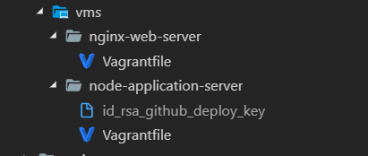

# Running Roomie Project

## Assumptions

1. We are assuming that when running this program, you are utilizing a terminal that enables bash. If you are using a Windows Computer, we recommend installing [Git Bash Terminal](http://www.techoism.com/how-to-install-git-bash-on-windows/)

2. If you are Launching this on a Linux OS, there are a few issues that may arise if the following specific versions of a program isn't installed.

- Vagrant Version 2.2.4 or Higher [Install Tutorial](https://computingforgeeks.com/install-latest-vagrant-on-ubuntu-18-04-debian-9-kali-linux/)
- No Program Configured to run Vagrant
  - If Another program is configured to be presented as an option for vagrant, I.E. Ruby, please remove or reconfigure your vagrant settings.

3. The following Software is available on your host machine:

- Packer
- Vagrant
- VirtualBox

---

## Building project

### Project apis

- [API documentation](https://illinoistech-itm.github.io/2019-team-09f/)

### First generate an rsa key

1. [Generate a new ssh key](https://help.github.com/articles/generating-a-new-ssh-key-and-adding-it-to-the-ssh-agent/#platform-linux)

2. Add your deploy key to your to this repo's settings by copying your \*.pub file

3. Name your private key **id_rsa_github_deploy_key** and remember its location.

---

### Building VMS for Production

1. Make sure your have already forked and cloned this repository
2. Change into the project folder
3. Add you rsa private key in the node-application-server directory

   

   ```
   cd packer/vms/node-application-server
   cp location-of-rsa ./
   ```

4. Run build script:

```
bash bulid-everything.sh
```

5. Visit [https://localhost:8080/](https://localhost:8080/)

Initial Build time is around 45-90 minutes. After the project, install all the proper dependencies.

### Building Development evnrionment

After the project builds, it is time to run. Switch to the directory containing the server for the project and install dependencies to verify your file is ready to run.

```
cd app/server
```

Comment out lines 44-63(all the redis connection) in the app/server/server.js

If on a Windows, device use the following commands:

```
npm run npm-install-windows
npm run dev
```

If on a linux device, use the following commands instead:

```
npm run npm-install-linux
npm run dev-linux
```

In the event that any errors pop up after running npm install, run

```
npm audit
```

The project should then open in your default browser.

- [Client - React Application: http://localhost:3000/](http://localhost:3000/)
- [Server - Express API Sever: http://localhost:5000/](http://localhost:5000/)

In the event that the project still refuses to run after the initial install and audit, change to app/client and run

```
npm install
npm audit
```

before returning back to app/server and running

```
// run dev script for machine type
```
