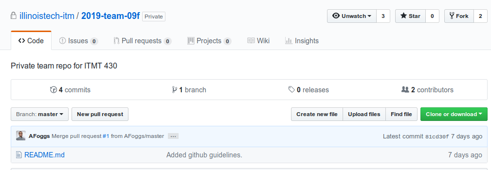
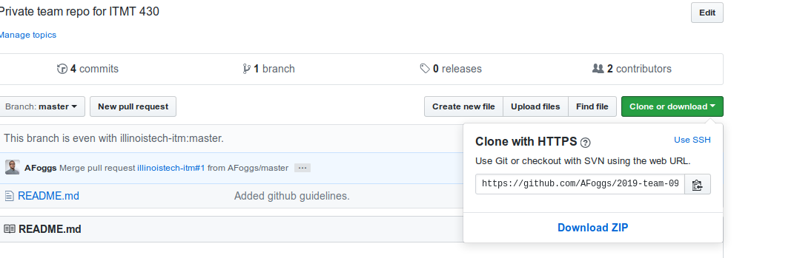
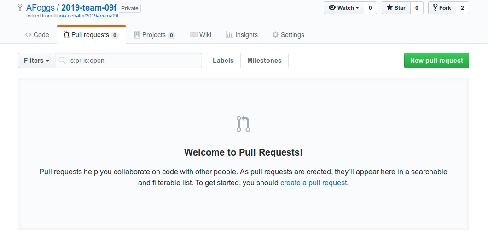
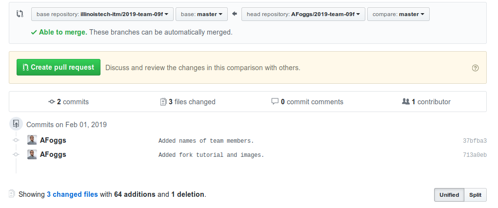
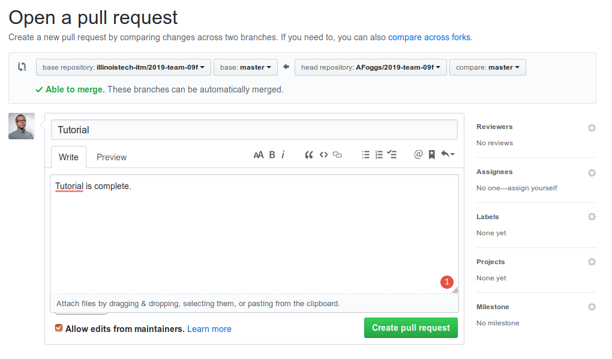
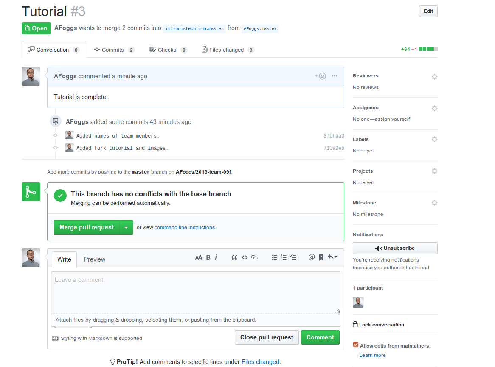

#### Forking Tutorial

First, Fork the team repository so that you have a personal copy. It is the button labeled fork on the upper right hand corner.



Next, in the newly forked Repo, copy the clone text and clone your personal repository.



After cloning the repository, enter the following commands so that you can set up your remote repository and team one.

```
git remote add origin https://github.com/user/repo.git //This is your repository
git remote set team https://github.com/user/repo.git //This is the group repository
git remote -v //Verify your Repository
```

Your output should look something like this.

```
origin	git@github.com:AFoggs/2019-team-09f.git (fetch)
origin	git@github.com:AFoggs/2019-team-09f.git (push)
team	git@github.com:illinoistech-itm/2019-team-09f.git (fetch)
team	git@github.com:illinoistech-itm/2019-team-09f.git (push)
```

After this, your environment is set up properly.

**_Before_** you do work, run this command:

```
git pull team master
```

This ensures that you have the most up to date repository that you're doing work on.

Once you have finished doing work for the day, push your code to your private repository. Once you are ready to combine your code, go to your personal repository, go to pull request, and hit new pull request.



Next you select create pull request



And Then create the title and comment.


Lastly, let your teammates know. Once at least 2 people have commented and saw that the code looks good, anyone may merge the pull request.


