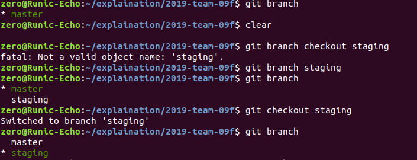
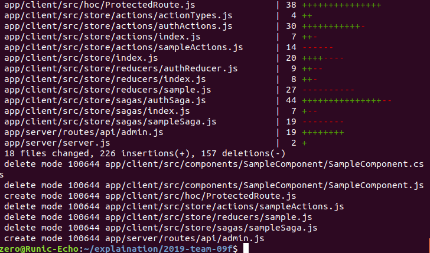
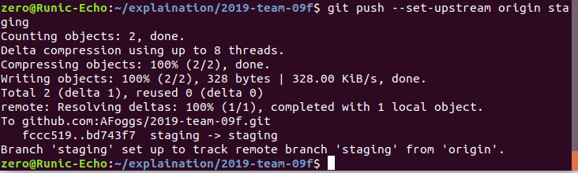
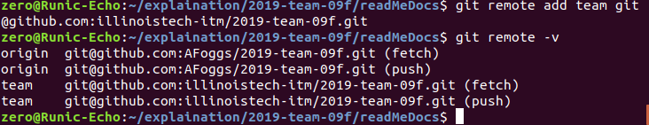
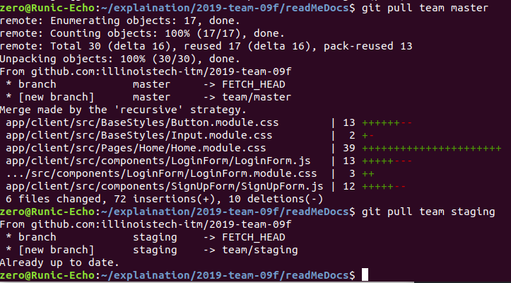
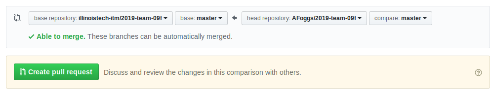
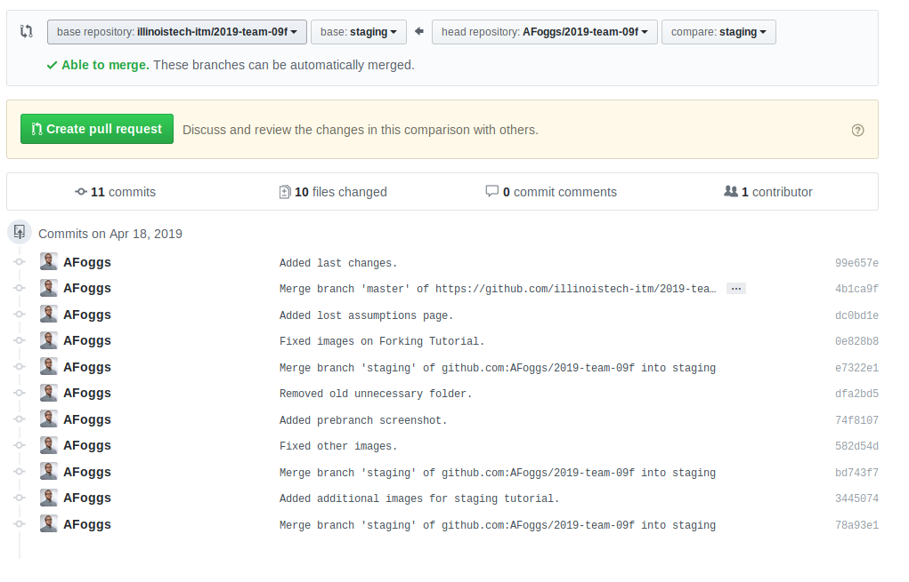
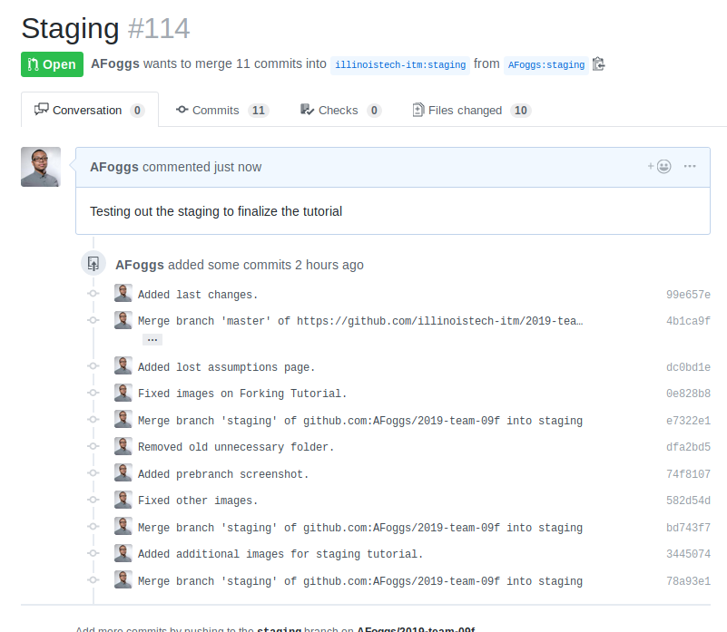

### Staging Forking Tutorial

As we begin working more intensely on parts of the program that we may all modify simultaneously, it is important for us to utilize a staging area.
The purpose of the staging area is to simply allow a location for us to push any changes that we have made to test to ensure that we do not break out master code. Additionally, it will allow us to move at a faster rate, as we will spend less time trying to fix broken code.

#### Local Changes

Whatever you are working on in your current repository, stop. Commit and push all the changes that you have and then prepare to make the necessary changes. After your stages are changed, in the terminal execute the following command:

```
git branch staging
git branch
git checkout staging
git branch
```

This will create your personal staging branch is created, which will mean you are almost set to do work.




After that, the next thing to do is to make perform a pull on the branch in order to update your local repository.

```
git pull origin staging
```
You can add a personal note on the next screen that pops up, and then exit the screen.



Next, you need to set up your upstream to staging. Run the following command:

```
git push --set-upstream origin staging
```


Lastly, you need to set up the git remote origin per the [Forking Tutorial Instructions](ForkingTutorial.md)

```
git remote set team https://github.com/illinoistech-itm/2019-team-09f.git
git remote -v //Verify your Repository
```



You are now all set!

In the event that you need to pull from the master to start working on changes while you are in the staging area, run

```
git pull team master
```

In the event that you need to pull changes someone made to test them, run the following command:

```
git pull team staging
```



When you are ready to merge changes from your personal staging branch to your personal master branch, follow the following steps:

1. Ensure your code is added and committed.
2. Run the following commands:
```
git checkout master
git pull origin master
git merge staging
git push origin master
```
3. If you intend to conduct more development, switch back to the staging repository by utilizing the following command:
```
git checkout staging
```

Anytime you need to switch a branches, use
```
git checkout name_of_branch
```

If you ever need to delete a branch, use
```
git branch -d name_of_branch
```

#### Github Changes

Merging to the team repository is a little different now. Once you are done with your work, commit and then push it.

```
git push origin staging
```

Next, visit [GitHub](https://www.github.com/) and log into your account and visit your repository.


Next, click **New pull request** and get ready to merge your changes. On the next screen, you will see the base repository to the left (the team repository) and the head repository to the right (your repository).



Change the base and compare both to staging, review the changes and then create a pull request.





That's it. You are done.
