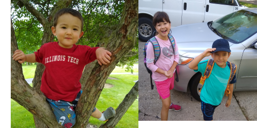

# Jeremy Hajek

## Where are you from

From the Chicago suburbs, grew up in Lombard and now live in Glen Ellyn (30 miles west of campus).

## IT Interest

My background is in IT Orchestration and Operations.  I had been an IT manager before previously becoming a professor in 2012.  I came to the realization that cloud native development and deployment (DevOps) was the logic outcome of software deployment outcomes.

## Something Interesting About You

It doesn't look like it now, but I played American Football in high school and junior college.  I managed to register one tackle to my credit.

## Git-IT Tutorial Badge

