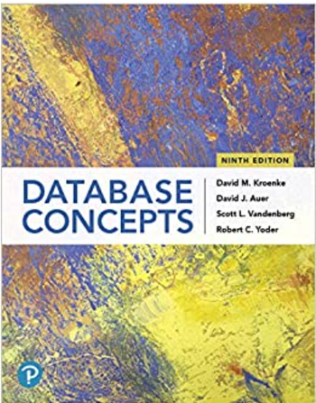
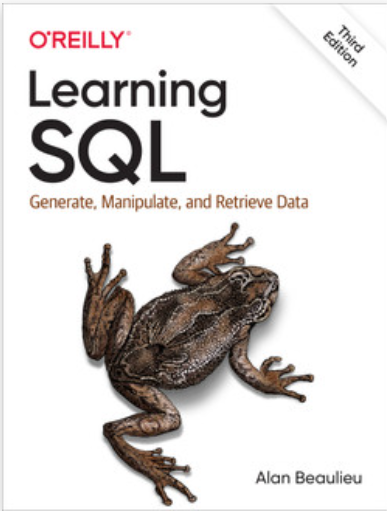

# ITMD 321 Data Modeling and Applications - Spring 2023

Semester: Spring 2023 - Professor Jeremy Hajek

| Category | Value |
| --------- | ------------ |
 **Professor** | Jeremy Hajek
 Address | Department of Information Technology & Management 10 W. 33rd St., Chicago, IL 60616
 Telephone | 312.567.5937
 Email | hajek@iit.edu
 Office | Perlstein Hall Room 223A, 10 W. 33rd St.
 Office Hours | Mon 12:30 PM — 1:20 PM, Tue & Thu 10:00 AM — 2:40 PM, Wed 11:30 AM — 1:00 PM, Fri 11:00 AM — 2:00 PM
 Location | Perlstein Hall 223 or Via Google Meets
 URL | Book and appointment at: [https://hajek.youcanbook.me](https://hajek.youcanbook.me "Booking APP URL")

## Course Catalog Description

Basic data modeling concepts are introduced. Hands-on database design, implementation, and administration of single-user and shared multi-user database applications using a contemporary relational database management system. [ITMD 321 Bulletin Description](http://bulletin.iit.edu/courses/itmd/ "ITMD 321 Bulletin Description")

## Prerequisites

None. Credit: 3-0-3 Semester Hours

## Lecture Day, Time & Place

* Main Lecture Class time
  * Monday and Wednesday 1:50pm to 3:05pm
  * Location - [TS-2030 Smart Lab](https://www.iit.edu/about/campus-information/mies-campus/mies-campus-map "IIT Campus Map URL")

## Directions to the Smart Lab TS-2030

To get to the Smart Tech Lab - enter the IIT tower on 35th Street. Swipe in at the desk and take the elevator up to the second floor.  Exit to the left and head north over the bridge from the Tower to the TS building. The floor turns from white tile to brown carpet. Take a left at the intersection and the Smart Lab is directly ahead of you.

## Schedule of Topics/Readings

All readings should be done prior to class

Session | Date | Topic | Reading - Homework |
----------|------|:------|----------
1 | 01/09 | Introduction | Tooling Assignment | NA
2 | 01/11 | Introduction | Tooling Assignment | NA
3 | 01/16 | No Class - MLK day | NA
4 | 01/18 | Introduction to tooling | NA
5 | 01/23 | History of Databases | NA
6 | 01/25 | History of databases | NA
7 | 01/30 | The Relational Model | NA
8 | 02/01 | The Relational Model | NA
9 | 02/06 | The Relational Model | NA
10 | 02/08 | The Relational Model | NA
11 | 02/13 | Learning SQL | NA
12 | 02/15 | Learning SQL | NA
13 | 02/20 | Learning SQL | NA
14 | 02/22 | Learning SQL | NA
15 | 02/27 | Data Modeling | NA
16 | 03/01 | Data Modeling | NA
17 | 03/06 | Mid-term preparation | NA
18 | 03/08 | Mid-term Exam  | NA
NA | 03/13 | Spring Break Week | NA
NA | 03/15 | Spring Break Week | NA
19 | 03/20 | Database Design | NA
20 | 03/22 | Database Design | NA
21 | 03/27 | Database Administration | NA
22 | 03/29 | Database Administration | NA
23 | 04/03 | Cloud Database | NA
24 | 04/05 | Cloud Database | NA
25 | 04/10 | NoSQL Database | NA
26 | 04/12 | NoSQL Database | NA
27 | 04/17 | Project work time | NA
28 | 04/19 | Project work time | NA
29 | 04/24 | Project work time | NA
30 | 04/26 | Project work time | NA
31 | 05/01 | Final Exam Week | NA

## Course Student Outcomes

At the conclusion of this course, each successful student will able to:

* Describe the theoretical and physical concepts of a relational database
* Explain the design methodology for databases and verify their structural correctness
* Use query language, primarily SQL, and their database related supported software
* Implement the theory behind the various database models and query languages.
• Design and build a simple database management system and demonstrate competence with the fundamental tasks involved with modeling, designing, and implementing a DBMS
* Outline essential DBMS concepts: database security, high availability, backup and recovery and SQL database tuning
* Analyze a complex computing problem and to apply principles of computing and other relevant disciplines to identify solutions (ABET Computing Criterion 3.1)
* Design, implement, and evaluate a computing-based solution to meet a given set of computing requirements in the context of the program’s discipline (ABET Computing Criterion 3.2)
* Identify and analyze user needs and take them into account in the selection, creation, evaluation, and administration of computer-based systems (ABET IT Criterion 3.6)

## Course Objectives

a. Introduction to databases DBMS Concepts
b. Introduction to Virtualization
c. Relational Model ER – Modeling Intro to SQL
d. Database Design More SQL Intro
e. Data Definition Language Data Types and Constraints Normalization
f. Schema Definition Table Creation SQL Queries
g. SQL Intro
h. Joins
i. Server Administration
j. Subqueries Grouping and Aggregates
k. Advanced Joins
l. Conditional Logic
m. Transactions
n. Indexes Constraints
o. Views Metadata
p. Programming/APIs SQLite
q. Database Backup and Disaster Recovery
r. Introduction to NoSQL databases and Big Data

## Required Textbook

* Publisher : Pearson; 9th edition (April 23, 2019)
* Language : English
* Paperback : 552 pages
* ISBN-10 : 0135188148
* ISBN-13: 978-0135188149

\newpage

* Title: Learning SQL, 3rd Edition
* Author(s): Alan Beaulieu
* Release date: March 2020
* Publisher(s): O'Reilly Media, Inc.
* ISBN: 9781492057611

### Readings

Readings for the class will be assigned from the textbooks; there will be additional reading assigned in the form of online reading. All readings should be done before coming to class on the assigned date, and are mandatory and expected.  Generally if you do the readings you will excel in the course, as the lectures serve as a clarification and explanation of material you should already be familiar with.

### Course Notes

It is recommended to take notes from the discussion portion of the class.

### Attendance

Attendance is expected and will be counted as part of your grade -- if you are not able to attend please email me / contact on Discord

### Course Web Site

[http://blackboard.iit.edu/](http://blackboard.iit.edu/ "Course Document Mangement Site URL")

The course will make use of Blackboard [http://blackboard.iit.edu/](http://blackboard.iit.edu/ "Course Document Mangement Site URL") for communications, assignment submissions, group project coordination, providing online resources and administering examinations. All remote students will view the course lectures online via Blackboard, and online readings and other course material will be found on Blackboard.

### Assignments

Each week there will a guided review question section and a lab exercise question. There will be 4 larger mini-projects (MPs) a midterm and a final project presentation.

### Grading

Each assignment will be worth the following:

* Weekly review questions: 10pts - x10
* Weekly lab exercises: 10 pts - x10
* Mini Projects - 25 points each x4
* 1 midterm exam - 100 pts
* 1 final project worth 50 points
* Attendance 2 points per class 30 points

Grading criteria for (undergrad course number) students will be as follows:

Letter | Description | Percentage
-------|-------------|------------
A | Outstanding work reflecting substantial effort | 90-100%
B | Excellent work reflecting good effort | 80-89.99%
C | Satisfactory work meeting minimum expectations | 70-79.99%
D | Substandard work not meeting expectations | 60-69.99%
E | Unsatisfactory work |0-59.99%

### Late Submission

By default no late work will be accepted – barring situations beyond our control.

### Academic Honesty

All work you submit in this course must be your own.

### Plagiarism

Dealing with code -- you need to respect opensource licenses and in the absence of a clear license be careful cutting and pasting code without attributing source. A good metric would be to add a comment in your code with a link to the original source to protect yourself.

This class won't be dealing with formal written papers.

### Our Contract

This syllabus is my contract with you as to what I will deliver and what I expect from you. If I change the syllabus, I will issue a revised version of the syllabus; the latest version will always be available on Blackboard. Revisions to readings and assignments will be communicated via Blackboard and via version control in GitHub

### Disabilities

Reasonable accommodations will be made for students with documented disabilities.  In order to receive accommodations, students must obtain a letter of accommodation from the Center for Disability Resources and make an appointment to speak with me as soon as possible.  My office hours are listed on the first page of the syllabus. The Center for Disability Resources (CDR) is located in 3424 S. State St., room 1C3-2 (on the first floor), telephone 312 567.5744 or disabilities@iit.edu

### ARC Tutoring Center

The university provides a free tutoring and study center called the [ARC](https://www.iit.edu/arc "IIT Resource Center URL").  This is located newly in the basement of the Galvin Library and is open to all for walk in appointments as well as scheduled tutoring.

### Illinois Tech Sexual Harassment and Discrimination Information

Illinois Tech prohibits all sexual harassment, sexual misconduct, and gender discrimination by any member of our community. This includes harassment among students, staff, or faculty. Sexual harassment of a student by a faculty member or sexual harassment of an employee by a supervisor is particularly serious. Such conduct may easily create an intimidating, hostile, or offensive environment.

Illinois Tech encourages anyone experiencing sexual harassment or sexual misconduct to speak with the Office of Title IX Compliance for information on support options and the resolution process. You can report sexual harassment electronically at [iit.edu/incidentreport](iit.edu/incidentreport "IIT Incident Report URL"), which may be completed anonymously. You may additionally report by contacting the Title IX Coordinator, Virginia Foster at foster@iit.edu or the Deputy Title IX Coordinator, Esther Espeland at eespeland@iit.edu.

For confidential support, you may reach Illinois Tech’s Confidential Advisor at (773) 907-1062. You can also contact a licensed practitioner in Illinois Tech’s Student Health and Wellness Center at student.health@iit.edu or (312)567-7550

For a comprehensive list of resources regarding counseling services, medical assistance, legal assistance and visa and immigration services, you can visit the Office of Title IX Compliance website at [https://www.iit.edu/title-ix/resources](https://www.iit.edu/title-ix/resources "IIT Title IX resources").
