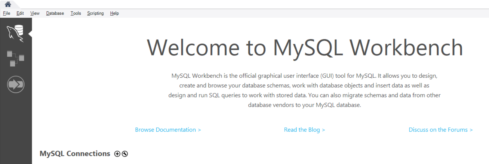
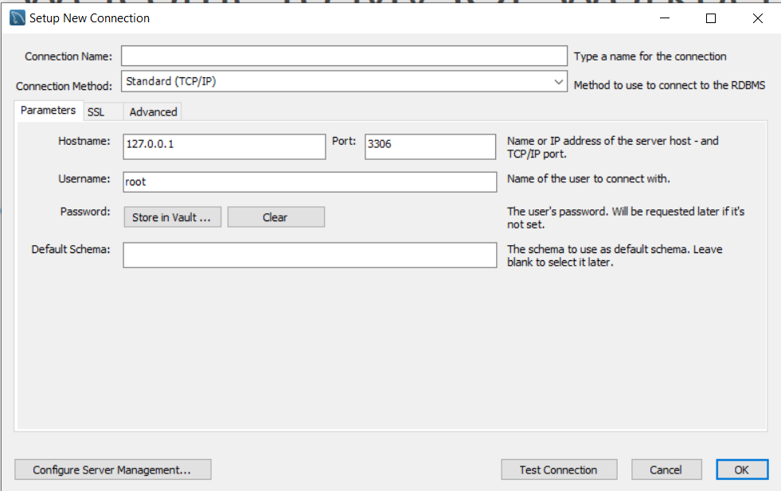
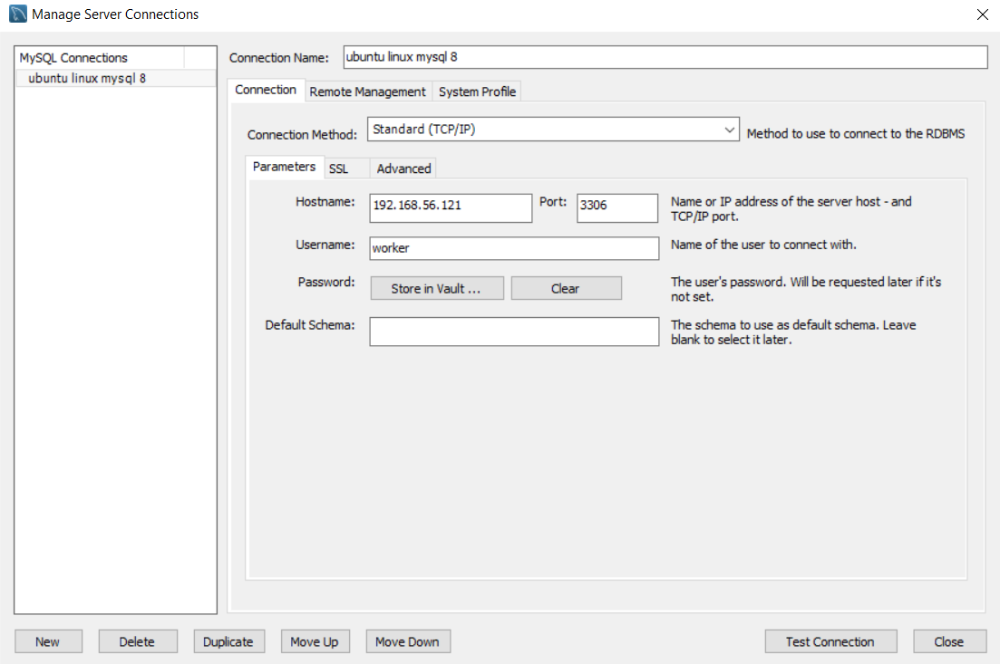
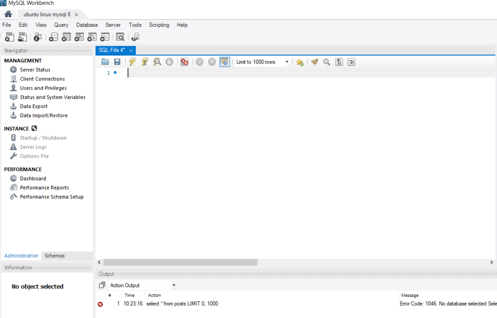

# ITMD 321 Week-03

## Installation of software

* On Debian/Ubuntu: `sudo apt install mysql-server-8.0`
* On Alma Linux: `sudo dnf install mysql`

You can run the command: `mysql -V` to see the version output and check that everything is installed.
Ubuntu and Debian Linux will autostart your mysql database service at system boot.

### Red Hat Installation Additional Information

For Red Hat and Alma Linux you will need to start the service manually and then enable it to start automatically at boot.

This is done via the Systemd systemctl command

* `sudo systemctl start mysql.service`
* `sudo systemctl enable mysql.service`
* `sudo systemctl status mysql.service`

### Connect to the DataBase

From the commandline in your Vagrant Box issue the command: `sudo mysql`. This will allow us to create a second user for the database.

By default - using MySQL on the major Linux Vendors since version 8 - there has been a security shift away from creating a "root" or "admin" user.  The account to vulnerable a target (half the user password combo is known reducing entropy).

In its place Ubuntu and Red Hat have you use the built in sudo command -- which requires account permission to elevate a standard user account to take an administrator or root account action -- such as logging into a database

```sql
CREATE USER 'worker'@'192.168.56.0/24' IDENTIFIED BY 'letmeinnow';
GRANT ALL ON *.* TO worker@'192.168.56.0/24';
FLUSH PRIVILEGES;
```

MySQL Documentation

* [MySQL :: MySQL 8.0 Reference Manual](https://dev.mysql.com/doc/refman/8.0/en/ "website for sql documentation")
* [MySQL :: MySQL 8.0 Reference Manual :: 13.7.1.3 CREATE USER Statement](https://dev.mysql.com/doc/refman/8.0/en/create-user.html "website for sql create")
* [MySQL :: MySQL 8.0 Reference Manual :: 13.7.1.6 GRANT Statement](https://dev.mysql.com/doc/refman/8.0/en/grant.html "website for sql grant")

### Allow External Connections to your Database

We need to modify MySQL configuration settings to listen on external port for connections. By default a database is setup to listen for connections on `localhost` (your system).

We need to edit this file: `/etc/mysql/mysql.conf.d/mysqld.cnf`. Change the value: `bind-address`  to
read `bind-address        = 192.168.56.10`.

Restart the server to take the new config into consideration:

```bash
sudo systemctl daemon-reload
sudo systemctl restart mysql.service
sudo systemctl status mysql.service
```

## Visualization tool - MySQL Workbench

We will be using the MySQL workbench to help visualize our database, relations, and tables

From your Host OS establish a connection (windows mac or Linux)
Using your package manager - install The MySQL Workbench

`choco install mysql.workbench`
`brew install --cask mysqlworkbench`
[Linux MySQL :: Download MySQL Workbench](https://dev.mysql.com/downloads/workbench/ "download website for mysql workbench")



Select the + sign to add a connection string



Use `Store in Vault` for Password - same one you used when creating the user from the command line
The IP is the line 35 value in your Vagrantfile - the host-only network you created.



Upon successful connection you will connect to a GUI interface.



### Sample Code

Next we are going to get some sample code to test our connections and run our commands

There are 4 `.sql` files located on Blackboard, download them and add them to a folder named `week-03` located under your `itmd-321` directory in your local repository.

Under the `CONTENT` folder in Blackboard there is a MySQL appendix -- the textbook uses MS Access by default, this PDF modifies the MS Access specific Tech through out the book.

We will reference the MySQL Online Extension A document to go over the MySQL workbench

## Deliverable

In the MySQL workbench run the 4 sample .sql files.  Take a screenshot of the output of the `select.sql` file in the MySQL Workbench.

Screenshot goes here

Repeat executing the `select.sql` script on the commandline of the MySQL server. Take a screenshot of the output. You will want to type it out in this case.

Screenshot goes here

Use the Readme.md markdown file to add your screenshots in the required place under the itmd-321 > week-03 directory.  Submit the URL to your GitHub repo in Blackboard.
