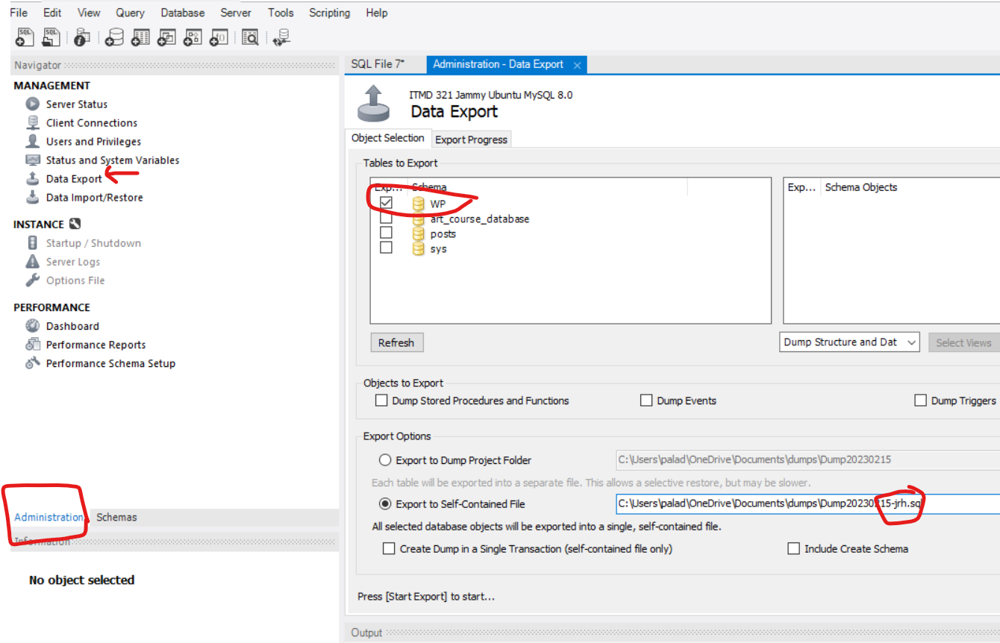

# Lab - Chapter 02

Lab exercise covering week-05 chapter 02 - part I.

## Objectives

* Analyze requirements for creating relational database tables from business requirements
* Discuss logic and methodology for creating relationships between tables

## Outcomes

At the conclusion of this assignment you will have taken business requirements and created a relational model to accurately represent the business requirements.

## Lab Exercises

Using Chapter 2 (P. 124-126 in the Kindle Book) Titled: `Working with Microsoft Access`, we will be creating the database and the relationships, keys, and constraints mentioned in the exercise using MySQL. To do this we will use Figure 2.27 - 2.31 to create the table schemas, relational constraints, and table data.

**Note** that the schema and table data for the Employee Table is in the Working with Microsoft Access Exercises (section 1, P.65-66). The content and schema for the Employee Table is located in Chapter 1, P.65/66 Figure 1.37 and 1.38.

Using the MySQL workbench and with your Ubuntu Jammy Linux box turned on, connect via the MySQL Workbench and you will begin to create the Database, or Schema, the tables, the keys, relations, and constraints.

## Deliverable

Using the MySQL Workbench, `Administration` tab > `Data Export` > Select `WP` > Export to Self-contained file. 

Make sure to add your initials to the `*.sql` file so I can tell it is your own work.
 
Create a folder named: `week-05` under the `itmd-321` folder in your local repo and commit the `*.sql` file to your remote repo.

Submit to Blackboard the URL to that file.  Assignment Due Feb 22nd 1:45 PM.

### Sources

Kroenke, David M.; Auer, David J.; Vandenberg, Scott L.; Vandenberg, Scott L.; Yoder, Robert C.; Yoder, Robert C.. Database Concepts (p. 124). Pearson Education. Kindle Edition. 