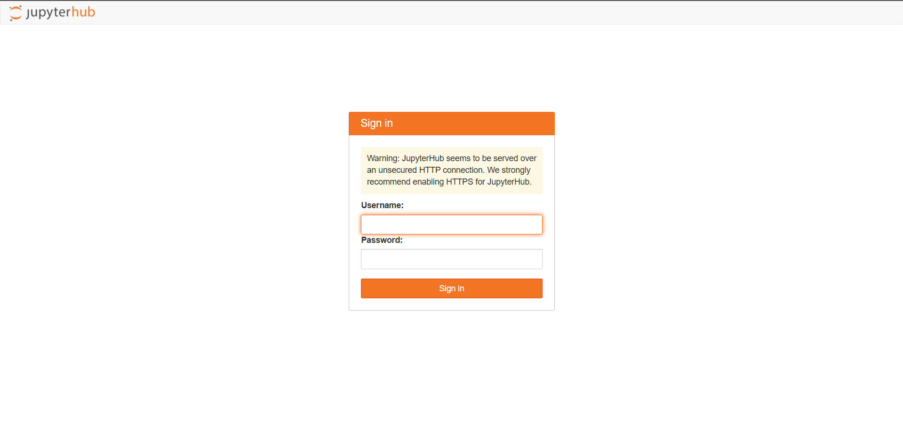
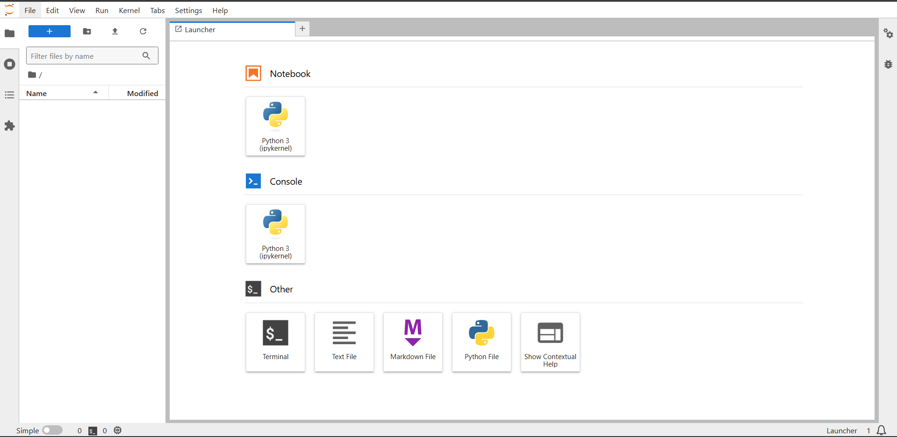
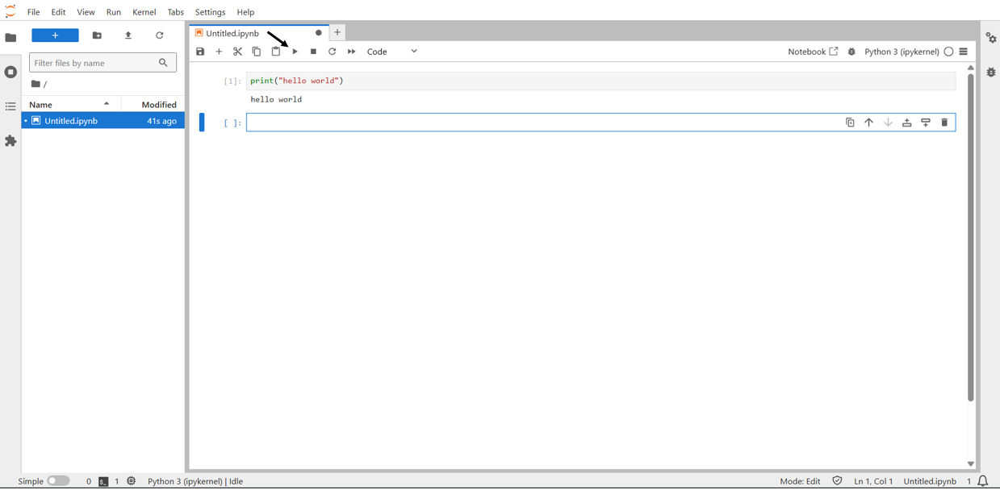
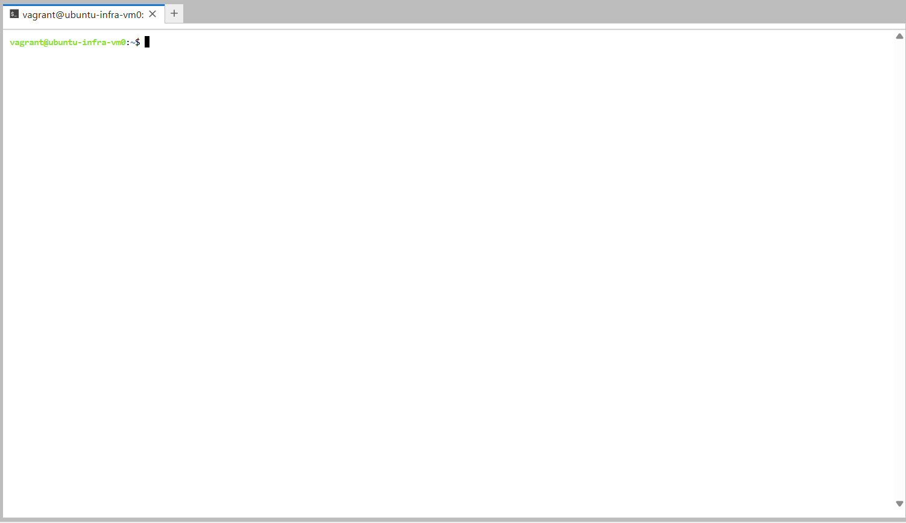

# Jupyter Notebook with Spark tutorial

### Your credentials

SSH into `spark-edge`.Your credentails are saved under `login.txt` file on ypur `spark-edge` server home. Do `cat login.txt` to get the credentails.

Your hawk id username is your username and random string of letters is your password.

> **Note: You only need to SSH into your `spark-edge` once to get the credentials.You can store this credentails some where safe as you can access the terminal inside the JupyterHub itself.**

To access your `spark-edge`:
1. Connect the school VPN visit https://vpn.iit.edu and download the university VPN (cisco) software (watch out your will have to authenticate via your second factor).
2. Connect to the host `vpn.iit.edu` in the vpn client.
3. Connect via SSH
    This is the example syntax
    `ssh -i "~\.ssh\id_ed25519_spark_edge_key" hajek@system26.rice.iit.edu`


### Login
**You need to be on the ***VPN*** to access any resources related to the cluster.**

Go to the link `http://192.168.172.26:8000/` and sign in  with your username and password.



### Creating a Notebook
Once you are logged in, you will see a page like this:



This is called **Launcher**.The left pane is the File Browser, it is the area where you will see all you files and folders present in your account. You can make use of ***New Folder***, ***Upload Files*** buttons situated right below ***Run Menu***.

Click on python icon under the Notebook section to create a new notebook. This will create a new notebook in the ***current directory***. If you want to create a new notebook in specific directory, navigate to that folder and then click on python icon under notbook section.

### Running programs

Once you have created a notebook, you can run your python programs. You can run a cell by clicking on the play button on the top menu of the notebook as shown below.



You can access launcher again by clicking on **"+"**.


### Terminal

In the launcher click on ***Terminal*** in the ***other*** section.



This is like any other linux terminal, you can do everything that your normal profile terminal allows you to do.

The main use of this section in this case is to ***clone and manage GitHub Repo's***. Clone your repository via ssh using `git clone`,if not already cloned

For more information on cloning your repo [click here](https://github.com/illinoistech-itm/jhajek/tree/master/itmd-521/git-tutorial).

### Installing Python libraries

The jupyter notebook generated is like any other jupyter notebook, you can install any extenal libraries with `pip`. Example:

```
pip install pandas
```
> **Note:** Only spark jobs will be sent to the spark cluster, any code other than spark will be run on local compute.


### [Click here to proceed with tests](./tests.md)