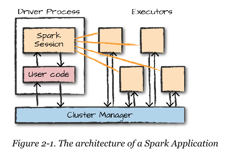

% Spark the Definitive Guide 2nd Edition
% Chapter 02
% A Gentle Overview to Spark

# A Gentle Overview

## Text Book


## Spark's Basic Architecture 22

- Single Computers work pretty well
- Powerful
- But only one machine
- This limits what can be done
- Single machines don't have the necessary power or the parallel ability
- Multiple computers alone are not enough -- you need a framework to control the data
  - To schedule data movement and data processing

## Spark Cluster Manager

- Spark has its own software based cluster manager.  
- Configurable out of the box
  - Simple config file denoting if the node is a slave or master
- Spark can also use existing cluster managers:
  - YARN from Hadoop 2.x/3.x
- [Mesos](https://mesos.apache.org "Apache mesos web site")
  - Cluster scheduler created by Twitter
  - Still in use, we won't focus on Mesos in this class
- We will work initially with the built in Spark cluster manager
- YARN later in the semester when we move to cluster work

## Core Architecture



## Spark Applications

- What makes up a Spark application?
  - Magic
- It is two things
  - A single **driver process** (like a main process in Java or Python)
  - A **set** of *executor processes*

## More Application

- A Driver runs the Spark Applications main() function
- This process sits on a node in the cluster
  - Remember Spark is always assumed to be an 2+ node cluster with an additional master node
- The Main function does 3 things:
  - Maintain information about the running process
  - Respond a user's program or input
  - Analyzing, distributing, and scheduling work across the executor processes
- Driver process is essential to the running of the application (can't crash!)

## Executors

- Responsible for carrying out the work that the Driver assigns them
- Executor then is responsible for two things:
  - Executing the code assigned by the Driver
  - Reporting the state of the execution back to the driver node 

## Architecture


## How Many Executors

- User specifies how many **executor** processes should fall on each cluster node
  - This can be declared at run time
  - This can be declared in the code
- There is a Spark mode called *local*
  - This runs both the driver and executors as local CPU threads and not distributed
  - Good for a quick test mode

## Spark Application Have

- Spark Applications have:
  - A Cluster Manager
  - Driver process
  - Executors
  - Code that is executed across executors

## Spark Language APIs

- Spark takes your logic in different languages
  - Translates it to the Core Spark language
  - Everything in Spark runs and computes in the Core Spark Language
- Scala is the default shell
  - You can launch this by typing from the command line:
  - ```spark-shell```
  - This assumes you already installed Spark
- Spark runs on the JVM
  - Only requirement is Java 8 JDK
  - OpenJDK works fine

## Languages

- We have said this a few times but again, Spark supports natively:
  - Scala
  - Java
  - Python
  - SQL, ANSI 2003 standard
  - R though the SparkR package

## API Architecture


## How to interact with the Spark Session

- Every compiled spark code interacts through a ```SparkSession()``` object
  - ```spark-submit``` is for running batch jobs
  - Each Spark application has only 1 ```SparkSession()```

## Code

- Open the CLI in your Ubuntu Virtual machine
  - type: ```spark-shell``` or ```pyspark```
  - For Scala, type:
  - ```val myRange = spark.range(1000).toDF("number")```
  - For Python, type:
  - ```myRange = spark.range(1000).toDF("number")```
- The text offers both languages, I will tend to use Python more

## DataFrame

- The previous code created a DataFrame
  - Containing 1000 rows
  - The numbers 0 to 999
  - It is a *distributed collection*
  - Depending on the number of **executors**, this range is divided across the cluster per executors

## What a DataFrame is

- Most common Spark Structured API
- Simply a table of data with rows and columns
  - table has no relational capabilities
  - Must be typed, but on demand can be inferred
- DataFrames are common in R and Python
  - But those languages are limited to single systems
  - DataFrame can only be as large as memory on that PC
- In Spark, DataFrames are the same as Python and R
  - Same logic and operations
  - But can be distributed and larger than the set of data.

## Partitions

- To allow every *executor* to perform work in parallel, Spark breaks the Data up into chunks called **partitions**
- A **partition** is a collection of rows that sits on a physical node in the cluster 
- DataFrames therefore have partitions
- If you have only one partition, even with thousands of executor threads:
  - Your parallelism is still 1
- If you have only one executor thread, with many partitions:
  - Your parallelism is still 1
- For the most part, we cannot manipulate the partitions directly
  - Only issue high-level transformations to data

## Transformations

- In Spark the core data structures are *immutable*
  - So data is immutable, strange?
  - How do we change or manipulate the data?
- In Spark we issue instructions on how to change or *transform* the data
- Scala
  - ```val divisby2 = myRage.where("number % 2 = 0")```
- Python
  - ```divisby2 = myRage.where("number % 2 = 0")```
- Notice no output will be returned... why?
- Spark will not perform the operation until we call an **action**

## Types of Transformations

- Two types of Transformations:
  - Narrow dependencies
  - Wide dependencies
- Narrow are 1 to 1 transformations, to find all numbers divisible by 2.
  - the ```where``` clause is the clue for a narrow dependency
- Wide dependency will have *input partitions* contributing to many *output partitions*
  - Known as a *shuffle*
- Narrow transformations performed in-memory
- Wide result in writes to the disk (can be a temporary data write)

## Lazy Evaluations

- Spark will wait until the very last moment to "execute the graph of computation instructions"
  - Spark doesn't modify the data immediately
- Spark builds up a plan of execution
- By waiting as long as possible, Spark can optimize this plan from a raw DataFrame to a steamlined physical plan to run as efficiently as possible across the cluster
- Also known as *predicate pushdown* on DataFrames
- So when does this "plan" get put into action?

## Actions

- To trigger a computation plan we execute an **action**
  - An action causes Spark to calculate a result
  - Using the previous example: ```divisby2.count()```
  - This will trigger an action that executes the entire plan and generates a result
- There are 3 kinds of actions:
  - Actions to view data in the console
  - Actions to collect data into native objects in their respective language
  - Actions to write to data output sources

## Demo Time

- This lecture continues from P.28 of the e-book until the end of the chapter.
- We will execute a series of Spark commands on some sample data
- See the accompanying pages and or recording

## Conclusion

- We learned about core architecture of Spark
  - We learned about executors
  - We learned about partitions
  - We learned about drivers
- We learned about datatypes
  - DataFrames
  - APIs
- We learned about transformations
- We learned about actions
- We learned how to put it together from the Spark CLI
