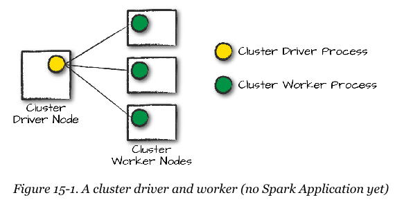
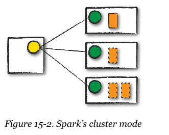
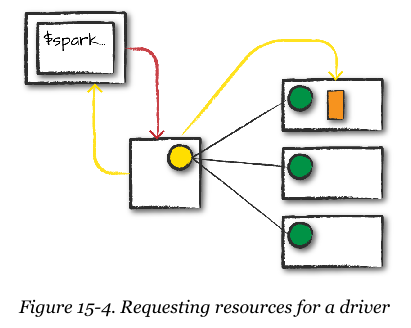
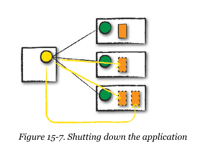

% Spark the Definitive Guide 2nd Edition
% Chapter 15
% How Spark Runs on a Cluster

# How Spark Runs on a Cluster

## Text Book


## Objectives and Outcomes

- Introduce and discuss what happens when Spark executes code
- Understand the architecture and components of a Spark Application
- Understand and discuss Spark pipelining
- Understand the requirements to run a Spark Application (leaning into chapter 16)

## Review - 214

- Thus far we have...
  - Focused on Spark's properties as a programming interface
  - Discussed how the structured APIs take a logical operation
  - Break it into a logical plan
  - Convert that to a physical plan that consists of RDD operations
  - Executes them across a cluster of machines
- Learned the 6 core filetypes and their pros and cons

## The Architecture of a Spark Application

- Some review from the mid-term:
- The Spark driver
  - The controller of the execution of a Spark Application
  - Maintains all of the state of the Spark cluster
  - It must interface with the cluster manager to get physical resources
  - Ultimately a process for maintaining the state of the application running on the cluster
- Spark Executors
  - These are processes that perform the tasks assigned by the Spark driver
  - Report their state back (success or failure)
  - There can be multiple **executor** processes

## The Architecture of a Spark Application - New Parts

- The Cluster Manager
  - The driver and executors do not exist in a vacuum
  - A cluster manager maintains a cluster of machines that will run your Spark Application
  - A cluster has its own "driver" process and "worker" processes (separate from Spark)
  - These processes are tied to physical machines (cluster nodes)
- When we run a Spark Application we request resources from the cluster manager to run it
  - The cluster manager is responsible for running the underlying computers
  - 

## Execution Modes

- There are [four types of cluster manager types](https://spark.apache.org/docs/latest/ "Spark documentation on cluster types") available (Spark 2.4.5)
  - standalone cluster manager
  - Apache Mesos
  - [Hadoop YARN](https://spark.apache.org/docs/latest/running-on-yarn.html "Apache YARN documentation")
  - Kubernetes
- We will be focusing on Hadoop YARN as that is what we have setup and running already  
- There are three execution modes
  - This is how you tell the Spark application how to distribute your application
  - This gives you the power to determine where the resources are located when you run the application
    - Cluster mode
    - Client mode
    - Local mode
- We will be moving away from the shell (pyspark or spark-shell) and to compiled code for submission to a cluster

## Cluster Mode

- Cluster is the most common way of running Spark Applications
  - User submits a precompiled JAR file, Python, or R script
  - Runs completely on the cluster
  - Cluster manager then launches the **driver** process on a worker node
    - In addition to the **executor** processes
    - This means that the cluster manager is responsible for maintaining all Spark Application processes
  - 

## Client Mode

- Almost the same as **cluster mode** except that the spark driver remains on the client machine that submitted the application 
  - This could be your laptop in this case
  - The disadvantage is that you can't shutdown your laptop!
  - Client machines are responsible for maintaining **driver** process
  - Cluster manager maintains the **executor** processes
- The driver is running on a machine outside of the cluster
  - Workers are located on machines in the cluster
  - 

## Local Mode

- Different from the above two modes
  - Local mode means the entire cluster runs on a single machine
  - Good for quick testing
  - Good for our class as there is zero setup
  - Good way to learn Spark

## Spark Application Life Cycle

- Now, how does it work?
  - Here is an illustrated example
  - 4 node cluster
    - 1 driver node (cluster manager driver node, not Spark node)
    - The type is irrelevant for this example)
    - 3 worker nodes
- Client request
  - 
  - We take a precompiled JAR and it is submitted to the Spark driver nodes
  - To do this we would run code like this: ```spark-submit --class <main-class> --master <master-url>  --deploy-mode cluster <application-jar name>```

## Launch

- Once the driver process has been placed on the cluster, it begins running user code
  - The code contains a ```SparkSession``` object
  - The ```SparkSession``` will communicate with the cluster manager (darker line)
  - Asking to launch Spark executor processes across the cluster (lighter lines)
  - Number of executors and partitions are defined on the command line dynamically or in the application code
  - 

## Execution and Completion

- The drivers and the workers communicate among themselves, moving code around
  - 
  - 

## The Life Cycle of a Spark Application (Inside Spark)

- The ```SparkSession```
  - The first step of any code submitted to a cluster is to include a SparkSession object
  - This is created automatically in the interactive mode
  - Avoid older code using the SparkContext pattern
- Add this line to existing Python Code (we will focus on Python)
  - ```from pyspark.sql import SparkSession```{.python}
  - ```spark = SparkSession.builder.master("local").appName("Word Count").config("put option here","put value here").getOrCreate()```{.python}
  - Page 221 has the remaining sample python code that you could type into a script to run
  - Code is typed up and in the [https://github.com/illinoistech-itm/jhajek](https://github.com/illinoistech-itm/jhajek "sample code repo") repo in itmd521 > samples > spark-book

## A Spark Job

- There is always one SparkContext per application
  - Actions always return results
  - Each Job breaks down into a series of *stages*
  - Number of stages depends on number of *shuffles*
  - The sample code `demo.py` has 6 stages - 222
- Stages
  - **Stages** represent groups of tasks than can be executed together (on multiple machines)
  - Spark tries to pack as much work as possible into the same stage
- Shuffles
  - A *shuffle* represents a physical repartitioning of the data
  - i.e. sorting a DataFrame or grouping a file read from a file
  - This requires Spark executors to coordinate how data will be distributed
  - Can even include temporary disk writes (slow!)
  - The ```spark.sql.shuffle.partitions``` default value is 200, means when a shuffle takes place, there are 200 partitions created.
  - ```spark.conf.set("spark.sql.shuffle.partitions", 50)```{.python}

## Tasks and Pipelining

- A task is just a unit of computation applied to a unit of data (the partition)
  - Partitioning your data into a larger number of partition means more parallel execution
- Pipelining allows stages to be combined (this is internal to Spark)
  - Pipelining allows Spark to cache shuffle data to disk
  - Can persist (cache) data between jobs, called *shuffle persistence* - 222

## Conclusion

- We walked through the internal and external Spark Application structure
- We walked through the types of cluster managers
- We walked through the types of cluster execution methods
- We walked through the SparkContext object
- We created a Python demo for a spark-submit job
- We discussed Spark stages, tasks, and shuffle persistence.

## Questions

- Any questions?
