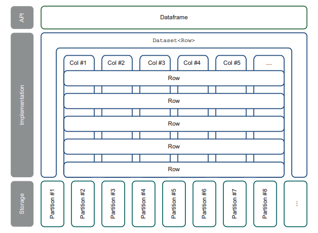

% Spark in Action: Second Edition
% Chapter 01
% So, what is Spark, anyway?

# So, what is Spark, anyway?

## Text Book

## 1.2.1 Spark in a data processing/data engineering scenario

- Data Engineers are data preparers
  - Spark is the perfect tool
  - 4 things generally done with Spark
    - Ingestion of Data
    - Improvement of data quality (DQ)
    - Transformation of data
    - Publication or accessibility of data

## Image of Data Engineering

## Spark in Data Science Scenario

- Scientists have slightly different approach then engineers
- Focus on the transformation part
  - [Jupyter](https://jupyter.org/ "Jupyter Notebooks")
  - [Zeppelin](https://zeppelin.apache.org/ "Apache Zeppelin")
  - [IBM Watson Studio](https://cloud.ibm.com/catalog/services/watson-studio "IBM Watson Studio")
  - [DataBricks Runtime](https://databricks.com/product/databricks-runtime "DataBricks Runtime")
  - [Pandas?](https://pandas.pydata.org/ "Python Pandas")

## Image of Data Science

## Uses of Spark

- 1.3.1 Predicting Restaurant Quality for State Governments
- 1.3.2 Lumeris health data company fast transformation
  - Converting CSV files to HL7 FHIR resources
- 1.3.3 Analyzing equipment logs at CERN for LHC
  - 1 Petabyte of data per second!

## 1.4 The DataFrame From Java Perspective

- The DataFrame is how Spark happens
  - This is the data type Spark uses (\*essentially)
- Similarities to a JDBC `ResultSet`
  - Data is accessible from a simple API
  - You can access the schema
- Differences
  - Do not browse via a `next()` method
  - No foreign or primary keys
  - Implemented as a `DataSet<Row>` data type

## 1.4.2 DataFrames from a RDBMS Perspective

- Similarities to a RDBMS Table
  - Data is described in Rows and Columns
  - Columns are strongly typed
- Differences
  - Data can be nested (JSON and XML docs)
  - You don’t update or delete entire rows (data is immutable)
  - You create a new DataFrame (immutable)
  - No constraints, indices, keys, or triggers
- The DataFrame is what we will use throughout the time using Spark

## Image of DataFrame

## First Sample Code

- On your virtual machine:
- Clone the sample code repo for chapter 01 at:
  - [https://github.com/jgperrin/net.jgp.books.spark.ch01](https://github.com/jgperrin/net.jgp.books.spark.ch01 "GitHub repo for Chapter 01") in your class Vagrant box

## Summary

- Item Here
