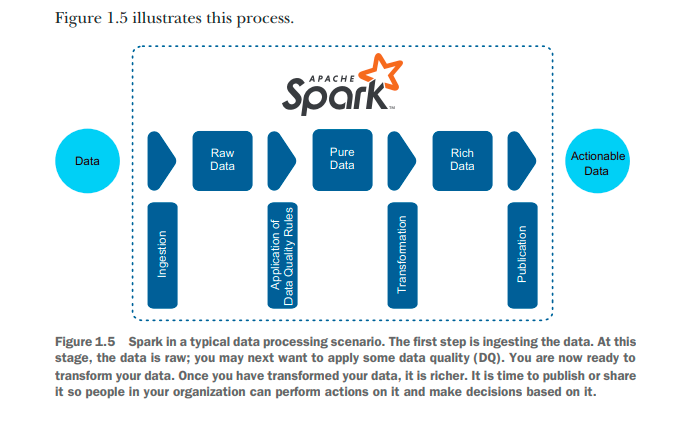
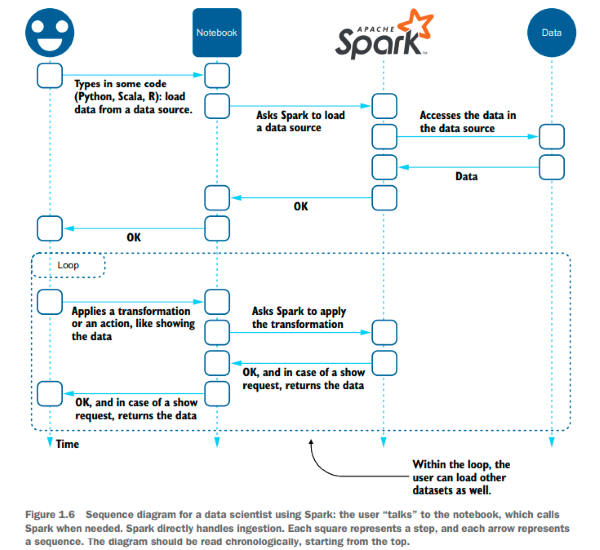

% Spark in Action: Second Edition
% Chapter 01
% So, what is Spark, anyway?

# So, what is Spark, anyway?

## Text Book

## 1.2.1 Spark in a data processing/data engineering scenario

- Data Engineers are data preparers
  - Spark is the perfect tool
  - 4 things generally done with Spark
    - Ingestion of Data
    - Improvement of data quality (DQ)
    - Transformation of data
    - Publication or accessibility of data

## Image of Data Engineering

## Spark in Data Science Scenario

- Scientists have slightly different approach then engineers
- Focus on the transformation part
  - Jupyter
  - Zeppelin
  - IBM Watson Studio
  - DataBricks Runtime
  - Pandas

## Image of Data Science

