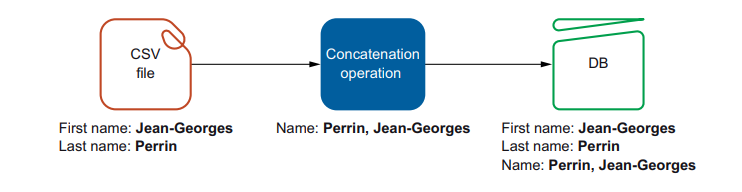
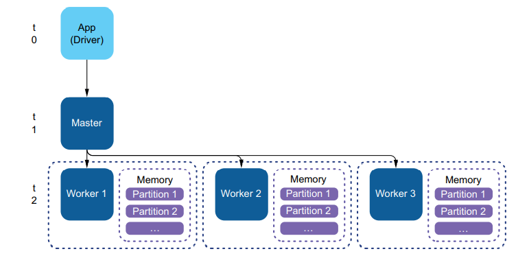
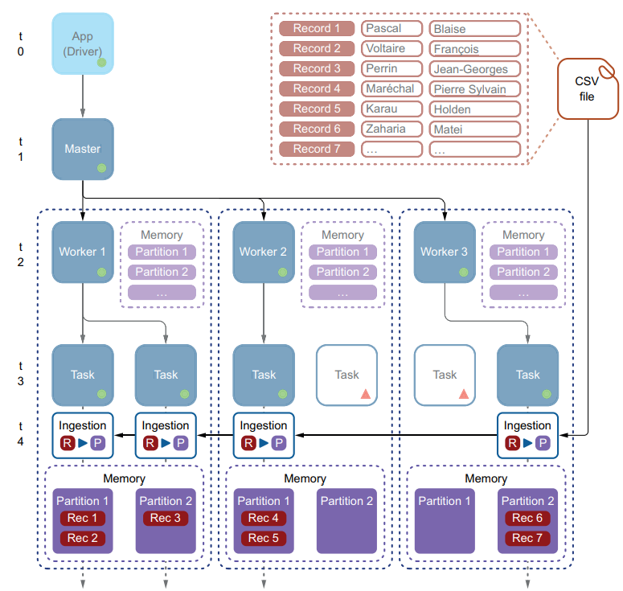
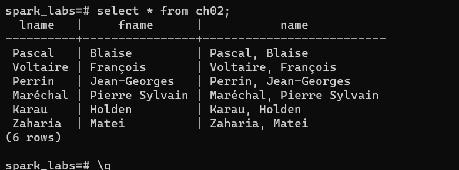

% Spark in Action: Second Edition
% Chapter 02
% Architecture and Flow

# Architecture and Flow

## Text Book

## Scientist Tech Help

## Objectives

- Building a mental model of Spark for a typical use case
- Understanding the associated code (Python and Java)
- Exploring the general architecture of a Spark application
- Understanding the flow of data

## Review

- What are the 4 steps involved in Data Engineering?
- What step is the Data Scientist generally focused on?
- What is a DataFrame?
- What 5 languages does Spark support out of the box?

## Typical Use Case

- We will walk through a scenario that involves distributed loading
  - A CSV file
  - a small operation
  - saving the results back to a database
  - PostgreSQL or Apache Derby
  - See Appendix F in the book for RDBMS installation help

## 2.1 Building a mental model

- How would we build an application to:
  - Ingest columns from a CSV file
  - Modify the data
  - Store the results to an RDBMS (Postgres)

## PostgreSQL pre-reqs

- You will need to install PostgreSQL (Pronounced Postgres) in your class Virtual Machine
  - `sudo apt-get update`
  - `sudo apt-get install postgresql postgresql-contrib`
- On Linux you need to install the Postgres JDBC driver (needed for Python)
  - `sudo apt-get install libpostgresql-jdbc-java`
  - The jar file will reside in: `/usr/share/java/postgresql.jar`
- In the `README.md` in the chapter 02 source code there is instruction on how to create the user and tables for this lab
  - If prompted the Vagrant box password is: **vagrant**
- Java code can be run from the root of chapter 02 source code by: `mvn clean install exec:exec`
- Python code can be run from the Python source code directory
  - `spark-submit --jars /usr/share/java/postgresql.jar ./csvToRelationalDatabaseApp.py`

## Installation of PostgreSQL

## Figure 2-1

## 2.2 Mental Model

- From the chapter 02 source code directory run:
  - `mvn clean install exec:exec`
  - This will invoke Maven to fetch the Java package dependencies for the PostgreSQL JDBC driver
  - Saves us much time
  - Found in the Pom.xml file

## 2.2 Mental Model Diagram

- 
  - This is what happens in our application

## 2.2 Using Java Code to Build a Model

- 

## 2.2 Connecting to Spark Master

- Spark Code connects from a client to a master node
  - This node is responsible for distributing your source code across a cluster
  - We are using a single node local cluster for now (but will move to a remote cluster in a few weeks)
  - In Java we have to instantiate the SparkSession Object
  - `SparkSession spark = SparkSession.builder()`{.java}
  `.appName("CSV to DB").master("local").getOrCreate();`{.java}
  - This *method chaining* can be declared at run time via command line flags as well

## Ingesting Data

- 

## Master Node

- Once the SparkSession has been instantiated, we ask Spark to load data
  - From a CSV in this case
- The Spark master does its works on distributed nodes
  - In the documentation called *slaves* but it is being changed to be *workers*
  - At point t2 the Master tells the workers to load the data
  - If we had multiple worker nodes, how would the data be read?

## Worker Nodes

- Each Spark worker node runs as a software task
  - Which has access to the nodes physical memory
  - Called partitions from Sparks point of view

## Partition Process

## Transform

- Once our data is partitioned, the transformation portion of the code can run
  - `df = df.withColumn(`{.java}
 `"name",concat(df.col("lname"), lit(", "),`{.java}
 `df.col("fname")));`{.java}
  - This is where we append the two columns and create a third column
  - We use the `concat()` method in Spark
  - The column names come from the CSV file--specified on the first line
- Spark is Lazy
  - So no data is actually loaded until a transformation is called
  - Code that actually modifies the data
  - Other wise, Spark will optimize all of your actions, waiting for a transformation

## Saving Our Work

- Now that the transformation (combining two columns to make a third) is done
  - How do we save the data?
  - In Chapter 1 we simply printed it to the screen
  - `df.show(5)`
  - We could write this data back as a CSV file or any other format
  - Spark has many builtin filetype options
  - This time we will write it out to a PostgreSQL DataBase
  - This assumes the database and table already exist and we have proper credentials

## Results

## Results Explained

- The whole dataset never hits our application (driver). The dataset is split
between the partitions on the workers, not on the driver
- The entire processing takes place in the workers
- The workers save the data in their partition to the database

## Summary

- Your application is the driver. Data may not have to come to the driver; it can be
driven remotely. It is important to remember this when you size your deployment (see chapters 5, 6, and 18)
- The driver connects to a master and gets a session. Data will be attached to this
session; the session defines the life cycle of the data on the worker’s nodes
- The master can be local (your local machine) or a remote cluster
- Data is partitioned and processed within the partition. Partitions are in memory
- Spark can easily read from CSV files (more details in chapter 7)
- Spark can easily save data in relational databases (more details in chapter 17)
- Spark is lazy: it will work only when you ask it to do so via an action
- Spark’s APIs rely heavily on method chaining

## Next Steps

- Complete the PostgreSQL setup on your Vagrant Box
  - Including creating the ROLE and DATABASE as described in the README.md in the ch02 source code
  - Take a screenshot from the psql cli with the output of the `\dt` command to show the table created
- Via Maven, run the build command and execute the code
- Take a screenshot of the results of the successful command from the PostgreSQL cli
  - `SELECT * from ch02;`
- Locate the data file and add my name and yours to the list
  - Execute the Python version of the source code
  - Upon success, take a screenshot of the table output
  - `SELECT * from ch02;`
- Use the Readme.md provided in the jhajek/itmd-521/labs folder for the deliverable
