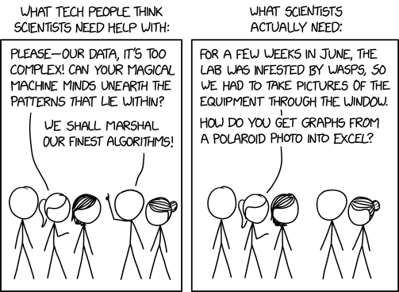
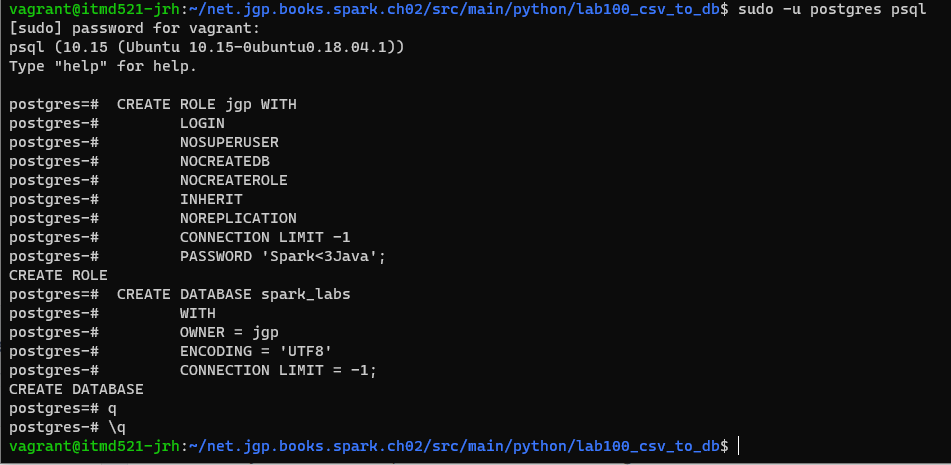
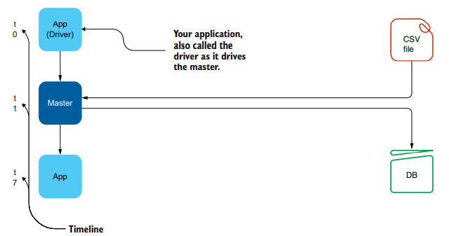
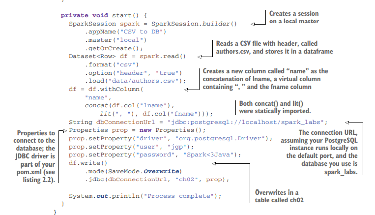

% Spark in Action: Second Edition
% Chapter 02
% Architecture and Flow

# Architecture and Flow

## Text Book

## Scientist Tech Help

## Objectives

- Building a mental model of Spark for a typical use case
- Understanding the associated code (Python and Java)
- Exploring the general architecture of a Spark application
- Understanding the flow of data

## Review

- What are the 4 steps involved in Data Engineering?
- What step is the Data Scientist generally focused on?
- What is a DataFrame?
- What 5 languages does Spark support out of the box?

## Typical Use Case

- We will walk through a scenario that involves distributed loading
  - A CSV file
  - a small operation
  - saving the results back to a database
  - PostgreSQL or Apache Derby
  - See Appendix F in the book for RDBMS installation help

## 2.1 Building a mental model

- How would we build an application to:
  - Ingest columns from a CSV file
  - Modify the data
  - Store the results to an RDBMS (Postgres)

## PostgreSQL pre-reqs

- You will need to install PostgreSQL (Pronounced Postgres) in your class Virtual Machine
  - `sudo apt-get update`
  - `sudo apt-get install postgresql postgresql-contrib`
- On Linux you need to install the Postgres JDBC driver (needed for Python)
  - `sudo apt-get install libpostgresql-jdbc-java`
  - The jar file will reside in: `/usr/share/java/postgresql.jar`
- In the `README.md` in the chapter 02 source code there is instruction on how to create the user and tables for this lab
  - If prompted the Vagrant box password is: **vagrant**
- Java code can be run from the root of chapter 02 source code by: `mvn clean install exec:exec`
- Python code can be run from the Python source code directory
  - `spark-submit --jars /usr/share/java/postgresql.jar ./csvToRelationalDatabaseApp.py`

## Installation of PostgreSQL

## Figure 2-1

## 2.2 Using Java Code to Build a Model

- 

## 2.2 Mental Model

- From the chapter 02 source code directory run:
  - `mvn clean install exec:exec`
  - This will invoke Maven to fetch the Java package dependencies for the PostegreSQL JDBC driver
  - Saves us much time
  - Found in the Pom.xml file

## Summary

- Summary goes here

## Next Steps

- Next steps here
