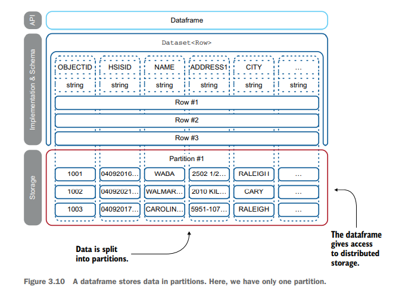

% Spark in Action: Second Edition
% Chapter 03
% The majestic role of the dataframe

# The majestic role of the dataframe

## Text Book


## Objectives

- Using the dataframe
- The essential (majestic) role of the dataframe in Spark
- Understanding data immutability
- Quickly debugging a dataframe’s schema
- Understanding the lower-level storage in RDDs
- Use dataframe-specific functions to perform transformations

## Review

- What are the 4 steps involved in Data Engineering?
- What step is the Data Scientist generally focused on?
- What is a DataFrame?
- What 5 languages does Spark support out of the box?
- What is the Spark Driver?
- What is the SparkSession?
- What are Partitions in Spark?

## How to use Spark

- To use Spark in a programmatic way, you need to understand some of its key APIs
- To perform analytics and data operations, Spark needs:
  - storage
  - both logical (at the application level) and physical (at the hardware level)
- At the logical level, the favorite storage container is the dataframe
  - A data structure similar to a table in the relational database world
- Transformations are operations you perform on data
  - Such as extracting a year from a date, combining two fields, normalizing data, and so on In this chapter, you’ll learn

## How we will use Spark

- We will merge two dataframes into one by using a SQL union-like operation
- At the end of the chapter, you will ingest two files in two dataframes
  - Modify their schema so they match
  - Union the result
  - See how Spark handles the storage as you go through those operations.

## 3.1 The essential role of the dataframe in Spark

- A dataframe is both a data structure and an API
  - Spark’s dataframe API is used within Spark SQL
  - Spark Streaming, MLlib (for machine learning), and GraphX to manipulate graph-based data structures within Spark
- Using this unified API drastically simplifies access to those technologies
  - You will not have to learn an API for each sub-library

## Figure 3-1


## 3.1.1 - Organization of a dataframe

- Dataframes can be constructed from a wide array of sources
  - Files, databases, or custom data sources
  - The key concept of the dataframe is its API
  - Java, Python, Scala, and R
  - In Java, a dataframe is represented by a dataset of rows `Dataset<Row>`
- Storage can be in memory or on disk, based on Spark’s strategy at the moment
  - It will use memory as much as it can
- Dataframes include the schema in a form of `StructType`
  - Which can be used for introspection
  - Dataframes also include a `printSchema()` method to more quickly debug your dataframes

## 3.1.2 - Immutability is not a swear word

- Dataframes are considered immutable storage
- Immutability is defined as unchangeable
  - When applied to an object, it means its state cannot be modified after it is created
- Data is immutable
  - Then you start modifying it
  - Spark stores only the steps of your transformation
  - Not every step of the transformed data
  - The intermediate data is not stored

## Figure 3-3


## Immutability Becomes Important

- Immutability becomes really important when you think in a distributed way
  - You store data, and each modification is done immediately on every node, as in a relational database
  - You keep the data in sync over the nodes and share only the transformation recipe with the various nodes.
- Spark uses the second solution, because it is faster to sync a recipe than all the data
  - The name of the engine under the Spark-hood is Catalyst
- We won't engage Catalyst
  - Spark, like any good operating system, will handle the resources for you

## Figure 3-5 Ingestion of Data

- 
- The first ingestion is a list of restaurants in Wake County North Carolina
- The second dataset consists of restaurants in Durham County, North Carolina
  - You will then transform the datasets so you can combine them via a union
  - And remove uneeded fields
  - Ingestion and transformation of data
  - Print the schema and count the number of records

## Figure 3.8 and 3.9


## 3.2.1 - Setting Things Up

- Lets transform the dataframe so it matches our desired output state
  - By renaming and dropping columns
  - Lets look at the output of the Java Code
  - We need to add code to the `pom.xml`
  - The code is in the next slide, then we can build and execute this Java code via Maven

## pom.xml additions

```xml
<plugin>
  <groupId>org.codehaus.mojo</groupId>
  <artifactId>exec-maven-plugin</artifactId>
  <version>1.6.0</version>
  <configuration>
    <executable>java</executable>
    <arguments>
      <argument>-classpath</argument>
      <classpath />
      <argument>net.jgp.books.spark.ch03
      .lab200_ingestion_schema_manipulation
      .IngestionSchemaManipulationApp</argument>
    </arguments>
  </configuration>
</plugin>
```

## Methods We Need

- Before we can merge two files, we need to prepare this one file
- Let’s look at the methods and functions you need now:
  - `withColumn()` method—Creates a new column from an expression or a column
  - `withColumnRenamed()` method—Renames a column
  - `col()` method—Gets a column from its name. Some methods will take the column name as an argument, and some require a Column object
  - `drop()` method—Drops a column from the dataframe. This method accepts an instance of a Column object or a column name
  - `lit()` functions—Creates a column with a value; literally, a literal value
  - `concat()` function—Concatenates the values in a set of columns

## Modifications

```java
df = df.withColumn("county", lit("Wake"))
 .withColumnRenamed("HSISID", "datasetId")
 .withColumnRenamed("NAME", "name")
 .withColumnRenamed("ADDRESS1", "address1")
 .withColumnRenamed("ADDRESS2", "address2")
 .withColumnRenamed("CITY", "city")
 .withColumnRenamed("STATE", "state")
 .withColumnRenamed("POSTALCODE", "zip")
 .withColumnRenamed("PHONENUMBER", "tel")
 .withColumnRenamed("RESTAURANTOPENDATE", "dateStart")
 .withColumnRenamed("FACILITYTYPE", "type")
 .withColumnRenamed("X", "geoX")
 .withColumnRenamed("Y", "geoY")
 .drop("OBJECTID")
 .drop("PERMITID")
 .drop("GEOCODESTATUS"); 
```

## Adding a Unique ID field

```java
df = df.withColumn("id", concat(
 df.col("state"), lit("_"),
 df.col("county"), lit("_"),
 df.col("datasetId")));
```

## 3.2.2 - Data is stored in partitions



## How many partitions

- Partitions are created by Spark for you
  - Data is assigned to each partition automatically based on your infrastructure
  - The number of nodes and size of the dataset
  - Because of the size of this dataset and we have one node, only 1 partition is created
  - Later on we can optimize these numbers based on the type of computation we are doing
- You can find out how many partitions you have with the following code:
  - ```System.out.println("*** Looking at partitions");```{.java}
 ```Partition[] partitions = df.rdd().partitions();```{.java}
 ```int partitionCount = partitions.length;```{.java}
 ```System.out.println("Partition count before repartition:```{.java}
 ```" + partitionCount);```{.java}

## Repartition

- You can repartition the dataframe to use four (or any number of) partitions by using the `repartition()` method. 
  - Repartitioning can increase performance:
 ```df = df.repartition(4);```{.java}
 ```System.out.println("Partition count after repartition: " +```{.java}
 ```df.rdd().partitions().length);```{.java}
  - How do you think this would work?

## 3.2.4 - A dataframe after a JSON ingestion

- Now we ingest the JSON data
  - JSON stands for JavaScript Object Notation
  - Is an international standard
  - Developed as a way to use text to create a representation of a structured OO object
  - But could be passed and processes by languages that didn't have pure Objects (JavaScript)
  - Text is a Universal Format it caught on
  - You must pay the bracket tax
  - JSON is good for computers, but not very human readable
  - Has support for nested values, which CSV files do not
  - When Spark displays the records, you will see nested values (arrays or lists)
  - Let's look at the examples in the book

## 3.2.5 - Combining two dataframes

- So how would we go about ingesting these two files and transforming them to our new schema?
  - This process is very common when dealing with disparate datasets
  - Hard to know what format the data will arrive in
  - But we need it in a unified state in order to do any data processing/analysis on
  - We won't cover how to write the new dataframe of data out, but essentially there is a `spark.save()` method
  - Figure 3-16 shows the two different datasets and their schemas
  - This is This is lab #230 in package `net.jgp.books.spark.ch03.lab230_dataframe_union`
- When doing a Union, there are two ways:
  - `union()` and `unionByName()`

## 3.3.1 - Reusing your POJOs

- Using compiled languages like Scala and Java have an advantage over interpreted languages like Python and R
  - In Spark they have an additional datatype beyond the `dataframe` called a `dataset`
  - Type `dataset` allow you to use POJOs directly in Spark
  - POJO is plain old Java Object
- Why?
  - You have existing code that already has data encapsulated or processed in its Object form
  - Type `dataset` prevents you from having to covert Object attributes to text files
  - Simplifies workflow
  - A `dataset` can be converted to a `dataframe` via the `.toDF()` method so you can use the dataframe's capabilities

## 3.3.3 - Converting back and forth

- Let's learn how to convert a dataframe to a dataset and back
  - This conversion is useful if you want to manipulate your existing POJOs and the extended API that apply to only the dataframe
- Let's refer to the textbook and sample code for the remainder of the chapter
  - Lab 300, 310, 320, and 321

## Summary

- Today we learned:
  - A dataframe is an immutable distributed collection of data, organized into named columns
  - A dataframe is implemented as a dataset of rows—or in code: `Dataset<Row>`
  - A dataset is implemented as a dataset of anything except rows—or in code:
    - `Dataset<String>`, `Dataset<Book>`, or `Dataset<SomePojo>`
  - Dataframes can store columnar information, like a CSV file, and nested fields and arrays, like a JSON file--the dataframe API remains the same.
  - In a JSON document, you can access nested fields by using a dot (.)
  - The API for the dataframe can be found at http://mng.bz/qXYE
  - The API for the static methods can be found at http://mng.bz/5AQD (and in appendix G)

## Additional Summary

- We learned:
  - If you do not care about column names when you union two dataframes, use union()
  - If you care about column names when you union two dataframes, use unionByName()
  - You can reuse your POJOs directly in a dataset in Spark
  - An object must be serializable if you want to have it as part of a `dataset`
  - The dataset’s `drop()` method removes a column in the dataframe
  - The dataset’s `col()` method returns a dataset’s column based on its name
  - The `to_date()` static function transforms a date as a string to a date
  - Catalyst is the transformation optimizer under the hood in Spark

## Next Steps

- Run the labs
