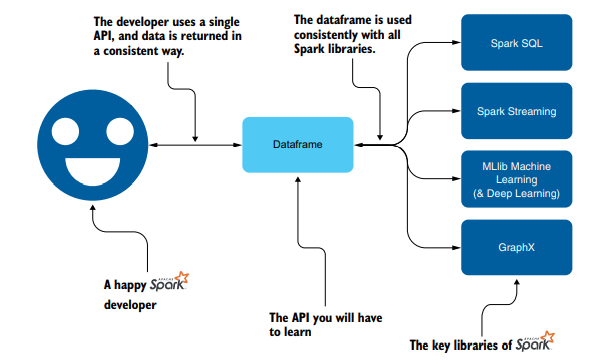
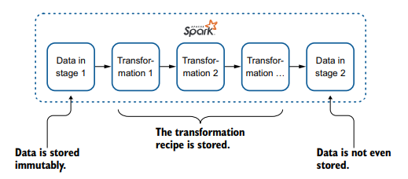
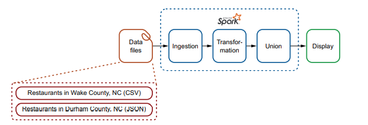
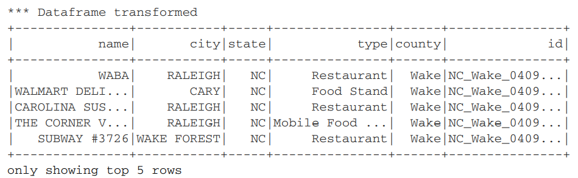
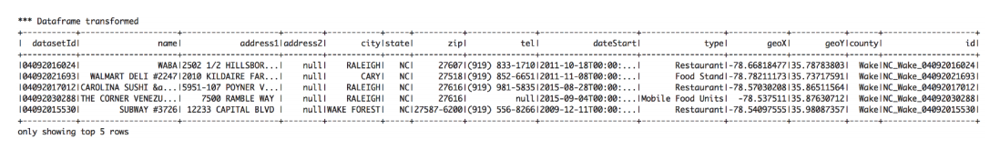

% Spark in Action: Second Edition
% Chapter 03
% The majestic role of the dataframe

# The majestic role of the dataframe

## Text Book

## Objectives

- Using the dataframe
- The essential (majestic) role of the dataframe in Spark
- Understanding data immutability
- Quickly debugging a dataframe’s schema
- Understanding the lower-level storage in RDDs
- Use dataframe-specific functions to perform transformations

## Review

- What are the 4 steps involved in Data Engineering?
- What step is the Data Scientist generally focused on?
- What is a DataFrame?
- What 5 languages does Spark support out of the box?
- What is the Spark Driver?
- What is the SparkSession?
- What are Partitions in Spark?

## How to use Spark

- To use Spark in a programmatic way, you need to understand some of its key APIs
- To perform analytics and data operations, Spark needs:
  - storage
  - both logical (at the application level) and physical (at the hardware level)
- At the logical level, the favorite storage container is the dataframe
  - A data structure similar to a table in the relational database world
- Transformations are operations you perform on data
  - Such as extracting a year from a date, combining two fields, normalizing data, and so on In this chapter, you’ll learn

## How we will use Spark

- We will merge two dataframes into one by using a SQL union-like operation
- At the end of the chapter, you will ingest two files in two dataframes
  - Modify their schema so they match
  - Union the result
  - See how Spark handles the storage as you go through those operations.

## 3.1 The essential role of the dataframe in Spark

- A dataframe is both a data structure and an API
  - Spark’s dataframe API is used within Spark SQL
  - Spark Streaming, MLlib (for machine learning), and GraphX to manipulate graph-based data structures within Spark
- Using this unified API drastically simplifies access to those technologies
  - You will not have to learn an API for each sub-library

## Figure 3-1

## 3.1.1 - Organization of a dataframe

- Dataframes can be constructed from a wide array of sources
  - Files, databases, or custom data sources
  - The key concept of the dataframe is its API
  - Java, Python, Scala, and R
  - In Java, a dataframe is represented by a dataset of rows `Dataset<Row>`
- Storage can be in memory or on disk, based on Spark’s strategy at the moment
  - It will use memory as much as it can
- Dataframes include the schema in a form of `StructType`
  - Which can be used for introspection
  - Dataframes also include a `printSchema()` method to more quickly debug your dataframes

## 3.1.2 - Immutability is not a swear word

- Dataframes are considered immutable storage
- Immutability is defined as unchangeable
  - When applied to an object, it means its state cannot be modified after it is created
- Data is immutable
  - Then you start modifying it
  - Spark stores only the steps of your transformation
  - Not every step of the transformed data
  - The intermediate data is not stored

## Figure 3-3

## Immutability Becomes Important

- Immutability becomes really important when you think in a distributed way
  - You store data, and each modification is done immediately on every node, as in a relational database
  - You keep the data in sync over the nodes and share only the transformation recipe with the various nodes.
- Spark uses the second solution, because it is faster to sync a recipe than all the data
  - The name of the engine under the Spark-hood is Catalyst
- We won't engage Catalyst
  - Spark, like any good operating system, will handle the resources for you

## Figure 3-5 Ingestion of Data

- 
- The first ingestion is a list of restaurants in Wake County North Carolina
- The second dataset consists of restaurants in Durham County, North Carolina
  - You will then transform the datasets so you can combine them via a union
  - And remove uneeded fields
  - Ingestion and transformation of data

## Figure 3-8

## 3.2.1 - Setting Things Up

- Lets transform the dataframe so it matches our desired output state
  - By renaming and dropping columns
  - 

## 

## Summary

- 

## Next Steps

- Complete the PostgreSQL setup on your Vagrant Box
