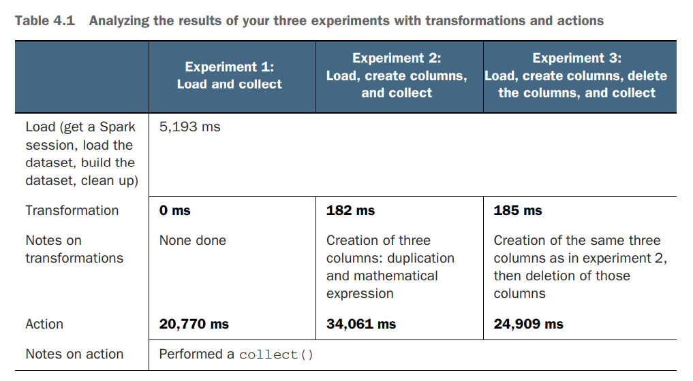

% Spark in Action: Second Edition
% Chapter 04
% Fundamentally Lazy

# Fundamentally Lazy - Chapter 04

## Text Book

## Objectives

- Using Spark’s efficient laziness to your benefit
- Building a data application the traditional way vs. the Spark way
- Building great data-centric applications using Spark
- Learning more about transformations and actions
- Using Catalyst, Spark’s built-in optimizer
- Introducing directed acyclic graphs

## Review

- What are the 4 steps involved in Data Engineering?
- What step is the Data Scientist generally focused on?
- What is a DataFrame?
- What 5 languages does Spark support out of the box?
- What is the Spark Driver?
- What is the SparkSession?
- What are Partitions in Spark?
- What does it mean that Spark dataframes are immutable?
- What is the difference between a dataset and dataframe?
- Which supported languages can use datasets in Spark?
- Name 2 differences between using a CSV and a JSON file in Spark?

## Introduction

- We will talk about laziness
- We will learn about the essential roles of transformations (each step of the data process) and actions (the trigger to get the work done)
- We will work on a real dataset from the US National Center for Health Statistics
- The application is designed to illustrate the reasoning that Spark goes through when
it processes data
  - Understand the experiments you will run to understand Spark’s transformations and actions
  - Observe the results of several transformations and actions
  - Look at the code behind the experiments
  - Analyze the results closely and see where time is spent

## 4-2 Why Spark Laziness is Good

- Transformations and actions are the bread and butter of Spark
- To see this we are going to load a dataset and measure performance to understand where work is being done
  - In most of the code samples so far we have used the **action** `.show()` to trigger the Spark plan to generate a result that can be displayed to the screen
  - Generally the `.show()` method is not that useful
- To understand the concepts of transformations and actions, and through that the concept of lazy operations, you will perform three experiments in lab #200:
  - Experiment 1—Load a dataset and perform a collection action
  - Experiment 2—Load a dataset, perform a transformation (creating three columns through duplication and mathematical operations), and perform a collection action
  - Experiment 3—Load a dataset, perform a transformation (creating three columns through duplication and mathematical operations)drop the newly created columns, and perform a collection action. This experiment will illustrate Spark’s laziness
  - Your dataset contains about 2.5 million records (a bit of real data)

## Figure 4-1

## Results of Figure 4-1

- Through transformations, you just created three columns of 2.5 million records, so about 7.5 million datasets, in 182 milliseconds
- While performing the action, if you do not do any transformation, the action takes about 21 seconds. If you create three columns, the action takes 34 seconds. But if you create and then delete the columns, the action takes about 25 seconds. Isn’t that odd? As you already guessed, this is due to laziness

## Steps to undertake

- Experiment 1 - Load and collect
- Experiment 2 - Load, create columns, and collect
- Experiment 3 - Load, create columns, delete the columns, and collect
- The NCHS dataset you are using contains birth rates for teens of ages 15 to 19 in the United States, divided by county, from 2003 to
2015
- The tone of this dataset is a bit serious the author wanted to use meaningful and real-life datasets

## 4.2.2 Schema of Data

Column name in the dataset | Type | Comment
---------------------------| -----|-------------------------
Year | Numeric | -
State | String | -
County | String | -
State FIPS Code | Integer | State code in the US Federal Information Processing Standards
County FIPS Code | Integer | County code in the US FIPS
Combined FIPS Code | Integer | Combination of the state and county FIPS code in one
Birth Rate | Decimal | Teen birth rate: births per 1,000 females ages 15–19 in a given year
Lower Confidence Limit | Decimal | Column renamed lcl later
Upper Confidence Limit | Decimal | Column renamed ucl later

## 4.2.5 The timing behind actions

- Lets refer to the text book P.80 in the printed page, as there is too much code to show it in a slide

## 4.3 - Comparing to RDBMS and traditional applications

- Lets refer to the text book P.83 in the printed page, as there is too much code to show it in a slide

## 4.4 - Spark is amazing for data-focused applications

- You can transform your data by using the following:
  - The built-in methods on the dataframe, such as withColumn()
  - The built-in column-level methods, such as expr() (refer to the list in appendix G)
  - The lower-level methods, such as map(), union(), and more (see appendix I)
  - Your own transformations using UDFs, detailed in chapter 16
  - **Your transformations will be applied only when you call an action**

## 4.5 - Catalyst is your app catalyzer

- What Catalyst does is similar to what a query optimizer does with a query plan in the relational database world
- To access the plan, you can use the `explain()` method of the dataframe to display it
  - Let’s have a closer look at a Catalyst plan
  - `df.explain()`
  - See Listing 4.3: lab500_transformation_explain
  - Page 88
- Additional Reading:
  - [Spark SQL: Relational Data Processing in Spark](http://people.csail.mit.edu/matei/papers/2015/sigmod_spark_sql.pdf "Spark SQL paper")
  - [Understanding your Apache Spark Application Through Visualization](https://databricks.com/blog/2015/06/22/understanding-your-spark-application-through-visualization.html "Understanding Spark via Visualization presentation")

## Summary

- Spark is efficiently lazy: it will build the list of transformations as a directed acyclic graph (DAG), which it will optimize using Catalyst, Spark’s built-in optimizer
- When you apply a transformation on a dataframe, the data is not modified
- When you apply an action on a dataframe, all the transformations are executed, and, if it needs to be, the data will be modified
- Modification of the schema is a natural operation within Spark. You can create columns as placeholders and perform operations on them
- Spark works at the column level; there is no need to iterate over the data
- Transformations can be done using the built-in functions (see appendix G), lower-level functions (appendix I), and dataframe methods.
- You can print the query plan by using the dataframe’s explain() method