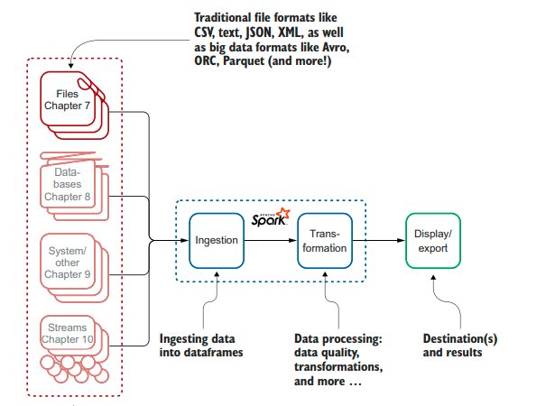
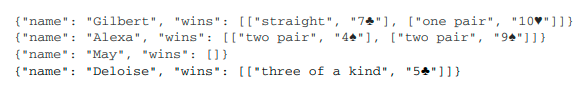
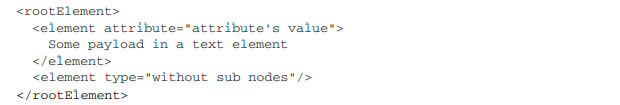

% Spark in Action: Second Edition
% Chapter 07
% Ingestion

# Ingestion - Chapter 07

## Text Book

## Objectives

- Common behaviors of parsers
- Ingesting from CSV, JSON, XML, and text files
- Understanding the difference between one-line and multiline JSON records
- Understanding the need for big data-specific file formats

## Review 1 of 2

- What are the 4 steps involved in Data Engineering?
- What step is the Data Scientist generally focused on?
- What is a DataFrame?
- What 5 languages does Spark support out of the box?
- What is the Spark Driver?
- What is the SparkSession?
- What are Partitions in Spark?
- What does it mean that Spark dataframes are immutable?
- What is the difference between a dataset and dataframe?

## Review 2 of 2

- Which supported languages can use datasets in Spark?
- Name 2 differences between using a CSV and a JSON file in Spark?
- Spark is efficiently lazy: it will build the list of transformations as a what?
- Is the data modified when you apply a transformation on a dataframe? Explain?
- When is the data in a dataframe modified? When you apply an action or a transformations? Explain.
- Within a Spark dataframe is it normal or difficult to modify the schema? Explain.
- Does Spark work on the row level, column level, or individual record level? Explain.

## Introduction

- Ingestion is the first step of your big data pipeline
  - Process of onboarding data
  - Import all types of standardized text data
  - Cover optimized binary versions of text data
  - Appendix L is the reference guide for each file format in the book
- For each format studied in this chapter, you will find:
  - A description of the file you want to ingest
  - The desired output that illustrates the result of our application
  - A detailed walk-through of the application so you understand precisely how to use and fine-tune the parser
  - Formats such as Avro, ORC, Parquet, and Copybook

## Focus on the files

All the examples of this chapter are available on GitHub at [https://github.com/jgperrin/net.jgp.books.spark.ch07](https://github.com/jgperrin/net.jgp.books.spark.ch07 "GitHub URL for chapter 07"). Appendix L is a reference for ingestion.

## 7-1 Common Behavior of Parsers

- A `parser` is the Spark name for the library that takes unstructured data (text from a file) and turns it into a Spark data structure
  - Parsers will have a source you read from
  - Spark supports regular expressions so you could use a \* for a wildcard or partial wildcard to read many files at once
  - Options are not case-sensitive, so multiline and multiLine are the same
  - All parsers have additional options to deal with various formats, schemas, and options--such as compression
- The core of all parser logic is the same, with small variations per individual format
- The file formats the book covers are:
  - 7.2 CSV
  - 7.4 JSON
  - 7.6 XML
  - 7.7 Plain text
  - 7.9 Avro, Orc, and Parquet

## 7.2 - Complex ingestion from CSV

- CSV, [Comma Separated Value](https://en.wikipedia.org/wiki/Comma-separated_values "website for comma separated value")
  - Oldest and one of the most common and easiest to create
  - Text is a universal format that any computer system can process
  - Partially due to Excel being able to convert to CSV
  - Unfortunately there are many types of CSV
    - TSV tab separated value
    - Fields can be encapsulated by quotes, or not
    - May use quotes to denote an empty value or not
    - May use spaces, like tabs to separate columns
  - You see the potential drawbacks
  - Lab200 in the example code: ComplexCsvToDataframeApp.java
    - Under the data folder: books.csv

## CSV Ingestion Options

- From the Book page 144:
  - `.option("sep", ";")`
  - `.option("quote", "*")`
  - `.option("dateFormat", "M/d/y")`
  - `.option("inferSchema", true)`
  - `.load("data/books.csv");`
- Schema is declared on first line: `id;authorId;title;releaseDate;link`
- The schema inference feature is a pretty neat, but it did not infer that the releaseDate column was a date
  - We have to specify a schema in that case, not infer it
  - Schemas on **Read** can be inferred or declared
- To run the sample, use the `mvn clean install` command
- Then run this command:
  `spark-submit --class net.jgp.books.spark.ch07`{.java}
  `.lab200_csv_ingestion.ComplexCsvToDataframeApp`{.java}
  `--master "local[*]"`{.java}
  `./target/spark-in-action2-chapter07-1.0.0-SNAPSHOT.jar`{.java}

## 7.3 - Ingesting a CSV with a known schema

- Lab 300, ComplexCsvToDataframeWithSchemaApp
  - Inferring the schema is a costly operation
  - Specifying enables you to have better control of the datatypes
  - Lets look at the printed page 146 source code explanation
  - CSV has an impressive number of variants, so Spark has an equally impressive number of options—and they keep growing!

## 7.4 Ingesting a JSON file

- [JSON standard](https://www.json.org/json-en.html "JSON standard webpage")
  - JSON is easier to read, less verbose, and brings fewer constraints than XML
  - A subformat of JSON is called [JSON Lines](https://jsonlines.org/ "JSON lines format standard webpage")
    - This makes storing JSON easier but makes it almost impossible to be human-readable
    - JSON lines supports unicode to
    - JSON could come in either format...
  - 

## JSON options

- For your first JSON ingestion, you are going to use the foreclosure dataset from the city of Durham, NC, for 2006 to 2016.
  - Let's look to page 149 to see the schema features
  - Very similar to CSV ingestion, as they are both text
  - We need to know if the JSON document is multiline or single line
  - There is a multiline option (single line is the default)
  - JSON can support nested elements in a field where CSV can't, though no null support

## 7.6 XML Ingestion

- Extensible Markup Language (XML)
  - This sample we will ingest a document containing (NASA) patents and then display some patents and the dataframe’s schema
- XML can be described as follows:
  - Structured
  - Extensible
  - Self-describing
  - Embeds validation rules through document type definition (DTD) and XML Schema Definition (XSD)
  - [A W3 standard](https://www.w3.org/XML/ "XML standards webpage")
  - 
  - This is lab: #600

## 7.7 - Ingesting a Text File

- Sometimes you have unstructured text.
  - Such as spoken text--used for NLP, natural language processing
  - Or sometimes you have data that is column delineated.  Meaning the data is a certain field width, with no delimiters
  - Lab 700 uses the text from an ebook, Romeo and Juliet.
  - How can we store this into a dataframe with no delimiters other than spaces?
  - By default by line
  - `Dataset<Row> df = spark.read().format("text").load();`{.java}
  - This is the only option for text

## 7.8 - Big Data File Formats

- Avro, Orc, Parquet
  - Natively designed file formats for use in BigData products like Hadoop and Spark
  - Customized to the environment, and non-text, binary formats
- Why more formats?
  - In most big data projects, you will have to pull the data from somewhere (the sources)
  - You may have to put it back somewhere else (the destinations)
- The sources can be files (studied in this chapter), databases (chapter 8), complex systems or APIs (chapter 9), or even streams (chapter 10)

## 7.8.1 - Why I can't just JSON/CSV/XML

- Here are some reasons:
  - JSON and XML (and in some measure CSV) are not easy to split
  - When you want your nodes to read a part of the file, it’s easier if you can split it
  - Node 1 will read the first 5,000 records, node 2 the second 5,000, and so on
  - Because of its root element, XML will need rework, which may break the document
  - Big data files need to be splittable for easier distributed work
  - CSV cannot store hierarchical information as JSON or XML can
  - None are designed to incorporate metadata.
  - None of these formats support easy column addition, deletion, or insertion
  - These formats are all quite verbose (especially JSON and XML), which inflates the file size drastically.
  - RDBMS Object work well, but are linked to each vendors software -- not universally exchangeable

## 7.8.2 - Avro is a schema-based serialization format

- [Apache Avro](https://avro.apache.org/ "apache Avro Home webpage") is a data serialization system, which provides rich data structures in a
compact, fast, and binary data format
  - Avro was designed for remote procedure calls (RPCs)
  - In a similar way as Protocol Buffers (Protobuf), a popular method for transferring serializable data developed and open sourced by Google
  - Avro supports dynamic modification of the schema
  - Avro offers a schema, written in JSON
  - Avro file is row-based, the file is easier to split, like CSV

## 7.8.3 - ORC is a columnar storage format

- [Apache ORC](https://orc.apache.org/ "Apache ORC webpage") - Optimized Row Columnar, is a columnar storage format
  - Is ACID compliant
  - Originally Designed for use in Hadoop and Impala platforms
  - Orc supports compression
  - ORC supports compound types including structs, lists, maps, and union
  - Spark support

## 7.8.4 - Parquet is also a columnar storage format
  
- [Apache Parquet](https://parquet.apache.org/ "Apache Parquet webpage")
  - Parquet is a columnar file format
  - Parquet supports compression
  - You can add columns at the end of the schema
  - Parquet also supports compound types such as lists and maps
  - Designed by Hortonworks and Twitter
  - Newer datatype and the default type for Spark
  
## 7.8.5 - Comparing Avro, ORC, and Parquet

- Big data file formats add a layer of complexity
- The following are qualities that ORC, Parquet, and Avro share:
  - They are binary formats
  - They embed their schema. Avro’s use of JSON for its schema gives the most flexibility
  - They compress their data. Parquet and ORC are better at compression than Avro
  - More technical details:
    - “Big Data File Formats Demystified” by Alex Woodie
    - [http://mng.bz/2JBa](http://mng.bz/2JBa "Big Data File Formats Demystified")
    - “Hadoop File Formats: It’s Not Just CSV Anymore” by Kevin Hass
    - [http://mng.bz/7zAQ](http://mng.bz/7zAQ "Hadoop File Formats: It’s Not Just CSV Anymore")

## 7.9.1 - Ingesting Avro, ORC, and Parquet

- This is lab 910, 920, 930
  - Let's look at section 7.9.1, 7.9.2, and 7.9.3
  - [Complete Reference Guide to load options](http://spark.apache.org/docs/latest/sql-data-sources-parquet.html "Spark reference guide for load options")

## Summary

- Ingestion is a key part of your big data pipeline
  - When ingesting files, you can use a regular expression (regex) to specify the path
- CSV is more complex than it looks, but a rich set of options allows you to tune the parser
- JSON exists in two forms: the one-line form called JSON Lines, and multiline JSON
- All options for file ingestion that are described in this chapter are not casesensitive
- Spark can ingest CSV, JSON, and text out of the box.
- To ingest XML, Spark needs a plugin provided by Databricks
- The pattern for ingesting any document is fairly similar: you specify the format and simply read
- Traditional file formats, including CSV, JSON, and XML, are not well suited for big data
- JSON and XML are not considered splittable file formats
- Avro, ORC, and Parquet are popular big data file formats
  - They embed the data and the schema in a file and compress the data
  - They are easier and more efficient to manipulate than CSV, JSON, and XML when it comes to big data
- ORC and Parquet files are in a columnar format
- Avro is row-based, which is more suitable for streaming
- ORC and Parquet’s compression is better than Avro’s

## Questions?

- Questions?
