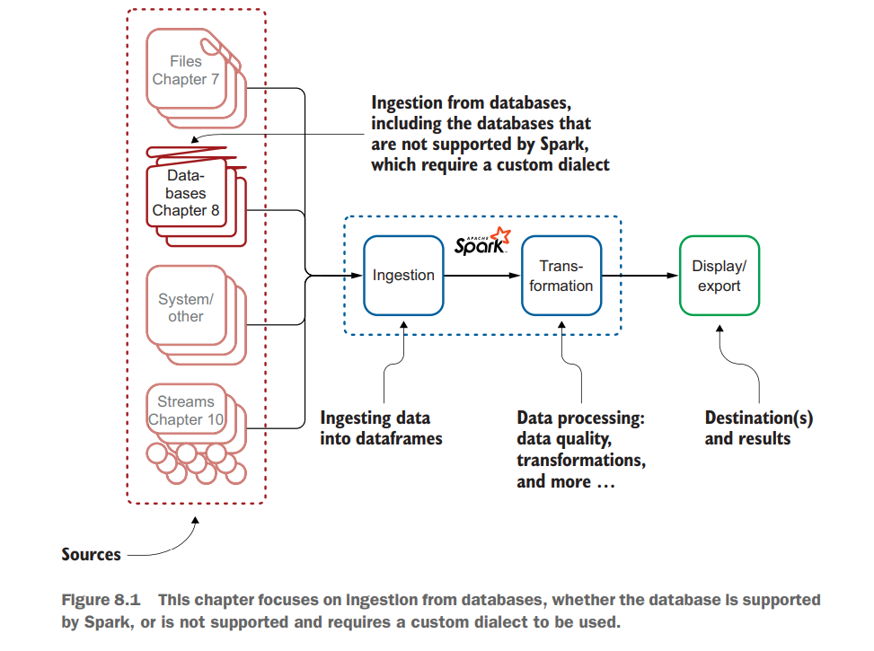
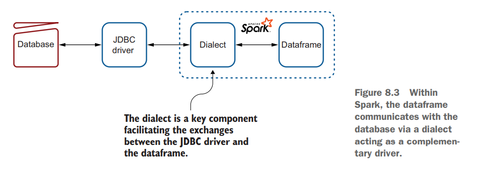

% Spark in Action: Second Edition
% Chapter 08
% Ingestion from Database

# Ingestion - Chapter 08

## Text Book

## Objectives

- Demonstrate ingesting data from relational databases
- Discuss the nature and the roles of dialects in communication between Spark and databases
- Demonstrate building advanced queries in Spark
- Demonstrate ingestion from a NoSQL database; Elasticsearch

## Review of Chapter 08

- Installed mariadb server
  - `sudo apt-get install mariadb-server`
- Retrieved the mysql java connector (needed for Python too)
  - wget https://dev.mysql.com/get/Downloads/Connector-J/mysql-connector-java-8.0.23.tar.gz
  - Extracted in and placed the `mysql-connector-java-8.0.23.jar` file in `/home/vagrant/Spark/jars`
- Ingested the sakila-data create script into our database
  - Retrieved the sakila sample data
  - `wget https://downloads.mysql.com/docs/sakila-db.tar.gz`
  - `tar -xvzf sakila-db.tar.gz`
  - `sudo mysql < sakila-db/sakila-schema.sql`
  - `sudo mysql < sakila-db/sakila-data.sql`

## Review of Chapter 08 part II

- We created a non-root user in the database
  - Named: **worker**
  - With Password: *Spark3Java*
  - `GRANT SELECT,INSERT,UPDATE, DELETE, ON sakila.* TO worker@'localhost' IDENTIFIED BY 'Spark3Java';`
- Set our ENV password: `export DB_PASSWORD=Spark3Java`
- Compiled sample Java code with `mvn clean install`
- Used compiled jar file to run samples:
`spark-submit --class`{.java}
`net.jgp.books.spark.ch08.lab101_mysql_ingestion_env_variable.MySQLToDatasetApp`{.java}
`--master "local[*]"`{.java}
`./target/spark-in-action2-chapter08-1.0.0-SNAPSHOT.jar`{.java}

## Introduction

- In this chapter, you’ll learn several ways to ingest data from those relational databases
  - Either the full table at once or filtering, joining, or aggregating data
  - To minimize data transfer
- You will see in this chapter which databases are supported by Spark
- When you work with a database not supported by Spark, a custom dialect is required
  - The dialect is a way to inform Spark of how to communicate with the database
  - Spark comes with many dialects to talk to databases by default

## Data Journey

## Understanding the Data

- For your first ingestion from a database, you are going to use the Sakila database in MySQL/MariaDB
  - Sakila is a standard sample database that comes with MySQL
- The Sakila sample database is designed to represent a DVD rental store.
  - A DVD is a shiny disk, 12 cm (about 5 inches) in diameter, which is used to store digital information
  - In the early days (1995), it was used to store movies in digital format
  - People could buy or rent those objects and watch the movie on their TV by using a device called a DVD player
- You will use the demo database, which includes about 15 tables and a few views (figure 8.2) for this scenario
  - Spark is not designed for data warehousing

## How to Connect

## Lab 100 and 101 - 8.1.5

- Let's run lab 100 and 101 again
  - Just to make sure we are properly connected
- We needed to change a few values to make this more secure
  - `props.put("user", "worker");`{.java}
  - `props.put("password", "Spark3Java");`{.java}
  - `serverTimezone=America/New_York",`{.java}
- To read from a database one the connection is all setup:
`Dataset<Row> df = spark.read()`{.java}
`.jdbc(jdbcUrl, "actor", new Properties());`{.java}

## Dialects - 8.2.1

- The **dialect** is a small software component
  - Often implemented in a single class, that bridges Apache Spark and the database

## Dialects provided with Spark - 8.2.2

- Spark comes with common RDBMS dialects by default
  - IBM Db2
  - Apache Derby
  - MySQL
  - Microsoft SQL Server
  - Oracle
  - PostgreSQL
  - Teradata Database
- There are plenty other plugins to be able to pull from NoSQL and Cloud Databases
  - [https://spark-packages.org/?q=Data+Source](https://spark-packages.org/?q=Data+Source "Spark additional datasources webpage")

## Advanced queries and ingestion - 8.3

- Sometimes you don’t want to copy all the data from a table to a dataframe
  - You know that you won’t use some data
  - You don’t want to copy the rows you won’t use
  - Because transfer is an expensive operation (time and maybe money if using the cloud)
  - A typical use case would be to run analytics on yesterday’s sales, compare month-to-month sales, and so on
- So we filter
  - Let us look at lab 300, 310, and 311

## Filtering by using a WHERE clause - 8.3.1

- In SQL, one way to filter data is to use a WHERE clause as part of your SELECT statement
  - Let’s see how to integrate such a clause in your ingestion mechanism
  - Look at the source code for Lab300
  - Printed page 180
  - You will note that Spark does not transform the SQL query on the way to the JDBC driver
- Listing 8.6
  - The following are important things to remember:
    - You can nest parentheses in the select statement
    - The table alias must not be an existing table in your database

## Joining data in the database - 8.3.2

- Joins...
  - You might be thinking, I can use Spark to do joins between dataframes!
  - For more information, see chapter 12 and appendix M
  - For performance and optimization reasons, you may want to ask your database to perform the operation
  - Lets look at lab310
`SELECT actor.first_name, actor.last_name, film.title, film.description`{.sql}
`FROM actor, film_actor, film`{.sql}
`WHERE actor.actor_id = film_actor.actor_id`{.sql}
`AND film_actor.film_id = film.film_id`{.sql}

## Summary

- Place holder

## Questions?

- Questions?
