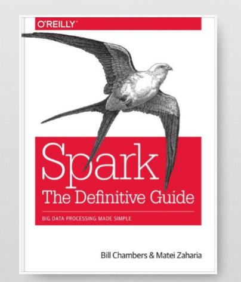

% Spark the Definitive Guide 2nd Edition
% Chapter 06
% Working With Different Types of Data

# Basic Structured Operations

## Text Book

## Objectives and Outcomes

- Understand how to build expressions using typed data
- Understand how to use:
  - Booleans
  - Numbers
  - Strings
  - Dates and Timestamps
  - Nulls
  - Complex and user types

## Review

- So far:
  - We covered basic DataFrame operations.
  - We learned the simple concepts and tools that you will need to be successful with Spark DataFrames
  - We learned what an expression is
  - We learned the difference between Select and SelectExpr
  - We learned how to add columns and rows to a DataFrame
  - We learned how to take random samples from DataFrames
  
## 

## Conclusion

- This chapter covered:

## Questions

- Any questions?
- Read Chapter 07 and do any exercises in the book.
