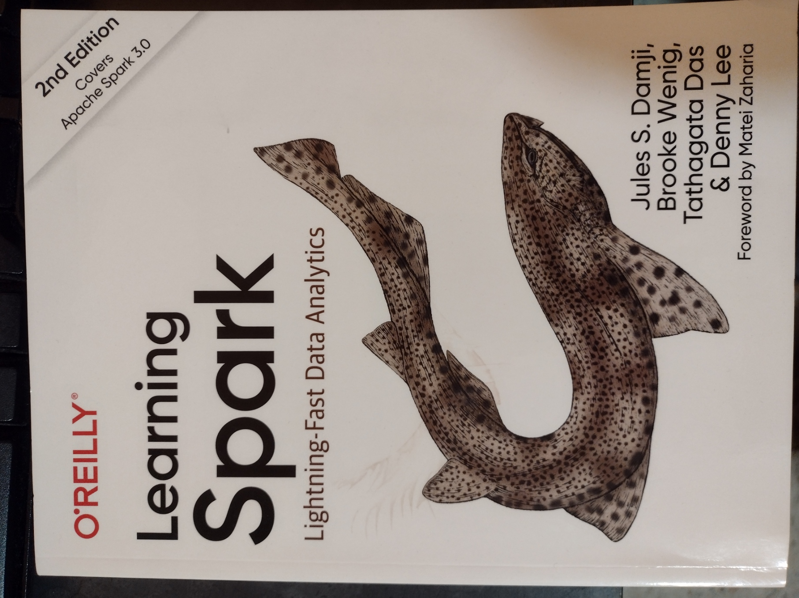
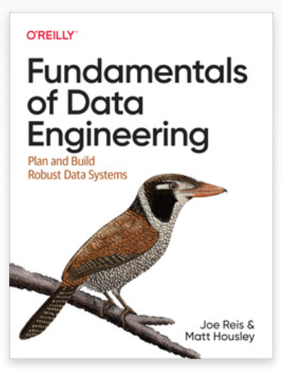

# ITMD 521 Big Data Infrastructure - Fall 2025

Semester: Spring 2025 Professor Jeremy Hajek

| Category | Value |
| --------- | ------------ |
 **Professor** | Jeremy Hajek
 Address | Department of Information Technology & Management 10 W. 35th St., Chicago, IL 60616
 Telephone | 312.567.5937
 Email | hajek@iit.edu
 Office | IIT Tower 15th Floor
 Office Hours and URL | See Times at [https://iit.campus.eab.com/pal/WAle8ZAcry](https://iit.campus.eab.com/pal/WAle8ZAcry "webpage for availability")
 Location | IIT Tower 15th Floor or online via MS Teams

## Course Catalog Description

This course covers both concepts and practical applications of distributed data paradigms. This provides a comparison between SQL, MapReduce, and Spark Frameworks. The course focuses on how to treat and prepare unstructured data to be used in the MapReduce framework for parallel processing. Students will be tasked with learning and demonstrating the MapReduce framework through implementing the Hadoop framework and associated Java technology. [ITMD 521 Bulletin Description](http://bulletin.iit.edu/courses/itmd/ "ITMD 521 Bulletin Description")

## Updated Course Description

This course covers both concepts and practical applications of distributed data paradigms and data engineering. We will explore cloud native tooling used in the industry. We will focus on the concepts of Data Engineering and explore the Data Life Cycle. We will apply these concepts using opensource Big Data platforms and by writing code to explore the concepts of Data Engineering. You will have an experience how to treat and prepare structured and unstructured Big Data. Students will be tasked with learning and demonstrating these concepts via a hands on final project.

## Prerequisites

Familiarity with programming and Linux: Normally 3-0-3 Semester Hours

## Section 01 Tuesday Lecture, Time & Place

* Main Class time
  * Tuesday and Thursday 5:00 PM to 7:40 PM
  * Location - TS-2030 Smart Lab
  * [Campus Map](https://www.iit.edu/about/campus-information/mies-campus/mies-campus-map "IIT Campus Map URL")

### Directions to Smart Lab

To get to the Smart Tech Lab - enter the Michael Galvin tower on 35th Street.  Swipe in at the desk and take the elevator up to the second floor. Exit to the left and head north over the bridge from the Tower to the TS building. The Floor turns from white tile to brown carpet.  Take a left at the intersection and the Smart Lab is directly ahead of you.

## Section 01 Schedule of Topics/Readings

All readings should be done prior to class

Session | Date | Topic | Reading for Homework |
----------|------|:------|----------
1 | 08/20 | Introduction | -
2 | 08/27 | Tooling Assignment | FoDE 1 
3 | 09/03 | Data Engineering Described | -
4 | 09/10 | Advanced Tooling Assignment | FoDE 2
5 | 09/17 | Data Engineering Life Cycle | Learning Spark 2
6 | 09/24 | Apache Spark Install | FoDE 3
7 | 10/01 | Designing Good Data Architecture | Learning Spark 3
8 | 10/08 | Apache Spark Structured APIs | FoDE 4
9 | 10/15 | Choosing Technologies Across the Data Engineering LifeCycle | Learning Spark 3
10 | 10/22 | End to End Data Set Examples | FoDE 5
11 | 10/29 | Data Generation in Source Systems | Learning Spark 4 Part I
12 | 11/05 | Spark SQL and DataFrames | FoDE 6
13 | 11/12 | Storage | Learning Spark 4 Part II 
14 | 11/19 | File storage and Partitions | FoDE 7
15 | 11/26 | Ingestion | Learning Spark 5
16 | 12/03 | Final Exam Week | -

## Course Student Outcomes

At the outcome of this course, students will have a structured overview of distributed data-paradigms. You will be able to describe and explain the aspects of each paradigm and the tools used to run programs to query structured and unstructured data. You will be able to install, implement, and demonstrate the software that allows you to use these paradigms. You will be able to explain the concept of Data Engineering and the Data Life Cycle.

## Course Objectives

Students completing this course will be able to:
  
* Describe the task of a Data Engineer
* Explain the Data lifecycle
* Deploy a Spark Application to a Spark cluster
* Demonstrate loading data from disparate data sources and discuss advantages
* Demonstrate and Discuss the benefits of enterprise Big Data tools
* Demonstrate the creation of Data Pipelining

## Required Textbook

* Learning Spark - Lighting-Fast Data Analytics
  * Damji, Jules S.; Wening, Brooke; Das, Tathagata; & Lee, Danny
  * ISBN-13: 978-1-492-05004-9
  * Publisher: O'Reilly
  * [https://www.amazon.com/Learning-Spark-Jules-Damji/dp/1492050040/ref=sr_1_9?keywords=learning+spark+2.0&qid=1641868150&sr=8-9](https://www.amazon.com/Learning-Spark-Jules-Damji/dp/1492050040/ref=sr_1_9?keywords=learning+spark+2.0&qid=1641868150&sr=8-9 "Link Learning Spark Amazon Page")

* Fundamentals of Data Engineering
  * Joe Reis, Matt Housley
  * Released June 2022
  * Publisher(s): O'Reilly Media, Inc.
  * ISBN: 9781098108304
  * [Link to Amazon](https://www.amazon.com/Fundamentals-Data-Engineering-Robust-Systems/dp/1098108302/ref=sr_1_1?crid=2Y0ZX5GC2N8KV&keywords=fundamentals+of+data+engineering&qid=1704683557&sprefix=fundamentals+of+data+en%2Caps%2C129&sr=8-1 "Textbook link to Amazon")

### Readings

Readings for the class will be assigned from the textbooks; there will be additional reading assigned in the form of online reading. All readings should be done before coming to class on the assigned date, and are mandatory and expected.  Generally if you do the readings you will excel in the course, as the lectures serve as a clarification and explanation of material you should already be familiar with.

### Course Notes

It is recommended to take notes from the discussion portion of the class.

### Attendance

Attendance is expected and will be counted as part of your grade -- if you are not able to attend please email me

### Canvas

We will be using Canvas as the new LMS for communications, assignment submissions, group project coordination, providing online resources and administering examinations. All remote students will view the course lectures online via Canvas, and online readings and other course material will be found on Canvas.

Mobile apps available

* [Android Canvas](https://play.google.com/store/apps/details?id=com.instructure.candroid&hl=en_US "Android Canvas")
* [iOS Canvas](https://apps.apple.com/us/app/canvas-student/id480883488 "iOS Canvas")

### Assignments

Lab Assignment: There will be 13 lab assignments
Final Project: The will be a final project detailed and presented during the final exam period

### Grading

Grading criteria for (undergrad course number) students will be as follows:

Letter | Description | Percentage
-------|-------------|------------
A | Outstanding work reflecting substantial effort | 90-100%
B | Excellent work reflecting good effort | 80-89.99%
C | Satisfactory work meeting minimum expectations | 70-79.99%
E | Unsatisfactory work |0-69.99%

The final grade for the class will be calculated as follows:

Name | Grade | Total Points
------------------|----------|-----------
Lab Assignments | 50% | 130 (10pts each x13)
Final Project | 38% | 100 points
Attendance | 12% | 30 points

### Late Submission

By default no late work will be accepted – barring situations beyond our control.

### Academic Honesty

All work you submit in this course must be your own. That includes code and code samples taken from the internet.

### Plagiarism

You must fully attribute all material, even when using code. Citing your sources is considered good practice and required even with source code. Using code-snippets from Stack Overflow requires a notice of the MIT license. Even proper usage of ChatGPT requires attribution and will generate an attribution link.

Dealing with code -- you need to respect opensource licenses and in the absence of a clear license be careful cutting and pasting code without attributing source. A good metric would be to add a comment in your code with a link to the original source to protect yourself.

### Collaboration

We will use Discord for all class questions and discussion

### Our Contract

This syllabus is my contract with you as to what I will deliver and what I expect from you. If I change the syllabus, I will issue a revised version of the syllabus; the latest version will always be available on Blackboard. Revisions to readings and assignments will be communicated via Blackboard and via version control in GitHub

### Disabilities

Reasonable accommodations will be made for students with documented disabilities.  In order to receive accommodations, students must obtain a letter of accommodation from the Center for Disability Resources and make an appointment to speak with me as soon as possible.  My office hours are listed on the first page of the syllabus. The Center for Disability Resources (CDR) is located in 3424 S. State St., room 1C3-2 (on the first floor), telephone 312 567.5744 or disabilities@iit.edu

### ARC Tutoring Center

The university provides a free tutoring and study center called the [ARC](https://www.iit.edu/arc "IIT Resource Center URL").  This is located newly in the basement of the Galvin Library and is open to all for walk in appointments as well as scheduled tutoring.

### Illinois Tech Sexual Harassment and Discrimination Information

Illinois Tech prohibits all sexual harassment, sexual misconduct, and gender discrimination by any member of our community. This includes harassment among students, staff, or faculty. Sexual harassment of a student by a faculty member or sexual harassment of an employee by a supervisor is particularly serious. Such conduct may easily create an intimidating, hostile, or offensive environment.

Illinois Tech encourages anyone experiencing sexual harassment or sexual misconduct to speak with the Office of Title IX Compliance for information on support options and the resolution process. You can report sexual harassment electronically at [iit.edu/incidentreport](iit.edu/incidentreport "IIT Incident Report URL"), which may be completed anonymously. You may additionally report by contacting the Title IX Coordinator, Virginia Foster at foster@iit.edu or the Deputy Title IX Coordinator, Esther Espeland at eespeland@iit.edu.

For confidential support, you may reach Illinois Tech’s Confidential Advisor at (773) 907-1062. You can also contact a licensed practitioner in Illinois Tech’s Student Health and Wellness Center at student.health@iit.edu or (312)567-7550

For a comprehensive list of resources regarding counseling services, medical assistance, legal assistance and visa and immigration services, you can visit the Office of Title IX Compliance website at [https://www.iit.edu/title-ix/resources](https://www.iit.edu/title-ix/resources "IIT Title IX resources").
