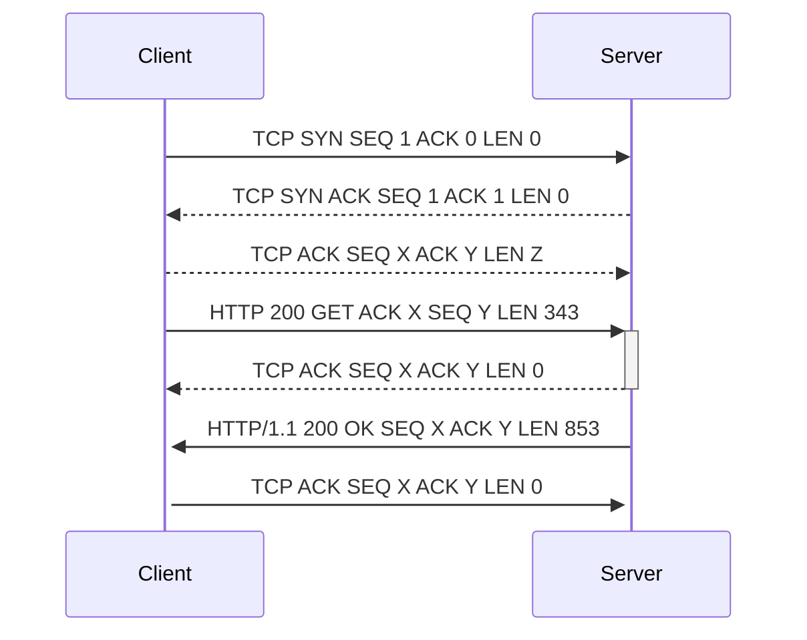

# Final Practical Exam

Assume we are using relative TCP sequence and acknowledgement numbers. This is a sample three way handshake and an HTTP request which is successfully returned (Code 200).

There are variables X, Y, and Z - can you open this document in Visual Studio Code and using the preview button (magnifying glass in the upper right corner). In a recorded video replace the values and explain the answers as you replace.

## Deliverable

You will take a screen capture of you replacing the values as well as explaining why you chose to replace the values. You can use previous WireShark Captures, VMs from Week 13 lab, previous homework, but your answers must be your own. Recording should take no more than 4-5 minutes. We need to see your face as well during the video to make sure it is you.

This portion is worth 30 points.

* 5 Points for formatting, sharing link, and having the correct sharing permissions
* 5 Points for introducing yourself in the video and having the camera on the entire time
* 20 Points for correct TCP sequencing information

You can make use of any screen capture technology you would like and render the capture as a MP4 or OGG/Vorbis equivalent. Upload it to your IIT Google Drive, give permissions to share the video via link, and submit that shared link to Blackboard as the deliverable. Please test this.

### Screen Capture Tool Suggestion

If you haven't used any screen capture tools - I would recommend the [OBS Project](https://obsproject.com/ "webpage for OBS Project"). The Open Broadcaster Software project is cross-platform and is a suite of tools used for screen capture and podcasting. I like it because there is a pretty straight forward record button and the recording is dumped instantly into an MP4.
