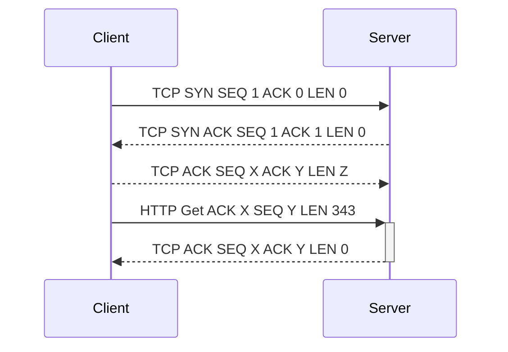

# Mermaid Sample

Does this render as a diagram?

```mermaid
sequenceDiagram
    participant Client
    participant Server
    Client->>Server: TCP SYN SEQ 1 ACK 0 LEN 0
    Server-->>Client: TCP SYN ACK SEQ 1 ACK 1 LEN 0
    Client-->>Server: TCP ACK SEQ X ACK Y LEN Z
    Client->>+Server: HTTP Get ACK X SEQ Y LEN 343
    Server-->>-Client: TCP ACK SEQ X ACK Y LEN 0
```
