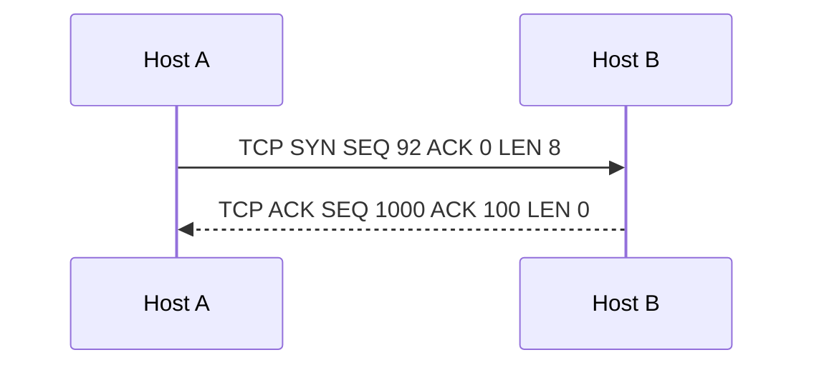
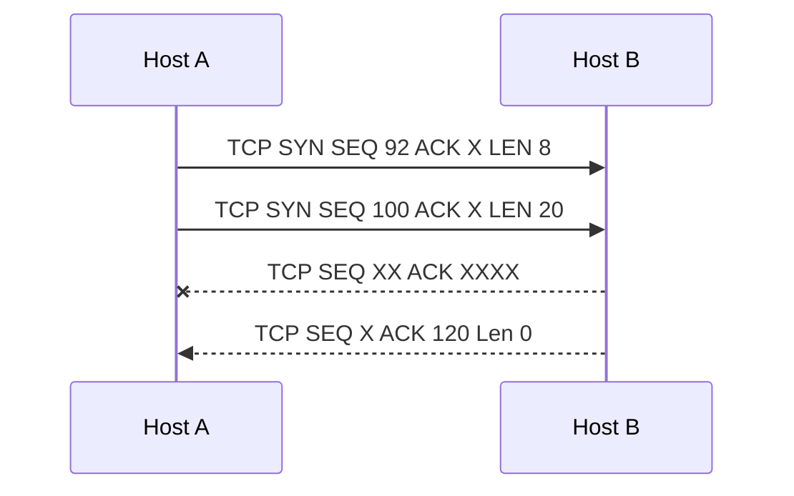
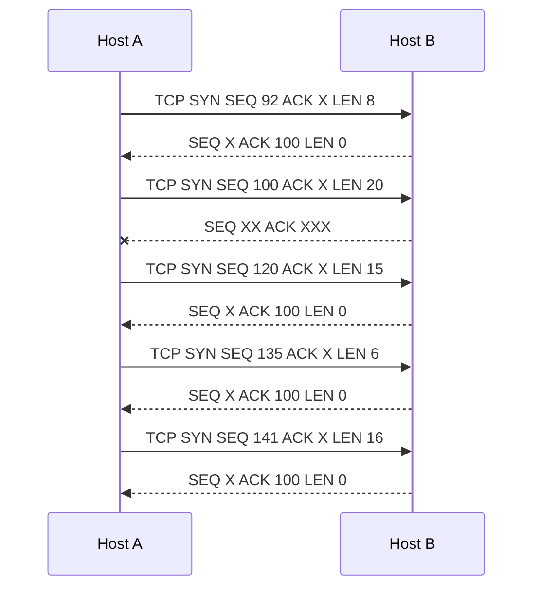

# Timeout and Retransmit Scenarios

## Lost ACK

What happens if the second packer or ACK 100 never makes it to Host A?

## One Lost Packet in a Sequence

What happens if the first packet, seq 92 ACK, never makes it back to Host A? What does the Host B do with the already received 8 bytes?

## Out of Order TCP Segment Arrival?

* Why is the ACK number for the 4 responses always 100 in this case?
* What happens if TCP segments arrive to a host out of order or with segments missing?
  * Hint - the ACK number is also a way for the receiver to tell the client how many bytes it has received and which segment it is expecting next.

If the TCP  sender receives three duplicate ACKs for the same data, it takes this as an indication  that the segment following the segment that has been ACKed three times has been  lost. (In the homework problems, we consider the question of why the sender waits  for three duplicate ACKs, rather than just a single duplicate ACK.) In the case that  three duplicate ACKs are received, the TCP sender performs a fast retransmit [RFC  5681], retransmitting the missing segment before that segment’s timer expires.

Kurose, James F.; Ross, Keith. Computer Networking (p. 244). Pearson Education. Kindle Edition.
