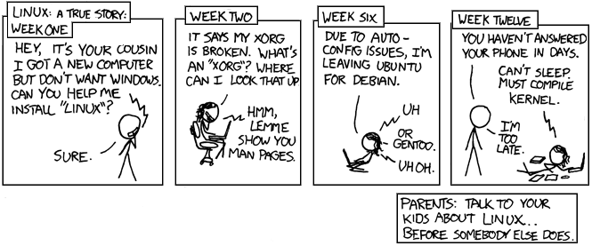

# ITMO 356 Introduction to Open Source Operating Systems

Semester: Fall 2026 Professor Jeremy Hajek

---------------- --------------------------------------------------------
  **Professor**: Jeremy Hajek
        Address: Department of Information Technology & Management,
                 10 W. 35rd St., Chicago, IL 60616
      Telephone: 312.567.5937
          Email: hajek@illinoistech.edu
         Office: Galvin Tower 15th floor ITM Offices, 10 W. 35th St.
   Office Hours: Monday and Wednesday 12:45 - 2:30 PM
---------------- --------------------------------------------------------

**Course Catalog Description:** Students learn to set up and configure an industry-standard open source operating system including system installation and basic system administration; system architecture; package management; command-line commands; devices, filesystems, and the filesystem hierarchy standard. Also addressed are applications, shells, scripting and data management; user interfaces and desktops; administrative tasks; essential system services; networking fundamentals; and security, as well as support issues for open source software. Multiple distributions are covered with emphasis on the two leading major distribution forks. [ITMO 356 Bulletin Description](http://bulletin.iit.edu/courses/itmo/ "ITMO 356 Bulletin Description")

### Prerequisites 

None  Credit: Lab 3-0-3

### Lecture Day, Time & Place

Tuesday and Thursday 1:50 - 3:05 in room TS-2033.

### Schedule of Topics/Readings

All readings should be done prior to class. Do the readings!  

Session # | Date | Topic | Reading - Homework |
----------|------|:------|----------
1 | 08/18 | Introduction  | NA
2 | 08/25 | Tooling Setup  | NA
3 | 09/01 | No Class  | Technology and Philosophy of FOSS Ch 2
4 | 09/08 | Chapter 2  | Technology and Philosophy of FOSS Ch 3
5 | 09/15 | Chapter 3  | Technology and Philosophy of FOSS Ch 4
6 | 09/22 | Chapter 4 | Technology and Philosophy of FOSS Ch 5
7 | 09/29 | Chapter 5 | Technology and Philosophy of FOSS Ch 6
8 | 10/06 | Chapter 6 | Technology and Philosophy of FOSS Ch 7
9 | 10/13 | NA | No Class - Fall Break on the 13th
10 | 10/20 | Chapter 7 | Technology and Philosophy of FOSS Ch 8
11 | 10/27 | Chapter 8 | Technology and Philosophy of FOSS Ch 9
12 | 11/03 | Chapter 8 | Technology and Philosophy of FOSS Ch 10
13 | 11/10 | Chapter 9 & 10 | Technology and Philosophy of FOSS Ch 11
14 | 11/17 | Chapter 11 & 12 | Technology and Philosophy of FOSS Ch 12
15 | 11/24 | Chapter 12 & 13 | Thanksgiving Break on the 25th - No Class
16 | 12/01 | Final Project | NA
17 | 12/07-12 | Final Exam week - Presentation of Final Project

### Course Outcomes

* Describe the origins of and explain the philosophy of Open Source Software
* Install, configure and administer an industry-standard distribution of the Linux operating system.
* Troubleshoot and resolve Linux installation problems and common system problems

### Course Student Outcomes

Students completing this course will be able to:

* Use and administer Linux as both a server and desktop operating system
* Describe the GPL, GNU, and history of the Linux operating system
* Install different Linux distributions with custom partitioning
* Navigate the graphical interface of the Linux operating system
* Navigate the filesystem using the command line
* Interact with the Linux shell
* Recall and use key Linux utilities
* Install software for use with the Linux operating system
* Use networking services and describe how to troubleshoot issues
* Use SSH for remote admiration and create customer host firewall rules
* Create shell scripts for use with automation
* Design, implement, and evaluate a computing-based solution to meet a given set of computing requirements in the context of the program’s discipline (ABET Computing Criteria 3.2)
* Identify and analyze user needs and take them into account in the selection, creation, evaluation and administration of computer-based systems discipline (ABET Computing Criteria 3.6)

### Required Textbook

* Self-published: Author Jeremy Hajek
  * Title: Technology and Philosophy of Free and Opensource Operating Systems, The Technology and Philosophy Of
* Free Download available: [https://github.com/jhajek/Linux-text-book-part-1/releases](https://github.com/jhajek/Linux-text-book-part-1/releases "Download of Technology and Philosophy of Free and Opensource Operating Systems, The Technology and Philosophy Of")

### Readings

Readings for the class will be assigned from the textbooks; there will be additional reading assigned in the form of online reading. All readings should be done before coming to class on the assigned date, and are mandatory and expected.  Generally if you do the readings you will excel in the course, as the lectures serve as a clarification and explanation of material you should al-ready be familiar with. Completion of reading may be verified by quizzes. Specific readings are assigned by topic above.

### Course Notes

It is recommended to take notes from the oral discussion portion of the class.

### Attendance

Undergrad attendance is expected and will be counted as part of your grade.  

### Assignments

Project/Examination: Detailed in Chapter 14.  It will be a comprehensive project testing all of the skills and tools we have gone over this semester in order to demonstrate mastery of these concepts.  The work can be done with a partner or done individually.

### Grading

Grading criteria for (undergrad course number) students will be as follows:

Letter | Description | Percentage
-------|-------------|------------
A | Outstanding work reflecting substantial effort | 90-100%
B | Excellent work reflecting good effort | 80-89.99%
C | Satisfactory work meeting minimum expectations | 70-79.99%
D | Substandard work not meeting expectations | 60-69.99%
E | Unsatisfactory work |0-59.99%

The final grade for the class will be calculated as follows:

   Name                  Grade    Total Points
----------------------- ------- ----------------
Review Questions (12):    20%        120
Lab Questions (12):       20%        120
Podcast Questions (12):   20%        120
          Midterm Exam:   17%        100
         Final Project:   17%        100
            Attendance:    5%         30
----------------------- ------- ----------------

### Late Submission

By default no late work will be accepted – barring situations beyond our control.

### Academic Honesty

All work you submit in this course must be your own.

### AI Usage policy

Unless designated students will be asked not to use LLMs or AIs to do their work. It is expected in an introduction class that you will learn the fundamentals and present your own work.

### Our Contract

This syllabus is my contract with you as to what I will deliver and what I expect from you. If I change the syllabus, I will issue a revised version of the syllabus; the latest version will always be available on Blackboard. Revisions to readings and assignments will be communicated via Blackboard.

### Disabilities

Reasonable accommodations will be made for students with documented disabilities.  In order to receive accommodations, students must obtain a letter of accommodation from the Center for Disability Resources and make an appointment to speak with me as soon as possible.  My office hours are listed on the first page of the syllabus. The Center for Disability Resources (CDR) is located in 3424 S. State St., room 1C3-2 (on the first floor), telephone 312 567.5744 or disabilities@iit.edu.

### ARC Tutoring Center

The university provides a free tutoring and study center called the [ARC](https://www.iit.edu/arc "IIT Resource Center URL").  This is located newly in the basement of the Galvin Library and is open to all for walk in appointments as well as scheduled tutoring.

### Illinois Tech Sexual Harassment and Discrimination Information

Illinois Tech prohibits all sexual harassment, sexual misconduct, and gender discrimination by any member of our community. This includes harassment among students, staff, or faculty. Sexual harassment of a student by a faculty member or sexual harassment of an employee by a supervisor is particularly serious. Such conduct may easily create an intimidating, hostile, or offensive environment.

Illinois Tech encourages anyone experiencing sexual harassment or sexual misconduct to speak with the Office of Title IX Compliance for information on support options and the resolution process. You can report sexual harassment electronically at [iit.edu/incidentreport](iit.edu/incidentreport "IIT Incident Report URL"), which may be completed anonymously. You may additionally report by contacting the Title IX Coordinator, Virginia Foster at foster@iit.edu or the Deputy Title IX Coordinator, Esther Espeland at eespeland@iit.edu.

For confidential support, you may reach Illinois Tech’s Confidential Advisor at (773) 907-1062. You can also contact a licensed practitioner in Illinois Tech’s Student Health and Wellness Center at student.health@iit.edu or (312)567-7550

For a comprehensive list of resources regarding counseling services, medical assistance, legal assistance and visa and immigration services, you can visit the Office of Title IX Compliance website at [https://www.iit.edu/title-ix/resources](https://www.iit.edu/title-ix/resources "IIT Title IX resources").
