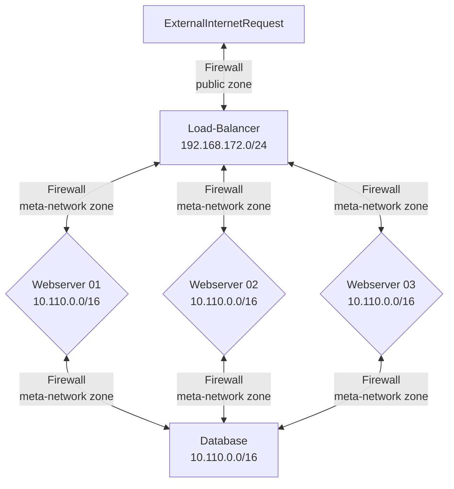

# Metrics Tutorial

This tutorial will explain how the metrics collection is setup for the VMs in our internal cloud.

## Metrics collection for Internal See-through Cloud

Each VM that is deployed on our internal cloud using the templates provided will be automatically configured for metrics export. Each VM will have Node Exporter configured for hardware metrics. The metrics will be harvested and amalgamated by a central Prometheus instance. A Grafana server will allow you to graph all your metrics. 

### Node Exporter

The Prometheus [Node Exporter](https://prometheus.io/docs/guides/node-exporter/ "webpage for installing Node Exporter") exposes a wide variety of hardware and kernel-related metrics.

* Exposed on 10.110.0.0/16 ens20 interface  
* On port 9100 on the meta-network

### Alert Manager

The [Alert Manager](https://prometheus.io/docs/alerting/latest/alertmanager/ "webpage for describing Alert Manager") handles alerts sent by client applications such as the Prometheus server. It takes care of deduplicating, grouping, and routing them to the correct receiver integration such as email, PagerDuty, or OpsGenie. It also takes care of silencing and inhibition of alerts.

### Prometheus 

[Prometheus](https://prometheus.io/docs/introduction/overview/ "webpage describing Prometheus") is an open-source systems monitoring and alerting toolkit originally built at SoundCloud. Since its inception in 2012, many companies and organizations have adopted Prometheus, and the project has a very active developer and user community. 

It is now a standalone open source project and maintained independently of any company. To emphasize this, and to clarify the project's governance structure, Prometheus joined the Cloud Native Computing Foundation in 2016 as the second hosted project, after Kubernetes.

Prometheus collects and stores its metrics as time series data, i.e. metrics information is stored with the timestamp at which it was recorded, alongside optional key-value pairs called labels.

### Grafana

In [Grafana](https://grafana.com/ "webpage for Grafana") you can query, visualize, alert on, and understand your data no matter where it’s stored. With Grafana you can create, explore, and share all of your data through beautiful, flexible dashboards.

### Mermaid Diagram of Cloud Computing Platform Networks

### Make up of the Cloud Lab Network

* 192.168.172.0/24
  * public zone 
  * network interface ens18
  * Has FQDN in the form of: `system78.rice.iit.edu` 
  * Where the `78` is the last octet of its IP address: `192.168.172.78`
* 10.0.0.0/16
  * metrics-network zone
  * network interface ens19
  * non-routable network
  * used for the internal Ubuntu `apt` mirror, speeds up downloads and installs
* 10.110.0.0/16
  * meta-network zone
  * network interface ens20
  * non-routable non-routable
  * [Consul DNS resolver provided](https://developer.hashicorp.com/consul/tutorials/networking/dns-forwarding#systemd-resolved-setup "webpage for consul DNS Forwarding")
  * Any FQDN, `*.service.consul` is dynamically resolved

### Service Discovery using Hashicorp Consul

One of the benefits of building a cloud native application is that the components of the application are not static. You would think this makes things chaos, but actually frees us from having to reserve specific IP address. Having to reserve IP address prevents our application from being moved to a different platform or having a test environment and a production environment.

By the definition of cloud native, resources cannot be statically defined. Everything then communicates via HTTP, how do we know the IP addresses of the nodes in our application? We could use a whole bunch of shell-scripted hackery, but we would quickly find that would run into scale problems.

You have a problem, that is connecting 3 webserver nodes to our load-balancer and connecting all three webserver nodes to communicate with a database layer. How will you know how to connect to these resources?

Enter [Hashicorp Consul](https://consul.io "webpage for consul.io service discovery"):

> *Consul uses service identities and traditional networking practices to help organizations securely connect applications running in any environment.*

> *A modern service networking solution requires that we answer four specific questions: Where are my services running? How do I secure the communication between them? ... How do I control access to my environments?*

The main principle is that each Packer source block in build templates have the configuration preset so that each virtual machine instance knows how to register itself with the Consul service upon launch and over the `meta-network firewalld zone` can communicate with the other registered nodes.

Consul is configured via the `shell provisioner`: `post_install_prxmx_update_dns_for_consul_service.sh` under `scripts` > `proxmox` > `core-jammy` to configure systemd-resolved, which is the systemd DNS resolver, to run a local DNS resolver on port 8600 internally (in addition to the normal 53) to listen for specific domain requests. Consul will then forward any requests to *.service.consul to port 8600. This port is open on the `meta-network firewalld zone` for all nodes and runs the Gossip protocol. The name implies, like real life, each node gossips to each other based on your domain name. This way each node knows who they are, and can resolve any known name to an IP via Consul on the `meta-network`

The hostnames that appear in the Proxmox Consol are defined in the `main.tf` resource block, in the remote-exec section, the line: 

`"sudo sed -i 's/replace-name/${var.lb-yourinitials}-vm${count.index}/' /etc/consul.d/system.hcl",`
Here we are using the `sed` command to find and replace a place holder, `replace-name` with the value you defined in the var `lb.yourinitials` and append the vm count value to generate a unique FQDN.

For example if you system names are:

* team00-lb-vm0.service.consul
* team00-ws-vm0.service.consul
* team00-ws-vm1.service.consul
* team00-ws-vm2.service.consul
* team00-db-vm0.service.consul

You would know these FQDNs ahead of time as you will be defining them in the `terraform.tfvars` under the `yourinitials` variable. Since you know the full domain names, you can add these directly into your Nginx loadbalancer configuration and into your application configuration to connect to the database. The IP resolution is completely transparent, as long as the consul service is running.

You can see this in action, ssh into anyone of your servers and issue the commands:

* `consul catalog nodes`
  * This will show you everything currently registered
* `ping team00-lb-vm0.service.consul`
  * Though this is the instructors demo this will resolve to an IP address
