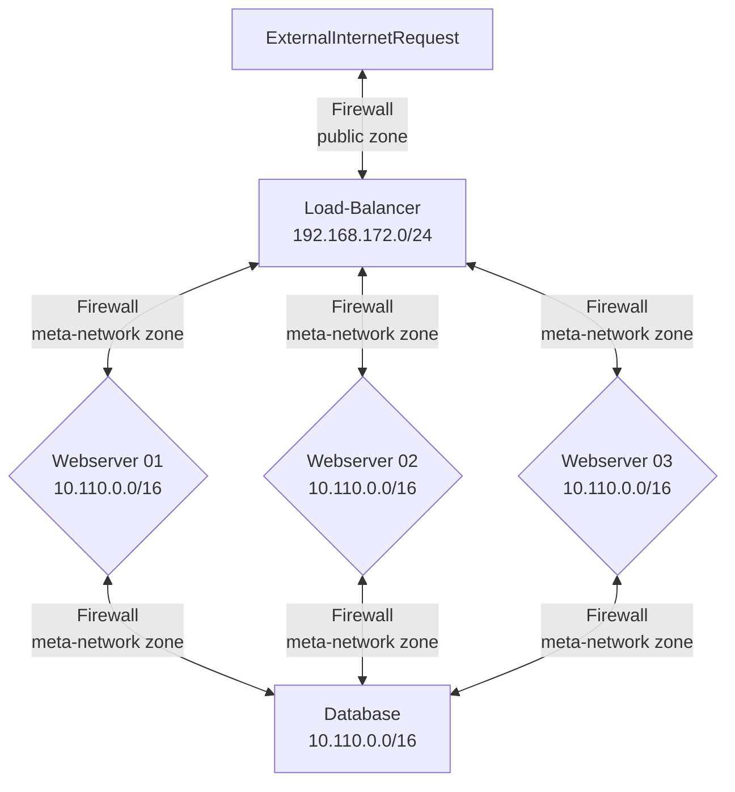

# Metrics Tutorial

This tutorial will explain how the metrics collection is setup for the VMs in our internal cloud.

## Metrics collection for the Internal See-through Cloud

Each VM that is deployed on our cloud platform, using the templates provided, will be automatically configured for metrics export. Each VM will have `Node Exporter` configured for hardware metrics publishing. The published metrics will be harvested and amalgamated by a Prometheus instance. A Grafana server will allow you to graph all your collected metrics. 

### Node Exporter

The Prometheus [Node Exporter](https://prometheus.io/docs/guides/node-exporter/ "webpage for installing Node Exporter") exposes a wide variety of hardware and kernel-related metrics.

* Exposed on 10.110.0.0/16 ens20 interface  
* On port 9100 on the meta-network

### Alert Manager

The [Alert Manager](https://prometheus.io/docs/alerting/latest/alertmanager/ "webpage for describing Alert Manager") handles alerts sent by client applications such as the Prometheus server. It takes care of deduplicating, grouping, and routing them to the correct receiver integration such as email, PagerDuty, or OpsGenie. It also takes care of silencing and inhibition of alerts.

### Prometheus 

[Prometheus](https://prometheus.io/docs/introduction/overview/ "webpage describing Prometheus") is an open-source systems monitoring and alerting toolkit originally built at SoundCloud. Since its inception in 2012, many companies and organizations have adopted Prometheus, and the project has a very active developer and user community. 

It is now a standalone open source project and maintained independently of any company. To emphasize this, and to clarify the project's governance structure, Prometheus joined the Cloud Native Computing Foundation in 2016 as the second hosted project, after Kubernetes.

Prometheus collects and stores its metrics as time series data, i.e. metrics information is stored with the timestamp at which it was recorded, alongside optional key-value pairs called labels.

Prometheus [is part of the CNCF](https://www.cncf.io/projects/prometheus/ "webpage CNCF for Prometheus"), the Cloud Native Compute Foundation (CNCF). 

### Grafana

In [Grafana](https://grafana.com/ "webpage for Grafana") you can query, visualize, alert on, and understand your data no matter where it’s stored. With Grafana you can create, explore, and share all of your data through beautiful, flexible dashboards.

### Mermaid Diagram of Cloud Computing Platform Networks



### Make up of the Cloud Lab Network

* 192.168.172.0/24
  * public zone 
  * network interface ens18
  * Has FQDN in the form of: `system78.rice.iit.edu` 
  * Where the `78` is the last octet of its IP address: `192.168.172.78`
* 10.0.0.0/16
  * metrics-network zone
  * network interface ens19
  * non-routable network
  * used for the internal Ubuntu `apt` mirror, speeds up downloads and installs
* 10.110.0.0/16
  * meta-network zone
  * network interface ens20
  * non-routable non-routable
  * [Consul DNS resolver provided](https://developer.hashicorp.com/consul/tutorials/networking/dns-forwarding#systemd-resolved-setup "webpage for consul DNS Forwarding")
  * Any FQDN, `*.service.consul` is dynamically resolved

### Service Discovery using Hashicorp Consul

One of the benefits of building a cloud native application is that the components of the application are not static. You would think this makes things chaos, but actually frees us from having to reserve specific IP address. Having to reserve IP address prevents our application from being moved to a different platform or having a test environment and a production environment.

By the definition of cloud native, resources cannot be statically defined. Everything then communicates via HTTP, how do we know the IP addresses of the nodes in our application? We could use a whole bunch of shell-scripted hackery, but we would quickly find that would run into scale problems.

You have a problem, that is connecting 3 webserver nodes to our load-balancer and connecting all three webserver nodes to communicate with a database layer. How will you know how to connect to these resources?

Enter [Hashicorp Consul](https://consul.io "webpage for consul.io service discovery"):

> *Consul uses service identities and traditional networking practices to help organizations securely connect applications running in any environment.*

> *A modern service networking solution requires that we answer four specific questions: Where are my services running? How do I secure the communication between them? ... How do I control access to my environments?*

The main principle is that each Packer `source block` in a build template will have the configuration preset so that each virtual machine instance knows how to register itself with the Consul service upon launch and over the `meta-network firewalld zone` and can communicate with the other registered nodes.

### Configuring Consul
 
* `scripts` > `proxmox` > `core-jammy` > `post_install_prxmx_update_dns_for_consul_service.sh` 

To configure systemd-resolved, which is the systemd DNS resolver, to run a local DNS resolver on port 8600 internally (in addition to the normal 53) to listen for specific domain requests. Consul will then forward any requests to *.service.consul to port 8600. This port is open on the `meta-network firewalld zone` for all nodes and runs the Gossip protocol. The name implies, like real life, each node gossips to each other based on your domain name. This way each node knows who they are, and can resolve any known name to an IP via Consul on the `meta-network`

The hostnames that appear in the Proxmox Consol are defined in the `main.tf` resource block, in the remote-exec section, the line: 

```bash
"sudo sed -i 's/replace-name/${var.lb-yourinitials}-vm${count.index}/' /etc/consul.d/system.hcl"
```

Here we are using the `sed` command to find and replace a place holder, `replace-name` with the value you defined in the var `lb.yourinitials` and append the vm count value to generate a unique FQDN.

For example if you system names are:

* jrh-lb-vm0.service.consul
* jrh-fe-vm0.service.consul
* jrh-fe-vm1.service.consul
* jrh-fe-vm2.service.consul
* jrh-db-vm0.service.consul

You would know these FQDNs ahead of time as you will be defining them in the `terraform.tfvars` under the `yourinitials` variable. Since you know the full domain names, you can add these directly into your Nginx loadbalancer configuration and into your application configuration to connect to the database. The IP resolution is completely transparent, as long as the consul service is running.

You can see this in action, ssh into anyone of your servers and issue the commands:

* `consul catalog nodes`
  * This will show you everything currently registered
* `ping jrh-lb-vm0.service.consul`
  * Though this is the instructors demo this will resolve to an IP address

### Firewall Zones

Assuming you are in the `proxmox-cloud-production-templates` directory...

* `packer > scripts > core-jammy > post_install_prxmx-firewall-configuration.sh`

You have the code that does three things

1) Install firewalld
2) Create three zones
3) Configure and attach the zones to existing network interfaces

By default all interfaces are locked down and you need to open additional ports in the firewall during the `provisioning `phase.

```bash
#!/bin/bash
##############################################################################################
# This is where you would update or open new firewall ports.
# By default is open:
# Port 22 for SSH
# port 8301 and 8500 are the Gossip protocol and for the instance to be able to 
# register with the Consul DNS service 
# Instances will be using firewalld
##############################################################################################
sudo apt-get update
sudo apt-get install -y firewalld

sudo systemctl enable firewalld
sudo systemctl start firewalld
##############################################################################################
# sudo firewall-cmd --zone=public --add-interface=ens18 --permanent
# Creates a zone that restricts traffic to that one interface ens18
##############################################################################################
sudo firewall-cmd --zone=public --add-interface=ens18 --permanent
sudo firewall-cmd --zone=public --add-service=ssh --permanent

# Create new zone on ens19 called metrics-network for just metrics
sudo firewall-cmd --new-zone=metrics-network --permanent
# Attach interface ens19 (eth1) to the new zone
sudo firewall-cmd --zone=metrics-network --change-interface=ens19 --permanent
# Created entry for Prometheus
# sudo firewall-cmd --zone=metrics-network --add-port=9100/tcp --permanent

# Create new zone on ens20 called meta-network for a non-routable internal network
sudo firewall-cmd --new-zone=meta-network --permanent
# Attach interface ens20 (eth2) to the new zone
sudo firewall-cmd --zone=meta-network --change-interface=ens20 --permanent

# Consul ports needed for Gossip protocol on the LAN
# https://www.consul.io/docs/install/ports
# Clients only need 8301 tcp & udp to communicate and Gossip with each other

sudo firewall-cmd --zone=meta-network --add-port=8301/tcp --permanent
sudo firewall-cmd --zone=meta-network --add-port=8301/udp --permanent

# Created entry for Node_exporter to be availabe for scraping
sudo firewall-cmd --zone=meta-network --add-port=9100/tcp --permanent

##############################################################################################
# Add any additional firewall ports below this line in this format:
# sudo firewall-cmd --zone=public --add-port=####/tcp --permanent
# sudo firewall-cmd --zone=public --add-port=####/udp --permanent
##############################################################################################
sudo firewall-cmd --reload
```

### How to configure metrics collection

The virtual machines created inside of our cloud and as part of this three-tier example have some vital components already registered. Just running a VM doesn't give you these capabilities. Why? Because operating systems are still considered as a *personal computer* -- we need to add on these capabilities.

The first one is: 

```bash
packer > scripts > jammy-services > node-exporter-consul-service.json
```

```json
{
  "service":
  {"name": "node-exporter",
    "tags": ["node-exporter", "prometheus","HAWKID"],
    "port": 9100
  }
}
```

This file is used to register the Node Exporter service with the `Consul` network for each VM that is created. This is important because as VMs are created and destroyed there needs to be an automatic way to see the Node Exporter service as it becomes available.

Now this is different from the point of a VM registering itself with Consul to use DNS forwarding. In this case we are registering the service with `Consul`. Later `Prometheus` will be able to query the service list and know where to find all of the `Node Exporter` endpoints.

#### Node Exporter Service file

The `Node Exporter` binary is downloaded and installed during the `provisioning` phase of the `packer build .` command. It is just a binary and needs a systemd service file to make the service start at system boot.

* `packer > scripts > jammy-services > node-exporter.service`

```
[Unit]
Description=Node Exporter
Wants=network-online.target
After=network-online.target
Wants=consul.service
After=consul.service

[Service]
User=node_exporter
Group=node_exporter
Type=simple
ExecStart=/bin/sh -c '/usr/local/bin/node_exporter --web.listen-address=0.0.0.0:9100 --no-collector.bonding --no-collector.dmi --no-collector.fibrechannel --no-collector.infiniband --no-collector.nfs --no-collector.nfsd --no-collector.nvme --no-collector.xfs'

[Install]
WantedBy=multi-user.target
```

Even with this service file we need to do a bit more maneuvering of the files to get them into the correct locations.

#### Installing the Node Exporter Binary

* `packer > scripts > core-jammy > post_install_prxmx_ubuntu_install-prometheus-node-exporter.sh`

```bash
#!/bin/bash 
set -e
set -v

echo "Downloading Prometheus Node Exporter..."
wget https://github.com/prometheus/node_exporter/releases/download/v1.4.0/node_exporter-1.4.0.linux-amd64.tar.gz
tar -xvzf node_exporter-1.4.0.linux-amd64.tar.gz

echo "Create system account and group node_exporter..."
sudo adduser --system --group node_exporter

echo "Copying extracted node_exporter to /usr/local/bin/..."
cp -v ./node_exporter-1.4.0.linux-amd64/node_exporter /usr/local/bin/node_exporter

echo "Changing ownership of node_exporter binary..."
sudo chown node_exporter:node_exporter /usr/local/bin/node_exporter

sudo cp -v /home/vagrant/node-exporter.service /etc/systemd/system/node-exporter.service

```

This logic is downloading the Node Exporter compressed binary, extracting the contents, and then copying our binary to the `/usr/local/bin` directory. In addition we see the service file for `node-exporter.service` being copied to the `/etc/systemd/system` directory--that is where user created `.service` files reside. I am providing the `.service` file -- the documentation for Node Exporter tells you how to create one, but they do not provide one.

#### Moving the files into place

* `packer > scripts > core-jammy > post_install_prxmx_install_hashicorp_consul.sh`

```bash
#!/bin/bash

# script to install hashicorp consul for Proxmox servers

wget -O- http://10.0.0.40/gpg | sudo gpg --dearmor -o /usr/share/keyrings/hashicorp-archive-keyring.gpg
#echo "deb [signed-by=/usr/share/keyrings/hashicorp-archive-keyring.gpg] https://apt.releases.hashicorp.com $(lsb_release -cs) main" | sudo tee /etc/apt/sources.list.d/hashicorp.list
echo "deb [signed-by=/usr/share/keyrings/hashicorp-archive-keyring.gpg] http://10.0.0.40/hashicorp $(lsb_release -cs) main" | sudo tee /etc/apt/sources.list.d/hashicorp.list
sudo apt-get update && sudo apt-get install -y consul

sudo systemctl stop consul.service
sudo mv -v /home/vagrant/system.hcl /etc/consul.d/
sudo mv -v /home/vagrant/node-exporter-consul-service.json /etc/consul.d/
sudo systemctl enable consul.service

echo "Sleeping for 5 seconds..."
sleep 5

```

This file has two purposes: it starts the `Consul` service as well as copies the `node exporter` service config file into the Consul configuration directory: `/etc/consul.d`.

When the Consul service starts on each VM, the `node_exporter service` will also start and register itself with Consul.

#### Where does everything start?

The final piece is the run time configuration during the `terraform apply` stage in the `main.tf` file.

```
# main.tf
"sudo systemctl daemon-reload",
"sudo systemctl restart consul.service",
"sudo rm /opt/consul/node-id",
"sudo systemctl restart consul.service",
"sudo sed -i 's/0.0.0.0/${var.lb-yourinitials}-vm${count.index}.service.consul/' /etc/systemd/system/node-exporter.service",
"sudo systemctl daemon-reload",
"sudo systemctl enable node-exporter.service",
"sudo systemctl start node-exporter.service",
```

You can see in the `provisioner "remote-exec"` block that we start all of our services; consul and node_exporter. Using `sed` we are replacing the placeholder values with our values defined in the `terraform.tfvars`.

## Conclusion

These are the scripts and run time configurations that are needed to enable single virtual machines to be part of a cloud computing platform -- to enable external metrics publication and handle the ephemeral/dynamic nature of VMs on a cloud. 
