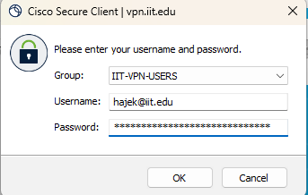

# Cluster Setup Tutorial

This is a short description of the tools we need to setup

## Configure VPN

If you are off of the campus network, connect via the university VPN client to our internal network. You can download the VPN client at [https://vpn-1.iit.edu](https://vpn-1.iit.edu "webpage for the VPN download") for MacOS and Windows (autodetects). 


Use your full `@hawk.iit.edu` email and portal password to authenticate. You will have to 2-factor authenticate as well.

## Connect to VPN

Launch the Cisco VPN tool and connect to `vpn.iit.edu` 


Authenticate using your Portal username and password



Watch out! The two-factor message triggers quickly and doesn't have much patience, make sure to have your phone ready to approve the connection.

## SSH Connection

Now we will test your SSH connection to the `buildserver`. From the terminal on your computer run the follwing command, replacing values of mine with yours:

```bash
ssh -i c:/users/palad/.ssh/id_ed25519_itmo_453_key hajek@system45.rice.iit.edu
```

The `-i` value is the path to the private key that matches the public key you provided to me in the excel Spreadsheet.

The value `hajek` is the username of the account. I created the accounts to use your HAWKID (just the value not the @hawk part), though these account are not related to the university accounts.

The FQDN of `system45.rice.iit.edu` is a virtual machine that we use as a buildserver to issue all of our build commands to our virtual machine cluster.
