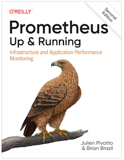

# ITMO 553 Opensource Server Administration

Semester: Summer 2025

| Category | Value |
| --------- | ------------ |
 **Professor** | Jeremy Hajek
 Address | Department of Information Technology & Management 10 W. 35th St., Chicago, IL 60616
 Telephone | 312.567.5937
 Email | hajek@iit.edu
 Office | IIT Tower 15th Floor
 Office Hours and URL | [See Times](https://outlook.office.com/bookwithme/user/c0947acc2b7040bbab5c8c289e3d4a83@iit.edu?anonymous&ep=plink "webpage for availability")
 Location | IIT Tower 15th Floor or online via MS Teams

**Course Catalog Description:** Students learn the administration topics and concepts of IT orchestration, automation, monitoring, and metric collection. Topics include configuring industry standard automation tooling and using scripting to achieve immutable infrastructure. Students will learn how to monitor and collect and present metrics in regards to the infrastructure they deploy. 

**Prerequisites:** ITMP 540 and ITMO 556, Credit: Lab 3-0-3

**Lecture Day, Time & Place:** Monday and Wednesday 10 AM - 1:10 PM in the [Tech South 2030 Smart Lab](https://www.iit.edu/about/campus-information/mies-campus/mies-campus-map "IIT Campus Map URL"), on IIT’s Mies Campus in Chicago.

**Schedule of Topics/Readings:** All readings should be done prior to class. Do the readings!  

Session # | Date | Topic | Reading |
----------|------|:------|----------
1 | 06/02 | Introduction and tooling setup | Ch 1 and 2
2 | 06/04 | History of Monitoring | Ch 3-6
3 | 06/09 | Instrumentation | Ch 9-12
4 | 06/11 | Graphing | Ch 13-16
5 | 06/16 | Infrastructure Monitoring  | -
6 | 06/18 | Infrastructure Monitoring  | Ch 18-20 
7 | 06/23 | Alerting and security | -
8 | 06/25 | Alerting and security | -
9 | 06/30 | Log Management and collection | -
10| 07/02 | Log Management and collection | -
11| 07/09 | Application Logging and Metrics | -
12| 07/11 | Application Logging and Metrics | -
13| 07/16 | Project work time | -
14| 07/18 | Project work time | -
15| 07/23 | Final Project/Exam Week | Final Presentation

**Course Outcomes:**

This course will enable students to be ready to design, build, and implement logging and metrics in monitored applications. Implementing these foundations will allow any system administrator to integrate logging and metric collection to correlate with business objectives.

**Course Student Outcomes:** Students completing this course will be able to:

* Explain the difference between push and pull metrics
* Explain the difference between logging and metrics
* Describe the current industry state of monitoring 
* Explain the use of logging and metrics in regards to Operating System
* Design, build, and implement logging and metrics systems into monitored applications

**Topics to Be Covered**:

* Monitoring & Measurement Frameworks
* Managing events and Metrics & Graphing
* Event Routing and Collection
* Containers and Logs
* Building an app & Notifications
* Getting Started & Monitoring Nodes
* Service Discovery
* Alerting & Scaling and Reliability
* Instrumenting Applications & Logging
* Building Monitored Applications & Notification

**Required Textbook:**

Prometheus Up and Running Version 2

[*Purchase on Amazon*](https://www.amazon.com/_/dp/1098131142?smid=ATVPDKIKX0DER&_encoding=UTF8&tag=oreilly20-20 "link to purchase textbook")

**Course Notes:**  It is recommended to take notes from the oral discussion portion of the class.

**Course Web Site:** We will be using Canvas for the course

**Assignments:**  5 tooling assignments and 5 Mini-Projects (MPs)

**Grading:** Grading criteria for (undergrad course number) students will be as follows:

Letter | Description | Percentage
-------|-------------|------------
A | Outstanding work reflecting substantial effort | 90-100%
B | Excellent work reflecting good effort | 80-89.99%
C | Satisfactory work meeting minimum expectations | 70-79.99%
D | Substandard work not meeting expectations | 60-69.99%
E | Unsatisfactory work | 0-59.99%

The final grade for the class will be calculated as follows: (example)

| Name                 | Grade | Total Points |
| ----------------------- | ------- | ---------------- |
|   Tooling Assignments: | 10% | 50 |
|                MP 1-5: | 50% | 200 |                 
|         Final Project: | 40% | 150 |
| ----------------------- | ------- | ---------------- |

**Late Submission:**  By default no late work will be accepted – barring situations beyond our control.

**Academic Honesty:**  All work you submit in this course must be your own.

**Plagiarism:** You must fully attribute all material directly quoted in papers and you must document all sources used in the preparation of the paper using complete, APA-style bibliographic entries. Including directly quoted material in an assignment without attribution or a bibliography entry for the source of the material is always plagiarism and will always be treated as such by me. No more than thirty-three percent of material included in any paper may be direct quotes. Students have submitted plagiarized material in seven of the last eight times I have taught this course and I will not tolerate it. If you submit plagiarized material you WILL receive a grade of ZERO for the assignment or exam question, an Academic Honesty Violation Report will be filed, and it may result in your expulsion from the course with a failing grade as per the IIT and ITM academic honesty policies. There is no excuse for not understanding this policy and if you do not understand it please let me know and I will be happy to discuss it with you until you do.

**Our Contract:** This syllabus is my contract with you as to what I will deliver and what I expect from you. If I change the syllabus, I will issue a revised version of the syllabus; the latest version will always be available on Canvas. Revisions to readings and assignments will be communicated via Canvas.

**Disabilities:** Reasonable accommodations will be made for students with documented disabilities.  In order to receive accommodations, students must obtain a letter of accommodation from the Center for Disability Resources and make an appointment to speak with me as soon as possible.  My office hours are listed on the first page of the syllabus. The Center for Disability Resources (CDR) is located in 3424 S. State St., room 1C3-2 (on the first floor), telephone 312 567.5744 or disabilities@iit.edu.

**ARC Tutoring Center:** The university provides a free tutoring and study center called the [ARC](https://www.iit.edu/arc "IIT Resource Center URL").  This is located newly in the basement of the Galvin Library and is open to all for walk in appointments as well as scheduled tutoring.

**Illinois Tech’s Sexual Harassment and Discrimination Information:** Illinois Tech prohibits all sexual harassment, sexual misconduct, and gender discrimination by any member of our community. This includes harassment among students, staff, or faculty. Sexual harassment of a student by a faculty member or sexual harassment of an employee by a supervisor is particularly serious. Such conduct may easily create an intimidating, hostile, or offensive environment.

Illinois Tech encourages anyone experiencing sexual harassment or sexual misconduct to speak with the Office of Title IX Compliance for information on support options and the resolution process. You can report sexual harassment electronically at iit.edu/incident report, which may be completed anonymously. You may additionally report by contacting the Title IX Coordinator, Virginia Foster at foster@iit.edu or the Deputy Title IX Coordinator at eespeland@iit.edu.

For confidential support, you may reach Illinois Tech’s Confidential Advisor at (773) 907-1062. You can also contact a licensed practitioner in Illinois Tech’s Student Health and Wellness Center at student.health@iit.edu or (312)567-7550

For a comprehensive list of resources regarding counseling services, medical assistance, legal assistance and visa and immigration services, you can visit the Office of Title IX Compliance website at [https://www.iit.edu/title-ix/resources](https://www.iit.edu/title-ix/resources "Title IX Compliance website").
