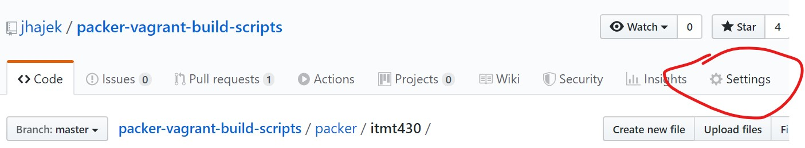
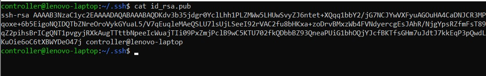
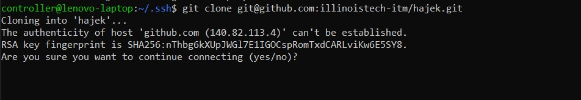
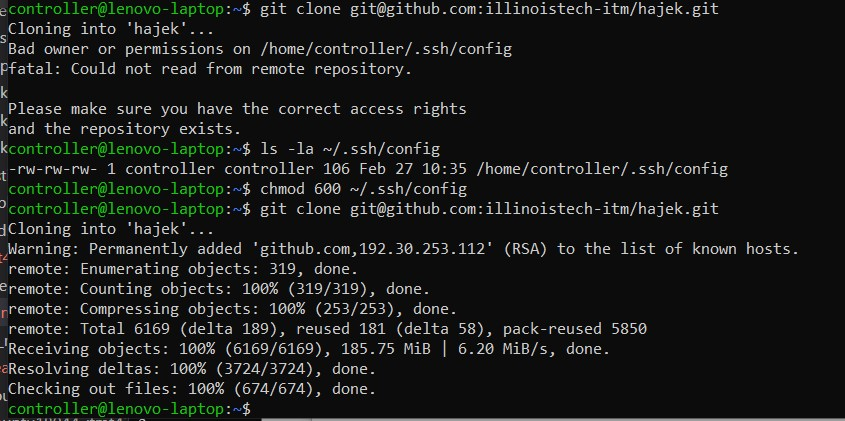
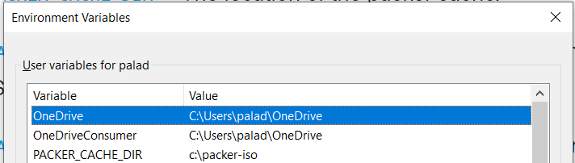

# Automation Demo

This is a small demo that will show the concepts of application automation

## Objectives

* Discuss and explain issues of authentication and access with automation
* Understand secrets management and discuss potential software solutions
* Discuss and understand the creation and use of SSH/RSA keys in relation to private repositories
* Describe and Understand the functional domains of Packer and Vagrant
  * How to manage the creation of virtual machine images/artifacts with Packer
  * How to manage, create, and start those Virtual Machines in Vagrant
  * How to manage private networking in VirtualBox/Vagrant for application deployment
* Describe and understand the concept of provisioning and post-processing of virtual machine artifacts

## Outcomes

At the end of this demonstration you will be able to deploy create two virtual machines, containing a sample NodeJS application and a sample relational database, via Packer and run/managed via Vagrant.  You will have successfully deployed this application code from a private GitHub repo via SSH and securely used RSA keys and Linux ENV variables to do so.

## Questions

If you have any questions myself and the TA are available over the break and via Slack.  We will endeavor to help out where needed.  Note that these are my suggestions and if other or better ways appear please share or feel free to follow them.

## Setup

For this demonstration, you need to have Packer, Vagrant, and VirtualBox installed.  If you completed the Tooling Assignment then you will have the correct tools.
You can clone the sample code I will be using--issue the command:

```bash
git clone https://github.com/jhajek/packer-vagrant-build-scripts.git
```

```bash
# The sample application code is located in my public repo jhajek
# you can clone this and copy it to your own private repo, located in the itmt-430 directory > sample code
git clone https://github.com/illinoistech-itm/jhajek.git
```

In this repo, under the folder named **Packer > itmt430 > automation-demo** you will find a detailed [Readme.md](https://github.com/jhajek/packer-vagrant-build-scripts/blob/master/packer/itmt430/ReadMe.md "Detailed Sample Project Repo Link").  The content of that link will be reprinted here.

### Initial Problem

How can you clone code from a private GitHub Repo?   When you do so on the command line you are prompted for a password.  This breaks automation.  Git and GitHub have a solution.  You can add an RSA Public Key to GitHub (called a Deploy Key) and clone over SSH as opposed to https.

### Pre-steps

Secrets management (passwords, keys, key/value pairs) is the one of the main focuses of cyber-security as well as any application health.  In building an application via an automation tools, we have to consider how we will place secrets into our new Operating System as well as how we will retrieve application code securely from a private GitHub repository.

We will be using [SSH/RSA](https://en.wikipedia.org/wiki/RSA_\(cryptosystem\)) keys to authenticate between your system and GitHub.  You might have heard these referred to as public/private key authentication. You will need to generate a keypair.  This can be done by issuing the following command from a shell on Mac, Linux, and/or PowerShell/Windows:

```bash
# this is the command to generate a basic keypair
ssh-keygen
```

You can accept the defaults by hitting enter.  In this case we don't want a passcode for our key.  If you have not generated a keypair before two files, `id_rsa` and `id_rsa.pub`  will be generated in the `~/.ssh` directory.  One is the private key, one is the public key.  

### Deploy Keys

Upon being made an admin of your team's GitHub repo, you will now have the ability to add public keys to your team private repo.  GitHub refers to these as **Deploy Keys**.  




From the command line display the content of your Public Key, copy and paste the content into a new GitHub Deploy Key. Give the Deploy Key name a very descriptive name so you can remember where the key is located.  You don't want to be reusing keys or passing them around.  You can generate and add as many keys as you want to. Each person should have your own generated key.



### SSH Config

What happens when we run this command?

```bash
# replace hajek.git with your teams or your own private repo name
git clone git@github.com:illinoistech-itm/hajek.git
```

You are prompted with a yes/no prompt, which will prevent an automated cloning.



There is a way to disable the fingerprinting.   It involves creating a file called `config` and placing it in your `~/.ssh` directory. This `config` file is an SSH default file that any SSH connection will read automatically.   This helps setup FQDNs or complicated file paths and saves you the time to type them.  The file should contain this content at the least:

```bash
Host   github.com
Hostname github.com
IdentityFile  /home/vagrant/.ssh/id_rsa
StrictHostKeyChecking no
```

* The value ```StrictHostKeyChecking``` is what turns off the fingerprint checking.  
* The `IdentityFile` value should point to your private key location (id_rsa)

After adding the `config` file, we now encounter a file permission error.  You will see the issue here is that GitHub requires private key files file to be permission 600 if you are on Linux or Mac, but not Windows.  



## A Word About Automation

Looking back to the dawn of the PC era and the operating systems that flowed from that era, Windows, MacOS, and Linux, we see that installation of these OSes are tailored for single person installs with many manual options and configurations.  As students we learned this in ITM 301 or a related Intro to Computers class, where we install many operating systems.  

Outside of a technology called [Jumpstart](https://en.wikipedia.org/wiki/JumpStart_\(Solaris\)) "Sun Solaris Jumpstart network based install tool wike page") which was successful doing network based installs, the idea deploying operating systems in an automated fashion was difficult, as operating systems were not built for this kind of thing.  

Coming into the current decade (2010), we begin to see the prevalence of a few things;

* High speed and Wireless Internet
* Laptops comparable in memory, disk, and CPU to desktops
* Massive increase in hard disk capacity and in speeds (SSD, NVMe)
* Virtualization -- through VirtualBox being opensource software
  * Virtual networking and routing through the VirtualBox Network interface
* Elastic Self-Serve Cloud Computing

With this combination, the idea of building a network and multiple machines that represents your application became possible.  The remainder of this tutorial will show you a way that based on your project this can be achieved.  As always these are not the only tools available, but a large part of the industry will be familiar with this method.   And always there are further optimizations that I will mention but are not required--feel free to explore.

## Packer.io

[Packer is an open source tool](https://packer.io/intro/index.html "Packer.io Introduction web page") for creating identical machine images for multiple platforms from a single source configuration. Packer is lightweight, runs on every major operating system, and is highly performant, creating machine images for multiple platforms in parallel...

A machine image is a single static unit that contains a pre-configured operating system and installed software which is used to quickly create new running machines. Machine image formats change for each platform. Some examples include AMIs for EC2, VMDK/VMX files for VMware, OVF exports for VirtualBox, etc.

### Why Use Packer

The verbiage is taken from [Why Use Packer?](https://packer.io/intro/why.html "Packer.io why use it web page")

Pre-baked machine images have a lot of advantages, but most have been unable to benefit from them because images have been too tedious to create and manage. There were either no existing tools to automate the creation of machine images or they had too high of a learning curve. The result is that, prior to Packer, creating machine images threatened the agility of operations teams, and therefore aren't used, despite the massive benefits.

Packer changes all of this. Packer is easy to use and automates the creation of any type of machine image. It embraces modern configuration management by encouraging you to use a framework such as Chef or Puppet to install and configure the software within your Packer-made images.

In other words: Packer brings pre-baked images into the modern age, unlocking untapped potential and opening new opportunities.

### Advantages of Using Packer

Super fast infrastructure deployment. Packer images allow you to launch completely provisioned and configured machines in seconds, rather than several minutes or hours. This benefits not only production, but development as well, since development virtual machines can also be launched in seconds, without waiting for a typically much longer provisioning time.

* Multi-provider portability
  * Because Packer creates identical images for multiple platforms, you can run production in AWS, staging/QA in a private cloud like OpenStack, and development in desktop virtualization solutions such as VMware or VirtualBox. Each environment is running an identical machine image, giving ultimate portability.
* Improved stability
  * Packer installs and configures all the software for a machine at the time the image is built. If there are bugs in these scripts, they'll be caught early, rather than several minutes after a machine is launched.
* Greater testability
  * After a machine image is built, that machine image can be quickly launched and smoke tested to verify that things appear to be working. If they are, you can be confident that any other machines launched from that image will function properly.

Packer makes it extremely easy to take advantage of all these benefits.

### Packer Structure

Packer uses JSON based build template files to provide all the answers needed for an automated installation.  You can find many working samples all over the internet, but I have provided 2 bare-bones or vanilla samples using CentOS Server and Ubuntu Server.  You can clone the repo for these samples here:

```bash
# Public repo containing Packer.io working build template samples.
# The samples are located in the directory: packer > vanilla-install
git clone https://github.com/jhajek/packer-vagrant-build-scripts.git
```

Let us take a look at the file: ```ubuntu-18044-vanilla.json```.  It is [located here](https://github.com/jhajek/packer-vagrant-build-scripts/blob/master/packer/vanilla-install/ubuntu18044-vanilla.json "URL to ubuntu vanilla packer build template") for viewing purposes.

If you are not familiar with JSON, it is a way to create key-value paired *objects* in basic text format, in order to give text data a searchable format, as well as make data-interchange possible between languages.

The build template file, is this case named ```ubuntu-18044-vanilla.json``` has three major sections:

* [builders](https://packer.io/docs/builders/index.html "Packer builders webpage")
  * The builder section tells packer what you are going to be building -- such as an VirtualBox VM or a Hyper-V VM for instance.  The values in this section the would relate to the options you would select if you were to manually create a new VirtualBox virtual machine.
* [provisioners](https://packer.io/docs/provisioners/index.html "Packer provisioners webpage")
  * This section is the added benefit to Packer.  This step executes after the base install is finished.  
  * This is where you can secure copy SSH keys into the new virtual machine, and/or execute shell scripts to add additional software or configure your software.
* [post-processors](https://packer.io/docs/post-processors/index.html "Packer post-processors webpage")
  * This phase is once the builder artifact is completed, you can export that format into multiple other formats.  
  * This allows you to create a VirtualBox OVF file and then convert it into a Vagrant Box file.  There is an [entire list of other types Packer can export to](https://www.packer.io/docs/post-processors/index.html "List of types packer can export to website").

### Run the Sample

You can build a vanilla Ubuntu Server 18.04.4 and/or a Centos 19.08 Vagrant Box by running this command from the directory where the build templates (JSON) are located:

```bash
# command to build Vagrant boxes with Packer
packer build ubuntu18044-vanilla.json
packer build centos-7-vanilla.json
```

These samples contain no code from any GitHub repos so they will simply complete their automated install and leave you with an artifact named: ```*.box``` located in the ```../build``` directory

### How does it answer install questions

Packer makes use of existing answer file technology.  Debian/Ubuntu uses a file format called [preseed](https://help.ubuntu.com/lts/installation-guide/armhf/apbs02.html "Ubuntu preseed documentation") and RedHat/CentOS uses a file format called **kickstart** which is an homage to Sun's Jumpstart.  

For the Ubuntu 18.04.4 template you can see this on line 28 and line 24 in the Centos-7 template.  These have been provided for you and will work out of the box &#8482; without having to modify anything as long as the **ks** or **preseed** directory are located in the same level as the build template.

### Output and Vagrant

Once the Packer build template finishes, you will have a *.box file.  This conversion step from an OVF to a Vagrant file is specified in the post-processing step, line 42-46 in the Ubuntu sample.  The value ```output``` is the directory of where you would like the artifact to be placed.  I choose to make a directory called ```../build``` relative to my build templates and have all artifacts placed there.  

This is a convention that makes sense to me, but you can change this to match your own convention if you desire.

The `*.box` artifact is good to have but doesn't do us any good.  Vagrant is a virtualization abstraction tool.  We need to add our newly created *.box so that Vagrant can manage it.  Let's walk through this.

Say you have an artifact named: `ubuntu-ws-18044-server-virtualbox-1583722003.box`. The numbers on yours will be different because I added a system variable that always appends [epoch time](https://en.wikipedia.org/wiki/Unix_time "Unix time article") to the filename guaranteeing a unique filename every time.  Packer build will fail if you already have an existing artifact with the same name (won't overwrite unless you use a --force flag).

To see which boxes Vagrant is currently managing, from the commandline type:

```bash
# Command to see what boxes Vagrant is managing
vagrant box list
```

```bash
# Command to add the newly built box to Vagrant for management
# Note, the end of your file name will be different as the timestamp will be different
# the --name potion is important as this is how Vagrant will refer this virtual machine
vagrant box add ./ubuntu-ws-18044-server-virtualbox-1583722003.box --name ubuntu-vanilla
vagrant box list
```

You should see your Vagrant box in the list as: ubuntu-vanilla

### Vagrant init

The next step is to create a properties file for this virtual machine called a **Vagrantfile**.  This is essentially a configuration file that is interpreted on boot time of the virtual machine and the configuration is translated into VirtualBox CLI commands to create the desired configuration.  

To create this file, I would strongly suggest creating a directory first with the name of the Vagrant box.  This helps keep things clear as to which virtual machine this controls and secondly every Vagrantfile has the same name Vagrantfile, and you wouldn't want to overwrite existing files.

```bash
# Commands to create a directory and create a Vagrantfile for ubuntu-vanilla
# Assuming that your PWD is a directory called build
mkdir ubuntu-vanilla
cd ubuntu-vanilla
vagrant init ubuntu-vanilla
```

Once these steps are done, you can launch the virtual machine with a simple command:

```bash
#  Command to launch and connect to a Vagrant Box
# From the CLI with the location the directory where the Vagrantfile is located
vagrant up
# to remotely connect
vagrant ssh
```

### Vagrant Private Networking

Vagrant has an added feature that will enable a local routable private network on your host PC between all VMs and your host.  It has the added benefit of handling IP address assignment - forging the need to have a DHCP server.  This will allow each person to work on their own hardware without the need for a lab or network.  Meaning you can work at home, in the school library, in the lab, all without having to change your networking stack.

Located in the Vagrantfile on line ~35 you will find this commented out code block.

```ruby
  # Create a private network, which allows host-only access to the machine
  # using a specific IP.
  # config.vm.network "private_network", ip: "192.168.33.10"
```  

Uncomment the `config.vm.network` line to automatically assign the listed private IP to your ubuntu-vanilla machine.

```ruby
  # Create a private network, which allows host-only access to the machine
  # using a specific IP.
    config.vm.network "private_network", ip: "192.168.33.10"
```  

If you have multiple machines, you would change the IP addresses and you now can have a fully assignable network as well as be able to use FQDNs out of your `/etc/hosts` file.  This allows you to add premade Vagrantfiles to your GitHub repo, which you can clone and script the process of starting the VM automatically.

One thing you will have to do in this case is if you have run the `vagrant up` command already and make a change to the `Vagrantfile` you will need to exit the `vagrant ssh` session and issue a `vagrant reload --provision` which is the command that forces Vagrant to re-evaluate the `Vagrantfile` for any changes it needs to make to the structure of the VM.  This only needs to take place one time when you change the Vagrantfile, not every time.

## Application Sample

The vanilla installs are a good start, but they don't answer the question of **secrets** and how to pass them.  

What kind of secrets might we have?

* Private keys
* Usernames and Passwords
* Authorization keys
* JWT seeds
* Salts


### Packer User-Variables

[Packer User Variables](https://www.packer.io/docs/templates/user-variables.html)

User variables allow your templates to be further configured with variables from the command-line, environment variables, Vault, or files. This lets you parameterize your templates so that you can keep secret tokens, environment-specific data, and other types of information out of your templates. This maximizes the portability of the template.

In this example we will be using Packer and Vagrant.  Packer will be used to construct and automate the build of our application.  Packer makes use of `scp` commands during its post-provisioner phase in order to allow files and other secrets to be transferred.  

### Example Two for a complex application

In the repository: [https://github.com/jhajek/packer-vagrant-build-scripts](https://github.com/jhajek/packer-vagrant-build-scripts "Repository for complex samples") you will now find: packer >  ITMT-430 folder.  This folder contains two example build scripts.  The first one is `ubuntu18044-itmt430-webserver.json` and `ubuntu18044-itmt430-database.json`.   The first sample will clone a Hello World Nodejs application from my own private repository.  The second build template will show you how to preseed root passwords for a MariaDB database, create a table, and insert three records to the database, then print those records out to the CLI.

### Variables File

Packer accepts an additional commandline value called ```--var-file=```.  The name of this file can be arbitrary. In the sample [Readme.md](https://github.com/jhajek/packer-vagrant-build-scripts/blob/master/packer/itmt430/ReadMe.md "Sample Readme.md from class example GitHub repo").  I called my file variables.json, but that is arbitrary.  I also added that filename, variables.json to the `.gitignore` file to prevent accidental pushing of your credentials to the GitHub repo.   This is a common tactic, Wordpress does this by giving you a `config-sample` file and have you rename the file.  That way the template can be distributed, but your own file with values will not be pushed or accessible to the outside.

This is a sample variables.json file:

```json
{
    "database-root-password": "foo",
    "database-user-password": "bar",
    "database-access-from-ip": "192.168.33.50",
    "database-ip": "192.168.33.51",
    "webserver-ip": "192.168.33.50",
    "database-name": "namegoeshere",
    "database-user-name": "database-username-goes-here"
}
```

## One way to set username and passwords securely in Packer

In the build template, under the **provisioner** section you will see this section which contains multiple file provisioners and shell script provisioners.  The sample that built the vanilla ubuntu images just used a shell provisioner.

```json
"provisioners": [
    {
    "type": "file",
    "source": "./id_rsa_github_deploy_key",
    "destination": "/home/vagrant/"
    },
    {
      "type": "file",
      "source": "./config",
      "destination": "/home/vagrant/"
    },
    {
      "type": "shell",
      "execute_command" : "echo 'vagrant' | {{ .Vars }} sudo -E -S sh '{{ .Path }}'",
      "inline": [
        "mkdir -p /home/vagrant/.ssh",
        "mkdir -p /root/.ssh",
        "chmod 600 /home/vagrant/id_rsa_github_deploy_key",
        "cp -v /home/vagrant/id_rsa_github_deploy_key /home/vagrant/.ssh/",
        "cp -v /home/vagrant/config /home/vagrant/.ssh/",
        "cp -v /home/vagrant/config /root/.ssh/",
        "git clone git@github.com:illinoistech-itm/hajek.git"
      ]
    },
```

These provisioners run after the operating system is installed.  Packer will launch the VM again and attempt to establish an SSH connection.  Once a connection is established, these provisioners will be executed in order.  This is all done by the Packer executable -- no human intervention needed.  From my sample I do three things.  

* I copy the RSA private key from my repo into the virtual machine
  * Note that I add this filename to the `.gitignore` file to make sure that I never push it to a repo
  * The name of the file `id_rsa_github_deploy_key` is arbitrary, I named mine that so I would remember what it was
* I added the config file for SSH to the virtual machine `~/.ssh` directory
  * This is needed to force a `git clone` via ssh to use the RSA private key that is the other half of the GitHub Code Deploy public key
* Finally I run my provisioner shell script for installing all needed dependencies
  * I added an inline shell command that will make directories, copy files, and execute the `git clone` command
  * This is my private repo so you will need to change **hajek.git** to your team private repo name

## To launch the sample and put it all together

* Issue the command inside of the folder, ```cp variables-sample.json variables.json```
  * The ```variables.json``` file contains key value pairs of variables and passwords to be passed into the provisioner shell script.
  * This renames the file ```variables-sample.json``` to ```variables.json```  (There is an entry in the `.gitignore` so you cannot accidentally `git push` your passwords).
* Edit the ```variables.json``` file replacing default values with your own
  * Note you won't see my private key in the public repo
* Issue the command below to begin the install with password, usernames, and RSA private key properly seeded

 ```bash
 packer build --var-file=./variables.json ubuntu18044-itmt430-database.json
 packer build --var-file=./variables.json ubuntu18044-itmt430-webserver.json
 ```
  
### Contents of Sample Packer Build Templates

There are two sample packer build templates in the itmt430 directory.

## Webserver contents

Once the artifact from Packer is built, you need to add the box to Vagrant to be managed.  This can be performed the same way that the Ubuntu-Vanilla install is done.

To access the application once the command: `vagrant up` has been run:

1) Open a browser on your host system and navigate to the IP address you set in the variables file.  The default is 192.168.33.50
1) This application has an Nginx webserver running on port 80.  
1) It has a Nodejs Hello World application running on port 3000.
1) It has an Nginx route to the Nodejs app located at `/app`

## Database contents

Once the artifact from Packer is built, you need to add the box to Vagrant to be managed.  This can be performed the same way that the Ubuntu-Vanilla install is done.

You will know this is successful when the root password is pre-seeded, the tables have been created, and the 3 records have been added.  You will see the output of a `SELECT * FROM TABLE;` command in the output of the provisioner step before Packer finished its build.  You can also access the MariaDB CLI via the command: `mysql -u root` and use table and select * from there.

1) System will create a `.my.cnf` file which allows for password-less authentication
1) System will pre-seed MariaDB or MyQL root password

### Link to Sample Code

The code samples here are hosted in my private repo, but I made a copy available in my public repo.  They are located in [https://github.com/illinoistech-itm/jhajek/tree/master/itmt-430/sample-code/](https://github.com/illinoistech-itm/jhajek/tree/master/itmt-430/sample-code/ "Sample Application Code")  or issue the command:

```bash
# clone the public repo and nagivate to: > itmt-430 > sample-code
git clone https://github.com/illinoistech-itm/jhajek
```

### Packer Caching Directory

Packer lets you set an Environment (ENV) variable for caching downloaded ISO images.  The variable is named: ```PACKER_CACHE_DIR```.  You can set this as a user ENV variable in Windows or in a `.bashrc` file in MacOS or Linux.  This saves much time in building Packer artifacts, saving you the repeated downloads.



### Further Security Choices

The methods described above are a good start, but might not be scalable beyond a small team.   A product recommended to look at is [Hashicorp Vault](https://www.vaultproject.io/ "Hashicorp Vault introduction website").  This is a much more centralized and scalable way to handle secrets that works locally and in the cloud.  [It has direct integration with Packer](https://packer.io/docs/templates/user-variables.html#vault-variables "Packer Integration with Vault webpage"), which skips the regular `variable.json` files method and instead pulls those values from an encrypted vault datastore.

If you are looking for a challenge, try to implement this, and put it on your resume. If you are curious I have a working sample from a team form 2019

### Manually Binding Network Interfaces

When using a VirtualBox Private network, Vagrant will prompt you to choose which physical NIC you want to pair to the virtual network.  This obviously requires a manual user-intervention, albeit a simple push of the number 1 or 2 (Usually WiFi or Ethernet NIC).

## Questions

If you have any questions myself and the TA are available over the break and via Slack.  We will endeavor to help out where needed.  Note that these are my suggestions and if other or better ways appear please share or feel free to follow them.
