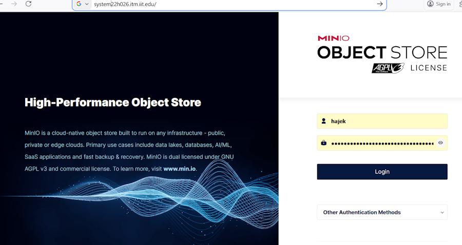

# Connecting and Using Minio Object Storage

When you look at modern platforms, what kind of mechanisms are used to store media? How are videos on YouTube and Disney+ stored and accessed for streaming? How are photos stored on Facebook, Instagram, and embedded in chat programs like Discord or WhatsApp?  

## Three Kinds of Storage

There are three types of storage and three types of consumers of that storage.

| Type | Consumer | Example | 
| ---- | -------- | ------- |
| Humans | File storage | `C:/users/documents/answers.docx`, `cat.jpg` |
| Operating Systems | Block Storage | Read 128KB blocks starting a VMM location |
| Applications | Uses HTTP | Recieves a stream of bytes |

In this case [Object storage](https://aws.amazon.com/what-is/object-storage/ "webpage for Object storage") is the way that modern applications store and retrieve media. Though they didn't invent the concept, [AWS S3](https://docs.aws.amazon.com/AmazonS3/latest/userguide/Welcome.html "webpage for what is S3?") is what made the method popular and the defacto way to accomplish streaming media.

### Object Storage Definition

> *Object storage is a technology that stores and manages data in an unstructured format called objects. Modern organizations create and analyze large volumes of unstructured data such as photos, videos, email, web pages, sensor data, and audio files. Cloud object storage systems distribute this data across multiple physical devices but allow users to access the content efficiently from a single, virtual storage repository...*

> *Metadata is critical to object storage technology. With object storage, objects are kept in a single bucket and are not files inside of folders. Instead, object storage combines the pieces of data that make up a file, adds all the user-created metadata to that file, and attaches a custom identifier. This creates a flat structure, called a bucket, as opposed to hierarchical or tiered storage. This lets you retrieve and analyze any object in the bucket, no matter the file type, based on its function and characteristics.*

## Min.io

We have an on premises S3 compatible solution called [Min.io](https://www.min.io/ "webpage for Min.io"). This implements many of the features of the S3 protocol and gives you the ability to have object storage for your internal network, without giving up AWS (and other major cloud providers) compatibility. 

You will be storing all your media, images, and movies via Minio. There are two language SDKs and you will receive the required secrets to connect. You will receive a text file in the home directory of your buildserver account with additional credentials. Recommended to align your secret names as such -- watchout the ACCESSKEY and SECRETKEY here are unrelated to the Proxmox keys.

```bash
echo "MINIO_ENDPOINT='${MINIOENDPOINT}'" >> /home/vagrant/team02m-2024/code/svelte/.env
echo "MINIO_ACCESS_KEY='${ACCESSKEY}'" >> /home/vagrant/team02m-2024/code/svelte/.env
echo "MINIO_SECRET_KEY='${SECRETKEY}'" >> /home/vagrant/team02m-2024/code/svelte/.env
echo "S3_BUCKET_NAME='${BUCKETNAME}'" >> /home/vagrant/team02m-2024/code/svelte/.env
```

### Python Min.io SDK

[Python SDK](https://docs.min.io/enterprise/aistor-object-store/developers/sdk/python/ "webpage for Python SDK") contains extensive documentation and example code. You will be working with the [get_presigned_url](https://docs.min.io/enterprise/aistor-object-store/developers/sdk/python/api/#get_presigned_urlmethod-bucket_name-object_name-expirestimedeltadays7-response_headersnone-request_datenone-version_idnone-extra_query_paramsnone). This allows a publicly accessible link to be generated without having to have public open access or generate personal links.

### JavaScript Min.io SDK

[JavaScript SDK](https://docs.min.io/enterprise/aistor-object-store/developers/sdk/javascript/ "webpage for JavaScript SDK"). Same as the Python documentation - you will be working with the `get_presigned_url` function.

### Accessing the Min.io Portal

The Minio Web Portal can be accessed at: [https://system22h026.itm.iit.edu](https://system22h026.itm.iit.edu "webpage for access") using the credentials received in the home directory of your buildserver account, named: login.txt.


