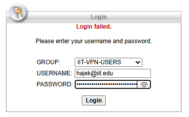

# Buildserver Tutorial - Part I

This is the initial description and setup for the Capstone Cloud Platform. It is expected that all team members go through this tutorial, as this is the critical part in deploying your team application.

## Overview

This tutorial assumes you have completed the Vagrant-Tooling-Assignment, Packer-Tooling-Assignment, Vault-Tooling-Assignment. It is critical to complete those first -- this tutorial builds upon those concepts.

This document will give you the first steps you need and acquaint you with the tools and locations needed to deploy your application.

## Configure VPN

If you are off of the campus network, connect via the university VPN client to our internal network. You can download the VPN client at [https://vpn-1.iit.edu](https://vpn-1.iit.edu "webpage for the VPN download") for MacOS and Windows (autodetects). 



Use your full `@hawk.illinoistech.edu` email and portal password to authenticate. You will have to 2-factor authenticate as well.

## Connect to VPN

Launch the Cisco VPN tool and connect to `vpn.iit.edu` 


Authenticate using your Portal username and password


Watch out! The two-factor message triggers quickly and doesn't have much patience, make sure to have your phone ready to approve the connection.

If you have more than one MFA set up besides your phone, it could give you a tricky time. If it is not prompting you to input one of your MFA, then close it, reconnect, and try putting `,SMS` directly after your password (no spaces and caps). For example if your password is `ilovebunnies`: `ilovebunnies,SMS`.

## Test Connection

Once the VPN is succesfully connected, you can test this connection by opening up a Terminal and issuing a `ping` command:

```bash
ping 192.168.192.2
```

Results:


## Required VSCode Extensions

There are two VSCode Extensions required, use the 4 square block Extensions icon in VSCode to install for working with Hashicorp HCL syntax.

*	`HashiCorp Terraform`
*	`Hashicorp HCL`


## IP Addresses to Know

For the department, we have an internal VLAN at the school. The address Range is 192.168.192.0/22. This address range has internal DNS with a domain name of `itm.iit.edu`. FQDNs are sequentially named: `system22hXYZ.itm.iit.edu` where `XYZ` is the value of the last IP octet and the 22 value is the CIDR block value. 

An example is `system22h098.itm.iit.edu` has an IP address of `192.168.192.98`.

Important Nodes
*	system22h082.itm.iit.edu
  * Node in cloud platform
* system22h083.itm.iit.edu
  * Node in cloud platform
* system22h084.itm.iit.edu
  * Node in cloud platform
* system22h098.itm.iit.edu
  * Buildserver with student accounts

## Setting up Your Team Repo

Following the GitHub tutorial, you will need to generate an additional public/private keypair via the `ssh-keygen` command. In GitHub though, we will be creating a [Deploy Key](https://gist.github.com/zhujunsan/a0becf82ade50ed06115 "webpage for Deploy Key explanation").

Then you will clone your team-repo into your buildserver account. This is the place we will be deploying your application from.

## Buildserver Accounts

Each student has an account on our buildserver: `system22h098.itm.iit.edu`. This is where you will clone your team repo and deploy your Packer and Terraform commands from. To test your connection use this command--you will be using the private key you created on your host system that corresponds to the public key you created and entered into the **Account Creation** document.

```bash
# Replace the value HAWKID with your hawk ID
# Replace the path (-i) from my identity file to your own identity file
ssh -i "C:\Users\palad\.ssh\id_ed25519_itmt-430-key" HAWKID@system22h098.itm.iit.edu"
```

Upon successful login and after executing an `ls` command, you will see a credentials file located in your home directory. If you do not see this file contact your instructor.


### Content of proxmox-credentials.txt 

In your document you will find three pairs of usernames and tokens. The first one is the commandline console access to the Proxmox 9 Cloud Platform.


Lets go and log into the Proxmox Cluster. Open a browser and enter the URL: `https://system22h082.itm.iit.edu:8006` -- take note that this is a self-signed certificate.


* Use the provided username (just the ID portion of your HAWKID)
* Use the provided console password
* Switch the third entry: Realm: to use `Proxmox VE authentication`

Once logged in, be curious and look around, be judicious, as you have full access.

# Deploy Team Vault Server - Part II

Getting our first component ready - Vault for secret management.

## Overview

This tutorial will demonstrate how to use our class buildserver, provided API keys, and the See-Through Cloud Platform, running on [Proxmox](https://proxmox.com/en/ "webpage for Proxmox Virtualization Platform"), using [Hashicorp Packer](https://packer.io "webpage for Packer.io") and [Terraform](https://terraform.io "webpage for Terraform").

At the conclusion of this tutorial you will have successfully connected to the remote buildserver and used Packer and Terraform to deploy a sample three-tier web application. 

### Working With Template Examples

* Make sure you have cloned your team repo to your local system 
* On your local system, copy from the `example-code` directory in `jhajek` -> `itmt-430` directory, into the `build` folder in your team repo.

Make sure you have created this folder structure.


## Department Production Cloud Details

The ITM department has a mock production cloud. The purpose of this on-prem cloud is not robustness or SLA based security, but has a promise of *good-enough* with the added ability to make thing visible--so we can see what is going on internally to the cloud.

We provide the building blocks of *cloud*

* IAM - Identity and Access Management
  * API based access/restriction to all resources
  * Gives you monitoring and auditing
* Compute and Networking
  * Virtualization gives you EC2 and VPS
* Block Storage
* Storage
  * S3-like Object storage over HTTP
* All over API via HTTP

### Virtualization Platform (Elastic Compute)

The Virtualization template we chose for building this internal cloud runs on a software called: [Proxmox](https://proxmox.com "webpage for Proxmox"). This is a German company that runs and opensource platform. Essentially the platform is a GUI manager on top of [Debian Linux](https://debian.org "webpage for Debian Linux") and [KVM](https://en.wikipedia.org/wiki/Kernel-based_Virtual_Machine "webpage explaining Kernel based virtual Machines"). We call it elastic compute because we can expand or contract the amount of compute at will via an API call.


The functionally is very similar to [VMware_ESXi](https://en.wikipedia.org/wiki/VMware_ESXi "webpage for VMware ESXi") or [Microsoft Hyper-V](https://learn.microsoft.com/en-us/virtualization/hyper-v-on-windows/quick-start/enable-hyper-v "webpage for Hyper-V").

### Cloud Network

Our Cloud platform has three attached networks:

* 192.168.192.0/22 is the private routable network available via the VPN or on campus, your virtual machines will be assigned an DHCP address from this IP range
* 10.0.0.0/16 is an internal non-routable network used to attach to an Ubuntu mirror so that all package updates happen over a local pre-configured network
* 10.110.0.0/16 is an internal non-routable network used for metrics collection (see Telemetry from chapter 14)
  * This uses a preconfigured event-router called `node-exporter` which is part of the `Prometheus` project
  * Each virtual machine launched will automatically register itself and begin reporting basic hardware metrics
  * This network also uses [Hashicorp Consul](https://consul.io "webpage for consul") for application discovery

### Proxmox API

Proxmox has an API that allows you to programmatically access any action you can take in the GUI--such as create virtual machine, delete, and so forth. This API is controlled by a `token_id` and a `token_secret` -- these are standard issue for working with Cloud Native software, no passwords here.

The Proxmox API can be accessed in two ways: [Packer has a Proxmox builder](https://developer.hashicorp.com/packer/plugins/builders/proxmox/iso "webpage for Packer Proxmox-iso provider") which we can leverage to build Virtual Machine Templates for our Virtualization Platform and [Terraform has a Proxmox Provider](https://registry.terraform.io/providers/Telmate/proxmox/latest/docs "webpage for Proxmox Provider") as well. You will be provided with a `token_id` and `token_secret` per person - starting with just IT/Operations.

### Terraform 

When dealing with Cloud-Native application deployments, the concepts we are used to when installing operating systems onto PCs and Laptops change radically. On a new laptop you would have to install an operating system by retrieving an installation iso file and burning it to some installation media. Then you would manually step through installation questions. Though the cloud is just someone else's computer&trade;, you don't have physical access to *install* operating systems on the cloud.

You don't actually install anything--you create OS templates or `images` and upload them to each provider (AWS, Proxmox, Azure...) and then use a templated language to deploy many `instances` of an image. You may have a `database` image. You might have a `loadbalancer` image. You might have a `webserver` image. And you may want variable copies or `instances` of each of these `images`.

[Hashicorp Terraform](https://terraform.io "webpage for Terraform") is a platform neutral way to programmatically deploy arbitrary numbers of instances from pre-made images. Packer will help make your templates, and Terraform helps you think in terms of deploying your application in total. Think of Terraform as Vagrant all grown up.

### Vault Templates

Similar to the Vault-tooling-assignment, we are now going to create a Vault Server. Let us start by unpacking the first Packer Proxmox template under,: `vault-templates` > `packer` > `proxmox-noble-vault-template`. Most of it should look familiar to the Packer VirtualBox templates in the previous assignment.

### Packer Init Block

This block is placed to initialize the Proxmox plugin for Packer. From the commandline run the command: `packer init .` -- this is needed only once per user account.

```hcl

locals { timestamp = regex_replace(timestamp(), "[- TZ:]", "") }

packer {
  required_plugins {
    virtualbox = {
      version = ">= 1.1.8"
      source  = "github.com/hashicorp/proxmox"
    }
  }
}
```

### Source Blocks

The next part of the code contains the `source` directive to tell Packer what which virtualization platform to connect to and build for. In this case it will be Proxmox, *proxmox-iso*. We will also give the particular `source` block a name so to be able to reference it in later `build` and `provisioner` stages.

```hcl

source "proxmox-iso" "proxmox-noble-vault-template" {
  boot_command = [
    "e<wait>",
    "<down><down><down>",
    "<end><bs><bs><bs><bs><wait>",
    "autoinstall ds=nocloud-net\\;s=http://{{ .HTTPIP }}:{{ .HTTPPort }}/ ---<wait>",
    "<f10><wait>"
  ]
  boot_iso {
    type="scsi"
    iso_file="local:iso/ubuntu-24.04.3-live-server-amd64.iso"
    unmount=true
    iso_checksum="file:http://mirrors.edge.kernel.org/ubuntu-releases/24.04.3/SHA256SUMS"
  }
  
  boot_wait = "5s"
  cores     = "${var.NUMBEROFCORES}"
  node      = "${var.NODENAME}"
  username  = "${var.TOKEN_ID}"
  token     = "${var.TOKEN_VALUE}"
  cpu_type  = "host"

  disks {
    disk_size    = "${var.DISKSIZE}"
    storage_pool = "${var.STORAGEPOOL}"
    type         = "virtio"
    io_thread    = true
    format       = "raw"
  }
  http_directory    = "subiquity/http"
  http_bind_address = "${var.BIND_ADDRESS}"
  http_port_max     = 9200
  http_port_min     = 9001
  memory            = "${var.MEMORY}"

  network_adapters {
    bridge = "vmbr0"
    model  = "virtio"
  }
  network_adapters {
    bridge = "vmbr1"
    model  = "virtio"
  }
  network_adapters {
    bridge = "vmbr2"
    model  = "virtio"
  }

  os                       = "l26"
  proxmox_url              = "${var.URL}"
  insecure_skip_tls_verify = true
  qemu_agent               = true
  cloud_init               = true
  cloud_init_storage_pool  = "local"
  # io thread option requires virtio-scsi-single controller
  scsi_controller      = "virtio-scsi-single"
  ssh_password         = "${var.SSHPW}"
  ssh_username         = "vagrant"
  ssh_timeout          = "22m"
  template_description = "A Packer template Hashicorp Vault"
  vm_name              = "${var.VMNAME}"
  tags                 = "${var.TAGS}"
}

```

### Build Blocks

The build block is where we tell Packer what to build when the `packer build .` command is executed. Packer has the unique ability to build in parallel, as many templates as you create in the `source` blocks. Each `source` name has to be entered into the `build sources` in order to be built. This built in parallelism means you can generally completely build templates on our buildserver in around 12-17 minutes.

```hcl

build {
  sources = ["source.proxmox-iso.proxmox-noble-vault-template"]
}

```

### Provisioners

There is an additional type of `provisioner` than just the shell script one demonstrated in the Packer Tooling Assignment.  There is also a [file provisioner](https://developer.hashicorp.com/packer/docs/provisioners/file "webpage for Packer File Provisioner"). A file provisioner is a way to place a file from your local system into a Virtual Machine template. These could be configuration files that are pre-configured, or they could be sensitive security keys. For this round we will use the `file provisioner` but as you might have guessed it, there is a Hashicorp product named [Vault](https://www.hashicorp.com/products/vault "webpage for Vault") that we will dive into the following sprints as we evolve our projects.

I have provided a series of static files that are needed for various operations to take place on the Cloud Platform. 

* `system.hcl` 
  * A file that is needed to register each virtual machine with Consul for Service Discovery / DNS forwarding.
* `node-exporter-consul-service.json` 
  * To allow the `Prometheus` telemetry system to automatically discover newly launched virtual machines
* `node-exporter.service` 
  * A systemd service file - to start the telemetry export at boot

You will find additional scripts needed for dynamically setting up firewalls for all of this internal traffic taking place. We are using [firewalld](https://firewalld.org "webpage for firewalld"). For our setup this material needs to remain here, you won't have to edit any of it, but I leave it here so that you can see what it takes to get a *regular* os into shape to work on a Cloud Native Platform. At the very end you will see some `provisioners` with shell scripts, but with an additional tag.

```hcl
only            = ["proxmox-iso.proxmox-frontend-webserver"]
```

The `only` tag is how you can create specific shell scripts that should be applied to only certain `images`. For instance you don't want to install a webserver on the backend image, and you don't want an uneeded database on a frontend image.

```hcl
  ########################################################################################################################
  # Using the file provisioner to SCP this file to the instance 
  # Add .hcl configuration file to register an instance with Consul for dynamic DNS on the third interface
  ########################################################################################################################

  provisioner "file" {
    source      = "./system.hcl"
    destination = "/home/vagrant/"
  }

  ########################################################################################################################
  # Copy the node-exporter-consul-service.json file to the instance move this file to /etc/consul.d/ 
  # directory so that each node can register as a service dynamically -- which Prometheus can then 
  # scape and automatically find metrics to collect
  ########################################################################################################################

  provisioner "file" {
    source      = "../scripts/proxmox/noble-services/node-exporter-consul-service.json"
    destination = "/home/vagrant/"
  }

  ########################################################################################################################
  # Copy the consul.conf file to the instance to update the consul DNS to look on the internal port of 8600 to resolve
  # .consul domain lookups
  ########################################################################################################################

  provisioner "file" {
    source      = "../scripts/proxmox/noble-services/consul.conf"
    destination = "/home/vagrant/"
  }

  ########################################################################################################################
  # Copy the node_exporter service file to the template so that the instance can publish its own system metrics on the
  # metrics interface
  ########################################################################################################################

  provisioner "file" {
    source      = "../scripts/proxmox/noble-services/node-exporter.service"
    destination = "/home/vagrant/"
  }

  ########################################################################################################################
  # This is the script that will open firewall ports needed for a node to function on the the School Cloud Platform
  # and create the default firewalld zones.
  ########################################################################################################################

  provisioner "shell" {
    execute_command = "echo 'vagrant' | {{ .Vars }} sudo -E -S sh '{{ .Path }}'"
    scripts         = ["../scripts/proxmox/core-noble/post_install_prxmx-firewall-configuration.sh"]
  }

  ########################################################################################################################
  # These shell scripts are needed to create the cloud instances and register the instance with Consul DNS
  # Don't edit this
  ########################################################################################################################

  provisioner "shell" {
    execute_command = "echo 'vagrant' | {{ .Vars }} sudo -E -S sh '{{ .Path }}'"
    scripts         = ["../scripts/proxmox/core-noble/post_install_prxmx_ubuntu_2204.sh",
                       "../scripts/proxmox/core-noble/post_install_prxmx_start-cloud-init.sh",
                       "../scripts/proxmox/core-noble/post_install_prxmx_install_hashicorp_consul.sh",
                       "../scripts/proxmox/core-noble/post_install_prxmx_update_dns_for_consul_service.sh"]
  }

  ########################################################################################################################
  # Script to change the bind_addr in Consul to the dynmaic Go lang call to
  # Interface ens20
  # https://www.consul.io/docs/troubleshoot/common-errors
  ########################################################################################################################
  
  provisioner "shell" {
    execute_command = "echo 'vagrant' | {{ .Vars }} sudo -E -S sh '{{ .Path }}'"
    scripts         = ["../scripts/proxmox/core-noble/post_install_change_consul_bind_interface.sh"]
  }
  
  ############################################################################################
  # Script to give a dynamic message about the consul DNS upon login
  #
  # https://ownyourbits.com/2017/04/05/customize-your-motd-login-message-in-debian-and-ubuntu/
  #############################################################################################
  
  provisioner "shell" {
    execute_command = "echo 'vagrant' | {{ .Vars }} sudo -E -S sh '{{ .Path }}'"
    scripts         = ["../scripts/proxmox/core-noble/post_install_update_dynamic_motd_message.sh"]
  }  
  
  ############################################################################################
  # Script to install Prometheus Telemetry support
  #############################################################################################
  
  provisioner "shell" {
    execute_command = "echo 'vagrant' | {{ .Vars }} sudo -E -S sh '{{ .Path }}'"
    scripts         = ["../scripts/proxmox/core-noble/post_install_prxmx_ubuntu_install-prometheus-node-exporter.sh"]
  } 

  ########################################################################################################################
  # Uncomment this block to add your own custom bash install scripts
  # This block you can add your own shell scripts to customize the image you are creating
  ########################################################################################################################

  provisioner "shell" {
    execute_command = "echo 'vagrant' | {{ .Vars }} sudo -E -S sh '{{ .Path }}'"
    scripts         = ["../scripts/proxmox/frontend/post_install_prxmx_frontend-firewall-open-ports.sh",
                      "../scripts/proxmox/frontend/post_install_prxmx_frontend-webserver.sh"]
    only            = ["proxmox-iso.proxmox-frontend-webserver"]
  }

  provisioner "shell" {
    execute_command = "echo 'vagrant' | {{ .Vars }} sudo -E -S sh '{{ .Path }}'"
    scripts         = ["../scripts/proxmox/backend/post_install_prxmx_backend-firewall-open-ports.sh",
                      "../scripts/proxmox/backend/post_install_prxmx_backend_database.sh"]
    only            = ["proxmox-iso.proxmox-backend-database"]
  }

}

```

Notice under the `scripts` directive I can run many shell scripts. Some like to put everything into a single script, but it might be better to break it into many small scripts so that you can trouble shoot functionality easier. The location of the scripts is arbitrary but I gave it a logical place, `../scripts/proxmox/frontend/...` that way I can reason about where and how scripts are identified, in the end you can change any of this structure or reference it as an example.

### Template for Variables

You will need to rename (using the `mv` command) the file: `template-for-variables.pkr.hcl` to `variables.pkr.hcl` this is the default file that Packer will look for.  This file now contains secret information -- **you do not** want this to be in version control. This could be a legal issue or definately a security liability. Before modifying this file make sure that you have the `variables.pkr.hcl` in your team repo `.gitignore` file. The reason we make the change on the buildserver and not on your local system is due to secrets (tokens).

The first four values are specific and you will receive an email with the exact credentials to enter if you are the IT/Operations person for this sprint.

The values you will enter inside the `default` quotes are the following:

* NODENAME
  * proxmonster3
* TOKEN_ID
  * provided to you via email
* TOKEN_SECRET
  * provided to you via email
* URL
  * https://system41.rice.iit.edu:8006/api2/json

```hcl
variable "NODENAME" {
  type    = string
  default = ""
}

variable "TOKEN_ID" {
  sensitive = true
  type   = string
  default = ""
}

variable "TOKEN_SECRET" {
  sensitive = true
  type   = string
  default = ""
}

variable "URL" {
  type = string
  # https://x.x.x.x:8006/api2/json
  default = ""
  sensitive = true
}
```

The next set of values are only for Virtual Machine Template building -- the amount of memory or CPUs doesn't reflect when the instances are deployed. You can experiment with these values, but I didn't notice a large performance increase when I added more memory or CPU.

The disksize you want to leave low, when deploying virtual machine instances from and image, you can increase the disk size, but not decrease it, so best to start low and increase when deploying with Terraform.

### Instance Variables

These remaining fields will be familiar, while building the images, Packer needs SSH credentials to log into the system and execute all the `provisioners` before it cuts off password based ssh access and goes to key based auth only (which we will have to generate another keypair shortly). These remaining fields allow you to name your template, always a good idea to put your team name in the template name, something like `team-00-fe` (frontend) that lets you know who the VM belongs too as we will be sharing the same server to run all of these. The SSH password is again defaulted to `vagrant` but there instructions to change that password in the `subiquity/http/user-data` file. One can also consider that SSH password auth will be removed upon completion so it might not matter, unless someone has console access, then they can easily log into your system. This is a security decision you will have to make.

```hcl
variable "frontend-VMNAME" {
  type    = string
  default = ""
}

variable "frontend-SSHPW" {
  type    = string
  default = ""
  sensitive = true
}

variable "backend-VMNAME" {
  type    = string
  default = ""
}

variable "backend-SSHPW" {
  type    = string
  default = ""
  sensitive = true
}
```

### Subiquity Cloud-init Modifications

We will also need to modify the `subiquity/http/template-user-data` and rename the file to `user-data`. Then you will have the option of editing line 9 (the user account password). The main item you will need to edit is line 56.

```
authorized-keys:
  - 'ssh-ed25519 '
```

You will once again generate an `ed25519` keypair using the ssh-keygen command. This key will be used to authenticate to your instances when you launch them.  What you will do is place the content of the public generated in to the line with the `ssh-ed25519` stub so it will look something like the below option. Cloud-init will automatically insert this public key--this is how it works in AWS, Azure, and GCP too -- the magic of cloud init. Make sure to maintain the indents and tabs in the `user-data` file as YAML, like Python is space sensitive.

```
authorized-keys:
  - 'ssh-ed25519 AAAAC3NzaC1lZDI1NTE5AAAAIE288nVirfucLQIfHXOdEW6xQ2otramp587k6rn9IwBE hajek@newyorkphilharmonic '
```

### Ready to Launch

Now I believe we are ready. You can execute the same three commands we ran for the Packer Tooling Assignment to begin to build the Packer Templates.

* `packer init .`
* `packer validate .`
* `packer build .`

Sit back and watch: you are about to become a cloud-native Ops Engineer.

If successful, in the [Proxmox GUI Console](https://system41.rice.iit.edu:8006 "webpage for Proxmox GUI console") you will see two virtual machine templates a screen with a paper icon behind it and indicated by the red square. Virtual Machines are indicated by a little computer screen icon in the figure below.


## Conclusion

This ends how to build Virtual Machine Templates on out Cloud provider, Proxmox. There will be a separate username and password to authenticate to a GUI to check your progress. The second part will engage with Terraform and how to deploy arbitrary numbers of virtual machines into production.
