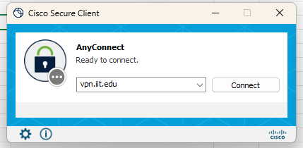
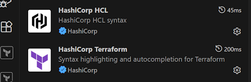
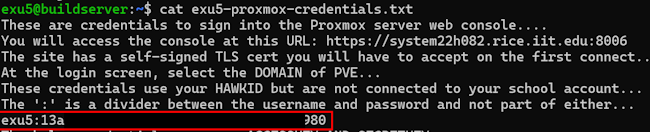
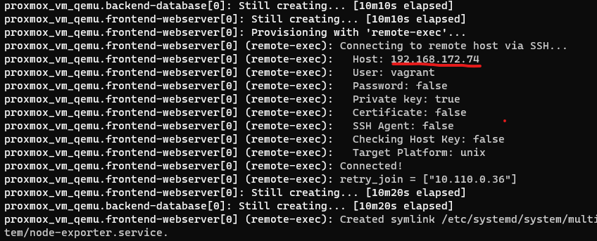

# Buildserver Tutorial - Part I

This is the initial description and setup for the Capstone Cloud Platform. It is expected that all team members go through this tutorial, as this is the critical part in deploying your team application.

## Overview

This tutorial assumes you have completed the Vagrant-Tooling-Assignment, Packer-Tooling-Assignment, Vault-Tooling-Assignment. It is critical to complete those first -- this tutorial builds upon those concepts.

This document will give you the first steps you need and acquaint you with the tools and locations needed to deploy your application.

## Configure VPN

If you are off of the campus network, connect via the university VPN client to our internal network. You can download the VPN client at [https://vpn-1.iit.edu](https://vpn-1.iit.edu "webpage for the VPN download") for MacOS and Windows (autodetects). 


Use your full `@hawk.illinoistech.edu` email and portal password to authenticate. You will have to 2-factor authenticate as well.

## Connect to VPN

Launch the Cisco VPN tool and connect to `vpn.iit.edu` 



Authenticate using your Portal username and password


Watch out! The two-factor message triggers quickly and doesn't have much patience, make sure to have your phone ready to approve the connection.

If you have more than one MFA set up besides your phone, it could give you a tricky time. If it is not prompting you to input one of your MFA, then close it, reconnect, and try putting `,SMS` directly after your password (no spaces and caps). For example if your password is `ilovebunnies`: `ilovebunnies,SMS`.

## Test Connection

Once the VPN is succesfully connected, you can test this connection by opening up a Terminal and issuing a `ping` command:

```bash
ping 192.168.192.2
```

Results:


## Required VSCode Extensions

There are two VSCode Extensions required, use the 4 square block Extensions icon in VSCode to install for working with Hashicorp HCL syntax.

*	`HashiCorp Terraform`
*	`Hashicorp HCL`



## IP Addresses to Know

For the department, we have an internal VLAN at the school. The address Range is 192.168.192.0/22. This address range has internal DNS with a domain name of `itm.iit.edu`. FQDNs are sequentially named: `system22hXYZ.itm.iit.edu` where `XYZ` is the value of the last IP octet and the 22 value is the CIDR block value. 

An example is `system22h098.itm.iit.edu` has an IP address of `192.168.192.98`.

Important Nodes
*	system22h082.itm.iit.edu
  * Node in cloud platform
* system22h083.itm.iit.edu
  * Node in cloud platform
* system22h084.itm.iit.edu
  * Node in cloud platform
* system22h098.itm.iit.edu
  * Buildserver with student accounts

## Setting up Your Team Repo

Following the GitHub tutorial, you will need to generate an additional public/private keypair via the `ssh-keygen` command. In GitHub though, we will be creating a [Deploy Key](https://gist.github.com/zhujunsan/a0becf82ade50ed06115 "webpage for Deploy Key explanation").

Then you will clone your team-repo into your buildserver account. This is the place we will be deploying your application from.

## Buildserver Accounts

Each student has an account on our buildserver: `system22h098.itm.iit.edu`. This is where you will clone your team repo and deploy your Packer and Terraform commands from. To test your connection use this command--you will be using the private key you created on your host system that corresponds to the public key you created and entered into the **Account Creation** document.

```bash
# Replace the value HAWKID with your hawk ID
# Replace the path (-i) from my identity file to your own identity file
ssh -i "C:\Users\palad\.ssh\id_ed25519_itmt-430-key" HAWKID@system22h098.itm.iit.edu"
```

Upon successful login and after executing an `ls` command, you will see a credentials file located in your home directory. If you do not see this file contact your instructor.


### Content of proxmox-credentials.txt 

In your document you will find three pairs of usernames and tokens. The first one is the commandline console access to the Proxmox 9 Cloud Platform.



Lets go and log into the Proxmox Cluster. Open a browser and enter the URL: `https://system22h082.itm.iit.edu:8006` -- take note that this is a self-signed certificate.


* Use the provided username (just the ID portion of your HAWKID)
* Use the provided console password
* Switch the third entry: Realm: to use `Proxmox VE authentication`

Once logged in, be curious and look around, be judicious, as you have full access.

# Deploy Team Vault Server - Part II

Getting our first component ready - Vault for secret management.

## Overview

This tutorial will demonstrate how to use our class buildserver, provided API keys, and the See-Through Cloud Platform, running on [Proxmox](https://proxmox.com/en/ "webpage for Proxmox Virtualization Platform"), using [Hashicorp Packer](https://packer.io "webpage for Packer.io") and [Terraform](https://terraform.io "webpage for Terraform").

At the conclusion of this tutorial you will have successfully connected to the remote buildserver and used Packer and Terraform to deploy a sample three-tier web application. 

### Working With Template Examples

* Make sure you have cloned your team repo to your local system 
* On your local system, copy from the `example-code` directory in `jhajek` -> `itmt-430` directory, into the `build` folder in your team repo.

Make sure you have created this folder structure.


## Department Production Cloud Details

The ITM department has a mock production cloud. The purpose of this on-prem cloud is not robustness or SLA based security, but has a promise of *good-enough* with the added ability to make thing visible--so we can see what is going on internally to the cloud.

We provide the building blocks of *cloud*

* IAM - Identity and Access Management
  * API based access/restriction to all resources
  * Gives you monitoring and auditing
* Compute and Networking
  * Virtualization gives you EC2 and VPS
* Block Storage
* Storage
  * S3-like Object storage over HTTP
* All over API via HTTP

### Virtualization Platform (Elastic Compute)

The Virtualization template we chose for building this internal cloud runs on a software called: [Proxmox](https://proxmox.com "webpage for Proxmox"). This is a German company that runs and opensource platform. Essentially the platform is a GUI manager on top of [Debian Linux](https://debian.org "webpage for Debian Linux") and [KVM](https://en.wikipedia.org/wiki/Kernel-based_Virtual_Machine "webpage explaining Kernel based virtual Machines"). We call it elastic compute because we can expand or contract the amount of compute at will via an API call.


The functionally is very similar to [VMware_ESXi](https://en.wikipedia.org/wiki/VMware_ESXi "webpage for VMware ESXi") or [Microsoft Hyper-V](https://learn.microsoft.com/en-us/virtualization/hyper-v-on-windows/quick-start/enable-hyper-v "webpage for Hyper-V").

### Cloud Network

Our Cloud platform has three attached networks:

* 192.168.192.0/22 is the private routable network available via the VPN or on campus, your virtual machines will be assigned an DHCP address from this IP range
* 10.0.0.0/16 is an internal non-routable network used to attach to an Ubuntu mirror so that all package updates happen over a local pre-configured network
* 10.110.0.0/16 is an internal non-routable network used for metrics collection (see Telemetry from chapter 14)
  * This uses a preconfigured event-router called `node-exporter` which is part of the `Prometheus` project
  * Each virtual machine launched will automatically register itself and begin reporting basic hardware metrics
  * This network also uses [Hashicorp Consul](https://consul.io "webpage for consul") for application discovery

### Proxmox API

Proxmox has an API that allows you to programmatically access any action you can take in the GUI--such as create virtual machine, delete, and so forth. This API is controlled by a `token_id` and a `token_secret` -- these are standard issue for working with Cloud Native software, no passwords here.

The Proxmox API can be accessed in two ways: [Packer has a Proxmox builder](https://developer.hashicorp.com/packer/plugins/builders/proxmox/iso "webpage for Packer Proxmox-iso provider") which we can leverage to build Virtual Machine Templates for our Virtualization Platform and [Terraform has a Proxmox Provider](https://registry.terraform.io/providers/Telmate/proxmox/latest/docs "webpage for Proxmox Provider") as well. You will be provided with a `token_id` and `token_secret` per person - starting with just IT/Operations.

### Terraform 

When dealing with Cloud-Native application deployments, the concepts we are used to when installing operating systems onto PCs and Laptops change radically. On a new laptop you would have to install an operating system by retrieving an installation iso file and burning it to some installation media. Then you would manually step through installation questions. Though the cloud is just someone else's computer&trade;, you don't have physical access to *install* operating systems on the cloud.

You don't actually install anything--you create OS templates or `images` and upload them to each provider (AWS, Proxmox, Azure...) and then use a templated language to deploy many `instances` of an image. You may have a `database` image. You might have a `loadbalancer` image. You might have a `webserver` image. And you may want variable copies or `instances` of each of these `images`.

[Hashicorp Terraform](https://terraform.io "webpage for Terraform") is a platform neutral way to programmatically deploy arbitrary numbers of instances from pre-made images. Packer will help make your templates, and Terraform helps you think in terms of deploying your application in total. Think of Terraform as Vagrant all grown up.

### Vault Templates

Similar to the Vault-tooling-assignment, we are now going to create a Vault Server. Let us start by unpacking the first Packer Proxmox template under,: `vault-templates` > `packer` > `proxmox-noble-vault-template`. Most of it should look familiar to the Packer VirtualBox templates in the previous assignment.

### Packer Init Block

This block is placed to initialize the Proxmox plugin for Packer. From the commandline run the command: `packer init .` -- this is needed only once per user account.

```hcl

locals { timestamp = regex_replace(timestamp(), "[- TZ:]", "") }

packer {
  required_plugins {
    virtualbox = {
      version = ">= 1.1.8"
      source  = "github.com/hashicorp/proxmox"
    }
  }
}
```

### Source Blocks

The next part of the code contains the `source` directive to tell Packer what which virtualization platform to connect to and build for. In this case it will be Proxmox, *proxmox-iso*. We will also give the particular `source` block a name so to be able to reference it in later `build` and `provisioner` stages.

```hcl

source "proxmox-iso" "proxmox-noble-vault-template" {
  boot_command = [
    "e<wait>",
    "<down><down><down>",
    "<end><bs><bs><bs><bs><wait>",
    "autoinstall ds=nocloud-net\\;s=http://{{ .HTTPIP }}:{{ .HTTPPort }}/ ---<wait>",
    "<f10><wait>"
  ]
  boot_iso {
    type="scsi"
    iso_file="local:iso/ubuntu-24.04.3-live-server-amd64.iso"
    unmount=true
    iso_checksum="file:http://mirrors.edge.kernel.org/ubuntu-releases/24.04.3/SHA256SUMS"
  }
  
  boot_wait = "5s"
  cores     = "${var.NUMBEROFCORES}"
  node      = "${var.NODENAME}"
  username  = "${var.TOKEN_ID}"
  token     = "${var.TOKEN_VALUE}"
  cpu_type  = "host"

  disks {
    disk_size    = "${var.DISKSIZE}"
    storage_pool = "${var.STORAGEPOOL}"
    type         = "virtio"
    io_thread    = true
    format       = "raw"
  }
  http_directory    = "subiquity/http"
  http_bind_address = "${var.BIND_ADDRESS}"
  http_port_max     = 9200
  http_port_min     = 9001
  memory            = "${var.MEMORY}"

  network_adapters {
    bridge = "vmbr0"
    model  = "virtio"
  }
  network_adapters {
    bridge = "vmbr1"
    model  = "virtio"
  }
  network_adapters {
    bridge = "vmbr2"
    model  = "virtio"
  }

  os                       = "l26"
  proxmox_url              = "${var.URL}"
  insecure_skip_tls_verify = true
  qemu_agent               = true
  cloud_init               = true
  cloud_init_storage_pool  = "local"
  # io thread option requires virtio-scsi-single controller
  scsi_controller      = "virtio-scsi-single"
  ssh_password         = "${var.SSHPW}"
  ssh_username         = "vagrant"
  ssh_timeout          = "22m"
  template_description = "A Packer template Hashicorp Vault"
  vm_name              = "${var.VMNAME}"
  tags                 = "${var.TAGS}"
}

```

### Build Blocks

The build block is where we tell Packer what to build when the `packer build .` command is executed. Packer has the unique ability to build in parallel, as many templates as you create in the `source` blocks. Each `source` name has to be entered into the `build sources` in order to be built. This built in parallelism means you can generally completely build templates on our buildserver in around 12-17 minutes.

```hcl

build {
  sources = ["source.proxmox-iso.proxmox-noble-vault-template"]
}

```

### Provisioners

There is an additional type of `provisioner` than just the shell script one demonstrated in the Packer Tooling Assignment.  There is also a [file provisioner](https://developer.hashicorp.com/packer/docs/provisioners/file "webpage for Packer File Provisioner"). A file provisioner is a way to place a file from your local system into a Virtual Machine template. These could be configuration files that are pre-configured, or they could be sensitive security keys. For this round we will use the `file provisioner` but as you might have guessed it, there is a Hashicorp product named [Vault](https://www.hashicorp.com/products/vault "webpage for Vault") that we will dive into the following sprints as we evolve our projects.

I have provided a series of static files that are needed for various operations to take place on the Cloud Platform. 

* `system.hcl` 
  * A file that is needed to register each virtual machine with Consul for Service Discovery / DNS forwarding.
* `node-exporter-consul-service.json` 
  * To allow the `Prometheus` telemetry system to automatically discover newly launched virtual machines
* `node-exporter.service` 
  * A systemd service file - to start the telemetry export at boot

You will find additional scripts needed for dynamically setting up firewalls for all of this internal traffic taking place. We are using [firewalld](https://firewalld.org "webpage for firewalld"). For our setup this material needs to remain here, you won't have to edit any of it, but I leave it here so that you can see what it takes to get a *regular* os into shape to work on a Cloud Native Platform. At the very end you will see some `provisioners` with shell scripts, but with an additional tag.

```hcl
only            = ["proxmox-iso.proxmox-frontend-webserver"]
```

The `only` tag is how you can create specific shell scripts that should be applied to only certain `images`. For instance you don't want to install a webserver on the backend image, and you don't want an uneeded database on a frontend image.

```hcl
  ########################################################################################################################
  # Using the file provisioner to SCP this file to the instance 
  # Add .hcl configuration file to register an instance with Consul for dynamic DNS on the third interface
  ########################################################################################################################

  provisioner "file" {
    source      = "./system.hcl"
    destination = "/home/vagrant/"
  }

  ########################################################################################################################
  # Copy the node-exporter-consul-service.json file to the instance move this file to /etc/consul.d/ 
  # directory so that each node can register as a service dynamically -- which Prometheus can then 
  # scape and automatically find metrics to collect
  ########################################################################################################################

  provisioner "file" {
    source      = "../scripts/proxmox/noble-services/node-exporter-consul-service.json"
    destination = "/home/vagrant/"
  }

  ########################################################################################################################
  # Copy the consul.conf file to the instance to update the consul DNS to look on the internal port of 8600 to resolve
  # .consul domain lookups
  ########################################################################################################################

  provisioner "file" {
    source      = "../scripts/proxmox/noble-services/consul.conf"
    destination = "/home/vagrant/"
  }

  ########################################################################################################################
  # Copy the node_exporter service file to the template so that the instance can publish its own system metrics on the
  # metrics interface
  ########################################################################################################################

  provisioner "file" {
    source      = "../scripts/proxmox/noble-services/node-exporter.service"
    destination = "/home/vagrant/"
  }

  ########################################################################################################################
  # This is the script that will open firewall ports needed for a node to function on the the School Cloud Platform
  # and create the default firewalld zones.
  ########################################################################################################################

  provisioner "shell" {
    execute_command = "echo 'vagrant' | {{ .Vars }} sudo -E -S sh '{{ .Path }}'"
    scripts         = ["../scripts/proxmox/core-noble/post_install_prxmx-firewall-configuration.sh"]
  }

  ########################################################################################################################
  # These shell scripts are needed to create the cloud instances and register the instance with Consul DNS
  # Don't edit this
  ########################################################################################################################

  provisioner "shell" {
    execute_command = "echo 'vagrant' | {{ .Vars }} sudo -E -S sh '{{ .Path }}'"
    scripts         = ["../scripts/proxmox/core-noble/post_install_prxmx_ubuntu_2204.sh",
                       "../scripts/proxmox/core-noble/post_install_prxmx_start-cloud-init.sh",
                       "../scripts/proxmox/core-noble/post_install_prxmx_install_hashicorp_consul.sh",
                       "../scripts/proxmox/core-noble/post_install_prxmx_update_dns_for_consul_service.sh"]
  }

  ########################################################################################################################
  # Script to change the bind_addr in Consul to the dynmaic Go lang call to
  # Interface ens20
  # https://www.consul.io/docs/troubleshoot/common-errors
  ########################################################################################################################
  
  provisioner "shell" {
    execute_command = "echo 'vagrant' | {{ .Vars }} sudo -E -S sh '{{ .Path }}'"
    scripts         = ["../scripts/proxmox/core-noble/post_install_change_consul_bind_interface.sh"]
  }
  
  ############################################################################################
  # Script to give a dynamic message about the consul DNS upon login
  #
  # https://ownyourbits.com/2017/04/05/customize-your-motd-login-message-in-debian-and-ubuntu/
  #############################################################################################
  
  provisioner "shell" {
    execute_command = "echo 'vagrant' | {{ .Vars }} sudo -E -S sh '{{ .Path }}'"
    scripts         = ["../scripts/proxmox/core-noble/post_install_update_dynamic_motd_message.sh"]
  }  
  
  ############################################################################################
  # Script to install Prometheus Telemetry support
  #############################################################################################
  
  provisioner "shell" {
    execute_command = "echo 'vagrant' | {{ .Vars }} sudo -E -S sh '{{ .Path }}'"
    scripts         = ["../scripts/proxmox/core-noble/post_install_prxmx_ubuntu_install-prometheus-node-exporter.sh"]
  } 

  ########################################################################################################################
  # Uncomment this block to add your own custom bash install scripts
  # This block you can add your own shell scripts to customize the image you are creating
  ########################################################################################################################

  provisioner "shell" {
    execute_command = "echo 'vagrant' | {{ .Vars }} sudo -E -S sh '{{ .Path }}'"
    scripts         = ["../scripts/proxmox/frontend/post_install_prxmx_frontend-firewall-open-ports.sh",
                      "../scripts/proxmox/frontend/post_install_prxmx_frontend-webserver.sh"]
    only            = ["proxmox-iso.proxmox-frontend-webserver"]
  }

  provisioner "shell" {
    execute_command = "echo 'vagrant' | {{ .Vars }} sudo -E -S sh '{{ .Path }}'"
    scripts         = ["../scripts/proxmox/backend/post_install_prxmx_backend-firewall-open-ports.sh",
                      "../scripts/proxmox/backend/post_install_prxmx_backend_database.sh"]
    only            = ["proxmox-iso.proxmox-backend-database"]
  }

```

Notice under the `scripts` directive I can run many shell scripts. Some like to put everything into a single script, but it might be better to break it into many small scripts so that you can trouble shoot functionality easier. The location of the scripts is arbitrary but I gave it a logical place, `../scripts/proxmox/frontend/...` that way I can reason about where and how scripts are identified, in the end you can change any of this structure or reference it as an example.

### Template for Variables

You will need to rename (using the `mv` command) the file: `template-for-variables.pkr.hcl` to `variables.pkr.hcl` this is the default file that Packer will look for.  This file now contains secret information -- **you do not** want this to be in version control. This could be a legal issue or definitely a security liability. Before modifying this file make sure that you have the `variables.pkr.hcl` in your team repo `.gitignore` file. The reason we make the change on the buildserver and not on your local system is due to secrets (tokens).

The first four values are specific and you will receive an email with the exact credentials to enter if you are the IT/Operations person for this sprint.

The values you will enter inside the `default` quotes are the following:

* NODENAME
  * system22h082
* TOKEN_ID
  * provided to you
* TOKEN_VALUE
  * provided to you
* URL
  * https://system22h082.itm.iit.edu:8006/api2/json

```hcl
variable "NODENAME" {
  type    = string
  default = ""
}

variable "TOKEN_ID" {
  sensitive = true
  type   = string
  default = ""
}

variable "TOKEN_VALUE" {
  sensitive = true
  type   = string
  default = ""
}

variable "URL" {
  type = string
  # https://x.x.x.x:8006/api2/json
  default = ""
  sensitive = true
}
```

The next set of values are only for Virtual Machine Template building -- the amount of memory or CPUs doesn't reflect when the instances are deployed. You can experiment with these values, but I didn't notice a large performance increase when I added more memory or CPU.

The `disksize` you want to leave low, when deploying virtual machine instances from and image, you can increase the disk size, but not decrease it, so best to start low and increase when deploying with Terraform.

### Instance Variables

These remaining fields will be familiar, while building the images, Packer needs SSH credentials to log into the system and execute all the `provisioners` before it cuts off password based ssh access and goes to key based auth only (which we will have to generate another keypair shortly). These remaining fields allow you to name your template, always a good idea to put your team name in the template name, something like `team-00-vault-server` that lets you know who the VM belongs too as we will be sharing the same server to run all of these. 

The SSH password is again defaulted to `vagrant` but there are instructions to change that password in the `subiquity/http/user-data` file. One can also consider that SSH password auth will be removed upon completion so it might not matter, unless someone has console access, then they can easily log into your system. This is a security decision you will have to make.

```hcl
variable "VMNAME" {
  type    = string
  default = ""
}

variable "SSHPW" {
  type    = string
  default = ""
  sensitive = true
}

variable "TAGS" {
  type    = string
  default = "teamXX;vault"
}
```

### Subiquity Cloud-init Modifications

We will also need to modify the `subiquity/http/template-user-data` and rename the file to `user-data`. Then you will have the option of editing line 9 (the user account password). The main item you will need to edit is line 56.

```
authorized-keys:
  - 'ssh-ed25519 '
```

You will once again generate an `ed25519` keypair using the ssh-keygen command. This key will be used to authenticate to your instances when you launch them.  What you will do is place the content of the public generated in to the line with the `ssh-ed25519` stub so it will look something like the below option. Cloud-init will automatically insert this public key--this is how it works in AWS, Azure, and GCP too -- the magic of cloud init. Make sure to maintain the indents and tabs in the `user-data` file as YAML, like Python is space sensitive.

```
authorized-keys:
  - 'ssh-ed25519 AAAAC3NzaC1lZDI1NTE5AAAAIE288nVirfucLQI5555555otramp587k6rn9IwBE hajek@newyorkphilharmonic '
```

### Ready to Launch

Now I believe we are ready. You can execute the same three commands we ran for the Packer Tooling Assignment to begin to build the Packer Templates.

* `packer init .`
* `packer validate .`
* `packer build .`

Sit back and watch: you are about to become a cloud-native Ops Engineer.

If successful, in the [Proxmox GUI Console](https://system22h082.itm.iit.edu:8006 "webpage for Proxmox GUI console") you will see two virtual machine templates a screen with a paper icon behind it and indicated by the red square. Virtual Machines are indicated by a little computer screen icon in the figure below.


# Deploy An Instance Using Terraform - Part III

This portion of the tutorial will show you how to take a Terraform Template and use it to deploy arbitrary numbers of virtual machines.

## Terraform Structure and Nomenclature

Taken from [Terraform About page](https://developer.hashicorp.com/terraform/intro "webpage for Terraform about page"):

### What is Terraform?
Terraform is an infrastructure as code tool that lets you build, change, and version cloud and on-prem resources safely and efficiently.

> HashiCorp Terraform is an infrastructure as code tool that lets you define both cloud and on-prem resources in human-readable configuration files that you can version, reuse, and share. 

> You can then use a consistent workflow to provision and manage all of your infrastructure throughout its lifecycle. Terraform can manage low-level components like compute, storage, and networking resources, as well as high-level components like DNS entries and SaaS features.

### How does Terraform work?

> Terraform creates and manages resources on cloud platforms and other services through their application programming interfaces (APIs). Providers enable Terraform to work with virtually any platform or service with an accessible API.

### Core Terraform Concepts

The core Terraform workflow consists of three stages:

* Write
  * You define resources
* Plan
  * Terraform creates an execution plan describing the infrastructure it will create, update, or destroy based on the existing infrastructure and your configuration.
* Apply
  * On approval, Terraform performs the proposed operations in the correct order, respecting any resource dependencies. 

## Terraform Example

Now let us take a look at the structure of our example Terraform plans. The plan is setup to create X number of virtual machine instances. The programming and structure will remind you of Packer. In fact, Hashicorp has intentionally made them similar.

There are four files to consider:

* `main.tf`
  * This is the main plan file -- similar in function to a Packer build template *.pkr.hcl
* `provider.tf`
  * This is similar to the `init block` in the packer build template, that tells Terraform which version and any provider plugins to download
  * In this case we will be downloading the Proxmox Provider in addition to the a random number generator plugin
* `template-terraform.tfvars`
  * This file is where you will place secrets and variables to customize configuration. The file will need to be renamed from `template-terraform.tfvars` to `terraform.tfvars` on the buildserver
  * `terraform.tfvars` is part of the .gitignore, so as not to pass secrets via version control.
  * You will enter the Proxmox Credentials the IT/Ops person received here
* `variables.tf`
  * Every variable that exists in the `terraform.tfvars` file needs to exist here, this file is for assigning default values and allowing for a commandline runtime override of variables set in `terraform.tfvars`

### Main.tf Structure

Let us take a look at our Terraform Plan - main.tf.  You will notice many of the same constraints as a Packer build template and that is on purpose as Hashicorp wanted to unify their platforms syntax. [Terraform Plan](https://github.com/illinoistech-itm/jhajek/blob/master/itmt-430/example-code/vault-templates/terraform/proxmox-noble-vault-template/main.tf "webpage for Terraform plan").

The first section is initialization of some plugins and variables. Terraform allows for variables (almost like a programming language) but doesn't quite have full looping support. Terraform, like Packer provides run-time variable declaration as well.  You will see the `${var}` spread throughout the Terraform plan.

In this case we are generating a random_id of 8 bytes that will be used to assign a unique id to each virtual machine instance when it launches and registers itself with the [Consul](https://www.consul.io "webpage for consul service discovery") DNS service. The second variable is a provided array of values and Terraform will randomly select a hard disk name. This will be the underlying disk where your virtual machines are stored on the Proxmox server. Of course this level of detail is never exposed in AWS or Azure, but part of this cloud is to show you the insides so here I am exposing what happens under the hood and how I spread virtual machines out so disks don't fill up.

```hcl

###############################################################################################
# This template demonstrates a Terraform plan to deploy two custom Ubuntu Focal 22.04 instances
###############################################################################################
resource "random_id" "id" {
  byte_length = 8
}

# https://registry.terraform.io/providers/hashicorp/random/latest/docs/resources/shuffle#example-usage
resource "random_shuffle" "datadisk" {
  input        = ["datadisk2", "datadisk3", "datadisk4", "datadisk5"]
  result_count = 1
}

```

### Terraform Resource Blocks

Packer has source blocks, and [Terraform has Resource blocks](https://developer.hashicorp.com/terraform/language/resources/syntax "webpage for the resource block descriptions"). *"Resources are the most important element in the Terraform language. Each resource block describes one or more infrastructure objects, such as virtual networks, compute instances, or higher-level components such as DNS records."*

We are using the third party [Proxmox Terrform Provider](https://registry.terraform.io/providers/Telmate/proxmox/latest/docs/resources/vm_qemu "webpage for terraform proxmox provider") to interface Terraform and Proxmox. This plan will be how you create arbitrary numbers of Virtual Machines from single Virtual Machines images (or templates in the Proxmox terms). 

```hcl

###############################################################################
# Terraform Plan for frontend webserver instances
###############################################################################

resource "proxmox_vm_qemu" "frontend-webserver" {
  count       = var.frontend-numberofvms
  name        = "${var.frontend-yourinitials}-vm${count.index}.service.consul"
  desc        = var.frontend-desc
  target_node = var.target_node
  clone       = var.frontend-template_to_clone
  os_type     = "cloud-init"
  memory      = var.frontend-memory
  cores       = var.frontend-cores
  sockets     = var.frontend-sockets
  scsihw      = "virtio-scsi-pci"
  bootdisk    = "virtio0"
  boot        = "cdn"
  agent       = 1

  ipconfig0 = "ip=dhcp"
  ipconfig1 = "ip=dhcp"
  ipconfig2 = "ip=dhcp"

  network {
    model  = "virtio"
    bridge = "vmbr0"
  }

  network {
    model  = "virtio"
    bridge = "vmbr1"
  }

  network {
    model  = "virtio"
    bridge = "vmbr2"
  }

  disk {
    type    = "virtio"
    storage = random_shuffle.datadisk.result[0]
    size    = var.frontend-disk_size
  }
```

### Terraform Plan Provisioner

Just like Packer, there is a concept of a provisioner to make launch time customizations that couldn't be made during the template building. We want each virtual machine to be registered with the Consul DNS service and learn all the IPs of our other instances, but only at the time we are launching our virtual machines instances. The only difference here is that you can either run a `shell` provisioner or run the `remote-exec` not a combination like in Packer. So below you see all of the run-time customizations needed to provision and make the last changes to our cloud instance. You won't need to edit any of these and can add on to this list without impacting anything.

```hcl

  provisioner "remote-exec" {
    # This inline provisioner is needed to accomplish the final fit and finish of your deployed
    # instance and condigure the system to register the FQDN with the Consul DNS system
    inline = [
      "sudo hostnamectl set-hostname ${var.frontend-yourinitials}-vm${count.index}",
      "sudo sed -i 's/changeme/${random_id.id.dec}${count.index}/' /etc/consul.d/system.hcl",
      "sudo sed -i 's/replace-name/${var.frontend-yourinitials}-vm${count.index}/' /etc/consul.d/system.hcl",
      "sudo sed -i 's/ubuntu-server/${var.frontend-yourinitials}-vm${count.index}/' /etc/hosts",
      "sudo sed -i 's/FQDN/${var.frontend-yourinitials}-vm${count.index}.service.consul/' /etc/update-motd.d/999-consul-dns-message",
      "sudo sed -i 's/#datacenter = \"my-dc-1\"/datacenter = \"rice-dc-1\"/' /etc/consul.d/consul.hcl",
      "echo 'retry_join = [\"${var.consulip}\"]' | sudo tee -a /etc/consul.d/consul.hcl",
      "sudo systemctl daemon-reload",
      "sudo systemctl restart consul.service",
      "sudo rm /opt/consul/node-id",
      "sudo systemctl restart consul.service",
      "sudo sed -i 's/0.0.0.0/${var.frontend-yourinitials}-vm${count.index}.service.consul/' /etc/systemd/system/node-exporter.service",
      "sudo systemctl daemon-reload",
      "sudo systemctl enable node-exporter.service",
      "sudo systemctl start node-exporter.service",
      "echo 'Your FQDN is: ' ; dig +answer -x ${self.default_ipv4_address} +short"
    ]

    connection {
      type        = "ssh"
      user        = "vagrant"
      private_key = file("${path.module}/${var.keypath}")
      host        = self.ssh_host
      port        = self.ssh_port
    }
  }
}

output "proxmox_frontend_ip_address_default" {
  description = "Current Pulbic IP"
  value       = proxmox_vm_qemu.frontend-webserver.*.default_ipv4_address
}

```
### Provider.tf

The `provider.tf` file is exactly like the `init` section of the Packer build template. It can be included in the `main.tf` but for separation purposes it is good to keep these two separate for ease if update and debug purpose. The first section is the required [Terraform provider](https://developer.hashicorp.com/terraform/language/providers "webpage listing Terraform Providers"). Terraform comes with providers out of the box for the most popular virtualization platforms, cloud and on-prem. We are telling Terraform to get the [Proxmox provider](https://registry.terraform.io/providers/Telmate/proxmox/latest/docs#argument-reference "webpage for Proxmox Terraform Provider"). These values setup debugging and logging, and tell the provider we will be using `token_id` and `token_secret` not username and password. No values here need to be updated or changed.

```hcl

terraform {
  required_providers {
    proxmox = {
      source  = "Telmate/proxmox"
      version = "3.0.2rc-07"
    }
    consul = {
      source  = "hashicorp/consul"
      version = "2.12.0"
    }
  }
}

provider "proxmox" {
  pm_tls_insecure     = true
  pm_api_url          = var.pm_api_url
  pm_api_token_id     = var.pm_api_token_id
  pm_api_token_secret = var.pm_api_token_secret
  pm_log_enable       = var.pm_log_enable
  pm_log_file         = var.pm_log_file
  pm_timeout          = var.pm_timeout
  pm_parallel         = var.pm_parallel
  pm_log_levels = {
    _default    = var.error_level
    _capturelog = ""
  }
} # end of provider "proxmox"

# Configure the Consul provider
provider "consul" {
  # insecure_https = true
  datacenter = "rice-dc-1"
  address    = "${var.consulip}:8500"
}

```

### Teamplate for terraform.tfvars

Similar to Packer, Terraform has a variables file for run-time values to be passed into your Plan. There are two files that serve this function: `terraform.tfvars` and `variables.tf` and they serve two different functions. Lets look at `terraform.tfvars` first. This file has to be renamed from `template-terraform.tfvars` to `terraform.tfvars` but **NOT** on your local system, only after the code is on the Buildserver. This is beacuse you will be passing `secrets` in this document. You don't want to be committing passwords or tokens into Version Control. The way we are doing this here is a step in the right direction, but utlimately not manageable and still has security issues. There is an additional product called [Hashicorp Vault](https://vault.io "webpage for Hashicorp Vault") we will be moving to in later sprints. For now this will work to give you exposure on how to deal with secrets. As always any of these varaible names can be edited, removed, or additional ones created. For now the first 10 are required as for authentication and to setup logging, the remaining are variables applied to each instance.

The structure of my file might seem to get quickly out of hand, and there are more optimal ways to organize things, feel free to adapt these values, structures, and comments. The more elements of your Terraform Plan, the more variables you might have to specifically customize different instances. This is how terraform is designed.

```hcl
###############################################################################
# These are your proxmox API token credentials (not username and password)
# That will be provided to you
###############################################################################
pm_api_url          = ""                         # URL of your Proxmox cluster
pm_api_token_id     = ""                         # This is an API token you have previously created for a specific user
pm_api_token_secret = ""                         # This is a uuid that is only available when initially creating the token 
target_node         = "proxmonsterX"             # Promox node to provision VMs
keypath             = "name-of-your-private-key" # The path to the private key you need to communicate with your instances
###############################################################################
# Debugging information settings
# No need to change these values
###############################################################################
pm_log_enable = true                           # Optional; defaults to false) Enable debug logging, see the section below for logging details
pm_parallel   = 2                              # (Optional; defaults to 4) Allowed simultaneous Proxmox processes (e.g. creating resources).
pm_timeout    = 600                            # (Optional; defaults to 300) Timeout value (seconds) for proxmox API calls.
pm_log_file   = "terraform-plugin-proxmox.log" # (Optional; defaults to terraform-plugin-proxmox.log) If logging is enabled, the log file the provider will write logs to.
###############################################################################
# This is a variable to append to your cloud instances so they have a unique
# FQDN -- this is needed for the gossip based DNS to work
###############################################################################
frontend-yourinitials = "" # initials to add to make unique systems
frontend-numberofvms  = 1  # quantity of that template to launch
frontend-desc         = "" # What is the purpose of the TF template
backend-yourinitials  = "" # initials to add to make unique systems
backend-numberofvms   = 1  # quantity of that template to launch
backend-desc          = "" # What is the purpose of the TF template
consul-service-tag-contact-email = "your-hawk-email-here" # Used as part of the consul service definition as a tag that can be queried
###############################################################################
# Name the template your created via Packer for Terraform to use to deploy
# instances from
###############################################################################
frontend-template_to_clone = "" # The name of the template to clone
backend-template_to_clone  = "" # The name of the template to clone
###############################################################################
# Customize instance hardware settings
###############################################################################
frontend-memory    = 4096  # Memory size of a VM
frontend-cores     = 1     # vCPU = cores * sockets
frontend-sockets   = 1     # vCPU = cores * sockets
frontend-disk_size = "30G" # Disk size of a VM - min size must equal to the disk size of your clone image
backend-memory     = 4096  # Memory size of a VM
backend-cores      = 1     # vCPU = cores * sockets
backend-sockets    = 1     # vCPU = cores * sockets
backend-disk_size  = "30G" # Disk size of a VM - min size must equal to the disk size of your clone image

```

In the `variables.tf` file you will find a declaration of each variable you have in the `terraform.tfvars` file -- there needs to be a 1 to 1 match. This is where the variable is essentially declared, but also you can set default values and even provide commandline runtime overrride -- which can be useful in debugging various values. *Remember*, if you add a variable to the `terraform.tfvars` you need a corresponding declaration in the `variables.tf` file.

```hcl

variable "pm_log_enable" {}
variable "pm_parallel" {}
variable "pm_timeout" {}
variable "pm_log_file" {}
variable "clone_wait" {
  default = 30
}
variable "pm_api_token_secret" {
  sensitive = true
}
```

### Terraform Commands

With the values edited in the `terraform.tfvars` file and your code on the Buildserver we have a few last items. Remember the public key-pair we generated for the building the Proxmox templates? We need to copy that private key into the directory where our `main.tf` is, and give the file name as the value for the entry, `keypath` in the `terraform.tfvars` file--note just the filename, not a path. Now we can begin to deploy. I would recommend having the Proxmox GUI loaded up so you can see the results in realtime.

### Terraform init

The first command you need to execute, and this is done once per Plan, is: `terraform init`  (note no `.` character like in Packer). This will download all the required plugins and initialize any metadata for the Terraform Plan.

### Terraform validate

The next command is: `terraform validate` which will validate all syntax, look for missing brackets, or undeclared variables, the command is optional but is a good habit to check for errors before you start to deploy items.

### Terraform apply

The final command to execute is: `terraform apply` which is what takes your Terraform Plan, and makes it a reality. Here we are no longer thinging in terms of a *server* or *windows*, but are now thinking in terms of components to get an application running. Terraform's goal is not to just provide blank servers, but to help provision all the elements of your plan. The estimate is 5-8 minutes per virtual machines with Proxmox able to handle 2 vm's deployment in parallel.

### Terraform destroy

The final command is: `terraform destroy` which does exactly what is says. This will destroy -- meaning delete -- all of the virtual infrastructure you deployed in your plan. You will find that you will have to use the `destroy` command and `apply` often, along with the `packer build` commands as you fix bugs and re-create your templates.

You might be tempted to just fix things on the fly, but that can be very dangerous as now problems are solved by a manual process and the knowledged is held only by you. Best to submit a bug report and rebuild the entire application so it is in a known-good state.

### What Happens When You Terraform Apply?

So what happens? Essentially all of the variables settings you have configured are processed, and the proper commandline commands are sent to Proxmox to request a launch of a virtual machine. This is exactly similar to what happens on your local system when Packer talks to VirtualBox and asks it to do the same.

The first step of a `terraform apply` is an interactive Yes/No step that shows you the Plan, essentially a last check to make sure what Terraform thinks it is going to do is what you want it to do. You can type `Yes` to proceed.


At that point, you now can sit back and watch the CLI and or the Proxmox GUI to watch the process play out. Essentially at this point, Proxmox is copying the virtual machine templates from there hard drive location over to a new hard drive location on the Proxmox server where the Virtual Machine *instances* will live and reconfiguring the CPU, RAM, and Network along with enlarging the harddrive.


### How long does it take?

Generally virtual machine templates take 6-12 minutes to deploy and deploy in parallel batches of 2. Essentially think of it as 5-6 minutes to copy and congfigure each virtual machine in a plan until its ready to use.

### How do I know its done?

You will see output like the figure below for each virtual machine instance you have the Terraform Plan create.



These values will be interspersed, especially in later sprints where we are deploying not just 2 instances, but say 8 to 12 instances.

### What are my IP addressed?

Since we are working on a platform and operating on Cloud Native principles, each time you launch instances, they will get a potentially new set of IP addresses. Each virtual machine instance will have three IP addresses, one on each network.

* 192.168.192.0/22
  * This is the *public* network and routable inside the IIT Network or externally via the VPN.
  * Each IP address has an associated FQDN based in the last octet
  * Example, if you IP address is 192.168.192.75 - then your FQDN is system22h075.rice.iit.edu
* 10.0.0.0/16
  * This is the non-routable network for running the Ubuntu package manger to get localized updates (not over the external network)
  * This IP is ephemeral and is assigned by DHCP
* 10.110.0.0/16
  * This is the non-routable network used for service and application discovery
  * Using [consul](https://consul/io "webpage for consul service discovery") and the gossip protocol each instance is assigned an ephemeral DHCP IP address.
  * This IP is registered with the consul server and all the other nodes and will automatically resolve to the variable: `frontend-team00.service.consul`
    * You can run the command from your instance CLI: `consul catalog nodes`
  * This allows you to connect your frontend and backend without having to know any IP address or hard code IP addresses
  * This is how cloud native and how applications are deployed

At the end of the command `terraform apply` I have configured a convenience command that will aggregate all the IP addresses assigned during the plan and print them out in one place.


### Can I manually connect to a Virtual Machine?

Yes you can SSH into your instance using your private key and the IP or fully qualified domain name. Your default user is: `vagrant`

### What happens if something goes wrong?

In all such cases, this is not a professional operation with 1000s of developers working on it. Sometimes things go wrong, virtual machines fail to launch, or spit out cryptic errors. Not to worry, remember in the cloud native principle, the instance is not important, its the image. We will just detroy and recreate what we need. A few troubleshooting tips to take into account:

* If you issue a `terraform destroy` command give the Proxmox system a few minutes, say 3-5 minutes, before doing a `terraform apply` so that commands clearing out resoruces have time to finish.
* If any of the `terraform apply` fails to deploy, you can just issue `terraform apply` again and terraform will look for what is missing, without touching what is there, and launch the missing part to make the `plan` accurate
* This goes too if you want to increase the number of instances say go from 3 to 1. Update your `terraform.tfvars` file `numberofvms` field and issue a `terraform apply` (without a `destroy`) and terraform will increase the numbers of your instances.
* Sometimes instances fail to launch, it happens, and you might be stuck with a non-booting image in the Proxmox GUI console, that Terraform can't delete. In this case you are able in the Proxmox GUI to highlight the virtual machine in question, and select the `Remove` option in the far corner and delete the instance in question
  * You can select the two check boxes listed as well
  * You will need to `stop` the virtual machine instance before removing it


### I can't connect to my web-server or database

As you saw in the demo video - my webserver failed to come up. That is because by default the firewall (firewalld) is locked down per-interface. You want to make sure that you have all the ports open you need when you build the Packer Proxmox template. My port 80 wasn't open in the virtual machine firewall.

### Firewalld Setup

[Firewalld documentation](https://firewalld.org "webapge for firewalld documentation")

Firewalld defines each network interface as a [zone](https://firewalld.org/documentation/zone/ "webpage for firewalld zones") There are three zones that has been created for our production cloud. 

* Interface ens18
  * zone=public
* Interface ens19
  * zone=metrics
* Interface ens20
  * zone=meta

You can open firewall ports per zone as needed - by default everything is locked down.

## Conculsion

Congratulations on getting this far. You have completed the second half of becoming a cloud native Ops Engineer. You are now able to end-to-end deploy Infrastructure as Code and begin now to focus on how to deploy the required application software and configure the needed items.

# Configuring Your Vault

After you have successfully deployed an VM instance of your Vault template. We want to SSH into the Vault server and configure the Vault server. Your team needs to designate one Vault server (who ever is the current IT/OPs person) to be the official Vault repo.

## Secrets

Refer to the `tooling-assignment-vault` for the instructions to initialize and configure a Vault. Once those steps have been accomplished there are a series of additional secrets that I am going to give you, and there a series of secrets that your team has already outlined will be required for your project. Feel free to add them at this time.

```bash
vault kv put -mount=secret NODENAME NODENAME1=system82 NODENAME2=system83 NODENAME3=system84 NODENAME4=system149
vault kv put -mount=secret SSH SSHUSER=vagrant SSHPW=vagrant
vault kv put -mount=secret URL NODE1=https://system22h082.itm.iit.edu:8006/api2/json 
vault kv put -mount=secret ACCESSKEY PK-USERNAME='hajek-pk@pve!hajek-itmt4302024' TF-USERNAME='hajek-tf@pve!hajek-itmt4302024'
vault kv put -mount=secret SECRETKEY PK-TOKEN='7935a1ca-7775-487f-adaa-awwewethgfb67' TF-TOKEN='c4662ce8-a9eb-4424-8573-axdsceeeee140'
vault kv put -mount=secret DB DBPASS=letmein DBUSER=controller DATABASENAME=foo DBURL=team-00-db.service.console CONNECTIONFROMIPRANGE='10.110.%.%'
```

## Advanced Vault

Note that many of the settings in the `tooling-assignment-vault` are open defaults. I would recommend as a team discussing how to reduce your privilleges foot print. There are additional storage engines for Vault. One of the interesting ones is the Vault MySQL integration. The [MySQL/MariaDB database secrets engine](https://developer.hashicorp.com/vault/docs/secrets/databases/mysql-maria "webpage for MySQL/MariaDB database secrets engine") is a special engine, different from the K/V pairings specifically for storing and retriving database credentials. I would encourage you to dedicate a team member to study how this works and implement this paradigm.


