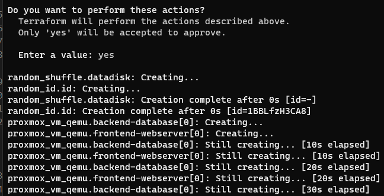

# Tutorial to Connect to the Department Cloud Platform - Part II

This tutorial assumes you have completed the [IT Operations cloud connect tutorial](https://github.com/illinoistech-itm/jhajek/blob/master/itmt-430/IT-Operations-cloud-connect-tutorial/Readme.md "webpage for IT Operations Cloud Connect Tutorial").

## Overview

At the conclusion of this tutorial, you will have deployed 2 virtual machine instances from your Proxmox image templates using [terraform](https://terraform.io "webpage for terraform").

## Setup

The only setup needed is to copy the private key created in the previous tutorial into the directory where the `main.tf` file is located: `terraform` > `proxmox-jammy-ubuntu-front-back-template` > `main.tf`. This also assumes that you have copied the `terraform` directory from the `jhajek` sample code repo noted in the Packer-Tooling-Assignment.

## Terraform Structure and Nomenclature

Taken from [Terraform About page](https://developer.hashicorp.com/terraform/intro "webpage for Terraform about page"):

### What is Terraform?
Terraform is an infrastructure as code tool that lets you build, change, and version cloud and on-prem resources safely and efficiently.

> HashiCorp Terraform is an infrastructure as code tool that lets you define both cloud and on-prem resources in human-readable configuration files that you can version, reuse, and share. 

> You can then use a consistent workflow to provision and manage all of your infrastructure throughout its lifecycle. Terraform can manage low-level components like compute, storage, and networking resources, as well as high-level components like DNS entries and SaaS features.

### How does Terraform work?

> Terraform creates and manages resources on cloud platforms and other services through their application programming interfaces (APIs). Providers enable Terraform to work with virtually any platform or service with an accessible API.

### Core Terraform Concepts

The core Terraform workflow consists of three stages:

* Write
  * You define resources, which may be across multiple cloud providers and services.
  * For example, you might create a configuration to deploy an application on virtual machines in a Virtual Private Cloud (VPC) network with security groups and a load balancer.
* Plan
  * Terraform creates an execution plan describing the infrastructure it will create, update, or destroy based on the existing infrastructure and your configuration.
* Apply
  * On approval, Terraform performs the proposed operations in the correct order, respecting any resource dependencies. 
  * For example, if you update the properties of a VPC and change the number of virtual machines in that VPC, Terraform will recreate the VPC before scaling the virtual machines.

You can see our example here: [Terraform Plan](https://github.com/illinoistech-itm/jhajek/blob/master/itmt-430/example-code/proxmox-cloud-production-templates/terraform/proxmox-jammy-ubuntu-front-back-template/main.tf "webpage for Terraform plan").

## Terraform Example

Now let us take a look at the structure of our example Terraform plans.  The plan is setup to create X number of virtual machine instances. The programing and structure will remind you of Packer. In fact, Hashicorp has intentionally made them vastly similar.

There are four files to consider:

* `main.tf`
  * This is the main plan file -- similar in function to a Packer build template *.pkr.hcl
* `provider.tf`
  * This is similar to the `init block` in the packer build template, that tells Terraform which version and any provider plugins to download
  * In this case we will be downloading the Proxmox Provider in addition to the a random number generator plugin
* `template-terraform.tfvars`
  * This file is where you will place secrets and variables to customize configuration. The file will need to be renamed from `template-terraform.tfvars` to `terraform.tfvars` on the buildserver
  * `terraform.tfvars` is part of the .gitignore, so as not to pass secrets via version control.
  * You will enter the Cloud Credentials the IT/Ops person received here
* `variables.tf`
  * Every varialbe that exists in the terraform.tfvars file needs to exist here, this file is for assigning default values and allowing for a commandline runtime override of variables set in `terraform.tfvars`

### Main.tf Structure

Let us take a look at our Terraform Plan - main.tf.  You will notice many of the same constraints as a Packer build template and that is on purpose as Hashicorp wanted to unify their platforms syntax. [Terraform Plan](https://github.com/illinoistech-itm/jhajek/blob/master/itmt-430/example-code/proxmox-cloud-production-templates/terraform/proxmox-jammy-ubuntu-front-back-template/main.tf "webpage for Terraform plan").

The first section is initialization of some plugins and variables. Terraform allows for variables (almost like a programming language) but doesn't quite have full looping support. Terraform, like Packer provides run-time variable declaration as well.  You will see the `${var}` spread throughout the Terraform plan.

In this case we are generating a random_id of 8 bytes that will be used to assign a unique id to each virtual machine instance when it launches and registers itself with the [Consul](https://www.consul.io "webpage for consul service discovery") DNS service. The second variable is a provided array of values and Terraform will randomly select a hard disk name. This will be the underlying disk where your virtual machines are stored on the Proxmox server. Of course this level of detail is never exposed in AWS or Azure, but part of this cloud is to show you the insides so here I am exposing what happens under the hood and how I spread virtual machines out so disks don't fill up.

```hcl

###############################################################################################
# This template demonstrates a Terraform plan to deploy two custom Ubuntu Focal 22.04 instances
###############################################################################################
resource "random_id" "id" {
  byte_length = 8
}

# https://registry.terraform.io/providers/hashicorp/random/latest/docs/resources/shuffle#example-usage
resource "random_shuffle" "datadisk" {
  input        = ["datadisk2", "datadisk3", "datadisk4", "datadisk5"]
  result_count = 1
}

```

### Terraform Resource Blocks

Packer has source blocks, and [Terraform has Resource blocks](https://developer.hashicorp.com/terraform/language/resources/syntax "webpage for the resource block descriptions"). *"Resources are the most important element in the Terraform language. Each resource block describes one or more infrastructure objects, such as virtual networks, compute instances, or higher-level components such as DNS records."*

We are using the third party [Proxmox Terrform Provider](https://registry.terraform.io/providers/Telmate/proxmox/latest/docs/resources/vm_qemu "webpage for terraform proxmox provider") to interface Terraform and Proxmox. This plan will be how you create arbitrary numbers of Virtual Machines from single Virtual Machines images (or templates in the Proxmox terms). 

```hcl

###############################################################################
# Terraform Plan for frontend webserver instances
###############################################################################

resource "proxmox_vm_qemu" "frontend-webserver" {
  count       = var.frontend-numberofvms
  name        = "${var.frontend-yourinitials}-vm${count.index}.service.consul"
  desc        = var.frontend-desc
  target_node = var.target_node
  clone       = var.frontend-template_to_clone
  os_type     = "cloud-init"
  memory      = var.frontend-memory
  cores       = var.frontend-cores
  sockets     = var.frontend-sockets
  scsihw      = "virtio-scsi-pci"
  bootdisk    = "virtio0"
  boot        = "cdn"
  agent       = 1

  ipconfig0 = "ip=dhcp"
  ipconfig1 = "ip=dhcp"
  ipconfig2 = "ip=dhcp"

  network {
    model  = "virtio"
    bridge = "vmbr0"
  }

  network {
    model  = "virtio"
    bridge = "vmbr1"
  }

  network {
    model  = "virtio"
    bridge = "vmbr2"
  }

  disk {
    type    = "virtio"
    storage = random_shuffle.datadisk.result[0]
    size    = var.frontend-disk_size
  }
```

### Terraform Plan Provisioner

Just like Packer, there is a concept of a provisioner to make launch time customizations that couldn't be made during the template building. We want each virtual machine to be registered with the Consul DNS service and learn all the IPs of our other instances, but only at the time we are launching our virtual machines instances. The only difference here is that you can either run a `shell` provisioner or run the `remote-exec` not a combination like in Packer. So below you see all of the run-time customizations needed to provision and make the last changes to our cloud instance. You won't need to edit any of these and can add on to this list without impacting anything.

```hcl

  provisioner "remote-exec" {
    # This inline provisioner is needed to accomplish the final fit and finish of your deployed
    # instance and condigure the system to register the FQDN with the Consul DNS system
    inline = [
      "sudo hostnamectl set-hostname ${var.frontend-yourinitials}-vm${count.index}",
      "sudo sed -i 's/changeme/${random_id.id.dec}${count.index}/' /etc/consul.d/system.hcl",
      "sudo sed -i 's/replace-name/${var.frontend-yourinitials}-vm${count.index}/' /etc/consul.d/system.hcl",
      "sudo sed -i 's/ubuntu-server/${var.frontend-yourinitials}-vm${count.index}/' /etc/hosts",
      "sudo sed -i 's/FQDN/${var.frontend-yourinitials}-vm${count.index}.service.consul/' /etc/update-motd.d/999-consul-dns-message",
      "sudo sed -i 's/#datacenter = \"my-dc-1\"/datacenter = \"rice-dc-1\"/' /etc/consul.d/consul.hcl",
      "echo 'retry_join = [\"${var.consulip}\"]' | sudo tee -a /etc/consul.d/consul.hcl",
      "sudo systemctl daemon-reload",
      "sudo systemctl restart consul.service",
      "sudo rm /opt/consul/node-id",
      "sudo systemctl restart consul.service",
      "sudo sed -i 's/0.0.0.0/${var.frontend-yourinitials}-vm${count.index}.service.consul/' /etc/systemd/system/node-exporter.service",
      "sudo systemctl daemon-reload",
      "sudo systemctl enable node-exporter.service",
      "sudo systemctl start node-exporter.service",
      "echo 'Your FQDN is: ' ; dig +answer -x ${self.default_ipv4_address} +short"
    ]

    connection {
      type        = "ssh"
      user        = "vagrant"
      private_key = file("${path.module}/${var.keypath}")
      host        = self.ssh_host
      port        = self.ssh_port
    }
  }
}

output "proxmox_frontend_ip_address_default" {
  description = "Current Pulbic IP"
  value       = proxmox_vm_qemu.frontend-webserver.*.default_ipv4_address
}

```
### Provider.tf

The `provider.tf` file is exactly like the `init` section of the Packer build template. It can be included in the `main.tf` but for separation purposes it is good to keep these two separate for ease if update and debug purpose. The first section is the required [Terraform provider](https://developer.hashicorp.com/terraform/language/providers "webpage listing Terraform Providers"). Terraform comes with providers out of the box for the most popular virtualization platforms, cloud and on-prem. We are telling Terraform to get the [Proxmox provider](https://registry.terraform.io/providers/Telmate/proxmox/latest/docs#argument-reference "webpage for Proxmox Terraform Provider"). These values setup debugging and logging, and tell the provider we will be using `token_id` and `token_secret` not username and password. No values here need to be updated or changed.

```hcl

terraform {
  required_providers {
    proxmox = {
      source  = "Telmate/proxmox"
      version = "2.9.11"
    }
    consul = {
      source  = "hashicorp/consul"
      version = "2.12.0"
    }
  }
}

provider "proxmox" {
  pm_tls_insecure     = true
  pm_api_url          = var.pm_api_url
  pm_api_token_id     = var.pm_api_token_id
  pm_api_token_secret = var.pm_api_token_secret
  pm_log_enable       = var.pm_log_enable
  pm_log_file         = var.pm_log_file
  pm_timeout          = var.pm_timeout
  pm_parallel         = var.pm_parallel
  pm_log_levels = {
    _default    = var.error_level
    _capturelog = ""
  }
} # end of provider "proxmox"

# Configure the Consul provider
provider "consul" {
  # insecure_https = true
  datacenter = "rice-dc-1"
  address    = "${var.consulip}:8500"
}

```

### Teamplate for terraform.tfvars

Similar to Packer, Terraform has a variables file for run-time values to be passed into your Plan. There are two files that serve this function: `terraform.tfvars` and `variables.tf` and they serve two different functions. Lets look at `terraform.tfvars` first. This file has to be renamed from `template-terraform.tfvars` to `terraform.tfvars` but **NOT** on your local system, only after the code is on the Buildserver. This is beacuse you will be passing `secrets` in this document. You don't want to be committing passwords or tokens into Version Control. The way we are doing this here is a step in the right direction, but utlimately not manageable and still has security issues. There is an additional product called [Hashicorp Vault](https://vault.io "webpage for Hashicorp Vault") we will be moving to in later sprints. For now this will work to give you exposure on how to deal with secrets. As always any of these varaible names can be edited, removed, or additional ones created. For now the first 10 are required as for authentication and to setup logging, the remaining are variables applied to each instance.

The structure of my file might seem to get quickly out of hand, and there are more optimal ways to organize things, feel free to adapt these values, structures, and comments. The more elements of your Terraform Plan, the more variables you might have to specifically customize different instances. This is how terraform is designed.

```hcl
###############################################################################
# These are your proxmox API token credentials (not username and password)
# That will be provided to you
###############################################################################
pm_api_url          = ""                         # URL of your Proxmox cluster
pm_api_token_id     = ""                         # This is an API token you have previously created for a specific user
pm_api_token_secret = ""                         # This is a uuid that is only available when initially creating the token 
target_node         = "proxmonsterX"             # Promox node to provision VMs
keypath             = "name-of-your-private-key" # The path to the private key you need to communicate with your instances
###############################################################################
# Debugging information settings
# No need to change these values
###############################################################################
pm_log_enable = true                           # Optional; defaults to false) Enable debug logging, see the section below for logging details
pm_parallel   = 2                              # (Optional; defaults to 4) Allowed simultaneous Proxmox processes (e.g. creating resources).
pm_timeout    = 600                            # (Optional; defaults to 300) Timeout value (seconds) for proxmox API calls.
pm_log_file   = "terraform-plugin-proxmox.log" # (Optional; defaults to terraform-plugin-proxmox.log) If logging is enabled, the log file the provider will write logs to.
###############################################################################
# This is a variable to append to your cloud instances so they have a unique
# FQDN -- this is needed for the gossip based DNS to work
###############################################################################
frontend-yourinitials = "" # initials to add to make unique systems
frontend-numberofvms  = 1  # quantity of that template to launch
frontend-desc         = "" # What is the purpose of the TF template
backend-yourinitials  = "" # initials to add to make unique systems
backend-numberofvms   = 1  # quantity of that template to launch
backend-desc          = "" # What is the purpose of the TF template
consul-service-tag-contact-email = "your-hawk-email-here" # Used as part of the consul service definition as a tag that can be queried
###############################################################################
# Name the template your created via Packer for Terraform to use to deploy
# instances from
###############################################################################
frontend-template_to_clone = "" # The name of the template to clone
backend-template_to_clone  = "" # The name of the template to clone
###############################################################################
# Customize instance hardware settings
###############################################################################
frontend-memory    = 4096  # Memory size of a VM
frontend-cores     = 1     # vCPU = cores * sockets
frontend-sockets   = 1     # vCPU = cores * sockets
frontend-disk_size = "30G" # Disk size of a VM - min size must equal to the disk size of your clone image
backend-memory     = 4096  # Memory size of a VM
backend-cores      = 1     # vCPU = cores * sockets
backend-sockets    = 1     # vCPU = cores * sockets
backend-disk_size  = "30G" # Disk size of a VM - min size must equal to the disk size of your clone image

```

In the `variables.tf` file you will find a declaration of each variable you have in the `terraform.tfvars` file -- there needs to be a 1 to 1 match. This is where the variable is essentially declared, but also you can set default values and even provide commandline runtime overrride -- which can be useful in debugging various values. *Remember*, if you add a variable to the `terraform.tfvars` you need a corresponding declaration in the `variables.tf` file.

```hcl

variable "pm_log_enable" {}
variable "pm_parallel" {}
variable "pm_timeout" {}
variable "pm_log_file" {}
variable "clone_wait" {
  default = 30
}
variable "pm_api_token_secret" {
  sensitive = true
}
```

### Terraform Commands

With the values edited in the `terraform.tfvars` file and your code on the Buildserver we have a few last items. Remember the public key-pair we generated for the building the Proxmox templates? We need to copy that private key into the directory where our `main.tf` is, and give the file name as the value for the entry, `keypath` in the `terraform.tfvars` file--note just the filename, not a path. Now we can begin to deploy. I would recommend having the Proxmox GUI loaded up so you can see the results in realtime.

### Terraform init

The first command you need to execute, and this is done once per Plan, is: `terraform init`  (note no `.` character like in Packer). This will download all the required plugins and initialize any metadata for the Terraform Plan.

### Terraform validate

The next command is: `terraform validate` which will validate all syntax, look for missing brackets, or undeclared variables, the command is optional but is a good habit to check for errors before you start to deploy items.

### Terraform apply

The final command to execute is: `terraform apply` which is what takes your Terraform Plan, and makes it a reality. Here we are no longer thinging in terms of a *server* or *windows*, but are now thinking in terms of components to get an application running. Terraform's goal is not to just provide blank servers, but to help provision all the elements of your plan. The estimate is 5-8 minutes per virtual machines with Proxmox able to handle 2 vm's deployment in parallel.

### Terraform destroy

The final command is: `terraform destroy` which does exactly what is says. This will destroy -- meaning delete -- all of the virtual infrastructure you deployed in your plan. You will find that you will have to use the `destroy` command and `apply` often, along with the `packer build` commands as you fix bugs and re-create your templates.

You might be tempted to just fix things on the fly, but that can be very dangerous as now problems are solved by a manual process and the knowledged is held only by you. Best to submit a bug report and rebuild the entire application so it is in a known-good state.

### What Happens When You Terraform Apply?

So what happens? Essentially all of the variables settings you have configured are processed, and the proper commandline commands are sent to Proxmox to request a launch of a virtual machine. This is exactly similar to what happens on your local system when Packer talks to VirtualBox and asks it to do the same.

The first step of a `terraform apply` is an interactive Yes/No step that shows you the Plan, essentially a last check to make sure what Terraform thinks it is going to do is what you want it to do. You can type `Yes` to proceed.



At that point, you now can sit back and watch the CLI and or the Proxmox GUI to watch the process play out. Essentially at this point, Proxmox is copying the virtual machine templates from there hard drive location over to a new hard drive location on the Proxmox server where the Virtual Machine *instances* will live and reconfiguring the CPU, RAM, and Network along with enlarging the harddrive.


### How long does it take?

Generally virtual machine templates take 6-12 minutes to deploy and deploy in parallel batches of 2. Essentially think of it as 5-6 minutes to copy and congfigure each virtual machine in a plan until its ready to use.

### How do I know its done?

You will see output like the figure below for each virtual machine instance you have the Terraform Plan create.


These values will be interspersed, especially in later sprints where we are deploying not just 2 instances, but say 8 to 12 instances.

### What are my IP addressed?

Since we are working on a platform and operating on Cloud Native principles, each time you launch instances, they will get a potentially new set of IP addresses. Each virtual machine instance will have three IP addresses, one on each network.

* 192.168.172.0/24
  * This is the *public* network and routable inside the IIT Network or externally via the VPN.
  * Each IP address has an associated FQDN based in the last octet
  * Example, if you IP address is 192.168.172.75 - then your FQDN is system75.rice.iit.edu
* 10.0.0.0/16
  * This is the non-routable network for running the Ubuntu package manger to get localized updates (not over the external network)
  * This IP is ephemeral and is assigned by DHCP
* 10.110.0.0/16
  * This is the non-routable network used for service and application discovery
  * Using [consul](https://consul/io "webpage for consul service discovery") and the gossip protocol each instance is assigned an ephemeral DHCP IP address.
  * This IP is registered with the consul server and all the other nodes and will automatically resolve to the variable: `frontend-yourinitials`.service.consul 
    * You can run the command from your instance CLI: `consul catalog nodes`
  * This allows you to connect your frontend and backend without having to know any IP address or hard code IP addresses
  * This is how cloud native and how applications are deployed

At the end of the command `terraform apply` I have configured a convenience command that will aggregate all the IP addresses assigned during the plan and print them out in one place.


### Can I manually connect to a Virtual Machine?

Yes you can SSH into your instance using your private key and the IP or fully qualified domain name. Your default user is: `vagrant`

### What happens if something goes wrong?

In all such cases, this is not a professional operation with 1000s of developers working on it. Sometimes things go wrong, virtual machines fail to launch, or spit out cryptic errors. Not to worry, remember in the cloud native principle, the instance is not important, its the image. We will just detroy and recreate what we need. A few troubleshooting tips to take into account:

* If you issue a `terraform destroy` command give the Proxmox system a few minutes, say 3-5 minutes, before doing a `terraform apply` so that commands clearing out resoruces have time to finish.
* If any of the `terraform apply` fails to deploy, you can just issue `terraform apply` again and terraform will look for what is missing, without touching what is there, and launch the missing part to make the `plan` accurate
* This goes too if you want to increase the number of instances say go from 3 to 1. Update your `terraform.tfvars` file `numberofvms` field and issue a `terraform apply` (without a `destroy`) and terraform will increase the numbers of your instances.
* Sometimes instances fail to launch, it happens, and you might be stuck with a non-booting image in the Proxmox GUI console, that Terraform can't delete. In this case you are able in the Proxmox GUI to highlight the virtual machine in question, and select the `Remove` option in the far corner and delete the instance in question
  * You can select the two check boxes listed as well
  * You will need to `stop` the virtual machine instance before removing it


### I can't connect to my web-server or database

As you saw in the demo video - my webserver failed to come up. That is because by default the firewall (firewalld) is locked down per-interface. You want to make sure that you have all the ports open you need when you build the Packer Proxmox template. My port 80 wasn't open in the virtual machine firewall.

### Firewalld Setup

[Firewalld documentation](https://firewalld.org "webapge for firewalld documentation")

Firewalld defines each network interface as a [zone](https://firewalld.org/documentation/zone/ "webpage for firewalld zones") There are three zones that has been created for our production cloud. 

* Interface ens18
  * zone=public
* Interface ens19
  * zone=metrics
* Interface ens20
  * zone=meta

You can open firewall ports per zone as needed - by default everything is locked down.

## Conculsion

Congratulations on getting this far. You have completed the second half of becoming a cloud native Ops Engineer. You are now able to end-to-end deploy Infrastucture as Code and begin now to focus on how to deploy the required applciation software and configure the needed items.
