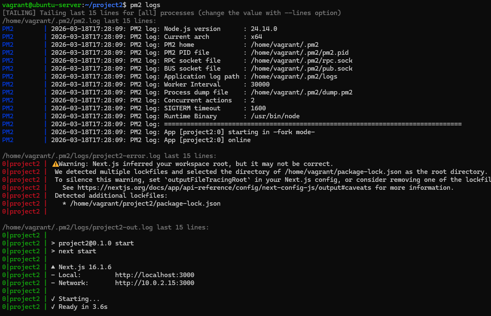
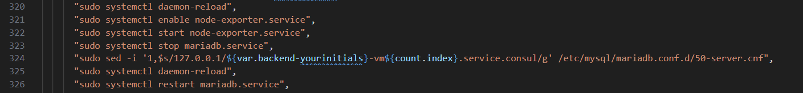

# Debugging Your Application

This document will go over a few of the troubleshooting and debugging tools you will need in figuring issues with your application.

## Systemd service files

To see more extensive documentation you can refer to chapter 10 of the Linux Text book provided in Canvas. All long running services in Linux are controlled by systemd `.service` files. These files define what application with what parameters to begin running at boot time and listen in the background for connections.

For example in the example-code provided for the flask application, there is a file named: `flask-app.service`
```
# General structure created from https://copilot.microsoft.com/shares/SVpE8dfAbZVoWPrHNEicu
[Unit]
Description=Gunicorn instance to serve Flask app
After=network.target

[Service]
User=flaskuser
Group=flaskuser
WorkingDirectory=/home/flaskuser
# The 0.0.0.0 address will be replaced with a private internal FQDN at runtime
# by Terraform in the remote exec portion via sed
# With debugging turned on
ExecStart=/usr/bin/gunicorn --access-logfile - --error-logfile - --log-level debug --capture-output --certfile=/home/flaskuser/signed.crt --keyfile=/home/flaskuser/signed.key --workers 4 --bind 0.0.0.0:3000 app:app 
#ExecStart=/usr/bin/gunicorn --certfile=/home/flaskuser/signed.crt --keyfile=/home/flaskuser/signed.key --workers 4 --bind 0.0.0.0:5000 app:app

Restart=always
RestartSec=5
KillSignal=SIGQUIT
TimeoutStopSec=15
SyslogIdentifier=teamXX-project

[Install]
WantedBy=multi-user.target
```

This is the structure of service files.

### Debugging service files

Each service file is controlled by the `systemctl` command. Pronounced *system-c-t-l* you may also hear *system cuddle*. The command verbiage is standardized:

The command: `sudo systemctl status flask-app.service` will give you the status of the service, if its running, enabled, disabled, or stopped and show you 10 lines of log output.

* `sudo systemctl stop flask-app.service`
* `sudo systemctl start flask-app.service`
* If you modify the `.service` file you will need to run an additional command
  * `sudo systemctl daemon-reload`

The same structure works for database services

* `sudo systemctl status mysql.service`
* `sudo systemctl status mariadb.service`
* `sudo systemctl status postgresql.service`
* `sudo systemctl status nginx.service`

### Using the Systemd Journal on the command line

Systemd has a specific tool that is used for searching logs.  Use the `journalctl` with the `-u` option to indicate which service. The journal is an append log so new items are appended to the end of the log.

* `sudo journalctl -u flask-app.service`
* `sudo journalctl -u mariadb.service`

You can use the `-r` option as well to reverse the output

* `sudo journalctl -r -u flask-app.service`
* `sudo journalctl -r -u mariadb.service`

You can use the `-f` option to *watch* a logs output in real time -- 10 at a time.

* `sudo journalctl -f -u flask-app.service`
* `sudo journalctl -f -u mariadb.service`

You can filer the journal, its like grep but built into the journal itself.

* Filter by message content
  * `journalctl MESSAGE_ID=xxxx`
* Filter by error level
  * `journalctl -p err`
* Filter by time range
  * `journalctl --since "1 hour ago"`

### Nginx Logs

Nginx doesn't use the systemd journal for its logs. It places them in the traditional location:

* `/var/log/nginx/access.log`
* `/var/log/nginx/error.log`

## Using PM2 to control Next.JS services

In the provisioner shell script: `post_install_prxmx_frontend-install_nextjs_service_dependencies.sh` 

```bash
#!/bin/bash

# PM2.io is a process manager for javascript applications
sudo npm install -g --save pm2

# This command uses pm2 to start your next.js application change the value 
# "project2" to your project name
pm2 start npm --name "project2" -- run start

sudo -u vagrant pm2 save
sudo -u vagrant pm2 startup
```

This script will make sure that your project will start at boot. You can use the pm2 options -- much like systemctl and the journalctl. The `pm2 status` command tells you if the application is running.

* `pm2 status`
* `pm2 logs`
  * This will show you error logs and output logs
* `pm2 start`
* `pm2 stop`



### Common Places to Check in Your Code

Quick note in the example code -- in the Terraform `main.tf` line 323, 324 and 326 have Maria DB specific commands that need to be adjusted if you are using MySQL and definitely if you are using PostgreSQL.



Line 324 is using `sed` to find and replace the setting that makes a DB listen only on localhost -- needs to be changed to listen for external connections on the internal Consul network `.service.consul`. Adjust accordingly the file path at the end of the `sed` command.
