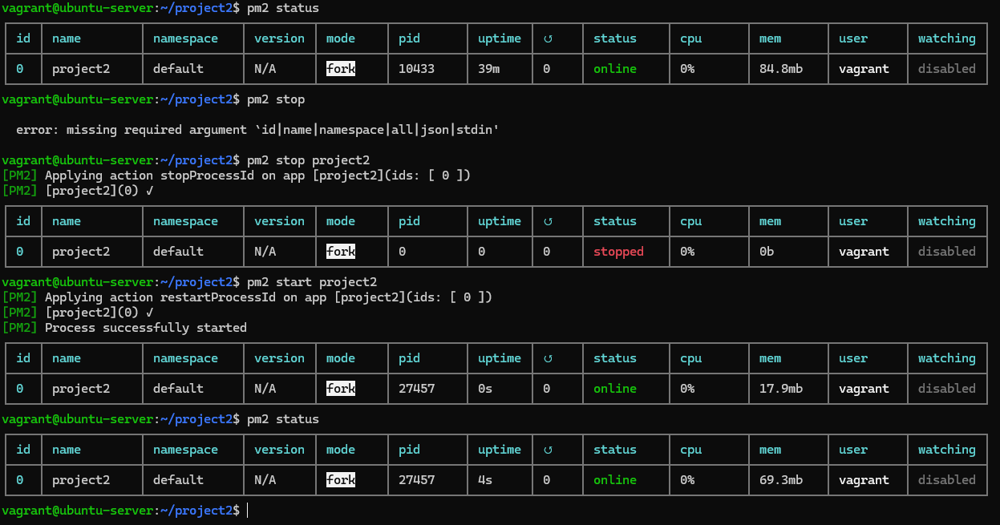
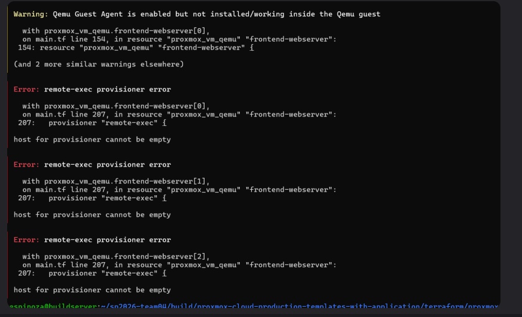

# Debugging Your Application

This document will go over a few of the troubleshooting and debugging tools you will need in figuring issues with your application.

## Systemd service files

To see more extensive documentation you can refer to chapter 10 of the Linux Text book provided in Canvas. All long running services in Linux are controlled by systemd `.service` files. These files define what application with what parameters to begin running at boot time and listen in the background for connections.

For example in the example-code provided for the flask application, there is a file named: `flask-app.service`
```
# General structure created from https://copilot.microsoft.com/shares/SVpE8dfAbZVoWPrHNEicu
[Unit]
Description=Gunicorn instance to serve Flask app
After=network.target

[Service]
User=flaskuser
Group=flaskuser
WorkingDirectory=/home/flaskuser
# The 0.0.0.0 address will be replaced with a private internal FQDN at runtime
# by Terraform in the remote exec portion via sed
# With debugging turned on
ExecStart=/usr/bin/gunicorn --access-logfile - --error-logfile - --log-level debug --capture-output --certfile=/home/flaskuser/signed.crt --keyfile=/home/flaskuser/signed.key --workers 4 --bind 0.0.0.0:3000 app:app 
#ExecStart=/usr/bin/gunicorn --certfile=/home/flaskuser/signed.crt --keyfile=/home/flaskuser/signed.key --workers 4 --bind 0.0.0.0:5000 app:app

Restart=always
RestartSec=5
KillSignal=SIGQUIT
TimeoutStopSec=15
SyslogIdentifier=teamXX-project

[Install]
WantedBy=multi-user.target
```

This is the structure of service files.

### Debugging service files

Each service file is controlled by the `systemctl` command. Pronounced *system-c-t-l* you may also hear *system cuddle*. The command verbiage is standardized:

The command: `sudo systemctl status flask-app.service` will give you the status of the service, if its running, enabled, disabled, or stopped and show you 10 lines of log output.

* `sudo systemctl stop flask-app.service`
* `sudo systemctl start flask-app.service`
* If you modify the `.service` file you will need to run an additional command
  * `sudo systemctl daemon-reload`

The same structure works for database services

* `sudo systemctl status mysql.service`
* `sudo systemctl status mariadb.service`
* `sudo systemctl status postgresql.service`
* `sudo systemctl status nginx.service`

### Using the Systemd Journal on the command line

Systemd has a specific tool that is used for searching logs.  Use the `journalctl` with the `-u` option to indicate which service. The journal is an append log so new items are appended to the end of the log.

* `sudo journalctl -u flask-app.service`
* `sudo journalctl -u mariadb.service`

You can use the `-r` option as well to reverse the output

* `sudo journalctl -r -u flask-app.service`
* `sudo journalctl -r -u mariadb.service`

You can use the `-f` option to *watch* a logs output in real time -- 10 at a time.

* `sudo journalctl -f -u flask-app.service`
* `sudo journalctl -f -u mariadb.service`

You can filer the journal, its like grep but built into the journal itself.

* Filter by message content
  * `journalctl MESSAGE_ID=xxxx`
* Filter by error level
  * `journalctl -p err`
* Filter by time range
  * `journalctl --since "1 hour ago"`

### Nginx Logs

Nginx doesn't use the systemd journal for its logs. It places them in the traditional location:

* `/var/log/nginx/access.log`
* `/var/log/nginx/error.log`

## Using PM2 to control Next.JS services

In the provisioner shell script: `post_install_prxmx_frontend-install_nextjs_service_dependencies.sh` 

```bash
#!/bin/bash

# PM2.io is a process manager for javascript applications
sudo npm install -g --save pm2

# This command uses pm2 to start your next.js application change the value 
# "project2" to your project name
pm2 start npm --name "project2" -- run start

sudo -u vagrant pm2 save
sudo -u vagrant pm2 startup
```

This script will make sure that your project will start at boot. You can use the pm2 options -- much like systemctl and the journalctl. The `pm2 status` command tells you if the application is running.

* `pm2 status`
* `pm2 logs`
  * This will show you error logs and output logs
* `pm2 start`
* `pm2 stop`




## Common Places to Check in Your Code

Quick note in the example code -- in the Terraform `main.tf` line 323, 324 and 326 have Maria DB specific commands that need to be adjusted if you are using MySQL and definitely if you are using PostgreSQL.


Line 324 is using `sed` to find and replace the setting that makes a DB listen only on localhost -- needs to be changed to listen for external connections on the internal Consul network `.service.consul`. Adjust accordingly the file path at the end of the `sed` command.

### The Firewall

First tip -- *do not* turn it off, ever. That isn't a solution as you will **never** run your application with the firewall off. Linux uses the `firewalld` firewall on all systemd based systems. The command `firewall-cmd` is the syntax to interrogate your firewall.

Remember we have three networks:

* `192.168.192.0/22`
  * `zone=public`
  * Attached to network interface `ens18`
  * The public facing network
* `10.0.0.0/16`
  * `zone=metrics-network`
  * Attached to network interface `ens19`
  * This is the internal Ubuntu Mirror and Metrics Collection Network
* `10.110.0.0/16`
  * `zone=meta-network`
  * Attached to network interface `ens20`
  * This is the internal Gossip Network that does our DNS lookup via [Consul](https://developer.hashicorp.com/consul "Website for Hashicorp Consul").


You can check the state of your firewall zones via these commands:

* `sudo firewall-cmd --zone=public --list-all`
* `sudo firewall-cmd --zone=meta-network --list-all`

You can add additional openings if needed:

* `sudo firewall-cmd --zone=meta-network --add-port=5000/tcp --permanent`
* `sudo firewall-cmd --reload`

[firewalld documentation](https://firewalld.org/ "website for firrewalld documentation")

### DHCP timeouts

Due to the nature of our cloud requesting IPs via DHCP, the university has a timeout feature to prevent DHCP exhaustion attacks. When the class is working together this can sometimes be triggered. The University is aware of this and has made some adjustments. But if you the results of a `terraform apply` look like the image below, the best tactic is to issue the `terraform apply` again and that amount of time is usually enough backoff to get a DHCP address.



## Nginx Routes

Due to the nature of our three-tier application, we are not making direct connections to frontend web-server. We are connecting through a load-balancer. That adds an extra layer for debugging. You will need/want to take a look at the routes in the Nginx `default` file. The routes there are from the example-code and you will need to adjust -- especially for static elements.

* `example-code > proxmox-cloud-production-templates-with-application > code > nginx > default`

Starting at about line 52:

```
# https://serverfault.com/questions/932628/how-to-handle-relative-urls-correctly-with-a-nginx-reverse-proxy
location /static/ {
      proxy_pass http://backend/static/;
}
location /welcome/ {
      proxy_pass http://backend/welcome/;
}
```

### The 3Ps Troubleshooting Framework

All my troubleshooting experience in Linux boils down to three things. I have named them the 3Ps. If you have an error message or cannot execute a command, start with these three troubleshooting steps.

* Path
  * If you get an error message telling you that file not found or path does not exist–double check your path. Is the absolute path correct? Is it a relative path problem? Are you on the wrong level of the tree?
* Permission
  * Every file has permission on what is allowed to be done with it based on a simple access control of read write and execute. Maybe you don’t have permission to write and therefore can’t delete a file. Perhaps the file is owned by someone else and they didn’t give you permission. Check permissions via ls -la or see if you need sudo.
* dePendencies
  * Are all the correct software dependencies installed? Perhaps you are missing a library or have an incompatible version that is preventing a tool from running?
  * If you try to run the commmand `btop` or `links 127.0.0.1` and you don’t have these packages installed, you will receive error messages.
  * If you don’t have the gcc compiler installed you won’t be able to compile and build the VirtualBox Guest Additions, which will be a dependency error.
* All else fails and you still have a problem, see if it is a full moon outside.
