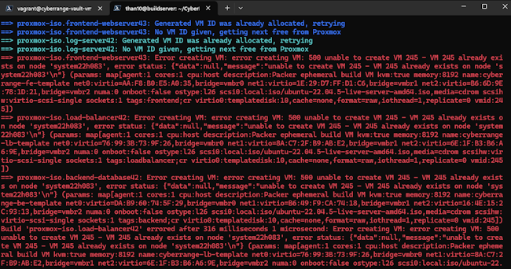

# How to Recompile the Packer Proxmox Plugin

When moving to the three-tier application deployment a new problem happens. An error: `500 error unable to create VM XYZ`



This step is needed to overcome a synchronization problem with Packer and Proxmox.  packer will build Vms in parallel, but each Proxmox node (we have 3) is drawing from a shared next node ID value -- and the requests from each parallel packer build come in faster than the cluster and synchronize the shared next node ID value. Our modification here bumps up the number of retries before Proxmox gives up. Fixes about 95% of these conflicts.

## Modification Steps

1) From your home directory on the buildserver: `git clone https://github.com/hashicorp/packer-plugin-proxmox`
1) `cd ~/packer-plugin-proxmox/builder/proxmox/common`
1) `vim step_start_vm.go`
1) modify this line of code: 
```go
var (
        //maxDuplicateIDRetries = 3
        maxDuplicateIDRetries = 400
)
```

## Compile Steps

1) Then `cd ~/packer-plugin-proxmox`
1) Run the command: `go build` and go-lang will download dependencies and compile the plugin
1) Rename the plugin you just built: `packer-proxmox-plugin` to `packer-plugin-proxmox_v1.2.3_x5.0-dev_linux_amd64`
1) Run the command to *install* and *register* this new plugin : `packer plugins install --path ./packer-plugin-proxmox_v1.2.3_x5.0-dev_linux_amd64 "github.com/hashicorp/proxmox"`

## Removal of pre-compiled plugin

1) `cd ~/.config/packer/plugins/github.com/hashicorp/proxmox`
1) Final step is to remove the pre-compiled `packer-proxmox-plugin` provided via the `packer init .` command...
```bash 
rm packer-plugin-proxmox_v1.2.3_x5.0_linux_amd64
rm packer-plugin-proxmox_v1.2.3_x5.0_linux_amd64_SHA256SUM
```

## Outcome

Now your packer build should be more reliable without having ID assignment conflicts.

But sometimes some templates fail to build some times.  You can use the `-only=` attribute of `packer build` to build *only* the failed template.

```bash
# build a single system using -only
packer build -only=proxmox-iso.log-server82 .

# build multiple systems using -only
packer build -only=proxmox-iso.frontend-webserver82,proxmox-iso.load-balancer83 .
```