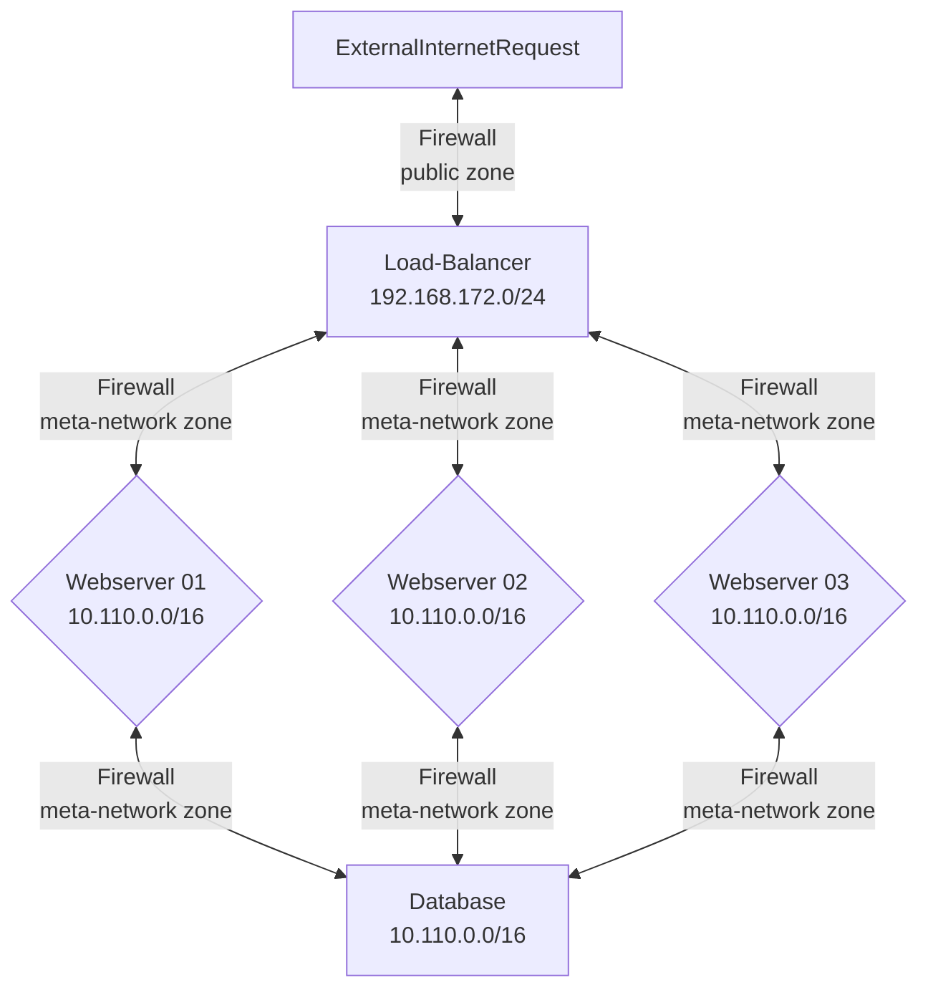

# Tutorial for Constructing a Cloud Native Three Tier Application

This will be a combination lecture/tutorial on how and why we are creating a three-tier web application.

## Objectives

* Discuss the concept of the three-tier web application
* Explore the imperative nature of the three-tier application when dealing with cloud-native development
* Discuss tooling needed to create a three-tier application
* Discuss and explore the ramifications of the modifications that modern operating systems require to become three-tier applications
* Discuss and explore the security ramifications of implementing a three-tier web application

## Outcomes

At the conclusion of this lecture/tutorial you will have explored the main tenants of a three-tier web application and the parameters and attributes required to construct one in a cloud-native manner.

## Purpose of an Application

When we look at a web application, we tend to look in the wrong way. When we tend to think of Apps as a Server and a Database. Or we tend to think of an Application as a JavaScript or Android application. In a sense those are the things we are using and building in, but in reality an Application is very simple.

An application is essentially listening for external connections via HTTP, called `requests` or `http GET requests` and your application will receive them, and server or return data to the requestor. That is pretty much it. You use Javascript or Java or Android to create an application that is listening on a certain port for a connection -- then serve the response back. With that in mind, the choice of language platform because a style choice because all languages are doing the same thing, as we are communicating over HTTP.

When we create an application its for users/customers to use, interact with in a safe, secure, and fast environment. All features are geared towards serving the customer. Now there are layers of complexity that can be added and security features due to application and session state, but these are implementation details.

## What is a Three-Tier Application?


For this portion of the class, we will be migrating our application from a standard monolithic system into a three-tier application. The term `three-tier` is used in relation to how there are different levels of architecture when constructing an application in the cloud-native way.

* First Tier
  * Load-Balancer
* Second Tier
  * Front-end
  * Also known as the webserver tier
* Third Tier
  * Back-end
  * Also known as the database/datastore tier

### Load-Balancer Tier

The `load-balancer` has the job of receiving `http` requests and spreading them over the nodes in the second-tier or frontend-tier. This is important for adding robustness to your application - to survive hardware failures. Cloud native relies on x86 virtualized Linux based servers, which are by nature, unreliable. 

For load-balancing there are many options. Most public cloud providers have their own load-balancing services, which are generally good enough. In our case we will be deploying our own load-balancing software. There are two good cases for open source load-balancer software: 

* [Nginx](http://nginx.org/en/docs/http/load_balancing.html "webpage for Nginx load-balancer" )
* [HAProxy](https://www.haproxy.org/ "webpage for HAProxy")

We will be doing TLS termination and load-balancing via a self-signed certificate, due to the school network being a private network. Looking at any cloud-native application, a load-balancer is at the root.

### Downsides of a Load-Balacner

There is definitely some potential downsides of a loadbalancer. The first thing to know is that now your HTTP requests are not going directly to a webserver, they are being proxied through a load-balancer, which can make debugging more difficult. 

Load-balancers also introduce the problem of maintaining session or state across multiple nodes of the webserver tier. This concept is called `sticky-sessions` - how do you attach login session tokens to make sure each user request is sent to the same node, keeping someone logged in?

Nginx provides [sticky sessions](https://docs.nginx.com/nginx/deployment-guides/load-balance-third-party/node-js/ "webpage to nginx sticky sessions documents") via IP Hash Load-balancing.

> *If your application requires basic session persistence (also known as sticky sessions), you can implement it in NGINX Open Source with the IP Hash load‑balancing algorithm.*

> *With the IP Hash algorithm, for each request NGINX calculates a hash based on the client’s IP address, and associates the hash with one of the upstream servers. It sends all requests with that hash to that server, thus establishing session persistence.*

### WebServer Tier

This tier's job is to handle requests from the load-balancer and return request data (generally webpages) to the load-balancer. Generally this level doesn't store any permanent state beyond any session data. This makes the hardware requirements for disk - very small as there is no data stored beyond the code needed to serve requests.

There are many common webserver softwares, such as:

* Nginx (pronounced: Engine X) <-- recommended one
* Apache
* lighttpd

Generally Nginx is preferred for any new infrastructure deployments. Often times these webservers will actually be used as proxies to server requests to the application servers on a standard port - 443 (https). In our cases this is an optional step but something to think about as an application grows in complexity.

For Example:

* Express/NodeJS running on port 3000
* Tornado/Python running on port 8888
* Tomcat/Glassfish Java running port 8080

This is good for security reasons and good because 443 (https) is a standard single port that can be opened in the firewall. The downside of proxying is that you add another layer of abstraction which can make debugging edge cases more difficult -- more hands need to touch a packet.

Creating a frontend-tier behind a load-balancers limits exposure of systems to the public internet--which is always good you can limit your security footprint. 

### Database/Datastore Tier

The last tier involves database storage. Called the backend-tier, this tier's job is to handle requests to read or write data. The reason it is sometimes called datastorage tier is because these tier too can be put behind an additional load-balancer and a cluster of database servers can be implemented. In this phase we will start with just one database, but will expand in the remaining phases.

One of the first things to consider in this tier is by default and for security reasons database software only listens for connections on the localhost. Each software needs to be configured for specifically listening on a host for external connections. You have firewall and database user permission considerations as well. These elements can make troubleshooting a bit tricky.

Another consideration is how to insert data, create schemas, and version control datasets? These are normally manual tasks, but if you want to pre-seed your application with 25 users and 100s of posts worth of data, this is one of the ways possible. The datastorage tier only talks to the webserver tier -- never to the load-balancer or to the direct public internet--no need to and a massive security violation of the three-tier application.

## Mermaid Diagram of Cloud Computing Platform Networks



This is what your deliverable will look like. With the tools provided, and enough shell-scriting glue, you will be able to create this.

### Make up of the Cloud Lab Network

* 192.168.172.0/24
  * public zone 
  * network interface ens18
  * Has FQDN in the form of: `system78.rice.iit.edu` 
  * Where the `78` is the last octet of its IP address: `192.168.172.78`
* 10.0.0.0/16
  * metrics-network zone
  * network interface ens19
  * non-routable network
  * used for the internal Ubuntu `apt` mirror, speeds up downloads and installs
* 10.110.0.0/16
  * meta-network zone
  * network interface ens20
  * non-routable non-routable
  * [Consul DNS resolver provided](https://developer.hashicorp.com/consul/tutorials/networking/dns-forwarding#systemd-resolved-setup "webpage for consul DNS Forwarding")
  * Any FQDN, `*.service.consul` is dynamically resolved

### Service Discovery using Hashicorp Consul

One of the benefits of building a cloud native application is that the components of the application are not static. You would think this makes things chaos, but actually frees us from having to reserve specific IP address. Having to reserve IP address prevents our applciation from being moved to a different platform or having a test environement and a production environment.

By the definition of cloud native, resources cannot be staticly defined. Everything then communicates via HTTP, how do we know the IP addresses of the nodes in our applciation? We could use a whole bunch of shell-scripted hackery, but we would quickly find that would run into scale problems.

You have a problem, that is connecting 3 webserver nodes to our load-balancer and connecting all three webserver nodese to communicate with a database layer. How will you know how to connect to these resoruces?

Enter [Hashicorp Consul](https://consul.io "webpage for consul.io service discovery"):

> *Consul uses service identities and traditional networking practices to help organizations securely connect applications running in any environment.*

> *A modern service networking solution requires that we answer four specific questions: Where are my services running? How do I secure the communication between them? ... How do I control access to my environments?*

The main principle is that each Packer source block in build templates have the configuration preset so that each virtual machine instance knows how to register itself with the Consul service upon launch and over the `meta-network firewalld zone` can communicate with the other registered nodes.

Consul is configured via the `shell provisioner`: `post_install_prxmx_update_dns_for_consul_service.sh` under `scripts` > `proxmox` > `core-jammy` to configure systemd-resolved, which is the systemd DNS resolver, to run a local DNS resolver on port 8600 internally (in addition to the normal 53) to listen for specific domain requests. Consul will then forward any requests to *.service.consul to port 8600. This port is open on the `meta-network firewalld zone` for all nodes and runs the Gossip protocol. The name implies, like real life, each node gossips to each other based on your domain name. This way each node knows who they are, and can resolve any known name to an IP via Consul on the `meta-network`

The hostnames that appear in the Proxmox Consol are defined in the `main.tf` resource block, in the remote-exec section, the line: 

`"sudo sed -i 's/replace-name/${var.lb-yourinitials}-vm${count.index}/' /etc/consul.d/system.hcl",`
Here we are using the `sed` command to find and replace a place holder, `replace-name` with the value you defined in the var `lb.yourinitials` and append the vm count value to generate a unique FQDN.

For example if you system names are:

* team00-lb-vm0.service.consul
* team00-ws-vm0.service.consul
* team00-ws-vm1.service.consul
* team00-ws-vm2.service.consul
* team00-db-vm0.service.consul

You would know these FQDNs ahead of time as you will be defining them in the `terraform.tfvars` under the `yourinitials` variable. Since you know the full domain names, you can add these directly into your Nginx loadbalacner configuration and into your application configuration to connect to the database. The IP resolution is completely transparent, as long as the consul service is running.

You can see this in action, ssh into anyone of your servers and issue the commands:

* `consul catalog nodes`
  * This will show you everything currently registered
* `ping team00-lb-vm0.service.consul`
  * Though this is the instructors demo this will resolve to an IP address

### How to Increase the Number of Instances Deployed

You can increase the number of deployed instances from 1 to and arbitrary amount by editing the `frontend-numberofvms  = 1  # quantity of that template to launch` in the `terraform.tfvars` file.

### How to Assign a Mac Address to get a Static IP

Though in your internal network and for service discovery you do not and won't assign static IP addresses, your external network connections need an static IP so your URL can be found.

| Team Number | MacAddr | Static IP | FQDN |
| ----------- | -------------| ------------- | ----------------- |
| team 00  | 04:9F:15:00:00:11 | 192.168.172.60 | system60.rice.iit.edu |
| team 01m | 04:9F:15:00:00:12 | 192.168.172.61 | system61.rice.iit.edu |
| team 02m | 04:9F:15:00:00:13 | 192.168.172.62 | system62.rice.iit.edu |
| team 03m | 04:9F:15:00:00:14 | 192.168.172.63 | system63.rice.iit.edu |
| team 04m | 04:9F:15:00:00:15 | 192.168.172.64 | system64.rice.iit.edu |
| team 01o | 04:9F:15:00:00:16 | 192.168.172.65 | system65.rice.iit.edu |
| team 02o | 04:9F:15:00:00:17 | 192.168.172.66 | system66.rice.iit.edu |
| team 03o | 04:9F:15:00:00:18 | 192.168.172.67 | system67.rice.iit.edu |
| team 04o | 04:9F:15:00:00:19 | 192.168.172.68 | system68.rice.iit.edu |
| team 05o | 04:9F:15:00:00:20 | 192.168.172.69 | system69.rice.iit.edu |

All this requires is to modify the `resource` block of your load-balancer in your `main.tf`, the first `network` block.

```hcl
network {
  model  = "virtio"
  bridge = "vmbr0"
 }
```

Should be edited to say this:

```hcl
network {
  model  = "virtio"
  bridge = "vmbr0"
  # Replace this mac addr with your assigned Mac
  macaddr = "04:9F:15:00:00:21"
  }
```

### Getting Application Code from the Team Repo into VM Instances

Now that you have your infrastructure setup, how will we get code from a private team repo into each of our virtual machine instances? We will use the Git clone command as part of a `provisioner` script in the `packer build` phase. But we will run into a problem, the team repository is a private repo requiring authentication to clone. In this case we will need to provide a private key for GitHub authentication and an ssh `config` file into a deployed instance. We can do that via a `file provisioner` in Packer. 

A [file provisioner](https://developer.hashicorp.com/packer/docs/provisioners/file "webpage for packer file provisioner documentation") allows you to securely upload files from your local system to the virtual machine being built. This is a simple way to insert a private key and an ssh config file to a virtual machine template. Later you can use a [shell provisioner](https://developer.hashicorp.com/packer/docs/provisioners/shell "webpage for shell provisioner documentation") to do the cloning of your private team repo.

Taking a look at the example Packer build template, `proxmox-jammy-ubuntu-three-tier-template.pkr.hcl` we added two file provisioners under the `build` block.

```hcl
build {
  sources = ["source.proxmox-iso.frontend-webserver","source.proxmox-iso.backend-database","source.proxmox-iso.load-balancer"]

  #############################################################################
  # Using the file provisioner to SCP this file to the instance 
  # Copy the configured config file to the ~/.ssh directory so you can clone 
  # your GitHub account to the server
  #############################################################################

  provisioner "file" {
    source      = "./config"
    destination = "/home/vagrant/.ssh/config"
  }

  #############################################################################
  # Using the file provisioner to SCP this file to the instance 
  # Copy the private key used to clone your source code -- make sure the public
  # key is in your GitHub account
  #############################################################################

  provisioner "file" {
    source      = "./id_ed25519"
    destination = "/home/vagrant/.ssh/id_ed25519"
  }
```

This will require you create an additional `ed25519` public/private keypair that will be placed in the directory where you execute the `packer build .` command. You will add the public key portion to your GitHub account so that your virtual machine instance can use these credentials to authenticate. You will need to make note of the keys and make proper adjustments to the names.

There is also an additional security step, at the very end of the Packer provisioning phase, you will see a script called `cleanup.sh`. This will delete your private key off of your server instance just before completing the provisioner phase--so that even if your instance is compromised--no keys will be avaialble to steal.

### Where to Clone

Cloning then takes place in a shell provisioner. The shell script is named `clone-team-repo.sh`. The essential code in that script is this command: `sudo -u vagrant git clone git@github.com:illinoistech-itm/team-00.git`. This clones your team code (**NOTE**: replace team-00 with your team repo name). Most likely you will clone your source code after you have installed all of the infrastructure, webservers, and language run-times.

This is because the team repo will contain custom configurations for configuring the load-balancer, setting up SSL/TLS cert, moving source code into the correct location for servers to render and serve code. Part of this will be envisioning each step that takes place so as to be troubleshooting what might be going wrong.

### Troubleshooting

As our application grows more complex, in software and in infrastructure, there grows a complexity. We are trying to tame this complexity via version control and automation. There is a temptation to just fix things and patch the system together, but this contradicts our Third Way - Creating a Learning Culture.

Though it is ok to experiment and fix things manually, you need to take the time to port all your changes into source code and your automation deploy scripts -- so that anyone can deploy the application and everyone can know the state of the application at any time. 

This is important because if you are trying to troubleshoot the system and the system you are reasoning about is not in the state you assume it is, this makes troubleshooting extremely difficult, as all your hypothesis will be made on shifting sand. Try to overcome and put the work in to automate everything and document it via GitHub, not to take shortcuts.

Another important concern is Linux system service control. How do you start services at boot? How does your application start at boot? You will need to think about creating systemd `.service` files so that your application can start up immediately at boot--without human intervention.

### Security Concerns

There are many items here that will be of concern regarding security. Things such as passwords, account tokens and account IDs, Google developer API tokens, SSL/TLS certs, database passwords--essentially these are called secrets and they are the most valuable part of your application, the other part being customer private information.

We will begin with applying some verbose ways to securely transmit these values, but you will see quite quickly that this way doesn't scale at all, and makes management of secrets a liability with each of your team members handling secure information. Though we want you to gain a glimpse of just what you are responsible for securing.

In the next sprint, this will be a defining issue and we will be implementing a solution for securing the distribution of secrets.

### User Testing

Your application needs to be tested and bugs or errors need to be filed. For your team's bug tracker we will use `GitHub Issues`. This is the `Issues` tab at the top of your team repo. the UI/UX person is responsible for testing the production systems, attempting to authenticate to Google Oauth, login, create items, and use your site. This assumes that the production system is in a working state, and makes that imperative to progress. You can at your choice split your developers up and assign one to be primarily a coder and one to primarily be a debugger. The issues posted should become Trello cards and work there way through the system and produce an artifact (GitHub commit at the end to show the initial bug as well as the solved issue).


## Summary and Conclusion

This sprint is a long one, but important as we are beginning to create an actual working cloud native application. Continue to make use of the principles we are learning in the DevOps handbook and keep working at this--soon you will see the fruits of your labors.
