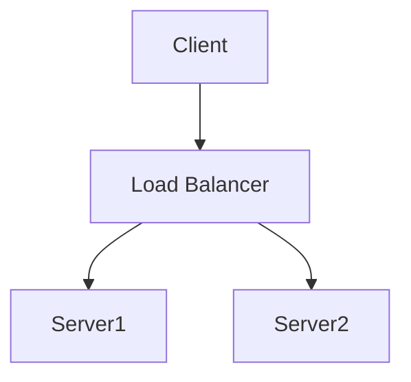
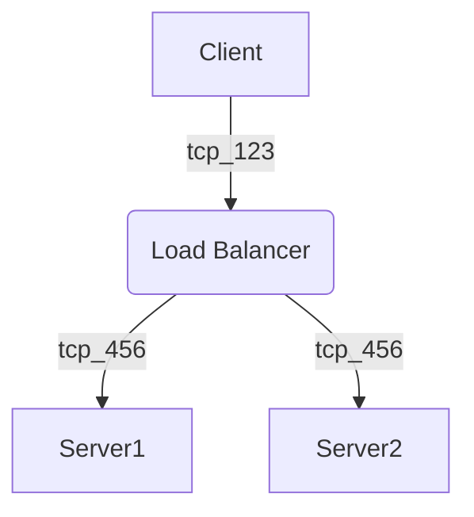
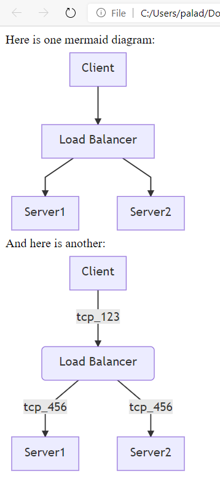
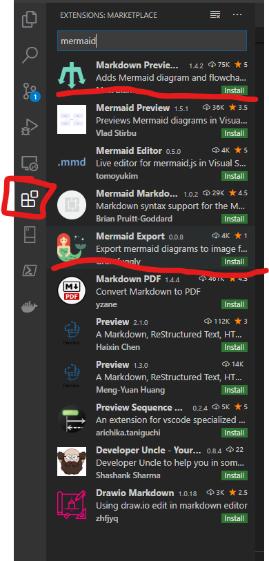

# Mermaid Markdown Charts

There is a new project called mermaid.js  that helps renders shapes to make Visio style charts, but is done as markdown and renders (with the help of a JavaScript library) in a browser window.

Details are located at: [Mermaid getting Started](
https://mermaid-js.github.io/mermaid/#/n00b-gettingStarted "mermaid JS getting started web page")

## Sample Diagram

To render in the browser
Save the file as *.html and it will render in a browser.

```html
<html>
  <body>
    <script src="https://cdn.jsdelivr.net/npm/mermaid@8.4.0/dist/mermaid.min.js"></script>
    <script>mermaid.initialize({startOnLoad:true});</script>

    Here is one mermaid diagram:
    <div class="mermaid">
      graph TD
      A[Client] --> B[Load Balancer]
      B --> C[Server1]
      B --> D[Server2]
    </div>

    And here is another:
    <div class="mermaid">
      graph TD
      A[Client] -->|tcp_123| B(Load Balancer)
      B -->|tcp_456| C[Server1]
      B -->|tcp_456| D[Server2]
    </div>
  </body>
</html>
```







Visual Studio Code Plugins for rendering Mermaid in browser and export to Images


