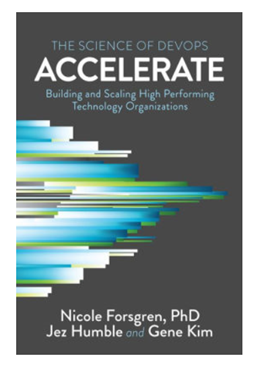

# ITMT 430 Systems Integration

Semester: Spring 2022 Professor Jeremy Hajek

---------------- --------------------------------------------------------
  **Professor**: Jeremy Hajek
        Address: Department of Information Technology & Management,
                 10 W. 33rd St., Chicago, IL 60616
      Telephone: 312.567.5937
          Email: hajek@iit.edu
         Office: Perlstein Hall Room 223A, 10 W. 33rd St.
   Office Hours: Mies Campus: Monday-Wed 12:30-3:00, Thursday 2:00-3:00, Friday 12:00 to 3:00
       Location: Perlstein Hall 223 or Via Google meets
                 book and appointment at:
                 [https://hajek.youcanbook.me](https://hajek.youcanbook.me "Booking APP URL")
---------------- --------------------------------------------------------

## Course Catalog Description

In this capstone course, students will identify, gather, analyze, and write requirements based on user needs and will then design, construct, integrate, and implement an information system as a solution to a business problem.  Students will document integration architecture, methodologies, and technologies using industry best practices.  User needs and user centered design will be applied in the selection, creation, evaluation, and administration of the resulting system.  The system design process will take into account professional, ethical, legal, security, and social issues and responsibilities and stress the local and global impact of computing on individuals, organizations, and society.  Discussion will also cover the need to engage in continuing professional development. [ITMT 430 Bulletin Description](http://bulletin.iit.edu/courses/itmt/ "ITMT 430 Bulletin Description")

## Prerequisites

ITMD 321, ITMD 411, ITMD 361, ITMD 362, ITM 100, ITMM 471, ITMO 340, and ITMO 356   Credit: 2-0-2 (lecture and Lab course) Semester Hours

## Lecture Day, Time & Place

* Main Lecture Class time
  * Monday 8:35am to 10:15am - [Wishnick Hall 113](https://www.iit.edu/about/campus-information/mies-campus/mies-campus-map "IIT Campus Map URL")
* Lab Class Times
  * Lab 01 Monday 10:25am to 12:05pm [TS-2030 Smart Lab](https://www.iit.edu/about/campus-information/mies-campus/mies-campus-map "IIT Campus Map URL")
  * Lab 03 Wednesday 8:35am to 10:15am [TS-2030 Smart Lab](https://www.iit.edu/about/campus-information/mies-campus/mies-campus-map "IIT Campus Map URL")
  * Lab 02 Wednesday 10:25am to 12:05pm [TS-2030 Smart Lab](https://www.iit.edu/about/campus-information/mies-campus/mies-campus-map "IIT Campus Map URL")

## Directions to the Smart Lab TS-2030

To get to the Smart Tech Lab - enter the IIT tower on 35th Street.  Swipe in at the desk and take the elevator up to the second floor.  Exit to the left and head north over the bridge from the Tower to the TS building.  The floor turns from white tile to brown carpet.  Take a left at the intersection and the Smart Lab is directly ahead of you.

## Schedule of Topics/Readings

All readings should be done prior to class

Session | Date | Topic | Reading - Homework |
----------|------|:------|----------
1 | 01/10 | Introduction  | ~~Tooling and Ethics Assignment~~
2 | 01/17 | No Class MLK Jr Day  | Intro to Tooling
3 | 01/24 | The Three Ways Ch 1-2 | NA
4 | 01/31 | Where to Start Ch 3-4 | Sprint 01 presentation
5 | 02/07 | Where to Start Ch 5-6  | NA
6 | 02/14 | Technical Practices of Flow Ch 7-10 | NA
7 | 02/21 | Technical Practices of Flow Ch 11-13 | Sprint 02 presentation
8 | 02/28 | Technical Practices of Feedback Ch 14-18 | NA
9 | 03/07 | Technical Practices of Learning Ch 19-21 | NA
NA | 03/14 | Spring Break Week | ~~Sprint 03 presentation~~ NA
10 | 03/21 | Technical Practices of InfoSec Ch 22-23 | NA
11 | 03/28 | Accelerate Ch 1-3 | NA
12 | 04/04 | Accelerate Ch 4-5 | Sprint 04 presentation
13 | 04/11 | Accelerate Ch 6-7 | NA
14 | 04/18 | Accelerate Ch 8-9 | NA
15 | 04/25 | Accelerate Ch 10-11 & 16 | Sprint 05 presentation
16 | 05/02 | Final Exam Week | NA

## Course Student Outcomes

At the completion of this course you will have experienced software application development in a team setting. You will understand the roles of the project manager, a software developer, security analyst, IT operations, and UI/UX developer.  You will have produced artifacts consistent with the nature of each job and applied the techniques and concepts learned in all of your pre-requisite courses.   The final measurable outcome will be a full deployment of a working application from scratch.  

You will be familiar with DevOps terminology and development practices.  You will have integrated hardware and software into a complete information system to meet identified user needs as a solution to a defined business problem and demonstrated ethics, and an understanding of legal, security, and social issues and responsibilities of information systems.  You will have integrated hardware and software into a complete information system to meet identified user needs as a solution to a defined business problem. You will have demonstrated building world class reliable, agile, and secure cloud native applications.

## Course Objectives

Students completing this course will be able to:

* Identify, gather, analyze, and write information system requirements based on user needs
* Document integration requirements using business process models
* Design, construct, integrate, and implement an information system as a solution to a business problem
* Apply key systems integration architecture, methodologies, and technologies in the construction of an information system using industry best practices
* Based on identified user needs, demonstrate the use of user centered design in the selection, creation, evaluation, and administration of an information system
* Recall and explain professional, ethical, legal, security, and social issues and responsibilities in information systems
* Describe the local and global impact of computing on individuals, organizations, and society
* Describe the need to engage in continuing professional development and explain how this may be achieved

## Required Textbook

* DevOps Handbook - How to Create World-Class Agility, Reliability, & Security in Technology Organizations
  * Gene Kim, Patrick Debois, John Willis, Jez Humble
  * ISBN-13:  9781942788003
  * Publisher:  IT Revolution Press
  * [http://www.barnesandnoble.com/w/the-devops-handbook-gene-kim/1121371901?ean=9781942788003](http://www.barnesandnoble.com/w/the-devops-handbook-gene-kim/1121371901?ean=9781942788003 "Link to DevOps Handbook")

\newpage

* DevOps Handbook - How to Create World-Class Agility, Reliability, & Security in Technology Organizations
  * Gene Kim, Patrick Debois, John Willis, Jez Humble, Dr. Nicole Forsgren
  * ISBN-13: 9781950508402
  * Publisher: IT Revolution Press
  * Publication date: 11/30/2021
  * Edition description: Second Edition
  * [https://www.barnesandnoble.com/w/the-devops-handbook-gene-kim/1138718562?ean=9781950508402](https://www.barnesandnoble.com/w/the-devops-handbook-gene-kim/1138718562?ean=9781950508402 "DevOps Handbook second edition")

\newpage

* Accelerate: The Science of Lean Software and DevOps: Building and Scaling High Performing Technology Organizations
  * Nicole Forsgren, PhD, Jez Humble, Gene Kim
  * ISBN-13: 9781942788331
  * Publisher: IT Revolution Press
  * [https://www.barnesandnoble.com/w/accelerate-nicole-forsgren-phd/1127477199?ean=9781942788331#/](https://www.barnesandnoble.com/w/accelerate-nicole-forsgren-phd/1127477199?ean=9781942788331#/ "Link to Accelerate")

### Readings

Readings for the class will be assigned from the textbooks; there will be additional reading assigned in the form of online reading. All readings should be done before coming to class on the assigned date, and are mandatory and expected.  Generally if you do the readings you will excel in the course, as the lectures serve as a clarification and explanation of material you should already be familiar with.

### Course Notes

It is recommended to take notes from the discussion portion of the class.

### Attendance

Undergrad attendance is expected and will be counted as part of your grade -- if you are not able to attend please email me

### Course Web Site

[http://blackboard.iit.edu/](http://blackboard.iit.edu/ "Course Document Mangement Site URL")

The course will make use of Blackboard [http://blackboard.iit.edu/](http://blackboard.iit.edu/ "Course Document Mangement Site URL") for communications, assignment submissions, group project coordination, providing online resources and administering examinations. All remote students will view the course lectures online via Blackboard, and online readings and other course material will be found on Blackboard.

### Assignments

* Software Sprint Report (x5)
  * Individual reports given by each team member per sprint demonstrating the objectives they completed
* Tooling assignment
  * This initial assignment will help you get your infrastructure setup and prepared for the semester
* ~~Ethics assignment~~
  * ~~Short question and answer assignment dealing with computer ethics~~
* Advanced Tooling Assignments
  * Covering Vagrant and Packer
* Student Chapter Presentation
  * Each week there are scheduled lectures that will be given by the student teams during the main course section
* Final exam consisting of review questions from student presentations

### Grading

Grading criteria for (undergrad course number) students will be as follows:

Letter | Description | Percentage
-------|-------------|------------
A | Outstanding work reflecting substantial effort | 90-100%
B | Excellent work reflecting good effort | 80-89.99%
C | Satisfactory work meeting minimum expectations | 70-79.99%
D | Substandard work not meeting expectations | 60-69.99%
E | Unsatisfactory work |0-59.99%

The final grade for the class will be calculated as follows:

Name | Grade | Total Points
------------------|----------|-----------
Sprint Report (5) | 38% | 20 points each
Chapter Presentation (1) | 6% | 20 points
Tooling Assignment (1) | 6% | 10 points
Tooling Assignment Advanced (2) | 6% | 5 points each
~~Ethics Assignment (1) | 6% | 10 points~~
Final Exam | 38% | 100 points
Attendance | 6% | 20 points

### Late Submission

By default no late work will be accepted – barring situations beyond our control.

### Academic Honesty

All work you submit in this course must be your own.

### Plagiarism

Dealing with code -- you need to respect opensource licenses and in the absence of a clear license be careful cutting and pasting code without attributing source. A good metric would be to add a comment in your code with a link to the original source to protect yourself.

This class won't be dealing with formal written papers.

### Our Contract

This syllabus is my contract with you as to what I will deliver and what I expect from you. If I change the syllabus, I will issue a revised version of the syllabus; the latest version will always be available on Blackboard. Revisions to readings and assignments will be communicated via Blackboard and via version control in GitHub

### Disabilities

Reasonable accommodations will be made for students with documented disabilities.  In order to receive accommodations, students must obtain a letter of accommodation from the Center for Disability Resources and make an appointment to speak with me as soon as possible.  My office hours are listed on the first page of the syllabus. The Center for Disability Resources (CDR) is located in 3424 S. State St., room 1C3-2 (on the first floor), telephone 312 567.5744 or disabilities@iit.edu

### ARC Tutoring Center

The university provides a free tutoring and study center called the [ARC](https://www.iit.edu/arc "IIT Resource Center URL").  This is located newly in the basement of the Galvin Library and is open to all for walk in appointments as well as scheduled tutoring.

### Illinois Tech Sexual Harassment and Discrimination Information

Illinois Tech prohibits all sexual harassment, sexual misconduct, and gender discrimination by any member of our community. This includes harassment among students, staff, or faculty. Sexual harassment of a student by a faculty member or sexual harassment of an employee by a supervisor is particularly serious. Such conduct may easily create an intimidating, hostile, or offensive environment.

Illinois Tech encourages anyone experiencing sexual harassment or sexual misconduct to speak with the Office of Title IX Compliance for information on support options and the resolution process. You can report sexual harassment electronically at [iit.edu/incidentreport](iit.edu/incidentreport "IIT Incident Report URL"), which may be completed anonymously. You may additionally report by contacting the Title IX Coordinator, Virginia Foster at foster@iit.edu or the Deputy Title IX Coordinator, Esther Espeland at eespeland@iit.edu.

For confidential support, you may reach Illinois Tech’s Confidential Advisor at (773) 907-1062. You can also contact a licensed practitioner in Illinois Tech’s Student Health and Wellness Center at student.health@iit.edu or (312)567-7550

For a comprehensive list of resources regarding counseling services, medical assistance, legal assistance and visa and immigration services, you can visit the Office of Title IX Compliance website at [https://www.iit.edu/title-ix/resources](https://www.iit.edu/title-ix/resources "IIT Title IX resources").

### COVID-19 Precautions and Face Coverings in Class

Illinois Tech students are required to be vaccinated, to have a booster as soon as you are eligible, and to wear face masks at all times when indoors. In general, individuals should spend as little time as practicable in closer proximity when doing so is necessary to achieve learning objectives. Students who are feeling ill or experiencing symptoms such as sneezing, coughing, or a higher than normal temperature will be excused from class and are expected to stay at home.

Instructors have the right to ask those who are not complying with these requirements to leave class in the interest of everyone's health and safety. In the event that a student refuses to comply with instructor directions regarding face masks, the instructor has the right to ask the student to leave, and/or cancel class. A student who refuses to comply with these requirements will be referred to the Office of the Dean of Students for possible disciplinary action under the Student Code of Conduct.

Additionally, as a reminder, following other simple practices such as frequent and thorough hand washing, wiping down desks and seats with disinfectant wipes when possible, not sharing personal items such as pens and cell phones, and avoiding crowded hallways and other enclosed spaces will promote good health in and out of the classroom.

Visit iit.edu/COVID-19 for details on Illinois Tech’s response to coronavirus (COVID-19). For information from government authorities, please see the Centers for Disease Control and Prevention website at cdc.gov
