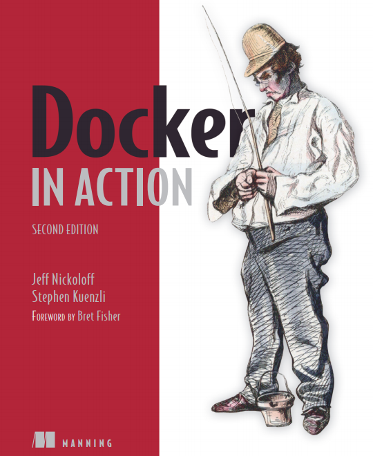
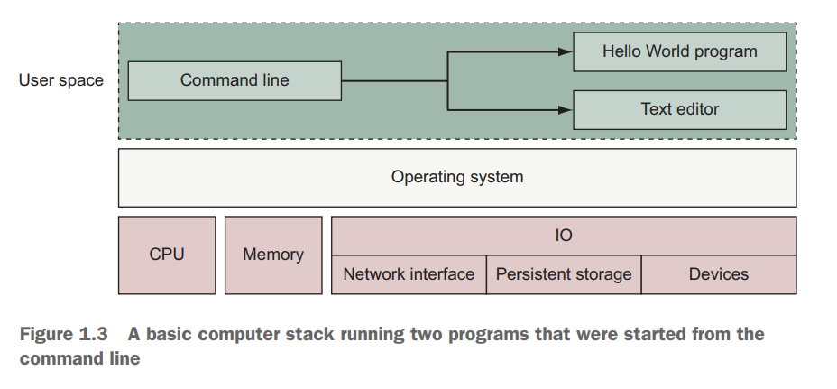
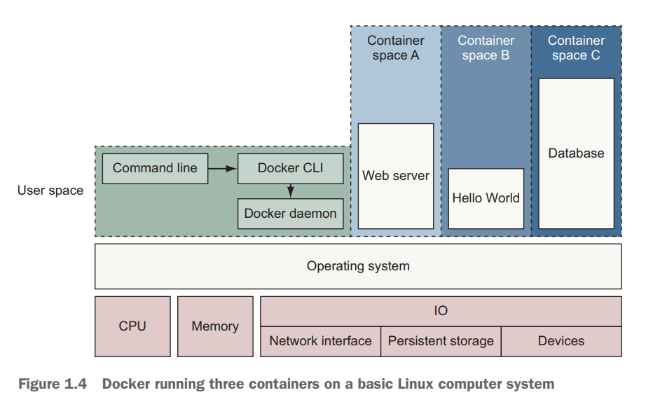

% Docker in Action: Second Edition
% Chapter 01
% Installing Docker

# Installing Docker

## Text Book

{height=350px}

## Docker is like...

{height=350px}

## Chapter 01 - Objectives

- Learn the Docker paradigm
- Demonstrate installing and running a "Hello World" application
- Discuss how Docker addresses software problems
- Learn when, where, and why you should use Docker

## Introduction

- Docker is a tool that makes adopting software packaging, distribution, and utilization best practices cheap and sensible defaults.
  - It does so by providing a complete vision for process containers and simple tooling for building and working with them.
- If you’re on a team that operates service software with dynamic scaling requirements, deploying software with Docker can help reduce customer impact (Immutable and not a machine).
  - Containers come up more quickly and consume fewer resources than virtual machine.
- Puts deployment back in the hands of the developers (closer to the code)
  - Software authors usually know how to install and configure their software with sensible defaults and required dependencies.
  - If you write software, distributing that software with Docker will make it easier for your users to install and run it.
- It promotes disposable system paradigms, persistent state isolation, and other best practices

## Docker

- Docker was released March 2013
  - [Video showing the birth of Docker](https://www.youtube.com/watch?v=wW9CAH9nSLs "Birth of Docker video")
- What is Docker?
  - It is sort of an illusion
  - Its not a programming language
  - Its not a framework
  - Its an abstraction on top of existing Linux components (cgroups and namespaces)
  - Its entirely Linux focused
    - Not possible to run natively on Windows, MacOS, or BSD

## Docker how it works

- Docker is:
  - A commandline program
  - A background process
  - A set of remote services that take a logistical approach to solving common software problems
  - Simplifies your experience installing, running, publishing, and removing software
  - It accomplishes this by using an operating system technology called containers

## Installing Docker in Ubuntu
  
- We need a Linux system to do this (MacOS doesn't count in this case)
  - Lets create/download an already install Ubuntu Virtual Machine
  - You should already have a directory named hashicorp-bionic64 from earlier in the semester
  - Let us `cd` into that directory and issue the `vagrant up` command
  - The system needs to be updated, so issue the command `sudo apt-get update` and then `sudo apt-get dist-upgrade` then reboot the system
  - Change the system name to your initials + docker:  `sudo hostnamectl set-hostname jrh-docker`
    - Exit the system and reconnect via `vagrant ssh` to initialize the change
  - [Follow the Docker instructions for Ubuntu 18.04](https://docs.docker.com/engine/install/ubuntu/ "Ubuntu Docker Instructions")

## Status Checking

- To see that things are working:
  - `sudo systemctl status docker`
  - Lets run the book example hello world container: `sudo docker run dockerinaction/hello_world`
    - What do we see?
  - 
    - What happens when we run the command a second time?

## Containers are not Virtualization - 1.1.3

- In this cloud-native era, people tend to think about virtual machines as units of deployment
  - Where deploying a single process means creating a whole network attached virtual machine
  - Virtual machines provide virtual hardware (or hardware on which an operating system and other programs can be installed)
- Docker containers don’t use any hardware virtualization
- Programs running inside Docker containers interface directly with the host’s Linux kernel
  - Docker is not a hardware virtualization technology

## Running software in containers for isolation - 1.1.4

## Running software in containers for isolation

## Docker Images and Instances

- There are Docker Images
  - Docker image is a bundled snapshot of all the files that should be available to a program running inside a container
  - You can create multiple instances from a single Docker Image
  - Containers that were started from the same image don’t share changes to their filesystem
  - Images are the shippable units in the Docker ecosystem

## The problems Docker solves

- Isolating dependencies and software versions
- Improving Portability across platform (and cloud provider)
  - Also from Desktop to Cloud
- Process Isolation (security restricting access)
- Docker provides an abstraction
  - All the tooling is reusable for any shipping container

## Docker in the larger ecosystem - 1.5

- Kubernetes is the most notable project in the ecosystem aside from Docker itself
- Kubernetes provides an extensible platform for orchestrating services as containers in clustered environments
- Kubernetes depends on container engines such as Docker, and so the containers and images you build on your laptop will run in Kubernetes
  - Kubernetes has its own learning curve and complexity as well

## Summary of Chapter 01

- Docker takes a logistical approach to solving common software problems and simplifies your experience with installing, running, publishing, and removing software. It’s a command-line program, an engine background process, and a set of remote services. It’s integrated with community tools provided by Docker Inc.
- The container abstraction is at the core of its logistical approach.
- Working with containers instead of software creates a consistent interface and enables the development of more sophisticated tools.
- Containers help keep your computers tidy because software inside containers can’t interact with anything outside those containers, and no shared dependencies can be formed.
- Because Docker is available and supported on Linux, macOS, and Windows, most software packaged in Docker images can be used on any computer.
- Docker doesn’t provide container technology; it hides the complexity of working directly with the container software and turns best practices into reasonable defaults.
- Docker works with the greater container ecosystem; that ecosystem is rich with tooling that solves new and higher-level problems.
- If you need help with a command, you can always consult the docker help subcommand

## Conclusion

- Have your Ubuntu 18.04 virtual machine running
- Have Docker latest installed and running
- Run the sample `docker run` command listed in the chapter
