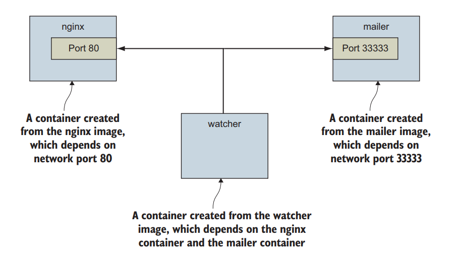
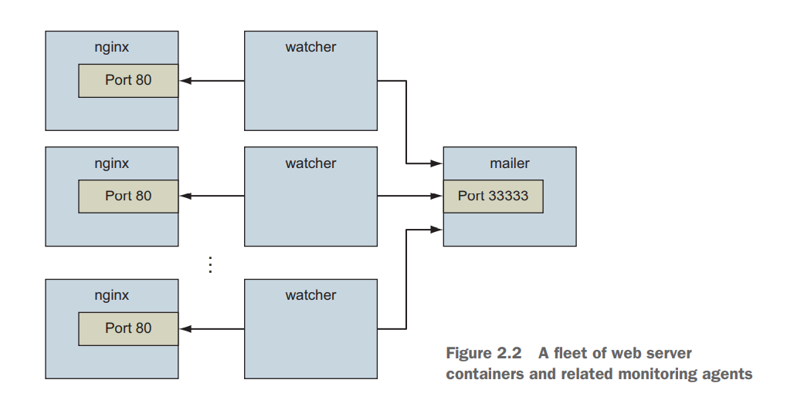

% Docker in Action: Second Edition
% Chapter 02
% Running Docker

# Running Docker

## Text Book

{height=350px}

## Chapter 02 - Objectives

- Demonstrate running interactive and daemon terminal programs in containers
- Perform basic Docker operations and commands
- Isolate programs from each other and injecting configurations
- Demonstrate running multiple programs in a container
- Explain the container life cycle
- Clean up Docker

## Vagrantfile changes before we start

- Open the `Vagrantfile` that controls your `hashicorp/bionic64`
- Uncomment line 35 and set the IP address to:
  - `ip: "192.168.33.30"`{.bash}
  - Uncomment line 52
  - Change line 57, changing 1024 to 4096 to change the amount of memory on the VM
  - Uncomment line 58, exit and save the file
  - Issue the command: `vagrant reload --provision`{.bash} to reconfigure the virtual machine to have a host only IP and 4 GB of memory

## Concept Review

- From chapter 01:
  - What are the two Linux concepts/features that make up a Linux Container?
  - Docker was created in what year/month?
  - Is the focus of Docker containers infrastructure or application deployment?
  - What is a Docker Container image?
  - What is a Docker Container instance?
  - What is the difference between a Linux Container and a Virtual Machine?

## Introduction



## Controlling containers: Building a website monitor - 2.1

- We are going to construct a small demo
- Create 3 nodes
  - An NGINX webserver container
    - Port 80
  - A mailer program container
    - Port 33333
  - A monitoring program container

## Controlling Containers

- To create this we need to:
  - Create detached and interactive containers
  - List containers on your system
  - View container logs
  - Stop and restart containers
  - Reattach a terminal to a container
  - Detach from an attached container

## Creating and Controlling a new container - 2.1.1

- Docker calls the collection of files and instructions needed to run a software program an image
- In this example, we’re going to download and install an image for NGINX from Docker Hub
  - There are other public and private hosted registries
  - [RedHat Container Registry](https://catalog.redhat.com/software/containers/explore "Red Hat container images website")
  - [Amazon Container Registry](https://aws.amazon.com/ecr/ "Amazon Container Registry website")
- Public containers are just that, public.  
  - Usually the producers of software maintain there official container
  - But not always
  - There are paid and private registries for enterprise assurance

## Run and Install the Containers - the Web Server

- Let us start working on our sample project from figure 2.1
- Let's create the front facing webserver first
- `sudo docker run --detach --name web nginx:latest`
  - The `--name` is a human-friendly name you give so you can reference the container instance
    - Otherwise Docker will auto-generate a random unique name (verb noun)
  - The output will be a large serial number or UUID for that containers instance
  - The `--detach` flag runs the docker instance in the background as a daemon
  - See the output at `sudo docker ps`
  - `-d` and `--detach` are the same values and runs the container as `daemon` or `process`

## Sample Project - the mailer and the watcher

- We have the first node (web)
- We need to run 2 more container instances and link them together
  - `sudo docker run -d --name mailer dockerinaction/ch2_mailer`
  - Lets run the monitor container in interactive mode
  - `sudo docker run -it --name agent --link web:insideweb --link mailer:insidemailer dockerinaction/ch2_agent`
  - `-i` means interactive and `-t` gives you a tty or a terminal
- The `--link` option allows containers to be part of the same namespace and to share or link connections
  - The link mechanism injects IP addresses into dependent containers, and containers that aren’t running don’t have IP addresses
  - Docker handles all routing and internal DNS for you

## Listing, stopping, restarting, and viewing output of containers - 2.1.3

- Run the command: `sudo docker ps`
  - This will list the running docker processes (add `-a` to see the dead processes)
- It will list the following:
  - The container ID
  - The image used
  - The command executed in the container
  - The time since the container was created
  - The duration that the container has been running
  - The network ports exposed by the container
  - The name of the container
- `sudo docker logs web` will show any internal logs generated from the containers
  - `-f` flag will follow or watch the logs update in realtime

## Solved problems and the PID namespace - 2.2

- Every running program—or process—on a Linux machine has a unique number called a process identifier (PID)
  - A PID namespace is a set of unique numbers that identify processes
- Docker creates a new PID namespace for each container by default
  - A container’s PID namespace isolates processes in that container from processes in other containers
  - Each container is completely isolated from other containers via its namespace
- But the ports that a container runs on are a system level value in the kernel
  - Not a namespace
  - Two containers cannot listen both on the same port

## A Webserver farm - 2.3



## Docker CIDs - Container IDs

- If we want to create the environment pictured in figure 2.2, what would happen if we just did this?
  - `sudo docker run -d --name webid nginx`
  - Then another time: `docker run -d --name webid nginx`
  - What will happen and why?
- Using the `sudo docker create` command is similar to run, but create will not start the container
  - Only create it
  - As opposed to `sudo docker run` which will start the container
- You can use the `--cidfile` flag to store off the unique CID of a container instance at create or run time
  - `sudo docker create --cidfile /tmp/web.cid nginx`
- You can add the `--name` flag to your Docker run commands, but if you are planning to automate things, this gets difficult.
  - Instead, let Docker create a random name for you and store the CIDs for reference
  - starting and stopping an instance

## Store CIDs as BASH environment variables

```bash
MAILER_CID=$(docker run -d dockerinaction/ch2_mailer)
WEB_CID=$(docker run -d nginx)
AGENT_CID=$(docker run -d \
 --link $WEB_CID:insideweb \
 --link $MAILER_CID:insidemailer \
 dockerinaction/ch2_agent)
 ```

## Bypassing the --name feature

```bash
# This... 
sudo docker run -d --name web1 nginx
sudo docker run -d --name web2 nginx
sudo docker run -d --name web3 nginx
sudo docker ps

# Could become this:
for (( n=1; n<=3; n++ ))
do
    sudo docker run -d nginx
done
sudo docker ps
```

## Environmental Agnostic Systems - 2.4

- Docker has three specific features to help build environment-agnostic systems:
  - Read-only filesystems
  - Environment variable injection
  - Volumes (think disks but not physical media)
- In our example we will build a WordPress Apache server container and a MySQL database server container
  - We should set the Apache WordPress Container Volume to read-only, why?
  - We can start a container with a `ro` root filesystem
  - `sudo docker run -d --name wp --read-only wordpress:5.0.0-php7.2-apache`
  - But this doesn't work as WordPress needs to write temporary files
  - `sudo docker run -d --name wp2 --read-only -v /run/apache2/ --tmpfs /tmp wordpress:5.0.0-php7.2-apache`
    - The `-v /run/apache2/` makes exceptions and makes a writable volume for the host to use
    - You can delete a docker instance - `sudo docker rm wp2`

## Create a MySQL Container

- We now need to create our MySQL database container
  - `sudo docker run -d --name wpdb -e MYSQL_ROOT_PASSWORD=ch2demo mysql:5.7`
- Let's link our WordPress instance to this MySQL database
  - `sudo docker run -d --name wp3 --link wpdb:mysql -p 8000:80 --read-only -v /run/apache2/ --tmpfs /tmp wordpress:5.0.0-php7.2-apache`
  - Note that the `-p` value means ports. This is a mapping of guest container port to host system ports
  - Let's open a browser to: http://192.168.33.30:8000 and see the welcome page of WordPress
- Run these commands:
  - `sudo docker run -d --name wpdb -e MYSQL_ROOT_PASSWORD=ch2demo mysql:5.7`
  - `sudo docker run -d --name wp3 --link wpdb:mysql -p 8000:80 --read-only -v /run/apache2/ --tmpfs /tmp wordpress:5.0.0-php7.2-apache`

## Assignment

- Blank
