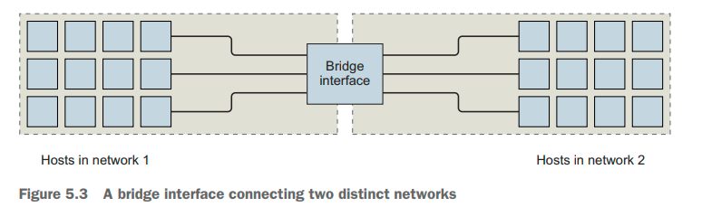
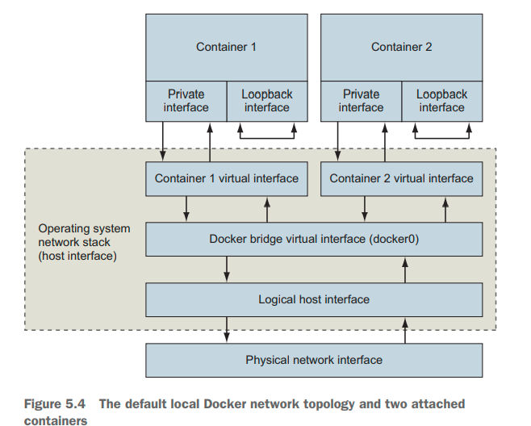

% Docker in Action: Second Edition
% Chapter 05
% Single Host Networking

# Single Host Networking

## Text Book

{height=350px}

## Chapter 05 - Objectives

- Discuss Docker networking background
- Demonstrate creating Docker container networks
- Demonstrate the Network-less and host-mode container paradigm
- Demonstrate how to publish services on the ingress network
- Discuss container network caveats

## Concept Review

- From chapter 01:
  - What are the two Linux concepts/features that make up a Linux Container?
  - Docker was created in what year/month?
  - Is the focus of Docker containers infrastructure or application deployment?
  - What is a Docker Container image?
  - What is a Docker Container instance?
  - What is the difference between a Linux Container and a Virtual Machine?

## Concept Review 2

- What is `--detached` mode?
- What is a CID?
- What does it mean to link two containers?

## Concept Review 3

- What are the three methods for obtaining Docker Images?
- What is a registry?
- Is a Docker Image a file?
- What is a layer?
- What is a major advantage of filesystem layers in Docker?
- How does the use of namespaces and `chroot` allow for filesystems to work in Docker?

## Concept Review 4

- In Linux -- what is a mount point?
- How do Containers use bind mounts to attached other parts of a filesystem to a Container?
- What is an in-memory filesystem in relation to a Container?
- What is a Docker volume?
- Are volumes separate or part of a Container (CID)?
- Do volumes persist after a Container instance has been stopped?  Deleted?

## Introduction

- Former Sun Microsystems CEO, Scott McNealy, once said, "The computer is not the computer, the network, is the computer."
  - Everything is about networking
  - Everything is attached to networking
  - We need to create containers with proper network exposure
- We need to understand how Docker networking interacts with the underlying host

## Basics: Protocols, interfaces, and ports - 5.1.1

- What is a network protocol?
- What is a network interface (NIC)?
  - How do we communicate with network interfaces?
- What is a port?
  - In relation to the network interface?
- What is the default port for:
  - http
  - https
  - MySQL
  - MemCached
  - MongoDB
  - CassandraDB
  - Redis
  - NodeJS

## Bigger Networking Picture: Networks, NAT, and port forwarding - 5.1.2

- Interfaces are single points in larger networks
- Networks are defined in the way that interfaces are linked together, and that linkage determines an interface’s IP address
  - Docker is concerned about two specific networks and the way containers are attached to them
    - Your host network
    - A bridged network
- A bridge is an interface that connects multiple networks so that they can function as a single network


## Docker Container Networking - 5.2

- Docker abstracts the underlying host-attached network from containers
  - Provides a degree of runtime environment agnosticism for the application
  - A container attached to a Docker network will get a unique IP address that is routable from other containers attached to the same Docker network
  - But how can the software inside the container then determine any other containers IP address?
- Networks can be defined in Docker
  - Multiple and separate networks -- all done automatically in software
  - Let us run the `sudo docker network` command
  - Let us run the `sudo docker network ls`{.bash} command

## Three Default Networks

- By default there are 3 drivers
  - Host, bridge, and none
- Bridge is the default driver that provides connectivity between each container running on the same machine
- Host driver can be used to connect a container's networking directly to the host operating system
- The null driver is a secure way to run a container for computation but not have any networking stack
  - For now we will only focus on the `local` scope in chapter 9 we will focus on a larger multi-system scope

## Creating a user-defined bridge network - 5.2.1

- The Docker bridge network driver uses Linux namespaces, virtual Ethernet devices, and the Linux firewall to build a specific and customizable virtual network topology called a bridge
  - You can see this by issuing the command `ip a sh`


## Build Your Own Network

- The idea is that you will build individual networks per application

```bash
Build a new network with a single command:
docker network create \
 --driver bridge \
 --label project=dockerinaction \
 --label chapter=5 \
 --attachable \
 --scope local \
 --subnet 10.0.42.0/24 \
 --ip-range 10.0.42.128/25 \
 user-network 
 ```

## Exploring a bridge network - 5.2.2

- See the text example

## NodePort Publishing - 5.4

- How to allow external traffic into our containers?
  - This is called the NodePort, or `-p`, for example:
    - 0.0.0.0:8080:8080/tcp
    - 8080:8080/tcp
    - 8080:8080
- What is the difference between these three commands?
  - `sudo docker run --rm -p 8080 alpine:3.8`
  - `sudo docker run --rm -p 8088:8080/udp alpine:3.8`
  - `sudo docker run --rm -p 127.0.0.1:8080:8080/tcp -p 127.0.0.1:3000:3000/tcp alpine:3.8`

## No firewalls or network policies - 5.5.1

- Docker container networks do not provide any access control or firewall mechanisms between containers
- Docker uses a namespace model
  - The namespace model solves resource access-control problems by transforming them into addressability problems
  - This design decision impacts the way we have to architect internetwork service dependencies and model common service deployments
  - Always deploy containers with proper access-control mechanisms between containers (bi-directional)

## Custom DNS - 5.5.2

- Docker provides a custom DNS system
  - This mapping enables clients to decouple from a dependency on a specific host IP and instead depend on whatever host is referred to by a known name
  - This is needed because each container has a private, dynamically assigned IP address, unless you are running DNS, you are in trouble
  - This leads us to a larger problem: Network Discovery

## Summary

- Docker networks are first-class entities that can be created, listed, and removed just like containers, volumes, and images
- Bridge networks are a special kind of network that allows direct intercontainer network communication with built-in container name resolution
- Docker provides two other special networks by default: host and none
- Networks created with the none driver will isolate attached containers from the network
- A container on a host network will have full access to the network facilities and interfaces on the host
- Forward network traffic to a host port into a target container and port with NodePort publishing
- Docker bridge networks do not provide any network firewall or access-control functionality
- The network name-resolution stack can be customized for each container

## Questions

Any questions?
