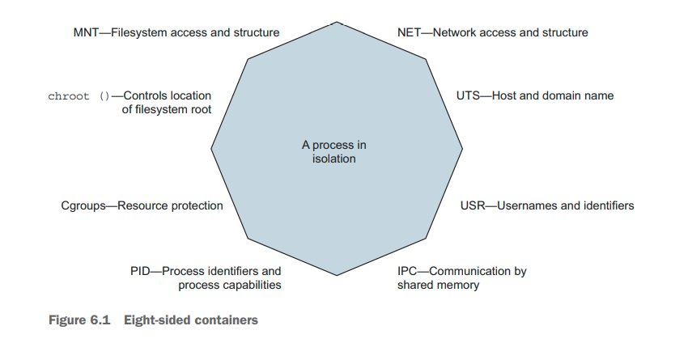

% Docker in Action: Second Edition
% Chapter 06
% Limiting risk with resource controls

# Limiting risk with resource controls

## Text Book

{height=350px}

## Chapter 06 - Objectives

- Discuss Docker networking background
- Demonstrate creating Docker container networks
- Demonstrate the Network-less and host-mode container paradigm
- Demonstrate how to publish services on the ingress network
- Discuss container network caveats

## Concept Review

- From chapter 01:
  - What are the two Linux concepts/features that make up a Linux Container?
  - Docker was created in what year/month?
  - Is the focus of Docker containers infrastructure or application deployment?
  - What is a Docker Container image?
  - What is a Docker Container instance?
  - What is the difference between a Linux Container and a Virtual Machine?

## Concept Review 2

- What is `--detached` mode?
- What is a CID?
- What does it mean to link two containers?

## Concept Review 3

- What are the three methods for obtaining Docker Images?
- What is a registry?
- Is a Docker Image a file?
- What is a layer?
- What is a major advantage of filesystem layers in Docker?
- How does the use of namespaces and `chroot` allow for filesystems to work in Docker?

## Concept Review 4

- In Linux -- what is a mount point?
- How do Containers use bind mounts to attached other parts of a filesystem to a Container?
- What is an in-memory filesystem in relation to a Container?
- What is a Docker volume?
- Are volumes separate or part of a Container (CID)?
- Do volumes persist after a Container instance has been stopped?  Deleted?

## Concept Review 5

- Can Docker networks be created separate from containers?
- Describe the default bridge network in Docker
- How does Docker do name resolution?
- How does Docker do IP addressing and routing?
- Can there be multiple Docker networks per system?
- What are the other two Docker network types?
- What is a NodePort and how does it allow forwarded traffic from the host to a container?
- Do Docker bridge networks provide any network firewall or access-control functionality?

## Introduction

- The features covered in this chapter focus on managing or limiting the risks of running software
  - These features prevent software from misbehaving
  - Constrain a bug or attack from consuming resources that might leave your computer unresponsive
  - Containers can help ensure that software only uses the computing resources and accesses the data you expect
    - Similar in function to a virtual machine, but these controls are constrained in a different way

## How Docker is protected by namespaces

## Setting Resources Allowances - 6.1

- Virtual Machines have hard restrictions on the amount of CPU and Memory that can be accessed
  - Due to their machine abstraction
- Docker can use flags for CPU and Memory
  - By default, Docker containers may use unlimited CPU, memory, and device I/O resources
- Memory limits are the most basic restriction you can place on a container
  - Using the  `-m` or `--memory` flag, unit = b, k, m or g
  - `docker container run -d --name ch6 --memory 256m alpine:3.6`
  - Quotas are NOT a reservation, but only overconsumption protection
  - `sudo docker stats` will show you how much resources a container is using
  - With overprovisioning memory, there are many soft ways software can fail -- be careful

## CPU - 6.1.2

- Processing time is just as scarce as memory
  - Docker lets you limit a container’s CPU resources in two ways:
  - First, you can specify the relative weight of a container to other containers, a ratio
    - Using the `--cpu-shares` flag in 512 unit increments you can assign relative priority or ratio of a container
    - This ratio is only in place when there is CPU contention, otherwise containers can exceed this ratio -- NOT a cap
  - Second, The `cpus` option allocates a quota of CPU resources the container may use by configuring the Linux Completely Fair Scheduler (CFS)
    - This is a max cap
- Another feature Docker exposes is the ability to assign a container to a specific CPU set
  - A CPU set, `--cpuset-cpus 0`  or `--cpuset-cpus 0,1,2` restricts a container to the assigned cores (numeric count)

## Summary

- Docker can limit the amount of memory a container can use to prevent over consumption, not make a quota
- CPUs can be shared/limited or rationed when there is resource contention

## Deliverable

- None

## Questions

Any questions?
