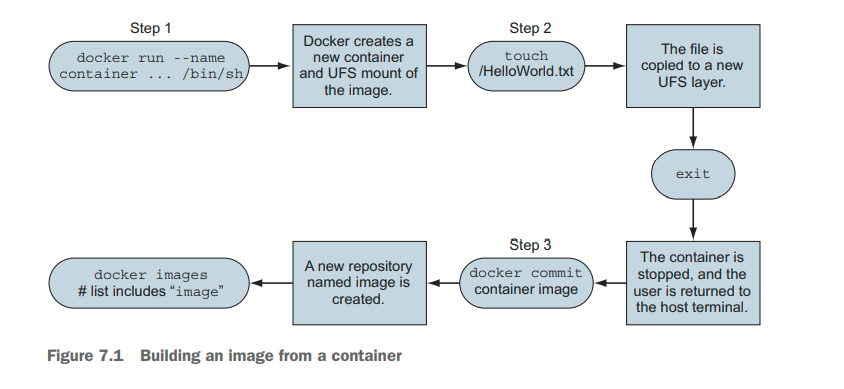

% Docker in Action: Second Edition
% Chapter 07
% Packaging software in images

# Packaging software in images

## Text Book

{height=350px}

## Chapter 07 - Objectives

- Discuss and Describe manual image construction and practices
- Explore Docker mages from a packaging perspective
- Demonstrate and explain working with flat images
- Demonstrate Docker image versioning best practices

## Concept Review

- From chapter 01:
  - What are the two Linux concepts/features that make up a Linux Container?
  - Docker was created in what year/month?
  - Is the focus of Docker containers infrastructure or application deployment?
  - What is a Docker Container image?
  - What is a Docker Container instance?
  - What is the difference between a Linux Container and a Virtual Machine?

## Concept Review 2

- What is `--detached` mode?
- What is a CID?
- What does it mean to link two containers?

## Concept Review 3

- What are the three methods for obtaining Docker Images?
- What is a registry?
- Is a Docker Image a file?
- What is a layer?
- What is a major advantage of filesystem layers in Docker?
- How does the use of namespaces and `chroot` allow for filesystems to work in Docker?

## Concept Review 4

- In Linux -- what is a mount point?
- How do Containers use bind mounts to attached other parts of a filesystem to a Container?
- What is an in-memory filesystem in relation to a Container?
- What is a Docker volume?
- Are volumes separate or part of a Container (CID)?
- Do volumes persist after a Container instance has been stopped?  Deleted?

## Concept Review 5

- Can Docker networks be created separate from containers?
- Describe the default bridge network in Docker
- How does Docker do name resolution?
- How does Docker do IP addressing and routing?
- Can there be multiple Docker networks per system?
- What are the other two Docker network types?
- What is a NodePort and how does it allow forwarded traffic from the host to a container?
- Do Docker bridge networks provide any network firewall or access-control functionality?

## Concept Review 6

- How can Docker limit the amount of memory available to a container?
  - How does this differ from a virtual machine?
  - Is this a quota or used for protection from overprovisioning?
- How are CPUs shared/limited when there is resource contention?

## Introduction

- This chapter we will understand the concerns of image design
  - Learn the tools for building images
  - Discover advanced image patterns
- You can create a Docker image by either modifying an existing image inside
- Or by defining and executing a build script called a **Dockerfile**

## Building Docker images from a container - 7.1

- Remember, a union filesystem (UFS) mount provides a container’s filesystem
- Any changes that you make to the filesystem inside a container will be written as new layers owned by the container that created them

## Packaging Container Images

- The basic workflow for building an image from a container includes three steps:
  - You create a container from an existing image
    - You choose the image based on what you want to be included with the new finished image and the tools you need to make the changes
  - The second step is to modify the filesystem of the container
    - These changes will be written to a new layer of the container’s union filesystem
  - Once the changes have been made, the last step is to commit those changes
    - Then you’ll be able to create new containers from the resulting image
  - Figure 7.1 illustrates this workflow

## 3 Steps to Package a Container



## Example of Package Lifecycle

```bash
sudo docker container run --name hw_container \
 ubuntu:latest \
 touch /HelloWorld 
sudo docker container commit hw_container hw_image 
sudo docker container rm -vf hw_container 
sudo docker container run --rm \
 hw_image \
 ls -l /HelloWorld
```

## Reviewing filesystem changes - 7.1.3

- Docker has a command that shows you all the filesystem changes that have been made inside a container
  - `sudo docker container diff name-of-container`
- Once you are satisfied, you can use the `sudo docker commit` command to create a new local container image
  - There is a `-m` flag that adds a note or commit message to the creation of this new container image
  - There is a `-a` flag that lets you add an author tag for traceability
- Container do not have init systems (no systemd or systemctl commands)
  - So how can we start our custom applications?

## Entrypoints

- An **entrypoint** is the program that will be executed when the container starts
  - If the entrypoint is set, the default command and its arguments will be passed to the entrypoint as arguments
  - To set the entrypoint, you need to create a new container with the `--entrypoint` flag set and create a new image from that container:
    - `sudo docker container run --name cmd-git --entrypoint git ubuntu-git`
  - Then you can use `docker commit` and commit this change and make a new container image from that change

## Configuring image attributes - 7.1.5

- Of the parameters that can be set when a container is created, all the following will carry forward with an image created from the container:
  - All environment variables
  - The working directory
  - The set of exposed ports
  - All volume definitions
  - The container entrypoint
  - Command and arguments
- This is a way you can add environment variables into a container image ahead of time
  - Using `ubuntu:latest` or `busybox:latest` as good starter templates

## Exploring Docker - 7.2.1

- Understanding the details of union filesystems is important for image authors for two reasons:
  - Authors need to know the impact that adding, changing, and deleting files have on resulting images
  - Authors need have a solid understanding of the relationship between layers and how layers relate to images, repositories, and tags
- `sudo docker image tag ubuntu-git:latest ubuntu-git:2.7`
  - `sudo docker image history`
  
## Summary

- New images are created when changes to a container are committed using the docker container commit command
- When a container is committed, the configuration it was started with will be encoded into the configuration for the resulting image
- An image is a stack of layers that’s identified by its top layer.
- An image’s size on disk is the sum of the sizes of its component layers.
- Images can be exported to and imported from a flat tarball representation by using the docker container export and docker image import commands
- The docker image tag command can be used to assign several tags to a single repository
- Repository maintainers should keep pragmatic tags to ease user adoption and migration control
- Tag your latest stable build with the latest tag
- Provide fine-grained and overlapping tags so that adopters have control of the scope of their dependency version creep

## Deliverable

- NA

## Questions

Any questions?
