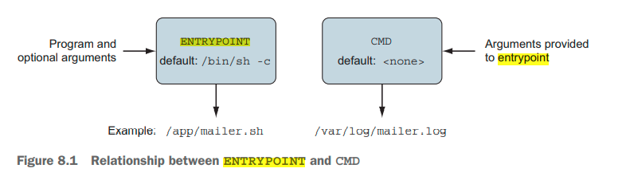

% Docker in Action: Second Edition
% Chapter 08
% Building images automatically with Dockerfiles

# Building images automatically with Dockerfiles

## Text Book

{height=350px}

## Chapter 08 - Objectives

- Discuss and demonstrate how to deploy automated image packaging with Dockerfiles
- Discuss the purpose of metadata and filesystem instructions
- Demonstrate creating maintainable image builds with arguments and multiple stages
- Demonstrate packaging for multiprocess and durable containers
- Understand the significance of reducing the image attack surface and building trust

## Concept Review

- From chapter 01:
  - What are the two Linux concepts/features that make up a Linux Container?
  - Docker was created in what year/month?
  - Is the focus of Docker containers infrastructure or application deployment?
  - What is a Docker Container image?
  - What is a Docker Container instance?
  - What is the difference between a Linux Container and a Virtual Machine?

## Concept Review 2

- What is `--detached` mode?
- What is a CID?
- What does it mean to link two containers?

## Concept Review 3

- What are the three methods for obtaining Docker Images?
- What is a registry?
- Is a Docker Image a file?
- What is a layer?
- What is a major advantage of filesystem layers in Docker?
- How does the use of namespaces and `chroot` allow for filesystems to work in Docker?

## Concept Review 4

- In Linux -- what is a mount point?
- How do Containers use bind mounts to attached other parts of a filesystem to a Container?
- What is an in-memory filesystem in relation to a Container?
- What is a Docker volume?
- Are volumes separate or part of a Container (CID)?
- Do volumes persist after a Container instance has been stopped?  Deleted?

## Concept Review 5

- Can Docker networks be created separate from containers?
- Describe the default bridge network in Docker
- How does Docker do name resolution?
- How does Docker do IP addressing and routing?
- Can there be multiple Docker networks per system?
- What are the other two Docker network types?
- What is a NodePort and how does it allow forwarded traffic from the host to a container?
- Do Docker bridge networks provide any network firewall or access-control functionality?

## Concept Review 6

- How can Docker limit the amount of memory available to a container?
  - How does this differ from a virtual machine?
  - Is this a quota or used for protection from overprovisioning?
- How are CPUs shared/limited when there is resource contention?

## Concept Review 7

- Which Docker command allows you to create a new customized Docker image?
- When a new Docker image is committed, does the previous configuration stay with the container?
- How is the size of a Docker image determined?
- Which command is used to tag/version Docker images?
- What is the reasoning behind tagging your latest stable build with the **latest** tag

## Introduction

- A Dockerfile is a text file that contains instructions for building a Docker image
  - The Docker image builder executes the Dockerfile and the instructions can configure or change anything about an image
  - Like what we have been doing from the command line
- Dockerfiles are the most common way to describe how to build a Docker image
- This chapter covers the basics of working with Dockerfile builds
  - The best reasons to use them
  - A lean overview of the instructions
  - How to add future build behavior
- We will use a familiar example that shows how to automate the process of building images with code instead of creating them manually
  - Once an image’s build is defined in code, it is simple to track changes in version control

## Packaging Git with a Dockerfile - 8.1

- Let us create a new directory
  - From that directory create a new file and name the new file **Dockerfile**
  - Let's add this code to the Dockerfile, changing the LABEL information to your own

```dockerfile
# An example Dockerfile for installing Git on Ubuntu
FROM ubuntu:latest
LABEL maintainer="dia@allingeek.com"
RUN apt-get update && apt-get install -y git
ENTRYPOINT ["git"]
```

- Let us add then build this Docker image
  - `sudo docker image build --tag ubuntu-git:auto .`{.bash}
  - Then run: `sudo docker images ls`{.bash} command

## Explanation

- From the Dockerfile you created:
- `FROM ubuntu:latest`{.bash}
  - Tells Docker to start from the latest Ubuntu image just as you did when creating the image manually
- `LABEL maintainer`{.bash}
  - Sets the maintainer name and email for the image
- `RUN apt-get update && apt-get install -y git`{.bash}
  - Tells the builder to run the provided commands to install Git
- `ENTRYPOINT ["git"]`{.bash}
  - Sets the entrypoint for the image to git
  - An **ENTRYPOINT** is the program that will be executed when the container starts

## Dockerfile Structure

- Dockerfiles can contain comments via the `#` symbol
  - The only special rule about Dockerfiles is that the first instruction must be `FROM`
  - After you saved the Dockerfile, you started the build process by invoking the docker image build command
  - The command had one flag set and one argument
- The --tag flag (or -t for short) specifies the full repository designation that you want to use for the resulting image
  - The argument that you included at the end was a single period
  - That argument told the builder the location of the Dockerfile
- The Dockerfile is constructing a new image, each command entry adds a new layer and Docker is committing each layer to a new image
  - There are 18 Dockerfile options in total

## Dockerfile Primer - 8.2

- [https://docs.docker.com/engine/reference/builder/](https://docs.docker.com/engine/reference/builder/ "URL to Docker build primer")

```dockerfile
FROM debian:buster-20190910
LABEL maintainer="dia@allingeek.com"
RUN groupadd -r -g 2200 example && \
 useradd -rM -g example -u 2200 example
ENV APPROOT="/app" \
 APP="mailer.sh" \
 VERSION="0.6"
LABEL base.name="Mailer Archetype" \
 base.version="${VERSION}"
WORKDIR $APPROOT
ADD . $APPROOT
ENTRYPOINT ["/app/mailer.sh"] 
EXPOSE 33333
# Do not set the default user in the base otherwise 
# implementations will not be able to update the image
# USER example:example
```

- `docker image build -t dockerinaction/mailer-base:0.6 -f mailer-base.df .`

## New Options

- Five new instructions are introduced in this Dockerfile
  - The first new instruction is **ENV**
  - ENV sets environment variables for an image, similar to the --env flag
  - A single ENV instruction is used to set three distinct environment variables
- The next two instructions are **WORKDIR** and **EXPOSE**
  - The result of the WORKDIR instruction will be an image with the default working directory set to /app
- The **EXPOSE** command creates a layer that opens TCP port 33333
  - But not externally exposing, only within the Docker network
- The **LABEL** instruction adds key/value pairs to the image’s metadata

## ENTRYPOINT

- The ENTRYPOINT instruction has two forms: the shell form and an exec form
  - The shell form looks like a shell command with whitespace-delimited arguments
  - The exec form is a string array in which the first value is the command to execute and the remaining values are arguments
  - In this Dockerfile will be executed as `/bin/sh –c 'exec ./mailer.sh'`
- We can run Docker inspect to check all the values we have set in our Dockerfile
  - `sudo Docker inspect dockerinaction/mailer-base:0.6`
- The last commented line is a metadata instruction, **USER**
  - It sets the user and group for all further build steps and containers created from the image

## Filesystem instructions - 8.2.2

- There are three instructions that modify the filesystem: COPY, VOLUME, and ADD

```dockerfile
FROM dockerinaction/mailer-base:0.6
RUN apt-get update && \
 apt-get install -y netcat
COPY ["./log-impl", "${APPROOT}"]
RUN chmod a+x ${APPROOT}/${APP} && \
 chown example:example /var/log
USER example:example
VOLUME ["/var/log"]
CMD ["/var/log/mailer.log"]
```

## Filesystem Instructions

- The **COPY** instruction will copy files from the filesystem where the image is being built, into the build container
  - The COPY instruction takes at least two arguments
  - The last argument is the destination, and all other arguments are source files
  - Note, Any files copied will be copied with file ownership set to root
- The second new instruction is **VOLUME**
  - This behaves exactly as you’d expect if you understand what the --volume flag
- The last instruction in this Dockerfile is **CMD**
  - CMD is closely related to the ENTRYPOINT instruction


## CMD and ENTRYPOINT

- The CMD command represents an argument list for the entrypoint
  - The default entrypoint for a container is `/bin/sh`{.bash}
- ENTRYPOINT is the first binary the container executes on start
- The CMD are the commands passed to that binary
  - The commands is split into two for easier accountability
  - The command as ENTRYPOINT and the options and arguments as CMD
- One last instruction to cover, **ADD**
  - The ADD instruction operates similarly to the COPY instruction with two important differences
  - The ADD instruction will fetch remote source files if a URL is specified
  - Extract the files of any source determined to be an archive file
    - This saves you from having to use the RUN option to extract files

## Using startup scripts and multiprocess containers - 8.5

- You’ll need to ask yourself whether the software running in your container requires any startup assistance
  - Supervision, monitoring, or coordination with other in-container processes
  - Remember not a VM so there is no systemd or sysVinit to start and control processes
- For example, WordPress requires certain environment variables to be set or container links to be defined
  - Without that context, WordPress would be unable to connect to the database where the blog data is stored
  - It would make no sense to start WordPress in a container without access to the data it’s supposed to serve
  - WordPress images use a script as the container entrypoint
  - That script validates that the container context is set in a way that’s compatible with the contained version of WordPress

## Startup Script Validation

- The startup process should validate as much of the assumed context as possible:
  - Presumed links (and aliases)
  - Environment variables
  - Secrets
  - Network access
  - Network port availability
  - Root filesystem mount parameters (read-write or read-only)
  - Volumes
  - Current user
- This can be done by setting the ENTRYPOINT to a shell script to check all of the requirements and fail fast if something is not set or met
  - Never give a broken artifact or an unknown state... where have we heard that?

## Declarative Programming and Wrap up - 8.5.3

- Now that we are declaring in our Dockerfile the construction of our container, we have entered a different paradigm.
  - We can use the docker service not just to launch and run containers, but to monitor them and provide healthchecks
  - To maintain state
- There are two ways to specify the health check command:
  - Use a HEALTHCHECK instruction when defining the image
  - On the command-line when running a container
- Examples of Dockerfiles
  - [https://docs.docker.com/engine/reference/builder/#dockerfile-examples](https://docs.docker.com/engine/reference/builder/#dockerfile-examples "URL of Dockerfile exampels")
- One thing to think about is, why isn't there a NETWORK or LINK command in the DOCKERFILE structure?
  - If we want to orchestrate the running of related docker instances, then we need Docker-Compose in conjunction with a Docker file
  
## Summary

- Most Docker images are built automatically from Dockerfiles
  - Docker provides an automated image builder that reads instructions from Dockerfiles
  - Each Dockerfile instruction results in the creation of a single image layer
  - Merge instructions to minimize the size of images and layer count when possible
  - Dockerfiles include instructions to set image metadata including the default user, exposed ports, default command, and entrypoint
  - Other Dockerfile instructions copy files from the local filesystem or a remote location into the produced images
  - Downstream builds inherit build triggers that are set with ONBUILD instructions in an upstream Dockerfile
  - Dockerfile maintenance can be improved with multistage builds and the ARG instruction
  - Startup scripts should be used to validate the execution context of a container before launching the primary application
  - A valid execution context should have appropriate environment variables set, network dependencies available, and an appropriate user configuration

## Deliverable

- NA

## Questions

Any questions?
