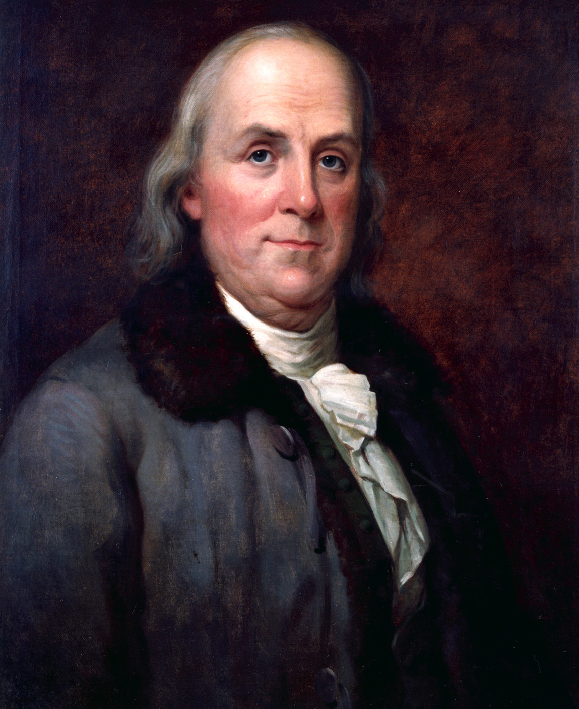
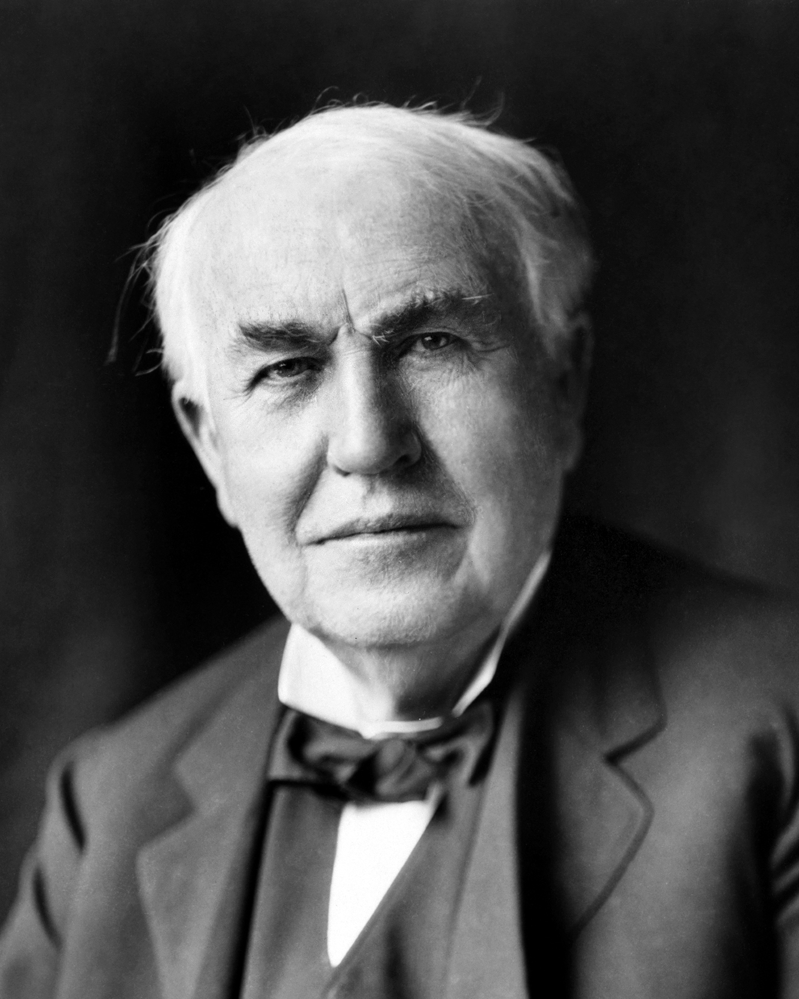
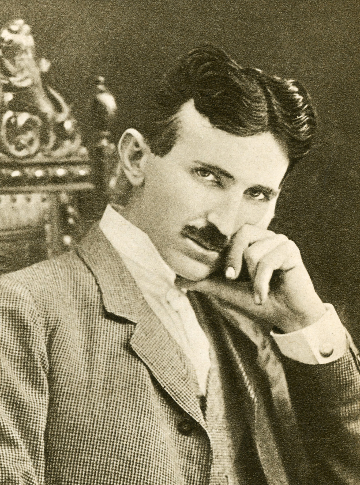
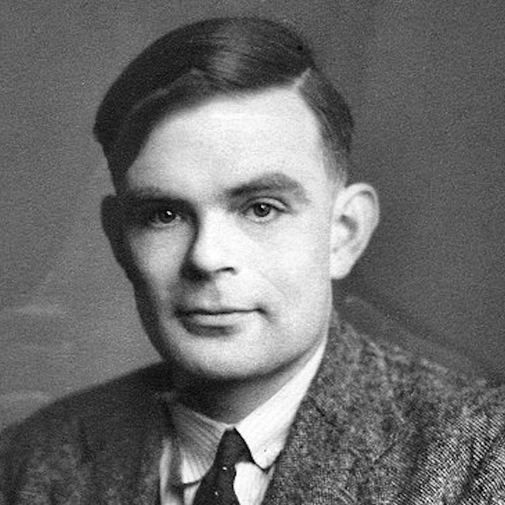
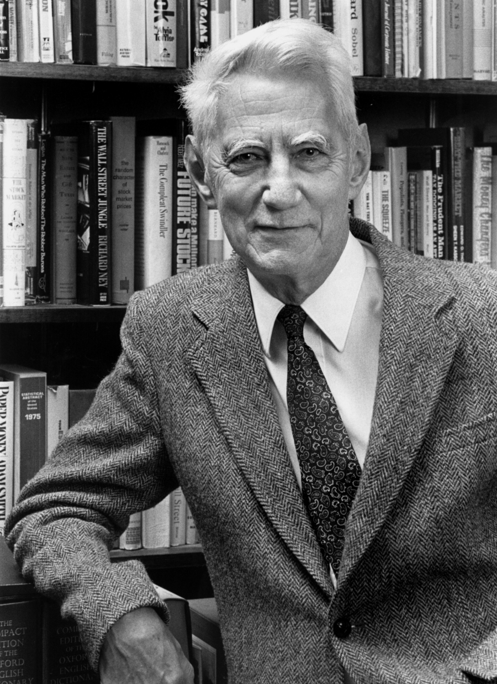
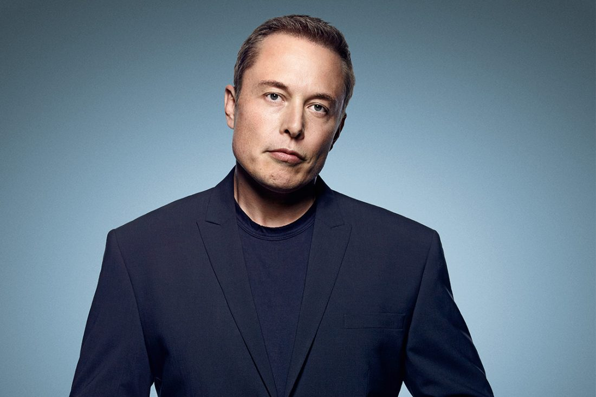
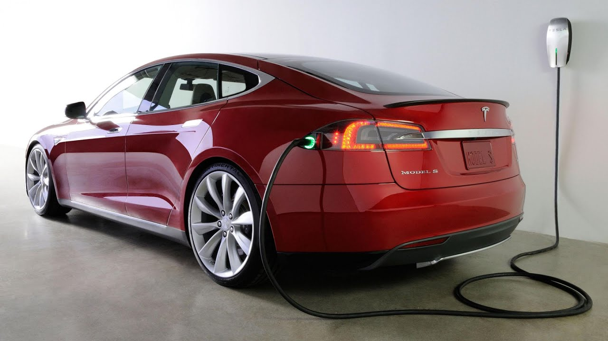
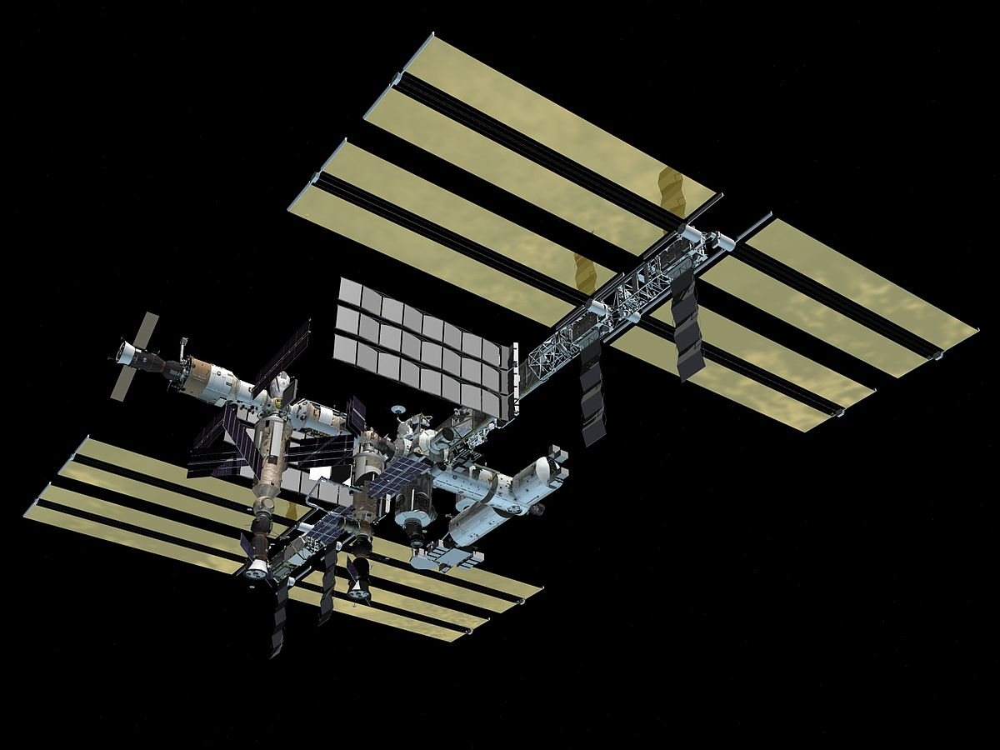
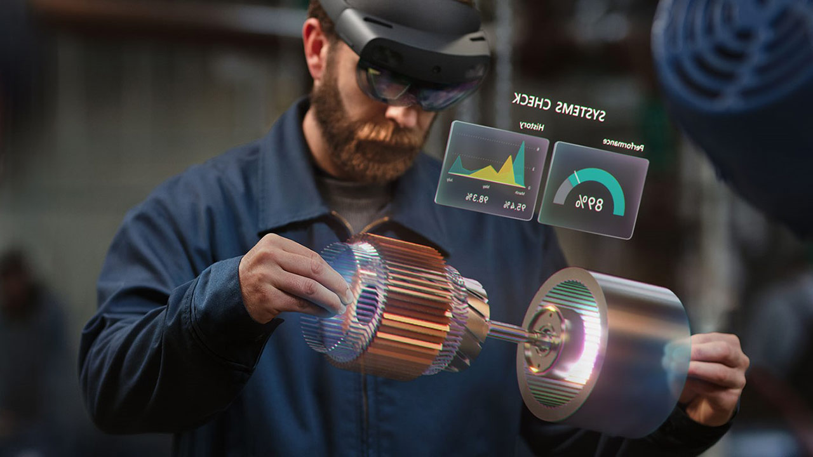
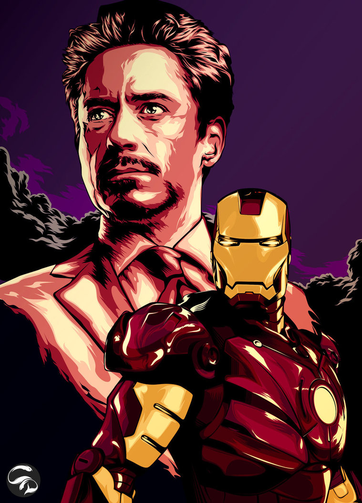

% STEM EXPO

# HISTORY and CHANGE

## Electricity

## Second Phase of Electricity

## AC/DC

## Commercial Electricity

## What was created

## Other Creators

## What is today

## Important Inventors

## What more

## What else

## HoloLens

## Any more

## Questions

- Any questions?
