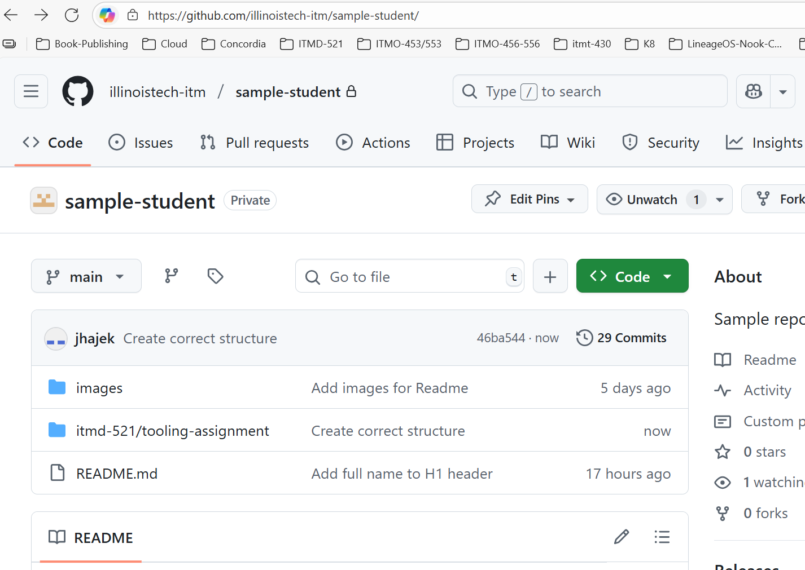
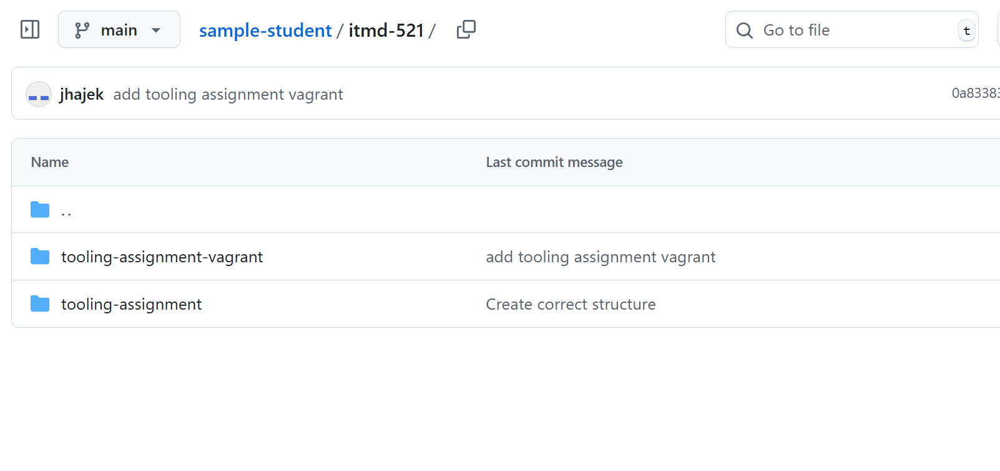
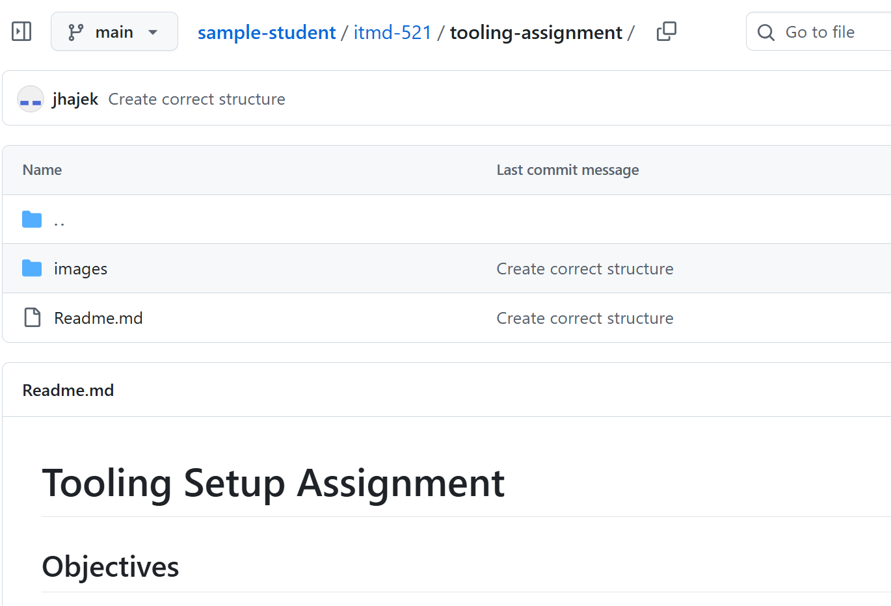
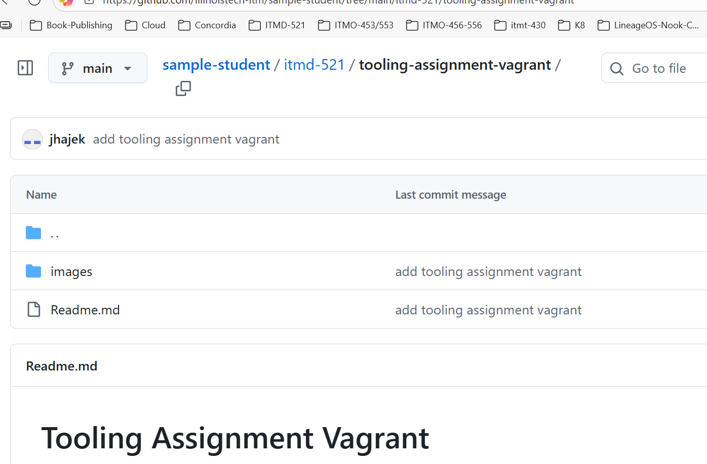

# Structure of Deliverables

This is how your first two deliverables should be structured

## Introduction Readme.md

Your Readme where you introduce yourself needs to be in the root of your private repo -- with all images in an `images` folder.

## Repo Folder Structure

You ned to create a folder for each class, in the example the class is `itmd-521`, use lowercase and **no spaces**--change the folder name as appropriate. Inside this folder you will create a sub-folder for each assignment.

## Tooling Assignment Deliverable

Your `tooling-assignment` deliverable will be inside of a directory you created in the root of you repo with the name of your class. In this example `itmd-521`. Make sure **no spaces** and adjust the class name as appropriate.

## Tooling Assignment Vagrant

Your `tooling-assignment-vagrant` deliverable will be inside of its own directory under your class folder with its own `images` directory.

