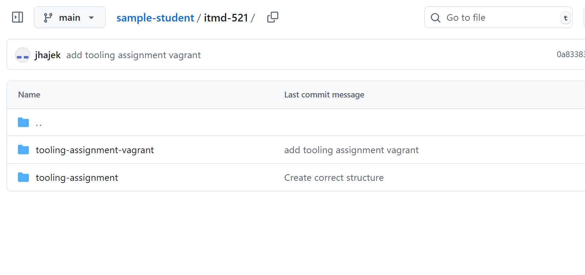

# The Structure of your Deliverables

This is how your private repo should be organized

## Structure

In the root of the repo there will be one folder per-class in the lower-case and **no spaces**. 

* [Example Repo Structure](https://github.com/illinoistech-itm/jhajek/ "github repo example structure")

## Repo Folder Structure

Inside of your class folder, you will create sub-folders as required (not all of these will be neccesary). Adjust the class name as required.

