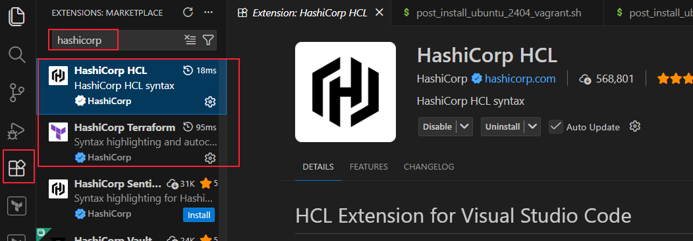

# Tooling Assignment Packer

## Objectives

* Demonstrate the use of Virtual Machines and discuss how they can extend your PCs capabilities
* Discuss the tools used for x86 based Virtualization and Apple Silicon based virtualization
* Examine the benefits of constructing virtual machine text based templates
* Demonstrate using version control in conjunction with text based templates
* Examine and explain the benefits creating custom virtualization artifacts
* Explain the uses and advantages of the Packer platform in relation to virtual machine creation

## Outcomes

At the conclusion of this lab you will have investigated using a virtualization platform (x86 VirtualBox and M1 Parallels) and demonstrated the ability to build your own custom virtualization artifacts. You will have discussed the advantages of using Packer and Vagrant and you will have implemented and deployed your own custom virtual machine artifacts.

### Packer - Part I

Taken from [https://packer.io](https://packer.io "Packer webpage"): Why Packer?

* Multi-provider Portability
  * Identical images allow you to run dev, staging, and production environments across platforms.
* Improved Stability
  * By provisioning instances from stable images installed and configured by Packer, you can ensure buggy software does not get deployed.
* Increased Dev / Production Parity
  * Keep dev, staging, and production environments as similar as possible by generating images for multiple platforms at the same time.
* Reliable Continuous Delivery
  * Generate new machine images for multiple platforms, launch and test, and verify the infrastructure changes work; then, use Terraform to put your images in production.
* Appliance Demo Creation
  * Create software appliances and disposable product demos quickly, even with software that changes continuously.

Packer is a community tool for creating identical machine images for multiple platforms from a single source configuration. Packer is lightweight, runs on every major operating system, and is highly performant, creating machine images for multiple platforms in parallel. 

A machine image is a single static unit that contains a pre-configured operating system and installed software which is used to quickly create new running machines. Machine image formats change for each platform. Some examples include AMIs for EC2, VMDK and VMX files for VMware, and OVF exports for VirtualBox.

## Packer HCL2 template

Lets take a look and see how Packer is able to build virtual machines from a YAML based text file. For the sample code used in the next section you can issue the command `git pull` in the jhajek repo you cloned at the beginning of class to get the latest source code samples. They will be located in the directory [packer-code-examples](https://github.com/illinoistech-itm/jhajek/tree/master/tooling-assignments/tooling-assignment-packer "website for packer code example"). Let us look at the file named: `ubuntu_24043_vanilla-server` > `ubuntu24043-vanilla-server.pkr.hcl` and `ubuntu_24043_apple_silicon_mac-vanilla-server` > `ubuntu_24043_vanilla-arm-server.pkr.hcl` examples.

* [Documentation options for VirtualBox](https://developer.hashicorp.com/packer/integrations/hashicorp/virtualbox/latest/components/builder/iso "webpage for Documentation option for VirtualBox")
* [Documentation options for Parallels](https://developer.hashicorp.com/packer/integrations/Parallels/parallels/latest/components/builder/iso "webpage for Documentation options for Parallels")

## Installing HCL VSCode plugin

VSCode has an extensive plugin system to provide features, syntax high-lighting, and auto-completion features for the HCL language. This will help with debugging. You will want to install the `Hashicorp HCL` and `Hashicorp Terraform` plugins.



### Packer Template for x86 VirtualBox

```hcl
packer {
  required_plugins {
    virtualbox = {
      source  = "github.com/hashicorp/virtualbox"
      version = "~> 1"
    }
      vagrant = {
      version = "~> 1"
      source = "github.com/hashicorp/vagrant"
    }
  }
}

source "virtualbox-iso" "ubuntu-24043-server" {
    boot_command = [
        "e<wait>",
        "<down><down><down>",
        "<end><bs><bs><bs><bs><wait>",
        "autoinstall ds=nocloud-net\\;s=http://{{ .HTTPIP }}:{{ .HTTPPort }}/ ---<wait>",
        "<f10><wait>"
      ]
  boot_wait               = "5s"
  disk_size               = 35000
  guest_additions_path    = "VBoxGuestAdditions_{{ .Version }}.iso"
  guest_os_type           = "Ubuntu_64"
  http_directory          = "subiquity/http"
  http_port_max           = 9200
  http_port_min           = 9001
  iso_checksum            = "${var.iso_checksum}"
  iso_urls                = ["${var.iso_url}"]
  shutdown_command        = "echo 'vagrant' | sudo -S shutdown -P now"
  ssh_username            = "vagrant"
  ssh_password            = "${var.user-ssh-password}"
  ssh_timeout             = "25m"
  nic_type                = "virtio"
  chipset                 = "ich9"
  gfx_vram_size           = "16"
  gfx_controller          = "vboxvga"
  #hard_drive_interface    = "virtio"
  cpus                    = 2
  memory                  = "${var.memory_amount}"
  vboxmanage              = [["modifyvm", "{{.Name}}", "--nat-localhostreachable1", "on"]]
  virtualbox_version_file = ".vbox_version"
  vm_name                 = "ubuntu-vanilla-server"
  headless                = "${var.headless_build}"
}

build {
  sources = ["source.virtualbox-iso.ubuntu-24043-server"]

  provisioner "shell" {
    execute_command = "echo 'vagrant' | {{ .Vars }} sudo -E -S sh '{{ .Path }}'"
    script          = "../scripts/post_install_ubuntu_2404_vagrant.sh"
  }

  post-processor "vagrant" {
    keep_input_artifact = false
    output              = "${var.build_artifact_location}{{ .BuildName }}-${local.timestamp}.box"
  }
}
```

### Packer Template for Apple Silicon Parallels

```hcl
locals { timestamp = regex_replace(timestamp(), "[- TZ:]", "") }

packer {
  required_plugins {
    vagrant = {
      source  = "github.com/hashicorp/vagrant"
      version = "~> 1"
    }
    parallels = {
      source  = "github.com/hashicorp/parallels"
      version = "~> 1.2.0"
    }
  }
}

source "parallels-iso" "vanilla-server" {
  boot_command          = ["<esc>", "c", "linux /casper/vmlinuz",
                           " quiet"," autoinstall",
                           " ds='nocloud-net;s=http://{{.HTTPIP}}:{{.HTTPPort}}/'",
                           "<enter>","initrd /casper/initrd <enter>","boot <enter>"]
  boot_wait               = "5s"
  disk_size               = 15000
  parallels_tools_flavor  = "lin-arm"
  guest_os_type           = "ubuntu"
  hard_drive_interface    = "sata"
  http_directory          = "subiquity/http"
  http_port_max           = 9200
  http_port_min           = 9001
  iso_checksum            = "${var.iso_checksum}"
  iso_urls                = ["${var.iso_url}"]
  shutdown_command        = "echo 'vagrant' | sudo -S shutdown -P now"
  ssh_wait_timeout        = "1800s"
  ssh_password            = "${var.SSHPW}"
  ssh_timeout             = "20m"
  ssh_username            = "vagrant"
  parallels_tools_mode    = "upload"
  ssh_handshake_attempts  = "300"
  communicator            = "ssh"
  memory                  = "${var.memory_amount}"
  prlctl                  = [["set", "{{.Name}}","--bios-type", "efi-arm64" ],
                             ["set", "{{.Name}}","--device-del", "sound0"]]
  prlctl_version_file     = ".prlctl_version"
  vm_name                 = "ubuntu-vanilla-server"
}

build {
  sources = ["source.parallels-iso.vanilla-server"]

  provisioner "shell" {
    execute_command = "echo 'vagrant' | {{ .Vars }} sudo -E -S sh '{{ .Path }}'"
    script          = "../scripts/post_install_ubuntu_2404_vagrant.sh"
  }

  post-processor "vagrant" {
    keep_input_artifact = false
    output              = "${var.build_artifact_location}{{ .BuildName }}--${local.timestamp}-arm.box"
  }
}
```

## Packer Template Main Sections

There are two main sections to understand. First is the **Source** section which tells us details about what needs to be built and how it will be built. The second section, is the **Build** section and this section is the part of the code that executes the first section in order to build your virtualized artifact.

### Source Block

The source code in the [HCL (HashiCorp Language)](https://www.packer.io/guides/hcl "HCL web-site") document under the header marked source, tells Packer what Operating System it will be building. It tells Packer what the answers to all the installation questions are going to be and it tells Packer which virtualization platform it should be using on the local system.

In this case, Packer is building a virtual machine using VirtualBox. The documentation for the [VirtualBox ISO build method](https://www.packer.io/plugins/builders/virtualbox/iso "Packer vbox iso documentation web-site") is very helpful in allowing you to customize and expand this simple template.

### Build Block

The build section tells Packer what to build. You can have multiple *source* sections in a single Packer build template. Within the Build portion of the template, there are two additional optional sections: provisioners and post-processors

### Provisioner Block

[Provisioners](https://www.packer.io/docs/provisioners "Packer provisioners web-page") are an extra feature of Packer. This allows you to execute additional commands after the initial install is completed. This allows you to separate the installation template and the ability to customize your artifacts. You can reuse the same template to build many Ubuntu Server Virtual Machines, but use a single or multiple shell script to install different software in each virtual machine. You can see the source code on the line that has **script**: `script = "../scripts/post_install_ubuntu_2404_vagrant.sh"`

You can also use inline shell commands for customizing your artifact. Packer will manage all of this using an SSH session.

### Post-Processor Block

This is one of the best features of Packer. Not only is Packer able to build a Virtual Machine artifact from a single *.pkr.hcl document, but it is able to convert a single artifact into 1 of 30 other formats. This allows for a single standardized template to be built, checked for compliance, version controlled, and converted all in a single step.

List of Post-Processor Options:

* 1&1
* Alicloud
* Anka
* Ansible
* Amazon EC2
* Azure
* Chef
* Cloudstack
* DigitalOcean
* Docker
* Google Cloud Platform
* HashiCups
* hcloud
* HuaweiCloud
* Hyper-V
* InSpec
* JD Cloud
* Kamatera
* Linode
* Naver Cloud
* Openstack
* Oracle
* Outscale
* Parallels
* Proxmox
* QEMU
* Scaleway
* Tencent Cloud
* Vagrant
* VirtualBox
* VMware vSphere
* VMware
* Yandex

At the conclusion of our Packer build template we will have Packer export our VirtualBox artifact and turn it into a Vagrant *.box file -- which we will then import into Vagrant so that we can run and use the artifact for us. We will walk through this manually, but you will quickly see places where these steps can be automated via a PowerShell or Zsh/Bash script.

## Tutorial Steps

These steps will walk you through building a custom VirtualBox Image from a Packer Template. The objectives for doing this are to show you how you can build your own virtual machines with your custom setup of software. This is a quick way to setup a multi-node network and install the same software you will be using on your production Operating Systems.

### Acquiring the Packer Sample Templates

The first templates we will be building will be on your local systems. We will be creating a 2 VM node using VirtualBox. This assumes you are working on an x86 system. If using the Apple Silicon your instructions will be mostly the same, the templates will be different.

The second step will be the IT Operations for your team deploying a Packer Build Template to build the same software to our production cloud using Packer, Terraform, and Proxmox -- our Virtualization Platform. 

You will find two folders, one for local VirtualBox build, the other for your team repo to build and deploy on our production server. Lets start with the first one

### Acquiring the Packer Sample Templates to build VirtualBox VMs for Vagrant

To get a hold of the Packer Build Template samples, you will need to clone an additional repo to your host systems (MacOS, Windows, or Linux). Issue the command: `git clone https://github.com/illinoistech-itm/jhajek` on your local system (but not inside your repository). There will be many directories with sample code from other classes, but all you are interested in is the ~~`itmt-430` directory and the conent in the `example-code` folder~~ `tooling-assignemnts` > `tooling-assignment-packer` folder. 

**Note:** do not clone the `jhajek` repo directly into your own repo. Repos and not meant to be mixed together and can cause unexpected behavior.

### Building Your Own Virtual Machines Using Packer and VirtualBox

The sample code provided is heavily templated, to allow use without hard-coding specific values or secrets into the template. There will be a few steps to add values that we need to fill out. Let's take a look at the file named: 

* x86 VirtualBox based OSes 
  * [ubuntu24043-server.pkr.hcl](https://github.com/illinoistech-itm/jhajek/blob/master/tooling-assignments/tooling-assignment-packer/ubuntu_24043_vanilla-server/ubuntu24043-vanilla-server.pkr.hcl "webpage showing the Packer syntax").
* Apple Silicon M Series Parallels Pro
  * [ubuntu24043-server.pkr.hcl](https://github.com/illinoistech-itm/jhajek/blob/master/tooling-assignments/tooling-assignment-packer/ubuntu_24043_apple_silicon_mac-vanilla-server/ubuntu_24043_vanilla-arm-server.pkr.hcl "webpage showing the Packer syntax").

There are two files associated with this Packer Build Template, there is a file called: `variables.pkr.hcl`. This file allows you to define variables that will be applied to settings at run time.

### Building Your Own Virtual Machines Using Packer and Parallels on Apple Silicon

The sample code provided is heavily templated, to allow many people to use without hard-coding specific values or secrets into the template. There will be a few steps to and values that we need to fill out. Let's take a look at the file named: [ubuntu_24043_vanilla-arm-server.pkr.hcl](https://github.com/illinoistech-itm/jhajek/blob/master/itmt-430/example-code/advanced-tooling-examples/ubuntu_24043_m1_mac/ubuntu_24043_vanilla-arm-server.pkr.hcl "webpage showing the Packer syntax for M1 silicon").

~~You will also be required to install the `Parallels Virtualization SDK`. You can install this from your Parallels account -- there is a download link. It is also available via `brew`: `brew install parallels-virtualization-sdk --cask`. This allows Packer to connect to the Parallels commandline, known as `prlctl`.~~

There is a special file associated with this Packer Build Template, there is a file called: `variables.pkr.hcl`. This file allows you to define variables that will be applied to settings at run time.

### Modifying the Subiquity user-data

Starting in Ubuntu Server 20.04, Ubuntu replaced the Preseed tool for autoinstalls with a tool called [Subiquity or Cloud Init](https://ubuntu.com/server/docs/install/autoinstall "webpage for autoinstall"). This allowed local auto-install logic and Cloud based server installs (AWS, VMWare, Azure, etc.. etc..) to use the same tool. Which makes sense as single installs on local servers or local PCs give way to a cloud native way of deploying multiple pre-configured copies of servers.

Under the directory, `ubuntu_24043_vanilla` > `subiquity` > `http` you will find another template named: `user-data`. This `user-data` file contains all of the *answers* for auto-install questions. 

This would be a place to configure timezone, harddrive size, software that is pre-installed, and configure SSH to accept Public Key based authentication. You would also create user accounts and passwords here. By default the system is setup for a username: `vagrant` and a password `vagrant`. If you choose to keep this pair then enter the SSH password `vagrant` in the value on line 14 of the `variables.pkr.hcl`.

### Provisioning Scripts

At the end of the `ubuntu24043-vanilla-live-server.pkr.hcl` file there are two sections, `provisioners` and `post-processors`. Provisioners is a an additional feature of Packer that allows the Packer binary to reboot your installed virtual machine and run a provisioner script -- in this case a shell script -- for further custom installation.

This could be custom software, cloning of source code, or removal of keys used for authentication. You can run multiple provisioner scripts and people usually do this to keep there logic separated. The `provisioner` script for `ubuntu24043-vanilla-live-server.pkr.hcl` is `post_install_ubuntu_2404_vagrant.sh`.

### Initializing the Packer VagrantBox Plugin

Staring in 2021, Hashicorp moved to break the plugins for the various builders out of the main Packer binary and into community controlled plugins -- that can release in faster cycles. That is why you have these lines of code at the beginning of your build template.

```hcl
packer {
  required_plugins {
    virtualbox = {
      version = ">= 1.1.5"
      source  = "github.com/hashicorp/virtualbox"
    }
  }
}
```

On Apple Silicon:

```hcl
packer {
  required_plugins {
    parallels = {
      version = ">= 1.2.2"
      source  = "github.com/hashicorp/parallels"
    }
  }
}
```

You only have to run this once time before you run your first build to retrieve the plugin, from the directory where the `ubuntu24043-vanilla-server.pkr.hcl` is located: `packer init .` -- this will initialize the VirtualBox Plugin for your local system.

### Validation

To double check that you have configured everything properly, there is a command to check: `packer validate .` and any errors or missing values will be reported to you.

### Building Virtual Machines

Here is where the fun begins. You will now execute the command required to build a custom VirtualBox VM from a completely automated script. If the two previous commands completed successfully then you can issue the command: `packer build .` and the virtual machine will begin to build. You will see the step by step process in the VirtualBox GUI as if you were manually installing, but there is no manual steps required if everything goes well. Depending on your laptops CPU and Hard disk the install can take as little as 10 minutes up to about 25 minutes. You will know things are successful if you see similar output on your Terminal:

```
Build 'virtualbox-iso.ubuntu-24043-server' finished after 15 minutes 34 seconds.

==> Wait completed after 15 minutes 34 seconds

==> Builds finished. The artifacts of successful builds are:
--> virtualbox-iso.ubuntu-24043-server: 'virtualbox' provider box: ../build/ubuntu-24043-server-20230213020353.box
```

The last line of the output tells you where to find your artifact. If you issue the command: `cd ../build` and then the command: `ls` you will see a similarly named file: `ubuntu-24043-server-20250213020353.box`. This is the `post-processor` for Vagrant converting the built VirtualBox artifact into a prepared Vagrant .Box file.
 
## Working with Vagrant and the Output Artifact - Part II

We need to add this `*.box` file to Vagrant so we can start, stop, and ssh to it with Vagrant.

* Lets `cd` into the newly created `build` directory: `cd ../build` 
* In the current directory issue the command: `mkdir ubuntu-server`
  * This will be the directory where we store our `Vagrantfile`
  * Issue the command: `vagrant box add ./ubuntu-24043-server-20250213020353.box --name ubuntu-server`
    * Your file name will have different numbers (timestamp)
  * The `--name` option should match the directory name it helps keep track of things
  * `cd` into the `ubuntu-server` directory and issue the command: `vagrant init ubuntu-server`
  * Then issue the commands: `vagrant up ; vagrant ssh` and you will find yourself SSH'd into your Vagrant Box
  * Remember to shut it down by issuing the command to exit the SSH session and then: `vagrant halt`
  * You can see the new box added to Vagrant by issuing the command: `vagrant box list`

### Additional Information on how to delete a Vagrant box

For this assignment, this step is optional, but I wanted to expose you to it as you will have to use this in your scripts to automate the deployment and recreation of your application. To delete the box from the `ubuntu-server` directory:

* Issue the command: `vagrant box remove ubuntu-server`
  * You can also use a `-f` flag to force the action
  * You will also need to manually delete the `.vagrant` directory left behind: `rm -rf ./.vagrant`

### Notes while building the Vagrant box via Packer

* The Packer build process may take anywhere from 5 to 25 minutes based on your system hardware and internet speeds
  * It is cached for subsequent use in the local directory `./packer_cache`
  * You can define an environment variable: `PACKER_CACHE_DIR`
  * Note that on Windows there is no download meter, it will appear the process is frozen, its not, just have to be patient

## Assignment

Using Packer and you appropriate platform, build two custom virtual machines using Packer, add use the command: `vagrant box add...`.  

* `ubuntu_24043_apple_silicon_mac-vanilla-server`
* `ubuntu_24043_apple_silicon_mac_vault-server`

or

* `ubuntu_24043_vanilla-server`
* `ubuntu_24043_vault-server`

## Summary

We went through using HashiCorp Packer and Vagrant to completely automate the building of Infrastructure to be used in the creation of our 3-tier application. We covered using secure remote authentication to leverage build server infrastructure. We provided you with a demonstration of how to use these tools and to leverage them to help automate tasks as well as version control them for audit and inspection.

## Deliverable

Submit the URL as designated in the file: `Readme.md`
